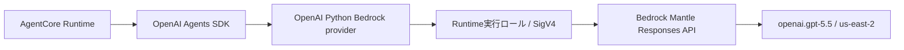

# ADR-0001: Bedrock MantleをRuntime実行ロールのSigV4で利用する

- Status: Accepted
- Date: 2026-08-05
- Decision owner: プロジェクトオーナー
- Reviewers: なし
- Supersedes: なし
- Superseded by: なし
- Related specs: `specs/03-agent-base-01/specs.md`
- Related plan: `specs/03-agent-base-01/plan.md`
- Related tasks: `specs/03-agent-base-01/tasks.md`

## 1. 背景

OpenAI Agents SDKで実装したAgentをAmazon Bedrock AgentCore Runtimeへデプロイし、Amazon Bedrockが提供するOpenAI互換APIからOpenAIモデルを利用する。PoCでは`us-east-2`の`openai.gpt-5.5`を使用する。

OpenAI PythonはAmazon Bedrockプロバイダーを提供しており、Bedrock Mantle endpointへのリクエストを標準のAWS認証情報チェーンとSigV4で認証できる。AgentCore RuntimeにはAWSリソースへアクセスする実行ロールがあるため、別の長期認証情報をコンテナへ渡さずにモデルを呼び出せる。

## 2. 課題

- OpenAI Agents SDKのResponses APIモデルをBedrock上で利用する接続方式を統一する必要がある。
- AgentコンテナへOpenAI Platform API keyまたはBedrock API keyを保存・注入せずに認証する必要がある。
- PoCとして実装を簡潔に保ちつつ、本番運用時にはIAM権限を縮小できる構成にする必要がある。

## 3. 決定ドライバー

- OpenAI Agents SDKとOpenAI Pythonの標準的なモデル実行経路を維持できること
- AgentCore Runtimeの一時的なロール認証情報を利用できること
- API keyの発行、保管、ローテーションが不要であること
- ストリーミングを含むResponses APIの呼び出しを利用できること
- AWS IAMでアクセス制御と監査を行えること

## 4. 決定

### 4.1 採用するもの

- OpenAI PythonのAmazon BedrockプロバイダーとResponses APIを使用し、Bedrock Mantle経由で`openai.gpt-5.5`を呼び出す。
- `openai[bedrock]`をAgentコンテナの依存関係に含め、非同期のOpenAIクライアントをOpenAI Agents SDKのモデル実行に使用する。
- AWSリージョンは`us-east-2`とする。
- 認証にはAgentCore Runtime実行ロールから標準AWS認証情報チェーンで取得する一時認証情報を使用し、SigV4でリクエストへ署名する。
- PoCではRuntime実行ロールへAWS管理ポリシー`AmazonBedrockMantleInferenceAccess`を付与する。
- OpenAI Platformへトレースを送信しないため、OpenAI Agents SDKのトレーシングを無効にする。AgentCoreの高度なトレーシングも本要件では無効にする。

### 4.2 採用しないもの

- `OPENAI_API_KEY`を使用したOpenAI Platformへの直接接続
- Amazon Bedrock API keyを使用したBearer認証
- 静的なAWSアクセスキーをコンテナの環境変数またはファイルへ格納する方式

### 4.3 例外

PoCに限りAWS管理ポリシー`AmazonBedrockMantleInferenceAccess`を許容する。本番運用へ移行する前に、使用するモデル、リージョン、操作を必要最小限に限定したカスタムIAMポリシーへ変更する。

## 5. 最終構成

## 6. 検討した代替案

| 代替案 | 利点 | 採用しない理由 |
| --- | --- | --- |
| OpenAI Platformへ直接接続する | OpenAI APIを直接利用できる | AWS内で認証とアクセス制御を完結する要件に合わず、OpenAI Platform API keyの管理が必要になる |
| Bedrock API keyを使用する | AWS SDKの認証情報チェーンに依存せず接続できる | API keyの発行、保管、ローテーションが必要で、Runtime実行ロールを利用できる構成では利点が小さい |
| 静的AWSアクセスキーを使用する | 実装時の認証情報が明示的になる | 長期認証情報の漏えいリスクとローテーション負荷が増え、AWSのワークロード認証方針に適さない |

## 7. 影響

### 良い影響

- AgentコンテナにAPI keyや静的AWS認証情報を保持せずに済む。
- 権限をRuntime実行ロールへ集約でき、AWS IAMによる制御と監査が可能になる。
- OpenAI Agents SDKのResponses APIおよびストリーミング実行を維持できる。

### 悪い影響

- OpenAI PythonのBedrockプロバイダーとBedrock Mantleが対応する機能・バージョンに依存する。
- PoCで使用するAWS管理ポリシーは、本番向けの最小権限ではない。
- OpenAI Agents SDKの既定トレースは利用できず、PoC中の詳細な実行追跡が限定される。

### リスクと対策

| リスク | 対策 |
| --- | --- |
| SDK更新でプロバイダーの挙動が変わる | `requirements.txt`で互換性を確認したバージョンを固定し、モデル呼び出しとストリーミングのテストを行う |
| 管理ポリシーの権限が広い | PoC用途に限定し、本番移行項目として最小権限化をバックログで管理する |
| 誤ってAPI key認証へフォールバックする | API keyを設定せず、実行ロールのSigV4で成功することをAWS環境のスモークテストで確認する |

## 8. 実装方針

- `agents/requirements.txt`へOpenAI Agents SDK、`openai[bedrock]`、`bedrock-agentcore`を互換性のあるバージョンで定義する。
- OpenAI PythonのBedrockプロバイダーへ`us-east-2`を指定した非同期クライアントを作成し、OpenAI Agents SDKからResponses APIモデルとして使用する。
- モデルIDは環境変数`BEDROCK_OPENAI_MODEL_ID`から取得する。
- Runtime実行ロールへ`AmazonBedrockMantleInferenceAccess`を付与する。
- `OPENAI_AGENTS_DISABLE_TRACING=1`をRuntime環境変数へ設定し、AgentCore Runtime側も`tracing_enabled=False`とする。

## 9. 運用方針

- PoCではIAM認証エラー、モデル利用権限、リージョン、モデルIDをスモークテストで確認する。
- 本番移行前に最小権限ポリシー、監視、アラーム、クォータ、障害時の切り分け手順を定義する。
- 認証情報をログへ記録しない。

## 10. コスト方針

- PoCでは呼び出し回数を限定し、Bedrock Mantleのモデル利用料金とAgentCore Runtime利用料金を確認する。
- 本番移行時に予算、利用量メトリクス、コストアラームを定義する。

## 11. セキュリティ / コンプライアンス方針

- API keyおよび静的AWSアクセスキーを使用しない。
- モデル呼び出し権限はRuntime実行ロールにのみ付与する。
- 本番環境ではAWS管理ポリシーを継続利用せず、最小権限のカスタムポリシーへ移行する。

## 12. 採用基準 / 完了条件

- `us-east-2`のAgentCore Runtimeから`openai.gpt-5.5`を呼び出せる。
- API keyを設定せず、Runtime実行ロールのSigV4認証でResponses APIの通常応答とストリーミング応答が成功する。
- Runtime実行ロール以外の静的認証情報がコンテナ、設定、ログへ含まれない。
- OpenAI Agents SDKとAgentCore Runtimeのトレーシングが無効である。

## 13. ロールバック / 変更方針

- Bedrockプロバイダーの互換性問題が生じた場合は、正常動作を確認済みの依存バージョンとRuntimeバージョンへ戻す。
- 認証方式またはモデル接続先を変更する場合は、本ADRをSupersededにして新しいADRで判断理由と移行方法を記録する。

## 14. 未決事項

- 本番用カスタムIAMポリシーの具体的なAction、Resource、Condition
- 本番運用時のトレース出力先と機密情報のマスキング方針

## 15. 参考資料

- `specs/03-agent-base-01/spec-draft.md`
- [OpenAI Python: Amazon Bedrock](https://github.com/openai/openai-python#amazon-bedrock)
- [OpenAI Agents SDK: Models](https://openai.github.io/openai-agents-python/models/)
- [AmazonBedrockMantleInferenceAccess](https://docs.aws.amazon.com/aws-managed-policy/latest/reference/AmazonBedrockMantleInferenceAccess.html)
