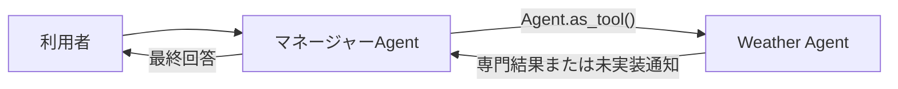

# ADR-0002: マルチエージェント構成にAgents-as-Toolsを使用する

- Status: Accepted
- Date: 2026-08-05
- Decision owner: プロジェクトオーナー
- Reviewers: なし
- Supersedes: なし
- Superseded by: なし
- Related specs: `specs/03-agent-base-01/specs.md`
- Related plan: `specs/03-agent-base-01/plan.md`
- Related tasks: `specs/03-agent-base-01/tasks.md`

## 1. 背景

OpenAI Agents SDKで、利用者との対話を担当するマネージャーAgentと、専門処理を担当するスペシャリストAgentを構成する。最初のスペシャリストはWeather Agentであり、今後ほかの専門Agentを追加する予定である。

本システムでは、スペシャリストが利用者との対話を引き継ぐのではなく、マネージャーAgentが専門Agentの結果を受け取り、会話全体と最終回答を管理する必要がある。

## 2. 課題

- マネージャーAgentが会話の所有権と最終回答の責任を維持できる構成を選ぶ必要がある。
- スペシャリストAgentを独立した責務で実装し、将来追加できる構成にする必要がある。
- 天気取得Toolが未実装の段階で、Weather Agentが取得していない天気情報を回答しないようにする必要がある。

## 3. 決定ドライバー

- 一つのAgentが利用者向け最終回答を所有すること
- スペシャリストAgentの出力をマネージャーAgentが確認、統合できること
- スペシャリストAgentを境界の明確な再利用可能コンポーネントとして追加できること
- 共通の会話方針やガードレールをマネージャーAgentへ集約できること
- 未実装機能について誤情報を生成しないこと

## 4. 決定

### 4.1 採用するもの

- OpenAI Agents SDKのAgents-as-Toolsパターンを使用する。
- マネージャーAgentへWeather Agentを`Agent.as_tool()`で登録する。
- マネージャーAgentが利用者との会話を維持し、専門Agentを呼び出し、その結果を踏まえて最終回答を生成する。
- Weather AgentはAgentとして実装するが、実データを取得する天気取得Toolは本要件の対象外とする。
- Weather Agentは天気取得Toolが未実装であることを回答し、架空の天気や取得していない情報を生成しない。
- 今後追加するスペシャリストAgentも、原則としてAgent-as-ToolでマネージャーAgentへ登録する。

### 4.2 採用しないもの

- マネージャーAgentからWeather AgentへのHandoff
- Weather Agentへ実データ取得機能があるように振る舞わせる暫定実装

### 4.3 例外

将来、スペシャリストAgentが利用者との対話を直接所有する必要が生じた場合は、そのAgentに限ってHandoffを再検討し、別のADRで判断する。

## 5. 最終構成

## 6. 検討した代替案

| 代替案 | 利点 | 採用しない理由 |
| --- | --- | --- |
| Handoff | 専門Agentがそのターンの会話を直接担当でき、専門Agentの指示に集中できる | 専門AgentがアクティブAgentとなり、マネージャーAgentが会話と最終回答を一貫して所有する要件に合わない |
| Weather Agentが天気を推測して回答する | 天気取得Toolの完成前でも形式上の回答を返せる | 取得していない情報を事実として提示するため、正確性要件を満たさない |

## 7. 影響

### 良い影響

- 利用者向けの会話方針と最終回答をマネージャーAgentへ集約できる。
- 複数のスペシャリストAgentの結果を、一つの回答へ統合できる。
- スペシャリストAgentごとに責務、指示、テストを分離できる。

### 悪い影響

- マネージャーAgentとスペシャリストAgentの両方でモデル呼び出しが発生し、応答時間とモデル利用量が増える可能性がある。
- マネージャーAgentのinstructionsとtool descriptionが不十分な場合、適切なAgentを呼び出せない可能性がある。
- 天気取得Toolが実装されるまで、Weather Agentは実際の天気情報を提供できない。

### リスクと対策

| リスク | 対策 |
| --- | --- |
| Weather Agentを呼び出さずにマネージャーAgentが天気を推測する | 両Agentの日本語instructionsへ禁止事項を明記し、捏造しないことをテストする |
| 意図しない専門Agentが選択される | 各Agentの責務と`tool_description`を具体化し、ルーティングのテストケースを追加する |
| ネストしたAgent実行で応答開始が遅れる | `Runner.run_streamed()`とAgentCore Runtimeのストリーミングレスポンスを使用する |

## 8. 実装方針

- マネージャーAgentとWeather Agentを個別に定義する。
- Weather Agentを`Agent.as_tool()`で変換し、マネージャーAgentの`tools`へ登録する。
- instructionsとtool descriptionは日本語で記述し、Weather Agentの対応範囲と未実装制約を明記する。
- 天気取得Toolは呼び出さず、後続要件として`specs/backlog/backlog.md`で管理する。
- 単体テストでは、天気に関する依頼がWeather Agentへ委譲されることと、取得不能時に架空情報を返さないことを検証する。

## 9. 運用方針

- スペシャリストAgentを追加する際は、責務、呼び出し条件、入力、出力、失敗時の振る舞いを定義する。
- Agent選択の誤りを評価できるテストケースを継続的に追加する。
- Handoffへ変更する必要が生じた場合は、会話所有権とセッション履歴への影響を評価する。

## 10. コスト方針

- Agent-as-Toolによる追加のモデル呼び出し回数とトークン使用量を検証する。
- 本番移行時に、専門Agentごとのモデル選択、呼び出し上限、タイムアウトを検討する。

## 11. セキュリティ / コンプライアンス方針

- マネージャーAgentからスペシャリストAgentへ渡す情報を、その専門処理に必要な範囲へ限定する。
- AgentおよびToolの出力を未検証の事実として扱わず、特に外部データ未取得時の捏造を禁止する。
- 今後のTool追加時は、Tool単位の権限と入力検証を設計する。

## 12. 採用基準 / 完了条件

- Weather Agentが`Agent.as_tool()`を介してマネージャーAgentから呼び出される。
- Handoffを使用せず、マネージャーAgentが利用者向け最終回答を返す。
- 天気取得Toolが未実装であることをWeather Agentが明示し、架空の天気を回答しない。
- Agent選択、最終回答、未実装時の振る舞いを自動テストで確認できる。

## 13. ロールバック / 変更方針

- Agent-as-Toolが要件を満たさない場合は、マネージャーAgent単体の直前の動作可能なRuntimeバージョンへ戻す。
- Handoffまたはコード主導のオーケストレーションへ変更する場合は、本ADRをSupersededにして新しいADRを作成する。

## 14. 未決事項

- 将来追加するスペシャリストAgentの選定基準と優先順位
- 専門Agentごとのモデル、タイムアウト、最大呼び出し回数

## 15. 参考資料

- `specs/03-agent-base-01/spec-draft.md`
- [OpenAI Agents SDK: Agent orchestration](https://openai.github.io/openai-agents-python/multi_agent/)
- [OpenAI Agents SDK: Tools](https://openai.github.io/openai-agents-python/tools/)
