# ADR-0003: Weather AgentのLambda Toolを専用AgentCore Gateway経由で利用する

- Status: Accepted
- Date: 2026-08-06
- Decision owner: プロジェクトオーナー
- Reviewers: なし
- Supersedes: N/A
- Superseded by: N/A
- Related specs: `specs/05-agent-tool-weather-01/specs.md`
- Related plan: `specs/05-agent-tool-weather-01/plan.md`
- Related tasks: N/A

## 1. 背景

既存のマルチエージェント構成では、マネージャーAgentがWeather Agentを`Agent.as_tool()`で利用し、利用者との会話と最終回答を所有する。この構成はADR-0002で決定済みである。

一方、現在のWeather Agentには外部Toolが登録されておらず、実在する天気情報を取得できないことを回答する。`lambda_tools/weather/handler.py`と`lambda_tools/weather/tools.json`には、Amazon Bedrock AgentCore GatewayのLambdaターゲット形式を想定した`get_weather`と`get_time`の固定モック実装があるが、Lambda、Gateway、GatewayTarget、IAM権限およびWeather AgentからのMCP接続はまだ構成されていない。

本featureでは、実データ取得ではなく固定モック値を用いて、Weather AgentからLambda Toolまでの接続をエンドツーエンドで検証する。

ADR-0002のAgents-as-Toolsと会話所有権に関する決定は維持する。一方、同ADRの「外部Toolを利用せず未実装を回答する」という記載は、天気Tool実装前の状態を対象としたものであり、本featureの実装後は本ADRの固定モックTool利用方針へ置き換える。

### 用語整理

- 専用Gateway: 本featureで新設し、`get_weather`と`get_time`を提供するLambdaターゲットだけを収容するAgentCore Gateway。
- モックTool: 外部の天気・時刻サービスを呼び出さず、接続確認用の固定値と`data_type=mock`を返すTool。

## 2. 課題

- Weather AgentからLambda Toolまでを、既存のAgents-as-Tools構成を維持したまま接続する方式を決める必要がある。
- Gatewayへの受信認証とLambdaターゲットへの送信認証を、静的な認証情報を使わず最小権限で構成する必要がある。
- 固定モック値を実在する天気または時刻として利用者へ提示しないようにする必要がある。
- GatewayまたはLambdaを利用できない場合も、Weather AgentとマネージャーAgentが情報を推測しないようにする必要がある。

## 3. 決定ドライバー

- Weather AgentからGatewayのLambdaターゲットを実際に呼び出す経路を検証できること
- 既存のマネージャーAgentとWeather Agentの責務および会話所有権を維持すること
- AgentCore Runtime実行ロールとGateway実行ロールの権限境界を明確にすること
- API keyや静的AWS認証情報を必要としないこと
- モック値を実データと誤認させず、障害時にも情報を捏造しないこと
- AWSリソースと権限を既存のCDKスタックで再現可能にすること

## 4. 決定

### 4.1 採用するもの

- 既存CDKスタックの`us-east-2`に、Weather AgentのモックTool用となる専用のAgentCore Gatewayを新設する。
- GatewayをMCP Gatewayとして構成し、`lambda_tools/weather/handler.py`をデプロイするLambda関数をLambdaターゲットとして登録する。
- `lambda_tools/weather/tools.json`をツールスキーマのソースとして使用し、`get_weather`と`get_time`の両方を公開する。
- Gateway実行ロールの権限を対象Lambdaの呼び出しだけに限定するため、`tools.json`はCDK synth時に読み込み、GatewayTargetへインラインで定義する。Gateway実行時にS3上のツールスキーマを読み取る構成は採用しない。
- Weather AgentだけがGatewayのMCP Toolを利用し、マネージャーAgentへGateway Toolを直接登録しない。
- 本PoCでは既存のWeather Agentが天気と時刻の両方を担当し、Agentの分割または名称変更は行わない。
- マネージャーAgentはADR-0002どおりWeather Agentを`Agent.as_tool()`で呼び出し、利用者向け最終回答を所有する。
- Gatewayの受信認証には`AWS_IAM`を使用し、AgentCore Runtime実行ロールへ本featureで追加するGateway関連権限を、対象Gatewayの`bedrock-agentcore:InvokeGateway`に限定する。既存のモデルおよびMemory用権限は維持する。
- Lambdaターゲットの送信認証には`GATEWAY_IAM_ROLE`を使用し、Gateway実行ロールに対象Lambda関数の`lambda:InvokeFunction`だけを許可する。
- Gateway実行ロールの信頼関係はAgentCore Gatewayサービスに限定し、送信元AWSアカウントおよび対象Gatewayで制限する。
- Lambda実行ロールには、Lambda実行と必要なログ出力に限定した権限を付与する。
- Toolの応答は固定モックであることを機械判定できるようにし、Weather AgentとマネージャーAgentは利用者へ実データではないことを明示する。
- Gateway接続失敗を含め、Agent実行中にGateway、LambdaまたはMCP Toolを利用できない場合は、Weather Agentが取得不能を返し、マネージャーAgentが推測せず安全な最終回答を返す。必須設定の欠落または不正によりAgent実行を開始できない場合は既存のRuntime HTTP／SSEエラー契約に従い、いずれの場合も固定値や推測値へフォールバックしない。

### 4.2 採用しないもの

- 本featureでは、共有または既存のGatewayへターゲットを追加しない。
- GatewayとLambdaターゲットだけを作成し、Weather Agentとの接続を後続featureへ残す構成は採用しない。
- 本featureでは、外部の天気または時刻サービスへ接続して実データを取得しない。
- マネージャーAgentへGateway Toolを直接登録しない。
- ツールスキーマをS3アセットとしてGatewayTargetへ渡さない。

### 4.3 例外

- N/A

## 5. 最終構成

```mermaid
flowchart LR
    User["利用者"] --> Manager["マネージャーAgent"]
    Manager -->|"Agent.as_tool()"| Weather["Weather Agent"]
    Weather -->|"MCP / SigV4<br/>Runtime実行ロール"| Gateway["専用AgentCore Gateway"]
    Gateway -->|"GATEWAY_IAM_ROLE"| Target["Lambda GatewayTarget"]
    Target --> Lambda["Weather／TimeモックLambda"]
    Lambda -->|"data_type=mock"| Target
    Target --> Gateway
    Gateway --> Weather
    Weather --> Manager
    Manager -->|"モック明示または取得不能"| User
```

## 6. 検討した代替案

### 6.1 既存または共有Gatewayへターゲットを追加する

#### 内容

本featureでGatewayを新設せず、既存または共有GatewayへLambdaターゲットだけを追加する。

#### メリット

- 会話では具体的なメリットを整理していない。

#### デメリット

- 現在のリポジトリには利用可能なGatewayが存在せず、対象GatewayとそのIAM境界を本featureだけで再現できない。

#### 判断

専用Gatewayを現在のCDKスタックへ新設する方針が合意されたため、採用しない。

### 6.2 Gatewayターゲットだけを作成し、Agent統合を後続対応にする

#### 内容

Lambda、GatewayおよびGatewayTargetの構築までを本featureとし、Weather AgentからのMCP利用は後続featureで実装する。

#### メリット

- 会話では具体的なメリットを整理していない。

#### デメリット

- Weather AgentからLambda Toolまでの接続をエンドツーエンドで確認する合意済みの目的を満たさない。

#### 判断

Weather Agentからの実利用までを本featureに含める方針が合意されたため、採用しない。

### 6.3 本featureで実在する天気・時刻データを取得する

#### 内容

固定モックを使用せず、外部サービスから現在の天気または時刻を取得する。

#### メリット

- 利用者へ実在する情報を提供できる。

#### デメリット

- 外部サービス、認証、ネットワーク、利用制限、障害処理など、Gateway接続確認とは別の要件が必要になる。

#### 判断

本featureは固定モックによるGateway接続PoCとし、実データ取得は別featureで検討する方針が合意されたため、採用しない。

## 7. 影響

### 7.1 良い影響

- Weather AgentからAgentCore Gateway、Lambdaターゲットまでの接続を、実データ提供サービスに依存せず検証できる。
- Runtime、Gateway、LambdaのIAM責務と権限境界が明確になる。
- マネージャーAgentが会話と最終回答を所有する既存構成を維持できる。
- 後続featureで実データ取得へ置き換える際も、GatewayとAgentの接続境界を再利用できる。

### 7.2 悪い影響・注意点

- GatewayとLambdaの追加により、リソース、ネットワーク呼び出し、認証および接続ライフサイクルが増える。
- Weather Agentを呼び出すモデル実行に加えてGatewayとLambdaの呼び出しが発生し、応答時間と利用料金が増える。
- `get_weather`と`get_time`は固定モックであり、現在の天気または時刻を提供できない。
- Gatewayターゲット名がMCP上のツール名の接頭辞になるため、名称変更が利用側へ影響する。

### 7.3 リスクと対策

| リスク | 対策 |
|---|---|
| モック値が実データとして回答される | ツール説明と応答にモックであることを含め、両Agentのinstructionsとテストで利用者への明示を固定する |
| GatewayまたはLambda障害時にモデルが値を推測する | Weather Agentは取得不能を返し、マネージャーAgentも推測せず安全な最終回答を返す |
| RuntimeまたはGatewayの権限が過大になる | 本featureで追加する`InvokeGateway`と`InvokeFunction`をそれぞれ対象リソースへ限定し、Gatewayロールの信頼条件も限定する |
| S3アセット方式によりGatewayロールへ追加権限が必要になる | `tools.json`をsynth時に読み込み、GatewayTargetへインラインで定義する |
| Gatewayターゲット名の変更でツール名が変わる | ターゲット名を安定したCDK管理値とし、接頭辞付きツール名を結合テストで確認する |
| MCP接続が適切に終了されない | 接続の生成、再利用、終了および失敗時の解放方法を実装計画で定義し、自動テストする |

## 8. 実装方針

- Gateway、Lambda、GatewayTargetおよび関連IAMは責務ごとのConstructへ分離し、既存スタックで依存関係を組み合わせる。
- `lambda_tools/weather/tools.json`をsynth時に読み込んでGatewayターゲットへインラインで関連付け、スキーマとハンドラー分岐の一致を自動テストする。
- Gateway endpointは非秘密設定としてAgentCore Runtimeへ渡し、生成されたIDやURLをAgentコードへ固定値として埋め込まない。
- Weather AgentにMCP Toolを登録し、`get_weather`と`get_time`を利用可能にする。マネージャーAgentの直接Toolは既存のWeather Agentだけとする。
- 正常系、入力不正、未知Tool、GatewayまたはLambda障害、MCP接続失敗、モック明示およびマネージャーAgentの最終回答を自動テストする。
- AWS E2E検証では、GatewayTargetが`READY`になった後に`tools/list`、`tools/call`およびAgentのエンドツーエンド呼び出しを確認する。実行にはユーザーの明示依頼を必要とし、未実施の段階はAWS E2E未検証として扱う。

## 9. 運用方針

- GatewayまたはLambdaを利用できない場合は、現在利用できない旨を利用者へ返し、固定値や推測値で代替しない。
- 利用者向け応答へ内部例外、スタックトレース、AWSリソース識別子または認証情報を含めない。運用ログへ認証情報や不要な入力値を記録せず、必要な診断情報はサニタイズする。
- AWS環境へのデプロイおよび実呼び出しは、ユーザーが明示的に依頼した場合だけ実施する。

## 10. コスト方針

- AgentCore Gateway、Lambdaおよび追加のモデル呼び出しが課金対象になり得ることをPoCの注意点とする。
- 具体的な予算、呼び出し上限およびアラームは本ADRでは決定しない。

## 11. セキュリティ / コンプライアンス方針

- Gateway受信は`AWS_IAM`とし、AgentCore Runtime実行ロールへ本featureで追加するGateway関連権限を、対象Gatewayの呼び出しに限定する。
- GatewayからLambdaへの呼び出しはGateway実行ロールを使い、対象Lambda関数だけに権限を限定する。
- API key、静的AWSアクセスキーまたはその他のシークレットをAgent、Lambda、環境変数およびCDKテンプレートへ埋め込まない。
- 利用者向けエラー応答に内部例外、スタックトレース、AWSリソース識別子または認証情報を含めない。運用ログには認証情報や不要な入力値を記録せず、必要な診断情報をサニタイズする。
- Gatewayの例外レベルは利用者へ内部詳細を返す`DEBUG`に設定しない。

## 12. 採用基準 / 完了条件

- [ ] 専用Gateway、LambdaおよびLambda GatewayTargetが既存CDKスタックから再現可能である。
- [ ] Runtime実行ロールからGateway、Gateway実行ロールから対象Lambdaへの最小権限が構成されている。
- [ ] Gatewayが`get_weather`と`get_time`を公開し、Weather Agentから両方を利用できる。
- [ ] マネージャーAgentがWeather Agentを経由して結果を受け取り、利用者向け最終回答を所有する。
- [ ] 正常時に固定モックであることを明示し、障害時に天気または時刻を推測しない。
- [ ] 必要な自動テストとローカルsynthが成功する。
- [ ] ユーザーの明示依頼に基づくAWS E2E検証で、GatewayTargetの`READY`、両Toolの`tools/list`／`tools/call`およびRuntimeからの最終回答を確認する。

## 13. ロールバック / 変更方針

- 本featureを戻す場合は、Weather AgentからMCP Tool設定とGateway endpoint設定を除去し、外部Toolを持たない直前の動作へ戻す。
- 専用Gatewayを共有Gatewayへ変更する場合、またはIAM以外の受信認証へ変更する場合は、権限境界と運用影響を再評価し、本ADRを更新または新しいADRで置き換える。
- 実データ取得へ移行する場合は、外部データソース、認証、入力、出力、障害処理および運用要件を別featureで定義する。

## 14. 未決事項

- Gateway名とGatewayTarget名の具体値
- MCPクライアントの接続ライフサイクル、タイムアウト、再試行およびツール一覧キャッシュの実装方式
- Lambdaの具体的なランタイム設定、タイムアウト、メモリおよびログ保持期間

## 15. 参考資料

- `specs/05-agent-tool-weather-01/spec-draft.md`
- `lambda_tools/weather/handler.py`
- `lambda_tools/weather/tools.json`
- `docs/ADR/adr-0001-use-bedrock-mantle-with-runtime-role-sigv4.md`
- `docs/ADR/adr-0002-use-agents-as-tools.md`
- [AWS Lambda function targets](https://docs.aws.amazon.com/bedrock-agentcore/latest/devguide/gateway-add-target-lambda.html)
- [Set up inbound authorization for your gateway](https://docs.aws.amazon.com/bedrock-agentcore/latest/devguide/gateway-inbound-auth.html)
- [Set up outbound authorization for your gateway](https://docs.aws.amazon.com/bedrock-agentcore/latest/devguide/gateway-outbound-auth.html)
- [Set up permissions for AgentCore Gateway](https://docs.aws.amazon.com/bedrock-agentcore/latest/devguide/gateway-prerequisites-permissions.html)
- [Understand how AgentCore Gateway tools are named](https://docs.aws.amazon.com/bedrock-agentcore/latest/devguide/gateway-tool-naming.html)
