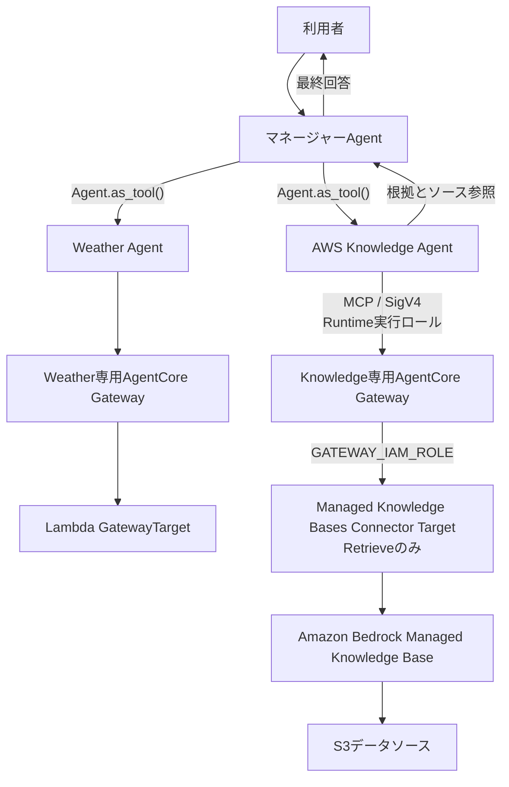

# ADR-0004: AWS Knowledge Agentから専用Gateway経由でManaged Knowledge BaseのRetrieveを利用する

- Status: Proposed
- Date: 2026-08-07
- Decision owner: プロジェクトオーナー
- Reviewers: N/A
- Supersedes: N/A
- Superseded by: N/A
- Related specs: `specs/06-rag-knowledge-agent-01/specs.md`
- Related plan: `specs/06-rag-knowledge-agent-01/plan.md`
- Related tasks: `specs/06-rag-knowledge-agent-01/tasks.md`

## 1. 背景

既存システムは、マネージャーAgentがWeather Agentを`Agent.as_tool()`で利用し、Weather Agentだけが専用AgentCore GatewayのLambda Targetへ接続する。マネージャーAgentが利用者との会話と最終回答を所有する構成はADR-0002、Weather Agent専用Gatewayの構成はADR-0003で決定済みである。

将来のAWSシステム構築案件の見積もり支援に向けて、変わりにくい社内標準、見積基準、過去案件をRAGで検索する経路を検証する。一般的なAWS知識ではRAGを利用したか判定しにくいため、本featureではモデルが事前に知り得ない架空の文書をAmazon Bedrock Managed Knowledge Baseへ登録する。

### 用語整理

- AWS Knowledge Agent: 社内AWS標準、見積基準、過去案件を検索し、根拠とソース情報をマネージャーAgentへ返すスペシャリストAgent。
- Knowledge専用Gateway: AWS Knowledge Agentだけが利用し、Managed Knowledge Bases Connector Targetだけを収容するAgentCore Gateway。
- `Retrieve`: Managed Knowledge Baseに対する単一検索を行い、関連するpassageとソース参照を返すConnector Tool。

## 2. 課題

- 既存のAgents-as-Tools構成とマネージャーAgentの会話所有権を維持しながら、RAG検索の専門責務を追加する必要がある。
- Weather AgentのLambda Targetとは異なる、AgentCore Gatewayの組み込みConnector利用経路を検証する必要がある。
- モデルの一般知識とManaged Knowledge Baseから取得した社内知識を区別し、取得していない情報を捏造しない構成にする必要がある。
- Runtime、Gateway、Managed Knowledge Base、S3の責務とIAM権限境界を分離する必要がある。
- 最初のPoCで単一検索とAgentic RAGのどちらを採用するかを決める必要がある。

## 3. 決定ドライバー

- マネージャーAgentが会話と最終回答を所有し続けること
- RAG検索を専門Agentの限定された責務として検証できること
- Weather AgentとKnowledge Agentの異なる情報源を同じマルチエージェントで検証できること
- Lambdaなどの独自検索統合を追加せず、AgentCore GatewayのManaged Knowledge Bases Connectorを検証できること
- 初回PoCで検索、取得結果、根拠、Agentルーティングの各段階を切り分けやすいこと
- API keyまたは静的AWS認証情報を必要とせず、IAMとSigV4で接続できること
- 取得できない社内知識をモデルが推測しないこと

## 4. 決定

### 4.1 採用するもの

- `AWS Knowledge Agent`をスペシャリストAgentとして追加し、`Agent.as_tool()`でマネージャーAgentへ登録する。
- マネージャーAgentがAWS Knowledge Agentを選択し、その結果を利用者向け最終回答へ統合する。
- AWS Knowledge AgentだけがKnowledge専用GatewayのMCP Toolを利用し、マネージャーAgentへMCP Toolを直接登録しない。
- Weather専用Gatewayとは別にKnowledge専用Gatewayを作成し、両GatewayのIAM境界と利用可否を分離する。
- Amazon Bedrock Managed Knowledge Baseを使用し、サービス管理Embeddingとサービス管理検索基盤を利用する。
- Knowledge専用Gatewayへ`bedrock-knowledge-bases`のManaged Knowledge Bases Connector Targetを登録する。
- 最初のPoCではConnector Targetから`Retrieve`だけを公開し、対象Managed Knowledge Base IDを管理者設定として固定する。
- Runtime実行ロールの一時AWS認証情報とSigV4でKnowledge専用Gatewayへ接続する。
- Gatewayのサービスロールから対象Managed Knowledge Baseを確認し、`Retrieve`するために必要なBedrock権限を付与する。
- AWS Knowledge Agentは取得結果だけを社内知識の根拠として使用し、文書名またはソース参照をマネージャーAgentへ返す。
- Knowledge経路の障害または検索結果なしを、推測した社内標準で代替しない。

### 4.2 採用しないもの

- マネージャーAgentからManaged Knowledge BaseのMCP Toolを直接利用する構成
- AWS Knowledge AgentへのHandoff
- Weather専用GatewayへManaged Knowledge Bases Connector Targetを追加する構成
- AWS Knowledge AgentとManaged Knowledge Baseの間にLambda、OpenAPI Targetまたは独自HTTP Targetを配置する構成
- 最初のPoCで`AgenticRetrieveStream`を公開する構成
- AWS Knowledge Agentへ見積書全体を完成させる責任を持たせる構成

### 4.3 例外

- N/A

## 5. 最終構成

## 6. 検討した代替案

### 6.1 マネージャーAgentからKnowledge Base Toolを直接利用する

#### 内容

AWS Knowledge Agentを追加せず、マネージャーAgentへManaged Knowledge BaseのMCP Toolを直接登録する。

#### メリット

- Agent階層と追加の専門Agent呼び出しを減らせる。

#### デメリット

- RAG専用Agentの責務、指示、取得不能時の振る舞いを独立して検証できない。
- Weather AgentとKnowledge Agentを選択または組み合わせるマルチエージェント構成を検証できない。

#### 判断

今回のPoCはRAGだけでなく、異なる情報源を持つ専門Agentの選択と統合も検証対象であるため採用しない。

### 6.2 AgenticRetrieveStreamから開始する

#### 内容

単一検索の`Retrieve`ではなく、複数ステップの検索と回答生成を行う`AgenticRetrieveStream`を最初から使用する。

#### メリット

- 複雑な質問に対する複数ステップの検索を検証できる。

#### デメリット

- S3取り込み、検索クエリ、取得chunk、Agentの回答生成、ルーティングの各段階を切り分けにくくなる。

#### 判断

最初のPoCでは単一検索の各段階を観察しやすい`Retrieve`から開始し、Agentic RAGは後続featureで検討する。

### 6.3 Lambdaを介してManaged Knowledge Baseを検索する

#### 内容

Weather Agentと同様にGatewayからLambdaを呼び出し、LambdaからManaged Knowledge Baseを検索する。

#### メリット

- Weather Agentと同じGateway Target形式へ統一できる。

#### デメリット

- Managed Knowledge Bases Connectorで不要な独自検索実装、Lambda、IAM、障害点が追加される。
- Gatewayの組み込みConnectorを検証する目的を満たさない。

#### 判断

Lambdaを介さずManaged Knowledge Bases Connectorを利用する方針が合意されているため採用しない。

### 6.4 Weather専用Gatewayを共有する

#### 内容

既存のWeather専用GatewayへManaged Knowledge Bases Connector Targetを追加する。

#### メリット

- 会話では具体的なメリットを整理していない。

#### デメリット

- ADR-0003で決定したWeather／Timeモック専用のGateway境界と一致しない。
- Weather経路とKnowledge経路の権限、設定、利用可否を独立して扱いにくくなる。

#### 判断

Weather専用Gatewayの既存境界を維持し、Knowledge経路を独立して検証するため採用しない。

## 7. 影響

### 7.1 良い影響

- マネージャーAgentの会話所有権を維持しながら、RAG検索の責務、指示、テストをAWS Knowledge Agentへ分離できる。
- GatewayからManaged Knowledge BaseまでをLambdaなしで検証できる。
- Weather AgentとAWS Knowledge Agentの選択、および両結果の統合を検証できる。
- Managed Knowledge Baseにない社内情報を捏造しない境界と、根拠提示の責任が明確になる。
- Runtime、各Gateway、Managed Knowledge Base、S3のIAM責務を分離できる。

### 7.2 悪い影響・注意点

- AWS Knowledge Agentのモデル呼び出しとKnowledge専用Gatewayの呼び出しが追加され、応答時間と利用料金が増える可能性がある。
- Runtimeで複数Gatewayの設定、接続、利用可否、cleanupを独立して管理する必要がある。
- `Retrieve`だけでは複数ステップの検索が必要な質問に十分対応できない場合がある。
- Managed Knowledge Baseの同期が完了するまで、登録文書を検索できない。

### 7.3 リスクと対策

| リスク | 対策 |
|---|---|
| マネージャーAgentがAWS Knowledge Agentを呼ばず社内情報を推測する | 両Agentの日本語instructionsへ呼び出し条件と捏造禁止を記載し、決定的なルーティングテストを行う |
| AWS Knowledge Agentが検索結果にない内容を補完する | `Retrieve`必須、根拠とソース参照の返却、検索結果なしのテストを仕様化する |
| Knowledge障害がWeather Agentまで停止させる | Gateway設定と利用可否を独立管理し、一方だけが失敗するテストを行う |
| RuntimeまたはGatewayの権限が過大になる | Runtimeは対象Gatewayの`InvokeGateway`、Gatewayは対象Managed Knowledge Baseの確認と`Retrieve`へ限定する |
| MCP接続が適切に終了されない | リクエスト単位の接続、Tool発見、実行、cleanupを維持し、失敗とキャンセルを自動テストする |

## 8. 実装方針

- AWS Knowledge AgentとAgent-as-Toolを既存Agent factoryへ追加し、Manager、Weather、Knowledgeの責務を分離する。
- Weather用とKnowledge用のMCP server、Tool allowlist、結果検証、利用可否を独立して扱う。
- Managed Knowledge Base、Knowledge専用Gateway、Connector Target、IAMを責務ごとのCDK Constructへ分離し、既存スタックで参照と作成順を接続する。
- Connector Targetは対象Managed Knowledge Base IDを管理者設定として持ち、`Retrieve`だけを公開する。
- 正常結果、ソース参照、検索結果なし、Gateway障害、Tool障害、独立障害、cleanupを自動テストする。
- AWS E2Eはユーザーの明示依頼後に行い、Gateway Targetの状態、Tool発見、実検索、Runtime最終回答を確認する。

## 9. 運用方針

- Managed Knowledge Baseの初回同期が成功するまで、RAG経路をAWS E2E検証済みとして扱わない。
- Knowledge経路を利用できない場合は取得不能を返し、モデルの一般知識で社内標準を代替しない。
- AWS環境へのデプロイ、同期、実検索、Runtime呼び出しはユーザーが明示的に依頼した場合だけ実施する。
- 初回同期の具体的な運用判断はADR-0005に記録する。

## 10. コスト方針

- AgentCore Gateway、Managed Knowledge Base、S3、追加のモデル呼び出しが課金対象になり得る。
- 具体的な予算、検索回数上限、コストアラームは本ADRでは決定しない。

## 11. セキュリティ / コンプライアンス方針

- API key、Bearer token、静的AWSアクセスキーを使用しない。
- Runtime実行ロールはKnowledge専用Gatewayだけを呼び出し、Managed Knowledge BaseとS3へ直接アクセスしない。
- Gatewayサービスロールは対象Managed Knowledge Baseの確認と`Retrieve`へ限定し、S3を直接読み取らない。
- サンプル文書には架空データだけを格納し、実在する顧客情報、社内情報、個人情報、秘密情報を含めない。
- 利用者向け応答とログへ内部例外、スタックトレース、内部リソース識別子、認証情報を含めない。

## 12. 採用基準 / 完了条件

- [ ] AWS Knowledge Agentが`Agent.as_tool()`としてマネージャーAgentから呼び出される。
- [ ] Knowledge専用GatewayとManaged Knowledge Bases Connector TargetがCDKで再現可能である。
- [ ] Connector Targetが対象Managed Knowledge Baseの`Retrieve`だけを公開する。
- [ ] Runtime、Gateway、Managed Knowledge Base、S3の権限境界が仕様どおりに限定される。
- [ ] 登録文書に固有の値とソース参照をAWS Knowledge Agentが返す。
- [ ] 検索結果なしまたは障害時に社内情報を捏造しない。
- [ ] WeatherとKnowledgeの利用可否を独立して扱える。
- [ ] 必要な自動テストとローカルsynthが成功する。
- [ ] ユーザーの明示依頼に基づくAWS E2Eで、Gateway経由の`Retrieve`とRuntime最終回答を確認する。

## 13. ロールバック / 変更方針

- 本featureを戻す場合は、AWS Knowledge AgentとKnowledge Gateway設定をマネージャーAgentおよびRuntimeから除去し、既存のManager＋Weather構成へ戻す。
- `AgenticRetrieveStream`、共有Gateway、マネージャーAgentからの直接Tool利用、顧客管理Knowledge Baseへ変更する場合は、本ADRを更新または新しいADRで置き換える。
- ADR-0002とADR-0003の既存決定は、本ADRのロールバックによって変更しない。

## 14. 未決事項

- Knowledge専用Gateway、Connector Target、Managed Knowledge Baseの具体的な名前
- `Retrieve`の取得件数、検索方式、公開するmetadata filterの演算子とパラメーター範囲
- 複数Gateway設定とMCP接続ライフサイクルの具体的な実装方式
- `AgenticRetrieveStream`を後続featureで導入する判断基準

## 15. 参考資料

- `specs/06-rag-knowledge-agent-01/discuss.md`
- `specs/06-rag-knowledge-agent-01/spec-draft.md`
- `specs/06-rag-knowledge-agent-01/specs.md`
- `specs/06-rag-knowledge-agent-01/plan.md`
- `specs/06-rag-knowledge-agent-01/tasks.md`
- `docs/ADR/adr-0002-use-agents-as-tools.md`
- `docs/ADR/adr-0003-use-dedicated-agentcore-gateway-for-weather-tools.md`
- [Amazon Bedrock Managed Knowledge Bases as Connector Target](https://docs.aws.amazon.com/bedrock-agentcore/latest/devguide/gateway-target-connector-managed-kb.html)
- [Define the gateway target configuration](https://docs.aws.amazon.com/bedrock-agentcore/latest/devguide/gateway-add-target-api-target-config.html)
- [OpenAI Agents SDK: Agent orchestration](https://openai.github.io/openai-agents-python/multi_agent/)
