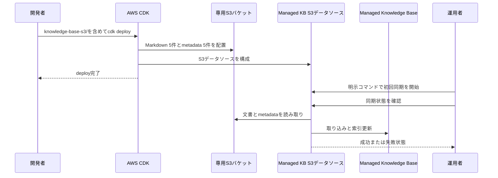

# ADR-0005: ナレッジ文書をCDKでS3配置し初回同期をデプロイ後に実行する

- Status: Proposed
- Date: 2026-08-07
- Decision owner: プロジェクトオーナー
- Reviewers: N/A
- Supersedes: N/A
- Superseded by: N/A
- Related specs: `specs/06-rag-knowledge-agent-01/specs.md`
- Related plan: N/A
- Related tasks: N/A

## 1. 背景

AWS Knowledge AgentのRAG検証には、モデルの学習済み知識と区別できる架空の社内AWS標準、見積基準、過去案件が必要である。これらの正本として、リポジトリの`knowledge-base-s3/`配下に5つのMarkdownと5つのsidecar metadataを配置する。

Managed Knowledge Baseが参照するS3へこれらのファイルを配置する方法と、データソースの初回同期をCDKデプロイに含めるかデプロイ後に分離するかを決める必要がある。ユーザーは、S3配置をAWS CDKで行い、初回同期は`cdk deploy`後の明示的なコマンドで実行する方針を選択した。

### 用語整理

- ナレッジ文書: `knowledge-base-s3/`配下の5つのMarkdown。
- sidecar metadata: 各Markdownと同じprefixに置く`<文書名>.metadata.json`。
- 初回同期: S3へ配置した文書とmetadataをManaged Knowledge Baseへ最初に取り込むデータソース同期。

## 2. 課題

- ローカルでレビューした文書とmetadataを、ディレクトリ階層を維持してS3へ再現可能に配置する必要がある。
- S3コンソールへの手動アップロードによる配置漏れ、階層ずれ、metadata対応漏れを避ける必要がある。
- 非同期の初回同期をCDKデプロイへ組み込むか、運用者が状態を確認できる明示的な手順へ分離するかを決める必要がある。
- 文書配置前の同期、同期忘れ、同期失敗、削除反映による意図しない大量削除を扱う必要がある。

## 3. 決定ドライバー

- 5つのMarkdownと5つのmetadataをリポジトリの正本から再現可能に配置できること
- ローカルとS3で相対パスおよびMarkdownとmetadataの対応を維持できること
- 手動のS3コンソールアップロードを不要にすること
- `cdk deploy`のリソース作成と非同期のデータソース同期を分離し、各段階の成否を確認しやすくすること
- 初回同期の開始、進行、成功、失敗を運用者が明示的に確認できること
- PoCで定期的または継続的な同期基盤を追加しないこと

## 4. 決定

### 4.1 採用するもの

- ナレッジ文書とmetadataの正本を`knowledge-base-s3/`配下で管理する。
- Managed Knowledge BaseのS3データソース専用となるGeneral Purpose S3バケットをAWS CDKで作成する。
- `knowledge-base-s3/`をCDKのローカルassetとして扱い、`cdk deploy`で5つのMarkdownと5つのsidecar metadataをS3へ配置する。
- ローカルの相対パスをS3オブジェクトキーとして維持する。
- S3文書配置とデータソースの依存関係を明示し、文書配置前に初回同期を開始しない。
- 初回データソース同期を`cdk deploy`へ組み込まない。
- `cdk deploy`成功後、明示的なコマンドで初回同期を開始する。
- 初回同期コマンド、状態確認方法、成功・失敗の判定方法、再実行前の確認事項を関連ドキュメントへ記載する。
- S3配置と初回同期に、S3コンソールまたはBedrockコンソールの手動操作を必須としない。
- 初回同期およびAWS環境での確認は、ユーザーの明示的な依頼を受けた場合だけ実施する。

### 4.2 採用しないもの

- S3コンソールから10ファイルを手動アップロードする方式
- Bedrockコンソールから初回同期を開始することを必須とする方式
- CDK Custom Resourceまたは同等の処理で、初回同期を`cdk deploy`中に自動実行する方式
- 定期同期または継続同期のためのスケジュールリソースを本featureで追加する方式

### 4.3 例外

- N/A

## 5. 最終構成

## 6. 検討した代替案

### 6.1 CDKデプロイ中に初回同期を自動実行する

#### 内容

CDK Custom Resourceまたは同等の処理を使用し、S3配置後に初回同期を開始して完了まで待機する。

#### メリット

- `cdk deploy`だけでリソース作成、文書配置、初回同期まで完了できる。

#### デメリット

- 非同期同期処理とCloudFormationデプロイが結合し、S3配置、データソース作成、同期失敗の切り分けが難しくなる。
- 同期の待機、タイムアウト、再試行、失敗時のCloudFormation動作を追加で扱う必要がある。

#### 判断

PoCでは各段階を明示的に確認しやすくするため、ユーザーが選択したデプロイ後の明示コマンド方式を採用する。

### 6.2 S3コンソールで文書を手動配置する

#### 内容

CDKでS3バケットだけを作成し、MarkdownとmetadataはS3コンソールからアップロードする。

#### メリット

- 会話では具体的なメリットを整理していない。

#### デメリット

- 配置漏れ、相対パスのずれ、Markdownとmetadataの対応漏れが発生し得る。
- リポジトリの正本から同じ状態を再現できない。

#### 判断

ユーザーがナレッジ文書をAWS CDKでS3へ配置することを要件としているため採用しない。

## 7. 影響

### 7.1 良い影響

- レビュー済みのローカル文書とmetadataを、同じ階層で再現可能にS3へ配置できる。
- S3コンソールでの配置漏れやmetadata対応漏れを防ぎやすい。
- CDKデプロイと非同期同期を分離し、各段階の状態と失敗原因を確認しやすい。
- 同期の開始時点を運用者が制御できる。

### 7.2 悪い影響・注意点

- `cdk deploy`だけでは文書が検索可能にならず、初回同期の追加手順が必要になる。
- 運用者が同期を実行し忘れると、AWS Knowledge Agentは新しい文書を検索できない。
- ローカル削除をS3へ反映する方式と、データソース同期時の削除保護を別途決定する必要がある。

### 7.3 リスクと対策

| リスク | 対策 |
|---|---|
| 初回同期を実行せずRuntime E2Eへ進む | 同期成功をAWS E2Eの前提条件とし、READMEと検証手順へ明記する |
| 文書またはmetadataの配置が欠落する | 5つのMarkdownと5つのmetadataの一対一対応とCDK asset内容を自動テストする |
| 同期失敗を無条件に再実行する | 状態と失敗理由を確認してから再実行する手順を文書化する |
| 文書削除で想定以上の索引データが削除される | 削除保護と許容閾値を実装計画で決定し、自動またはAWS検証で確認する |
| 不要ファイルがS3へ配置される | CDK assetの対象を`knowledge-base-s3/`へ限定し、生成物と管理情報を除外・検査する |

## 8. 実装方針

- S3バケット、文書配置、Managed Knowledge Base、S3データソースを責務ごとのCDK Constructへ分離する。
- CDK assetは`knowledge-base-s3/`の登録対象だけを含み、相対パスを維持してS3へ配置する。
- 文書配置完了前にデータソースを利用する処理を開始しないよう、CDK上の依存関係を明示する。
- 初回同期を開始するCustom Resourceは作成しない。
- 文書とmetadataの存在、JSON形式、一対一対応、asset内容、S3セキュリティ設定、初回同期処理がCDKに含まれないことを自動テストする。
- AWS E2Eでは、明示コマンドによる同期開始、状態確認、検索可能性を順番に検証する。

## 9. 運用方針

- `cdk deploy`成功後に、対象アカウント、`us-east-2`、Knowledge Base ID、データソースIDを確認して初回同期を開始する。
- 同期完了状態を確認してからGateway経由の検索またはRuntime E2Eへ進む。
- 同期失敗時は状態と失敗理由を確認し、同じコマンドを無条件に繰り返さない。
- 定期同期と自動同期は本featureの運用範囲に含めない。
- AWS環境へのデプロイ、同期、実検索はユーザーの明示依頼がある場合だけ実施する。

## 10. コスト方針

- S3、Managed Knowledge Baseの取り込みと検索、およびデプロイに伴うAWSリソースが課金対象になり得る。
- 初回同期はPoC検証に必要な場合だけ実行する。
- 具体的な予算、同期回数上限、コストアラームは本ADRでは決定しない。

## 11. セキュリティ / コンプライアンス方針

- S3バケットはパブリックアクセスを遮断し、保存時暗号化とTLS通信を必須にする。
- Managed Knowledge Baseのサービスロールは対象S3データソースの読み取りだけに限定する。
- S3配置主体は対象バケットへの配置に必要な権限だけを持つ。
- サンプル文書とmetadataには架空データだけを含め、秘密情報、実在する顧客情報、社内情報、個人情報を含めない。
- AWS識別子や認証情報を同期コマンドの出力、ログ、問い合わせ資料へ不要に記録しない。

## 12. 採用基準 / 完了条件

- [ ] 5つのMarkdownと5つのsidecar metadataがリポジトリの正本として存在する。
- [ ] CDKデプロイで10ファイルを想定した相対パスのまま専用S3バケットへ配置できる。
- [ ] S3コンソールまたはBedrockコンソールの手動操作を必要としない。
- [ ] 初回同期が`cdk deploy`へ組み込まれていない。
- [ ] 初回同期コマンド、状態確認、成功・失敗判定、再実行前の確認事項が文書化される。
- [ ] ユーザーの明示依頼に基づくAWS E2Eで、初回同期の成功と登録文書の検索を確認する。

## 13. ロールバック / 変更方針

- 文書配置に問題がある場合は、同期を開始せず、直前に確認済みのCDK assetと文書内容へ戻して再デプロイする。
- 初回同期をCDKへ自動統合する必要が生じた場合は、非同期待機、タイムアウト、再試行、CloudFormation失敗時の動作を評価し、本ADRを更新または新しいADRで置き換える。
- S3以外のデータソースまたは定期同期を導入する場合は、別featureで要件と運用境界を定義する。

## 14. 未決事項

- ローカルから削除した登録対象ファイルをS3から削除する具体的な方式
- S3データソースの削除保護設定と許容閾値
- S3バケット、S3オブジェクト、Managed Knowledge Base、データソースのRemoval Policy
- 初回同期と状態確認に使用する具体的なコマンド、識別子の解決方法、再実行手順

## 15. 参考資料

- `specs/06-rag-knowledge-agent-01/discuss.md`
- `specs/06-rag-knowledge-agent-01/spec-draft.md`
- `specs/06-rag-knowledge-agent-01/specs.md`
- `knowledge-base-s3/`
- [Amazon Bedrock Managed Knowledge Base: Amazon S3](https://docs.aws.amazon.com/bedrock/latest/userguide/kb-managed-ds-s3.html)
- [Include metadata in a data source](https://docs.aws.amazon.com/bedrock/latest/userguide/kb-metadata.html)
- [AWS CDK BucketDeployment](https://docs.aws.amazon.com/cdk/api/v2/python/aws_cdk.aws_s3_deployment/BucketDeployment.html)
