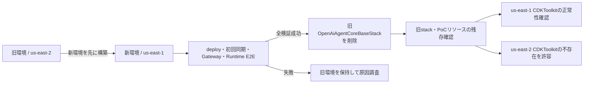

# ADR-0006: PoC全体をus-east-1へ移行してからus-east-2を廃止する

- Status: Accepted
- Date: 2026-08-18
- Decision owner: プロジェクトオーナー
- Reviewers: N/A
- Supersedes: N/A
- Superseded by: N/A
- Related specs: `specs/06-rag-knowledge-agent-01/specs.md`
- Related plan: `specs/06-rag-knowledge-agent-01/plan.md`
- Related tasks: `specs/06-rag-knowledge-agent-01/tasks.md`

## 1. 背景

AWS Knowledge Agentの実装は、PoC全体を`us-east-2`へ配置し、Amazon Bedrock Managed Knowledge BaseとManaged Knowledge Bases Connectorを利用する前提で計画された。

default profileの対象AWSアカウントと`us-east-2`に対する`cdk diff`では、CloudFormationのread-only change setが、`AWS::Bedrock::KnowledgeBase`の`MANAGED`設定と`AWS::Bedrock::DataSource`の`MANAGED_KNOWLEDGE_BASE_CONNECTOR`設定をリージョン側resource schemaの未サポートとして拒否した。AWS公式の対応リージョンにも`us-east-2`は含まれない。一方、Managed Knowledge Baseと`openai.gpt-5.5`は`us-east-1`で利用できる。

プロジェクトオーナーは、PoC全体を`us-east-1`へ変更し、最終的に既存の`us-east-2`リソースを削除する方針を選択した。

### 用語整理

- 新環境: 同一AWSアカウントの`us-east-1`へ配置する`OpenAiAgentCoreBaseStack`と、その管理下のPoCリソース。
- 旧環境: 同一AWSアカウントの`us-east-2`に存在する`OpenAiAgentCoreBaseStack`と、その管理下のPoCリソース。
- 移行完了: 新環境のdeploy、初回同期、GatewayおよびRuntime E2Eが成功し、旧環境の削除と残存確認が完了した状態。`us-east-1`の`CDKToolkit`が正常であることを必須とし、`us-east-2`の`CDKToolkit`は存在しなくてもよい。

## 2. 課題

- Managed Knowledge Baseを利用する要件を維持しながら、AWSが実際に受理するリージョンへPoCを配置する必要がある。
- Runtime、Memory、Weather／Knowledge Gateway、Lambda、Managed Knowledge Base、S3のリージョン境界を複雑化させずに移行する必要がある。
- 動作確認前に旧環境を削除して検証経路や会話履歴を失うことを防ぐ必要がある。
- 新旧環境の一時的な併存後に旧環境を確実に削除し、二重課金と利用先の混在を解消する必要がある。
- 移行完了後に利用しない`us-east-2`の`CDKToolkit`を、履歴上の完了条件のためだけに復元・維持しない運用条件が必要である。

## 3. 決定ドライバー

- Managed Knowledge BaseとManaged Knowledge Bases Connectorを仕様どおり利用できること
- `openai.gpt-5.5`の利用を維持できること
- PoCを単一リージョン、単一stackとして理解・運用できること
- 新環境の成功を確認するまで旧環境をロールバック先として保持できること
- 旧環境の削除対象をリージョンとstack名で明確に限定できること
- 移行完了後は現行の`us-east-1` CDK基盤だけを維持し、不要な旧リージョンのbootstrap基盤を復元しないこと

## 4. 決定

### 4.1 採用するもの

- PoC全体のデプロイ先を`us-east-1`へ変更する。
- Runtime、Memory、Weather／Knowledge Gateway、GatewayTarget、Lambda、Managed Knowledge Base、S3および関連IAMを、同一AWSアカウントの`us-east-1`に単一stackとして配置する。
- `us-east-1`でCloudFormation事前検証、deploy、文書配置、初回同期、Gateway Tool、Runtime E2Eを順に完了する。
- 新環境のE2E成功後に限り、旧`us-east-2`の`OpenAiAgentCoreBaseStack`を削除する。
- 削除後は旧stackと、本PoCのRuntime、Memory、Gateway、GatewayTarget、LambdaおよびKnowledge関連リソースの残存を確認する。
- 現行デプロイ基盤である`us-east-1`の`CDKToolkit` stackは削除せず、正常状態を維持する。
- 移行完了後の`us-east-2` `CDKToolkit`は維持対象にしない。残存監査で存在しない場合も移行失敗とせず、復元しない。

### 4.2 採用しないもの

- Managed Knowledge Baseが未サポートのまま`us-east-2`へ同じtemplateをdeployする方式
- Runtimeを`us-east-2`へ残し、Knowledge関連リソースだけを`us-east-1`へ分割する複数リージョン構成
- Managed Knowledge Base要件をやめ、`us-east-2`で顧客管理Vector Storeを使用する方式
- 新環境のE2E成功前に旧環境を削除する方式
- 移行完了条件を満たすためだけに、不要な`us-east-2` `CDKToolkit`を再bootstrapする方式

### 4.3 例外

- N/A

## 5. 最終構成

## 6. 検討した代替案

### 6.1 PoC全体をus-east-1へ移行する

#### 内容

PoCの全リソースを`us-east-1`の単一stackへ配置し、検証成功後に旧`us-east-2` stackを削除する。

#### メリット

- Managed Knowledge Baseと`openai.gpt-5.5`を同一リージョンで利用できる。
- 既存の単一リージョン構成とIAM境界を維持できる。
- 新環境の検証中は旧環境を保持できる。

#### デメリット

- 移行中は新旧環境が一時的に併存し、料金が重複する。
- 旧Memoryと旧S3データはstack削除後に復旧できない。

#### 判断

Managed Knowledge Base要件と単一リージョン構成を両立できるため採用する。

### 6.2 Knowledge経路だけをus-east-1へ分割する

#### 内容

Runtimeと既存Weather経路を`us-east-2`へ残し、Managed Knowledge BaseとKnowledge Gatewayを`us-east-1`へ配置する。

#### メリット

- 既存RuntimeとWeather経路のリージョンを維持できる。

#### デメリット

- 複数stack、cross-region参照、SigV4署名リージョン、障害境界、削除手順が複雑になる。
- 仕様の同一リージョン前提を維持できない。

#### 判断

PoCの構成と運用を不必要に複雑化するため採用しない。

### 6.3 us-east-2でself-managed Knowledge Baseを使用する

#### 内容

Managed Knowledge Baseをやめ、顧客管理Vector Storeを使用するKnowledge Baseへ変更する。

#### メリット

- 既存の`us-east-2`配置を維持できる可能性がある。

#### デメリット

- Managed Knowledge Base、サービス管理Embedding、顧客管理Vector Storeなしというfeatureの中心要件を変更する。

#### 判断

中心要件を維持できないため採用しない。

## 7. 影響

### 7.1 良い影響

- CloudFormationとBedrockが対応するリージョンで、Managed Knowledge Baseの実AWS検証へ進める。
- `openai.gpt-5.5`、Runtime、Gateway、Knowledge Baseを同一リージョンに保てる。
- 新環境の検証失敗時に旧環境を直ちに失わずに済む。
- 移行完了後は旧環境の二重課金と誤接続を解消できる。
- 不要な`us-east-2` bootstrap基盤を完了条件のために復元する運用が不要になる。

### 7.2 悪い影響・注意点

- 移行中は同名stackがリージョン別に存在し、コマンドのregion指定を誤る危険がある。
- 新旧環境の併存期間はAWS利用料金が重複する。
- 旧stack削除により、旧Memoryの会話履歴、旧S3オブジェクト、ログなど`DESTROY`対象データは復旧できない。
- ADR-0001、ADR-0003、ADR-0005に記載された`us-east-2`前提は、本決定の範囲で読み替える必要がある。
- 将来`us-east-2`へCDK stackを再配置する場合は、その時点で改めてbootstrapとasset基盤の確認が必要になる。

### 7.3 リスクと対策

| リスク | 対策 |
|---|---|
| 誤って新環境を削除する | destroy前にaccount、profile、stack名、region=`us-east-2`を別々に確認する |
| 新環境の検証前に旧環境を削除する | deploy、同期、Gateway、Runtime E2Eを削除の必須ゲートにする |
| 旧環境のデータを後から必要とする | 削除前に必要な検証結果を保存し、復旧不能な対象を確認する |
| 新旧環境の料金が重複する | E2E完了後に旧環境の削除と残存監査を続けて実施する |
| stack外リソースを誤って削除する | 削除対象を旧`OpenAiAgentCoreBaseStack`と、その管理下または本PoC名で識別できる残存リソースの確認に限定する |
| 旧`CDKToolkit`の不存在をPoC移行の不完了と誤判定する | 完了判定は旧PoCリソースの不存在と現行`us-east-1` stack／`CDKToolkit`の正常性に限定する |

## 8. 実装方針

- `app.py`、Runtime設定、URL検証、テストおよび文書の固定リージョンを`us-east-1`へ更新する。
- `us-east-1`のCDK bootstrap状態を確認し、必要な場合だけ同アカウントを明示してbootstrapする。
- `cdk diff`のCloudFormation事前検証が成功した後に、新環境をdeployする。
- 初回同期が`COMPLETE`になった後にGatewayとRuntime E2Eを実施する。
- 新環境の検証成功後、旧リージョンを明示できる方法で旧stackを削除する。
- 削除後はCloudFormationと各対象サービスをread-onlyで照会し、旧PoCリソースの残存がないことと、`us-east-1`の新stackおよび`CDKToolkit`が正常であることを確認する。
- `us-east-2`の`CDKToolkit`は確認結果を記録するが、不存在でも復元せず完了判定を妨げない。

## 9. 運用方針

- AWS操作ごとにprofile、account、region、stack名を確認する。
- 新環境の検証が一つでも失敗した場合は旧環境を保持する。
- 旧環境削除後は、必要に応じて新環境を正本として後続検証を行う。
- `us-east-1`の`CDKToolkit`は本PoC stackの削除対象に含めず、現行のdeploy基盤として維持する。
- `us-east-2`の`CDKToolkit`は移行完了後の維持対象に含めない。不存在を検知しても、PoCの残存リソースとして扱わず、再bootstrapしない。

## 10. コスト方針

- 移行中は新旧のRuntime、Memory、Gateway、Lambdaその他のリソースが一時的に併存し、料金が重複し得る。
- 新環境のE2E成功後は旧環境を削除し、不要な継続課金を避ける。

## 11. セキュリティ / コンプライアンス方針

- 既存のIAM最小権限、SigV4、秘密情報非保持の方針をリージョン変更後も維持する。
- 削除コマンドへ認証情報を埋め込まず、標準AWS profileと一時認証情報を使用する。
- AWS識別子は検証に必要な範囲だけ記録し、認証情報をログやSDD成果物へ保存しない。

## 12. 採用基準 / 完了条件

- [x] SDD成果物、実装、テストおよび文書の対象リージョンが`us-east-1`で整合する。
- [x] `us-east-1`のCloudFormation事前検証と`cdk deploy`が成功する。
- [x] Managed Knowledge Baseの初回同期、Gateway Tool、Runtime E2Eが成功する。
- [x] 新環境の成功前に旧`us-east-2` stackを削除していない。
- [x] 成功後に旧`us-east-2`の`OpenAiAgentCoreBaseStack`を削除する。
- [x] 旧PoCリソースが残っておらず、`us-east-1`の新stackと`CDKToolkit`が正常であることを確認する。`us-east-2`の`CDKToolkit`は不存在でもよい。

## 13. ロールバック / 変更方針

- 旧環境削除前に新環境で問題が発生した場合は、旧`us-east-2` stackを保持したまま新環境の原因を調査する。
- 旧環境削除後にリージョン判断を戻す場合は、CDKから再デプロイする。削除済みMemory履歴、S3オブジェクト、ログなどの復旧は保証しない。
- `us-east-2`へ再デプロイする場合は、その時点の対応リージョンと要件を再確認し、必要な`CDKToolkit`を改めてbootstrapする。
- 別リージョンまたは複数リージョン構成へ変更する場合は、本ADRを更新または新しいADRで置き換える。

## 14. 未決事項

- `app.py`を`us-east-1`へ変更した後に、旧`us-east-2` stackだけを削除する具体的なCDKまたはCloudFormationコマンド
- 旧stack削除後に残存確認する対象APIと、本PoCリソースを識別する具体的な条件

## 15. 参考資料

- `specs/06-rag-knowledge-agent-01/specs.md`
- `specs/06-rag-knowledge-agent-01/plan.md`
- `specs/06-rag-knowledge-agent-01/tasks.md`
- `docs/ADR/adr-0001-use-bedrock-mantle-with-runtime-role-sigv4.md`
- `docs/ADR/adr-0003-use-dedicated-agentcore-gateway-for-weather-tools.md`
- `docs/ADR/adr-0005-deploy-knowledge-documents-with-cdk-and-sync-after-deploy.md`
- [Managed Knowledge Base対応リージョン](https://docs.aws.amazon.com/bedrock/latest/userguide/kb-managed-regions.html)
- [GPT-5.5のリージョン提供状況](https://docs.aws.amazon.com/bedrock/latest/userguide/model-card-openai-gpt-55.html)
