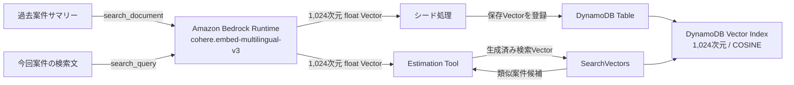

# ADR-0007: DynamoDB Vector SearchのEmbeddingにBedrockのCohere Embed Multilingual v3を使用する

- Status: Proposed
- Date: 2026-08-19
- Decision owner: プロジェクトオーナー
- Reviewers: N/A
- Supersedes: N/A
- Superseded by: N/A
- Related specs: `specs/07-dynamodb-vector-search/specs.md`
- Related plan: N/A
- Related tasks: N/A

## 1. 背景

Estimation AgentのPoCでは、DynamoDBを過去案件実績と見積マスターの構造化データの正本として利用し、DynamoDB Vector Indexから今回案件に類似する過去案件サマリーを検索する。

当初の仕様では、OpenAI Embeddings APIの`/v1/embeddings`を直接呼び出し、`text-embedding-3-small`でVectorを生成する方針としていた。しかし、この方式ではAWS外部のAPI endpoint、OpenAI API keyの保管、外部通信、およびOpenAI側の契約・運用が追加で必要になる。プロジェクトオーナーは、直接API利用が必要であれば`text-embedding-3-small`を採用しない方針を示した。

本PoCの過去案件サマリーと検索文は主に日本語である。PoC全体は`us-east-1`のAmazon Bedrock AgentCoreとAWSリソース上で動作するため、日本語を含む意味検索に適したAmazon BedrockのEmbeddingモデルを選択し、DynamoDB Vector Searchとの責務境界を明確にする必要がある。

### 用語整理

- 保存Vector: 過去案件サマリーをEmbeddingへ変換し、DynamoDBのサマリーItemへ保存する1,024次元の浮動小数点Vector。
- 検索Vector: 今回案件の検索文をEmbeddingへ変換し、`SearchVectors`へ渡す1,024次元の浮動小数点Vector。
- `SearchVectors`: 生成済みの検索Vectorを受け取り、DynamoDB Vector Indexから近傍Itemを検索するAPI。Embeddingモデル自体は実行しない。

## 2. 課題

- 日本語の過去案件サマリーと検索文を同じ意味空間へ変換するEmbeddingモデルを決める必要がある。
- シード時の保存Vector生成と検索時の検索Vector生成で、モデル、次元数、および検索用途に応じた入力種別を一貫させる必要がある。
- DynamoDB Vector Indexの次元数はモデル出力と一致させる必要がある。
- Embedding生成と`SearchVectors`の責務を分離し、`SearchVectors`へモデル名を指定すればVectorが生成されるという誤解を避ける必要がある。
- OpenAI Embeddings APIの直接利用に伴うAPI key、外部通信、および追加の運用境界をPoCへ持ち込むかを決める必要がある。

## 3. 決定ドライバー

- 日本語を含む案件サマリーと検索文を対象にできること
- PoCの既存AWSアカウントと`us-east-1`で利用できること
- OpenAI Embeddings APIの直接利用とOpenAI API keyを不要にできること
- IAMによってEmbeddingモデルの呼び出し権限を限定できること
- 保存Vectorと検索Vectorの生成条件、およびDynamoDB Vector Indexの次元数を固定できること
- シード、検索、テスト、手動確認で同じモデル条件を再現できること

## 4. 決定

### 4.1 採用するもの

- Embedding providerとしてAmazon Bedrock上のCohereを使用する。
- Embeddingモデルを`cohere.embed-multilingual-v3`に固定する。
- 過去案件サマリーは`input_type=search_document`、今回案件の検索文は`input_type=search_query`で生成する。
- `embedding_types=["float"]`と`truncate=NONE`を使用し、各入力を512 token、かつ約2,048文字以下へ制限する。
- 保存Vectorと検索Vectorを1,024次元に固定し、DynamoDB Vector Indexも1,024次元、`COSINE`距離に固定する。
- Estimation Toolまたはシード処理がAmazon Bedrock Runtimeの`InvokeModel`でVectorを生成し、検索時は生成済みVectorをDynamoDB `SearchVectors`へ渡す。
- サマリーItemへprovider、モデルID、次元数、入力種別、生成元hash、および準備状態を記録する。
- Estimation Tool実行ロールだけへ、対象DynamoDBリソースと`cohere.embed-multilingual-v3`に必要な最小権限を付与する。

### 4.2 採用しないもの

- OpenAI Embeddings APIの`/v1/embeddings`と`text-embedding-3-small`の直接利用
- OpenAI API keyをAWS Secrets Managerへ保管してEstimation Toolから利用する構成
- Amazon Titan Text Embeddings V2を本PoCのEmbeddingモデルとして使用する構成
- 実行時の設定によって複数のEmbeddingモデルまたは次元数を切り替える構成
- Agentまたは利用者から生のVectorを受け取り、そのまま`SearchVectors`へ渡す構成
- `SearchVectors`がEmbeddingモデルを呼び出すという責務設計

### 4.3 例外

- N/A

## 5. 最終構成

## 6. 検討した代替案

### 6.1 OpenAI `text-embedding-3-small`を直接利用する

#### 内容

Estimation Toolまたはシード処理からOpenAI Embeddings APIの`/v1/embeddings`を直接呼び出し、`text-embedding-3-small`で保存Vectorと検索Vectorを生成する。

#### メリット

- 当初の`specs.md`でモデルIDと1,536次元を固定しており、仕様案が具体化されていた。

#### デメリット

- OpenAI API endpointへの外部通信が必要になる。
- OpenAI API keyの保管、取得、ローテーション、非露出確認が必要になる。
- OpenAI Platform側の契約、利用可否、rate limit、料金、およびデータ取り扱いに依存する。

#### 判断

プロジェクトオーナーが、OpenAI Embeddings APIの直接利用が必要であれば`text-embedding-3-small`を採用しない方針を示したため、採用しない。

### 6.2 Amazon Titan Text Embeddings V2を利用する

#### 内容

Amazon Bedrockの`amazon.titan-embed-text-v2:0`を使用し、保存Vectorと検索Vectorを生成する。

#### メリット

- Amazon Bedrock内で利用でき、OpenAI API keyとAWS外部への直接API接続を必要としない。
- 1,024次元を選択できる。

#### デメリット

- AWS公式文書では英語向けに最適化されたモデルと説明され、多言語対応はpreviewとして記載されている。
- 本PoCの主な検索対象である日本語に対して、Cohere Embed Multilingual v3ほど多言語検索用途が明示されていない。

#### 判断

本PoCは日本語の案件サマリーと検索文を主対象とするため、100以上の言語を対象とする多言語検索モデルとして明示されている`cohere.embed-multilingual-v3`を採用する。

## 7. 影響

### 7.1 良い影響

- OpenAI API key、Secrets Manager secret、およびOpenAI API endpointへの外部通信経路が不要になる。
- Bedrockモデル呼び出しをIAMで対象モデルへ限定できる。
- 日本語を含む多言語検索を用途として明示したモデルでPoCを評価できる。
- 保存時と検索時の入力種別、およびDynamoDB Vector Indexの次元数が明確になる。
- Embedding生成障害とDynamoDB検索障害を別の処理段階として診断できる。

### 7.2 悪い影響・注意点

- 既存のOpenAI前提で記載した仕様、テスト観点、IAM、および手動確認手順をBedrock前提へ変更する必要がある。
- Cohere Embed Multilingual v3の入力は512 token、かつ約2,048文字までに制限される。
- Bedrockのモデル利用可否、quota、throttling、および料金の影響を受ける。
- 将来別モデルへ変更する場合、既存Vectorと検索Vectorの意味空間を混在させられないため、保存Vectorの再生成が必要になる。

### 7.3 リスクと対策

| リスク | 対策 |
|---|---|
| シード時と検索時でモデルまたは次元数が異なる | モデルIDと1,024次元を固定し、起動時または呼び出し前の設定検証と自動テストを行う |
| 保存Vectorへ`search_query`を使用する、または検索Vectorへ`search_document`を使用する | 用途別の`input_type`を仕様とテストで固定する |
| 長い案件要約が暗黙に切り捨てられる | `truncate=NONE`と入力上限検証を使用し、上限超過を明示的な入力エラーにする |
| Tool実行ロールが任意のBedrockモデルを呼び出せる | `bedrock:InvokeModel`を`cohere.embed-multilingual-v3`のFoundation Modelリソースへ限定する |
| `SearchVectors`がモデルを実行すると誤認される | Vector生成と検索を別工程としてTool契約、ログ、テスト、手動確認へ明記する |
| モデル変更後に旧Vectorが残る | モデル変更時は新しいADR、全保存Vectorの再生成、および必要に応じた新Vector Index作成を必須とする |

## 8. 実装方針

- シード処理と`search_similar_projects`は、共通の入力正規化規則とBedrock Embedding adapterを使用する。
- シード処理は`search_document`、検索Toolは`search_query`を指定し、どちらも1,024次元の浮動小数点Vectorだけを受理する。
- `SearchVectors`にはモデルIDではなく、生成済み検索Vector、`top_k`、scope、および許可されたfilterを渡す。
- Vector Indexは1,024次元と`COSINE`距離で作成する。
- 自動テストでは実Bedrockを呼び出さず、`InvokeModel`の要求パラメーター、応答型、次元数、および障害処理をテストダブルで検証する。
- AWS E2Eはユーザーの明示依頼後に実施し、モデル利用可能性、シード、Index反映、実検索を順に確認する。

## 9. 運用方針

- AWS E2Eの前に、`us-east-1`で`cohere.embed-multilingual-v3`が利用可能であり、Tool実行ロールに対象モデルの権限があることを確認する。
- Bedrockのタイムアウト、throttling、アクセス拒否、モデル利用不能、応答不正をEmbedding経路の利用不能として扱い、別モデルへ自動fallbackしない。
- サマリー本文が変わった場合は生成元hashで差分を識別し、同じモデル条件で保存Vectorを再生成する。
- Vector Indexの非同期反映が完了するまでRuntime E2Eを開始しない。

## 10. コスト方針

- Amazon BedrockのEmbedding呼び出しとDynamoDB Vector Searchが課金対象になり得る。
- 具体的な予算、呼び出し回数上限、およびコストアラームは本ADRでは決定しない。
- シード再実行時は、生成元hashが同じサマリーの不要なEmbedding再生成を避ける方針を後続計画で検討する。

## 11. セキュリティ / コンプライアンス方針

- OpenAI API key、Bedrock API key、Bearer token、および静的AWSアクセスキーを使用しない。
- Bedrock呼び出しにはEstimation Tool実行ロールの一時AWS認証情報を使用する。
- Runtime実行ロールからBedrock EmbeddingモデルとDynamoDBへ直接アクセスさせない。
- Embeddingモデルへ渡すデータは架空の過去案件サマリーと今回案件の検索文に限定し、単価、価格、正式な実績数値、見積Draft、actor情報、およびAWSリソース識別子を含めない。
- Vector本体、AWS認証情報、Authorization header、および内部リソース識別子をAgent応答または通常ログへ含めない。

## 12. 採用基準 / 完了条件

- [ ] `specs/07-dynamodb-vector-search/specs.md`が本ADRのモデル、次元数、入力種別、IAM、および障害方針と整合している。
- [ ] シード処理が`cohere.embed-multilingual-v3`と`search_document`で1,024次元の保存Vectorを生成する。
- [ ] 検索Toolが`cohere.embed-multilingual-v3`と`search_query`で1,024次元の検索Vectorを生成する。
- [ ] DynamoDB Vector Indexが1,024次元と`COSINE`距離で構成される。
- [ ] Estimation Tool実行ロールだけが対象Embeddingモデルと対象DynamoDBリソースへアクセスできる。
- [ ] OpenAI Embeddings API、OpenAI API key、およびEmbedding用の外部HTTPS通信経路が構成に含まれない。
- [ ] 正常系、入力上限、次元不一致、Bedrock障害、Vector検索0件、およびVector検索障害を自動テストで確認する。
- [ ] ユーザーの明示依頼に基づくAWS E2Eで、保存Vector生成、Index反映、検索Vector生成、および`SearchVectors`を確認する。

## 13. ロールバック / 変更方針

- 実装前に本決定を戻す場合は、`specs.md`と本ADRを再レビューし、代替モデルと認証・通信境界を改めて決定する。
- 実装後に別のEmbeddingモデルへ変更する場合は、新しいADRで本ADRを置き換える。
- モデル変更時は、同じVector Indexへ異なるモデルのVectorを混在させず、すべての保存Vectorを新モデルで再生成する。
- 次元数、距離関数、projection、filter属性、またはpartition keyが変わる場合は、新しいDynamoDB Vector Indexを作成して切り替える。

## 14. 未決事項

- シード用Embeddingをデプロイ前のローカル工程で生成するか、デプロイ後のシード処理で生成するか
- Bedrock Embedding adapter、入力正規化、再試行、タイムアウト、および生成元hash比較の具体的な実装方式
- Embedding利用量の具体的な上限、予算、およびコスト監視方法
- Sample Project Delta以外に検索品質評価で使用する日本語質問セットと合格基準

## 15. 参考資料

- `specs/07-dynamodb-vector-search/specs.md`
- [Cohere Embed Multilingual model card](https://docs.aws.amazon.com/bedrock/latest/userguide/model-card-cohere-embed-multilingual.html)
- [Cohere Embed v3 request and response parameters](https://docs.aws.amazon.com/bedrock/latest/userguide/model-parameters-embed-v3.html)
- [Supported models and Regions for Amazon Bedrock knowledge bases](https://docs.aws.amazon.com/bedrock/latest/userguide/knowledge-base-supported.html)
- [Titan Text Embeddings models](https://docs.aws.amazon.com/bedrock/latest/userguide/titan-embedding-models.html)
- [Build semantic search with native vector support in Amazon DynamoDB](https://aws.amazon.com/blogs/database/build-semantic-search-with-native-vector-support-in-amazon-dynamodb/)
- [Using vector indexes in DynamoDB](https://docs.aws.amazon.com/amazondynamodb/latest/developerguide/VectorSearch.html)
