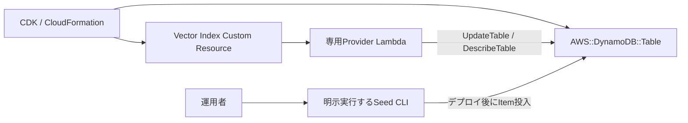

# ADR-0008: DynamoDB Vector Indexを専用Custom Resource Providerで管理する

- Status: Accepted
- Date: 2026-08-20
- Decision owner: プロジェクトオーナー
- Reviewers: プロジェクトオーナー
- Supersedes: N/A
- Superseded by: N/A
- Related specs: `specs/07-dynamodb-vector-search/specs.md`
- Related plan: `specs/07-dynamodb-vector-search/plan.md`
- Related tasks: `specs/07-dynamodb-vector-search/tasks.md` T004、T040〜T042、T105、T110

## 1. 背景

Estimation Agent PoCでは、過去案件サマリーを保存するDynamoDBテーブルと、1,024次元のVectorを検索するDynamoDB Vector Indexをデプロイする。DynamoDBのサービスAPIはVector Indexの作成、状態参照、更新、削除に対応している一方、2026年8月19日時点のCloudFormation `AWS::DynamoDB::Table`と`aws-cdk-lib 2.265.0`にはVector Indexを直接表現するL1／L2 APIがない。

また、ADR-0007により、Sample DataのEmbedding生成とシードはCloudFormationのライフサイクルから分離し、デプロイ後に明示的かつ冪等に実行することが決定している。

### 用語整理

- Vector Index Provider: CloudFormation Custom ResourceのイベントをDynamoDB control-plane APIへ変換する専用Lambda。
- Seed CLI: `dynamodb-seed/`の検証、Embedding生成、Item投入をデプロイ後に明示実行するCLI。

## 2. 課題

- CloudFormationが直接表現できないVector IndexをCDKスタックの作成・更新・削除と連動させる必要がある。
- 非同期のIndex状態と同一イベントの再実行を安全に扱う必要がある。
- インフラ管理とBedrock呼び出し・Sample Data投入の失敗範囲を分離する必要がある。
- Providerが対象外のテーブル、Index、Itemを操作しないようにする必要がある。

## 3. 決定ドライバー

- 既存のCDK／CloudFormationデプロイ手順へ統合できること
- Create、Update、Deleteとrollbackで再現可能なライフサイクルを持つこと
- DynamoDB APIの非同期状態と再実行を冪等に扱えること
- ProviderのIAMと操作対象をVector Index管理へ限定できること
- Sample Data投入失敗をCloudFormation rollbackへ波及させないこと

## 4. 決定

### 4.1 採用するもの

- DynamoDBテーブル本体は通常のCDK Construct／`AWS::DynamoDB::Table`で管理する。
- Vector IndexはCloudFormation Custom Resourceと専用Provider Lambdaの組合せで管理する。
- ProviderはCreate／UpdateでDynamoDBのVector Index更新APIを呼び、`DescribeTable`で対象Indexが利用可能になるまで状態を確認する。
- テーブル作成時の`AttributeDefinitions`はPK／SKだけとする。Vector IndexのSearch Schema属性は、Providerが`VectorIndexUpdates.Create`と同じ`UpdateTable`リクエストで文字列属性として定義する。
- 同一設定の再実行を成功として扱う。
- Indexの不変設定が変わる場合はversion付きの新しいIndex名を使用し、CloudFormationの置換ライフサイクルで切り替える。
- DeleteではCustom Resourceが所有する対象Indexだけを削除し、既に削除済みの場合も成功として扱う。
- ProviderのIAMは対象テーブルの`DescribeTable`とVector Index管理に必要な`UpdateTable`、自身のログ出力だけへ限定する。
- エラーへテーブル名、Index名、状態、AWS request IDを含められるが、本文、Vector、Item内容はログへ記録しない。
- Sample DataとEmbeddingはCustom Resourceへ含めず、デプロイ後にSeed CLIで明示実行する。

### 4.2 採用しないもの

- CloudFormationが未対応のVector Indexを存在しないL1／L2プロパティで表現すること
- Vector Indexを手作業のAWS CLIだけで作成し、CloudFormationスタックから独立して管理すること
- CDK deploy中にEmbedding生成、Sample Data投入、検索品質評価を実行すること
- ProviderへItemの読み書き、任意テーブル、任意Indexを操作する権限を付与すること

### 4.3 例外

- CloudFormationまたはCDKがVector Indexを正式サポートした場合も、自動的には方式を変更しない。本ADRと`plan.md`へ戻り、移行・置換・rollbackへの影響を再評価する。

## 5. 最終構成

## 6. 検討した代替案

### 6.1 AWS CLIによる手動管理

#### 内容

デプロイ後に運用者がAWS CLIでVector Indexを作成・削除する。

#### メリット

- Custom Resource Providerを実装しなくてよい。

#### デメリット

- StackとIndexの所有関係、更新順、削除順をCloudFormationが追跡できない。
- 手順漏れや環境差分が発生しやすい。

#### 判断

Vector IndexをCDKスタックのライフサイクルへ再現可能に統合できないため、採用しない。

### 6.2 Custom ResourceでSeedまで実行する

#### 内容

Providerまたは別Custom ResourceがBedrockを呼び、Sample Dataを投入する。

#### メリット

- deployだけで検索準備まで完了できる。

#### デメリット

- Bedrock障害、throttling、データ不正、Indexの結果整合がCloudFormation失敗やrollbackへ波及する。
- Seedだけの再実行と診断が難しくなる。

#### 判断

ADR-0007の明示的なSeed方針と矛盾するため、採用しない。

## 7. 影響

### 7.1 良い影響

- Vector Indexの所有関係と作成・更新・削除順をCloudFormationで追跡できる。
- Providerの単体テストで非同期状態、冪等性、置換、削除を決定的に検証できる。
- Seed障害がインフラrollbackへ波及しない。

### 7.2 悪い影響・注意点

- CloudFormation標準リソースだけの場合よりProviderコードとテストが増える。
- DynamoDB API変更とProviderの非同期状態処理を保守する必要がある。
- Index設定変更には新Indexへの置換が必要になる。

### 7.3 リスクと対策

| リスク | 対策 |
|---|---|
| 再実行で重複作成する | 現在状態と設定を比較し、同一設定を成功として扱う |
| Index作成中にCloudFormationが完了する | `DescribeTable`で利用可能状態まで確認する |
| Deleteが他Indexを削除する | Custom Resource所有のテーブル名とIndex名を検証する |
| エラーで機微情報を漏らす | ログ項目を状態、識別子、request IDへ限定する |

## 8. 実装方針

- テーブルは物理名`OpenAiEstimationData`、オンデマンド、PK／SK、TTL `expires_at_epoch`で作成する。
- Vector Indexは`EstimationProjectVectorIndexV1`、属性`embedding`、1,024次元、COSINE、HASH `search_scope`、仕様で許可したINLINE_FILTERとprojectionで作成する。
- Providerはfake DynamoDB control-plane clientを注入できるようにし、CloudFormationイベント処理とAPI呼び出しを分離する。
- CDKテンプレートテストでCustom Resource properties、依存関係、IAM、Sample Data Custom Resource不在を検証する。

## 9. 運用方針

- deploy後にIndexの利用可能状態を確認してからSeed CLIを実行する。
- 失敗時はCloudFormationイベント、対象Index状態、request IDを確認し、ItemやSeedを変更して回避しない。
- Indexの非同期反映後に検索品質評価を実行する。

## 10. コスト方針

- Providerの実行時間とCloudWatch Logs、DynamoDB Vector Indexが課金対象になり得る。
- Providerのログ保持はPoC方針に合わせて1週間とする。
- Sample DataのEmbedding費用はdeploy処理ではなく、明示実行するSeed工程で管理する。

## 11. セキュリティ / コンプライアンス方針

- ProviderにDynamoDB Item APIとBedrock権限を付与しない。
- 対象テーブルとCustom Resource所有Index以外を操作しない。
- Vector、検索本文、Sample Data、認証情報をログへ出力しない。

## 12. 採用基準 / 完了条件

- [x] 人のレビューで本ADRがAcceptedになっている。
- [ ] 通常のCDKテーブルとVector Index Custom Resourceが依存順に作成される。
- [ ] ProviderのCreate、再Create、非同期状態、Update置換、Delete、既削除を自動テストで確認できる。
- [ ] Provider IAMが対象テーブルのVector Index管理とログへ限定される。
- [ ] Sample Data投入Custom Resourceが存在しない。

## 13. ロールバック / 変更方針

- Provider実装に問題がある場合は、Stack更新を停止し、直前のProvider code assetとCustom Resource propertiesへ戻す。
- Index契約を変更する場合は既存Indexを直接変更せず、新しいversion付きIndexを作成して切り替える。
- CloudFormation／CDKの正式サポートへ移行する場合は、新しいADRで所有権移行と既存Index置換を決定する。

## 14. 未決事項

- なし

## 15. 参考資料

- `specs/07-dynamodb-vector-search/specs.md`
- `specs/07-dynamodb-vector-search/plan.md`
- `docs/ADR/adr-0007-use-bedrock-cohere-multilingual-embeddings-for-dynamodb-vector-search.md`
- [Using vector indexes in DynamoDB](https://docs.aws.amazon.com/amazondynamodb/latest/developerguide/VectorSearch.html)
