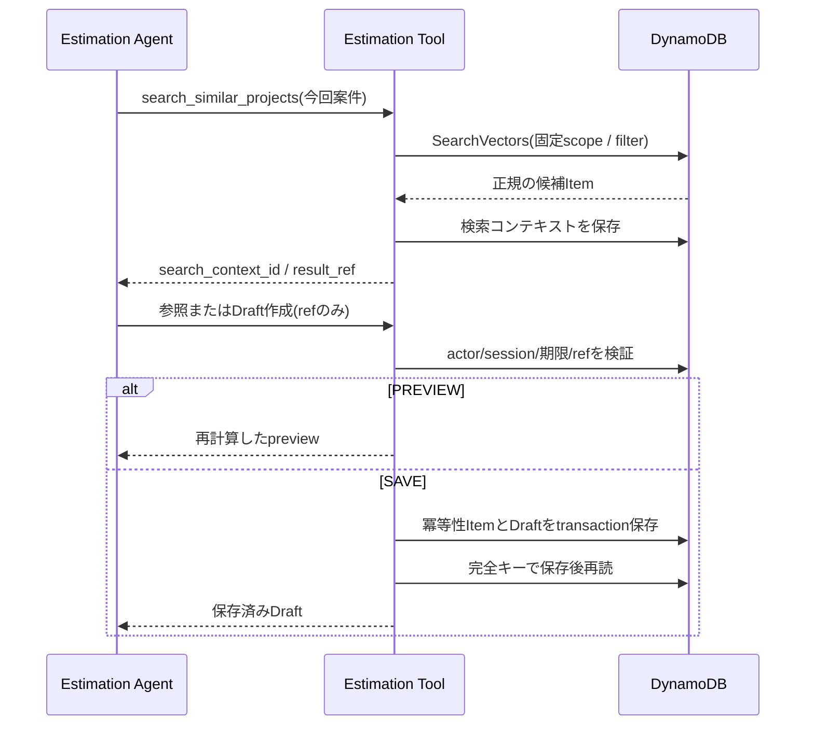

# ADR-0009: Estimationデータを単一テーブルと不透明な検索コンテキストで管理する

- Status: Accepted
- Date: 2026-08-20
- Decision owner: プロジェクトオーナー
- Reviewers: プロジェクトオーナー
- Supersedes: N/A
- Superseded by: N/A
- Related specs: `specs/07-dynamodb-vector-search/specs.md`
- Related plan: `specs/07-dynamodb-vector-search/plan.md`
- Related tasks: `specs/07-dynamodb-vector-search/tasks.md` T005、T023、T025、T031〜T034、T102〜T104

## 1. 背景

Estimation Agent PoCでは、過去案件サマリーと実績、標準工数、単価、価格ポリシーを参照し、短期の検索コンテキストを経由して見積Draftを作成・再参照する。Vector検索結果にはDynamoDBの物理キーが含まれるが、Agentが生成・改変した案件IDや物理キーを後続参照へそのまま渡すと、別案件の参照や意図しない書き込みにつながる。

また、Lambda、MCP、Runtime Memoryの失敗・再試行が発生しても、同じ保存要求からDraftを重複作成しない境界が必要である。

### 用語整理

- 検索コンテキスト: Vector検索結果と正規の案件IDの対応をactor／sessionへ束縛して短期間保持するItem。
- `result_ref`: Agentへ返す推測困難な候補参照。DynamoDBの物理キーではない。
- 冪等性Item: 同じ論理保存要求から作成済みDraftを解決するItem。

## 2. 課題

- 異なる種類とライフサイクルのデータをPoCで理解可能な境界に分ける必要がある。
- Vector検索結果をAgent経由で安全に構造化参照とDraft保存へ引き継ぐ必要がある。
- TTLの物理削除遅延にかかわらず期限切れ参照を拒否する必要がある。
- previewと永続化を分け、明示保存だけを冪等に処理する必要がある。
- Agentが渡す合計値、案件ID、actor、session、冪等性キーを信頼しない必要がある。

## 3. 決定ドライバー

- PoCのデータ関係とIAM書き込み境界を一つのテーブルで確認できること
- 任意の物理キーをAgentへ公開せず、検索結果の由来を検証できること
- actor／sessionを越えた参照を拒否できること
- 明示保存だけが副作用を持ち、再試行でDraftを重複作成しないこと
- 正式な計算結果と参照マスター版をDraftへ保存できること

## 4. 決定

### 4.1 採用するもの

- PoCでは物理名`OpenAiEstimationData`の単一オンデマンドテーブルを使用する。
- `PK`／`SK`接頭辞、`entity_type`、`schema_version`で過去案件、実績、マスター、検索コンテキスト、Draft、冪等性Itemを分離する。
- Vector属性は過去案件サマリーItemだけに保存する。
- Vector検索時に`search_context_id`と候補ごとの`result_ref`を`secrets.token_urlsafe(32)`相当で発行する。
- 検索コンテキストへ正規の案件ID、順位、検索条件、actor、session、scope、作成時刻、期限を保存する。
- 検索コンテキストの有効期間は30分とし、DynamoDB TTLに加えてToolが現在時刻を検証する。
- 後続Toolは`search_context_id`と`result_ref`だけを受け取り、サーバー側対応表から案件を解決する。Agentから任意の案件IDや物理キーを受け付けない。
- `create_estimate_draft`は`PREVIEW`と`SAVE`を分け、PREVIEWでは書き込まない。
- SAVEではToolが入力、参照、マスター版、Decimal計算を再検証し、冪等性ItemとDraftを`TransactWriteItems`で同時に条件付き作成する。
- 冪等性キーはMCPアダプターが検証済みactor、session、search context、正規化した保存要求から導出し、モデル指定値を破棄する。
- 同じキーと要求hashは既存Draftを返し、同じキーで異なる要求hashは競合として拒否する。
- 保存後は完全キーでDraftを再読し、一致を確認できた場合だけ成功とする。

### 4.2 採用しないもの

- データ分類ごとに複数テーブルへ分割すること
- AgentへDynamoDBのPK／SKまたは任意案件IDを渡して後続参照させること
- Vector検索filterまたはAgentの会話履歴だけを参照認可の根拠にすること
- DynamoDB TTLによる物理削除だけで有効期限を判定すること
- preview時のDraft仮保存
- モデルが作成した冪等性キーや合計金額を正本として使用すること
- `Scan`、PartiQL、prefix検索、Draft一覧取得をAgent Toolへ提供すること

### 4.3 例外

- 本番向けの明細分割、複数テナント分離、PITR、バックアップ、長期保持は本PoCの対象外とし、必要になった場合は別の仕様とADRで再設計する。

## 5. 最終構成

## 6. 検討した代替案

### 6.1 データ分類ごとの複数テーブル

#### 内容

過去案件、マスター、検索コンテキスト、Draftを別テーブルへ分割する。

#### メリット

- リソース単位のIAMとライフサイクルを分離しやすい。

#### デメリット

- PoCのConstruct、設定、権限、運用対象が増える。
- 一つの見積フローにおけるItem関係を確認しにくくなる。

#### 判断

本PoCでは接頭辞とLeadingKeysで論理境界を明示し、Vector検索・構造化参照・保存を一つのデータ面で確認するため、採用しない。

### 6.2 案件IDをAgent経由で引き継ぐ

#### 内容

Vector検索結果の`project_id`を後続Toolへ渡す。

#### メリット

- コンテキストItemが不要でTool入力が単純になる。

#### デメリット

- AgentがIDを生成・改変でき、検索していない案件を参照できる。
- actor／session／期限をサーバー側で検証できない。

#### 判断

検索結果の由来を保証できないため、採用しない。

### 6.3 保存前に常に追加確認する

#### 内容

最初の入力で保存が明示されていてもpreview後に再確認する。

#### メリット

- 意図しない保存をより強く抑止できる。

#### デメリット

- 明示保存を同一turnで完了する仕様を満たさない。

#### 判断

保存意図を3状態で扱い、明示保存だけを同一turnで実行する方針を採用する。

## 7. 影響

### 7.1 良い影響

- Agentが物理キーを知ることなく検索候補を後続処理へ安全に渡せる。
- TTL削除遅延、MCP再試行、Memory rollbackがあっても参照期限とDraft重複を制御できる。
- Sample Dataと利用時データの違いを同じテーブル内で追跡できる。

### 7.2 悪い影響・注意点

- 検索ごとに短期コンテキストItemの書き込みが発生する。
- 単一テーブルのキー規約とItem種別検証を厳格に保守する必要がある。
- TTL期限後も物理Itemが一時的に残る可能性がある。

### 7.3 リスクと対策

| リスク | 対策 |
|---|---|
| refの推測・改変 | 十分なentropyのopaque IDとサーバー側対応表を使用する |
| 別actor／sessionの再利用 | MCPアダプターが内部contextを上書きし、Toolで一致検証する |
| TTL削除遅延 | `expires_at_epoch`を毎回アプリ側で検証する |
| 保存の二重実行 | 冪等性ItemとDraftを条件付きtransactionで作成する |
| 400 KiB上限へ接近 | 型付きシリアライズ後350 KiBで保存を拒否する |

## 8. 実装方針

- `plan.md`で定義したPK／SK規約をRepositoryへ集約し、任意キーを受けるAPIを作らない。
- マスター参照は既知Partition Keyの`Query`、実績・Draft参照は完全キーの`GetItem`を使用し、`Scan`を禁止する。
- Tool Lambdaの書き込みIAMを`SEARCH_CONTEXT#*`、`ESTIMATE_PROJECT#*`、`IDEMPOTENCY#*`へ限定する。
- Draft IDはUUIDv4、初期versionは1、SKは`V0001`とする。
- 保存Itemへ入力スナップショット、ref、マスター版、計算入力・結果、警告、作成者、日時を保持する。

## 9. 運用方針

- 検索コンテキストの物理削除時刻を認可判断や成功条件に使用しない。
- 保存状態はpreview、保存済み、保存失敗を明確に区別する。
- 手動確認の後片付けは記録した完全なDraft IDだけを対象とし、一括削除やScanを行わない。

## 10. コスト方針

- テーブルはPoC向けオンデマンドとし、PITRは初期状態で無効とする。
- 検索コンテキストは30分で論理失効させ、TTLで後から物理削除する。
- top-3と配列上限によりItemとTool結果の肥大化を抑える。

## 11. セキュリティ / コンプライアンス方針

- actor／sessionは検証済みRuntime contextから注入し、モデル入力を信頼しない。
- AgentへDynamoDB物理キー、Vector、任意filterを返さない。
- ToolコードとIAMの両方で書き込みItem種別を制限する。
- Sample Dataへ実案件、顧客、個人、機密単価を含めない。

## 12. 採用基準 / 完了条件

- [x] 人のレビューで本ADRがAcceptedになっている。
- [ ] 仕様どおりの単一テーブルItem契約が実装される。
- [ ] 改変、別actor、別session、期限切れ、未知refを自動テストで拒否できる。
- [ ] PREVIEWが無書き込みで、SAVEだけが冪等transactionを実行する。
- [ ] 保存後再読できない処理を成功として返さない。

## 13. ロールバック / 変更方針

- キー規約を変更する場合は既存Itemとの互換性、Seed再生成、Draft参照への影響を新しいADRで決定する。
- 複数テーブルまたは本番向け明細分割へ移行する場合は、本ADRをSupersededにし、移行・二重書き込み・rollback方式を定義する。

## 14. 未決事項

- なし

## 15. 参考資料

- `specs/07-dynamodb-vector-search/specs.md`
- `specs/07-dynamodb-vector-search/plan.md`
- `docs/ADR/adr-0002-use-agents-as-tools.md`
