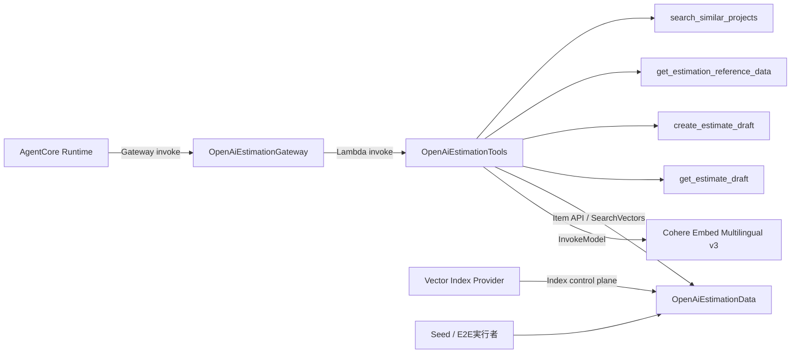

# ADR-0010: 4つのEstimation Toolを単一Gateway Targetへ集約してIAMを分離する

- Status: Accepted
- Date: 2026-08-20
- Decision owner: プロジェクトオーナー
- Reviewers: プロジェクトオーナー
- Supersedes: N/A
- Superseded by: N/A
- Related specs: `specs/07-dynamodb-vector-search/specs.md`
- Related plan: `specs/07-dynamodb-vector-search/plan.md`
- Related tasks: `specs/07-dynamodb-vector-search/tasks.md` T006、T030〜T035、T043〜T053、T104、T110〜T113

## 1. 背景

既存PoCは、Manager AgentがWeather AgentとAWS Knowledge AgentをAgents-as-Toolsとして利用し、各専門Agentが専用AgentCore Gatewayを通じて自身のToolだけを呼び出す。Estimation Agentには、類似案件検索、構造化マスター参照、見積preview／保存、Draft再参照の4業務Toolが必要である。

4 Toolは同じDynamoDBテーブル、契約、Repository、計算、検索コンテキストを共有する一方、AgentCore Runtime、Gateway、Tool Lambda、Vector Index Provider、Seed／E2E運用者では必要な権限が異なる。

## 2. 課題

- Estimationの業務Toolを既存Weather／Knowledge Toolから分離する必要がある。
- 4 Toolを一つの実行単位へ集約するか、読み取り・書き込み等で分割するかを決める必要がある。
- RuntimeからDynamoDBとEmbeddingへ直接アクセスさせず、GatewayとTool Lambdaの信頼境界を定義する必要がある。
- Estimation Gatewayだけの障害を既存Agentや一般会話へ波及させない必要がある。

## 3. 決定ドライバー

- ADR-0002〜ADR-0004のManager所有権と専門Gateway境界を維持できること
- 4 Tool間で共通契約、Repository、計算、検索コンテキストを再利用できること
- Runtime、Gateway、Tool、Provider、Seed、cleanupを最小権限で分離できること
- PoCとしてデプロイ単位と運用対象を過度に増やさないこと
- Estimation機能を任意設定とし、部分障害時も既存機能を継続できること

## 4. 決定

### 4.1 採用するもの

- Estimation専用AgentCore Gateway `OpenAiEstimationGateway`を作成する。
- Target `EstimationTools`を作成し、Lambda `OpenAiEstimationTools`へ接続する。
- 1つのLambdaで次の4 ToolだけをTool名により振り分ける。
  - `search_similar_projects`
  - `get_estimation_reference_data`
  - `create_estimate_draft`
  - `get_estimate_draft`
- ハンドラーはルーティング、共通入力検証、共通エラー変換へ限定し、Embedding、Repository、計算、コンテキスト、保存をモジュール分割する。
- Estimation Agentだけが4 Toolを利用し、ManagerへはEstimation Agentを`Agent.as_tool()`として登録する。Handoffを使用しない。
- RuntimeロールはEstimation Gateway invokeだけを許可し、DynamoDBとEmbeddingモデルへの直接権限を付与しない。
- GatewayはEstimation Tools Lambdaのinvokeだけを許可する。
- Tool Lambdaは対象テーブル／Index、固定Embeddingモデル、自身のログへ必要な最小権限を持ち、書き込み先PKをLeadingKeysで制限する。
- Vector Index Provider、Seed実行者、E2E後片付け実行者はTool Lambdaとは別の権限主体とする。
- Weather、Knowledge、EstimationのGatewayを独立して生成・接続・cleanupし、利用可能な専門Agentの組合せでManagerを構成する。

### 4.2 採用しないもの

- Estimationの4 ToolをWeatherまたはKnowledge Gatewayへ追加すること
- 4 ToolをManager、Weather、Knowledge Agentへ直接登録すること
- Agentへ汎用DynamoDB Tool、PartiQL、任意キー、任意filterを公開すること
- 各Toolを別Gatewayまたは別Lambdaへ分割すること
- RuntimeロールへDynamoDB、SearchVectors、Bedrock Embedding権限を付与すること
- Tool LambdaにVector Index control-plane権限またはSeed管理対象への書き込み権限を付与すること

### 4.3 例外

- PoCの負荷、障害分離、デプロイ頻度により実行単位の分割が必要になった場合は、別ADRでGateway Target、Lambda、IAM、Tool契約への影響を再評価する。

## 5. 最終構成

## 6. 検討した代替案

### 6.1 ToolごとにLambdaを分割する

#### 内容

検索、構造化参照、Draft作成、Draft参照を別Lambdaとしてデプロイする。

#### メリット

- Toolごとに実行ロール、timeout、デプロイを分離できる。

#### デメリット

- 共通契約、Repository、Embedding、計算のパッケージとデプロイ対象が増える。
- PoCのGateway Target、ログ、IAM、テスト構成が複雑になる。

#### 判断

4 Toolは同じデータ面と業務境界を共有し、コード内とLeadingKeysで書き込み境界を検証できるため、単一Lambdaへ集約する。

### 6.2 RuntimeからDynamoDBを直接操作する

#### 内容

AgentCore RuntimeロールへDynamoDBとBedrock権限を付け、Agent内からSDKを呼ぶ。

#### メリット

- Gateway／Lambda経路を省略できる。

#### デメリット

- Agentの推論責務と決定的な計算・検証・保存責務が混在する。
- Runtimeロールの権限が広がり、Tool Schemaの公開境界を利用できない。

#### 判断

業務Toolによる入力検証、最小権限、監査境界を維持できないため、採用しない。

### 6.3 読み取りと書き込みを別Targetへ分割する

#### 内容

検索・参照TargetとDraft保存Targetを分ける。

#### メリット

- 書き込み権限をTarget／Lambda単位で分離できる。

#### デメリット

- 検索コンテキスト発行も書き込みを必要とし、単純なread／write分割にならない。
- PoCの接続、Tool一覧、部分障害、cleanupがさらに複雑になる。

#### 判断

単一Target内でTool名、Item種別、LeadingKeys、条件付き書き込みにより境界を維持する方針を採用する。

## 7. 影響

### 7.1 良い影響

- Estimation固有のToolと障害を既存Gatewayから分離できる。
- 4 Toolが同じ業務モジュールを再利用できる。
- Runtimeにデータ面の直接権限を付けずに済む。
- Estimationが未設定・利用不能でも既存Agentを継続できる。

### 7.2 悪い影響・注意点

- 1つのLambda障害が4 Toolすべてへ影響する。
- Tool Lambdaの実行ロールは読み取りと限定書き込みの両方を持つ。
- Gatewayが3系統となり、接続・timeout・cleanupの組合せが増える。

### 7.3 リスクと対策

| リスク | 対策 |
|---|---|
| Tool Lambdaの権限が過大になる | Resource、Index、Foundation Model、LeadingKeysで限定し、CDKテストで検証する |
| 4 Tool間のルーティング誤り | Tool allowlist、Tool別Schema、未知Tool拒否を実装する |
| Estimation障害が全体停止になる | Gatewayごとに独立した接続・cleanupと利用可否を管理する |
| Tool結果がAgentへ内部情報を漏らす | 共通envelope、64 KiB上限、物理キー・Vector禁止をアダプターでも検証する |

## 8. 実装方針

- Gateway Targetへ4 ToolのJSON Schemaだけを登録する。
- MCPアダプターでallowlist、Tool別結果Schema、timeout、最大3検索、actor／session／冪等性キー注入を実装する。
- Lambda timeoutは60秒を基本とし、MCP transportは75秒、Tool呼び出しは60秒、Embeddingは全体45秒以内とする。
- Runtimeへ`AGENTCORE_ESTIMATION_GATEWAY_URL`と`AGENTCORE_ESTIMATION_GATEWAY_TARGET_NAME`を任意設定として追加する。
- Estimation設定が不完全な場合はEstimationだけを無効化し、既存Manager構成を維持する。

## 9. 運用方針

- Gateway、Lambda、Toolごとの相関ID、結果、件数、レイテンシを記録する。
- Estimation接続失敗、Tool失敗、cleanup失敗を既存Agentの障害と区別する。
- ログ保持はPoC方針に合わせて1週間とする。

## 10. コスト方針

- Gateway、Lambda、CloudWatch Logs、Bedrock、DynamoDBの利用料金を監視する。
- 検索回数、Embedding再試行、Tool結果サイズをコード上限で制御する。
- AWS E2E前に月額予算と50%／80%／100%通知を設定する。

## 11. セキュリティ / コンプライアンス方針

- Runtime、Gateway、Tool、Provider、Seed、cleanupの実行主体を分ける。
- Tool Lambdaは過去案件とマスターのPKへ書き込めない。
- RFP本文、検索全文、Vector、単価、見積金額、認証情報をログへ記録しない。
- Gateway SchemaとLambda側の双方で入力を検証し、モデル入力を信頼しない。

## 12. 採用基準 / 完了条件

- [x] 人のレビューで本ADRがAcceptedになっている。
- [ ] Estimation専用Gateway／Target／Lambdaへ4 Toolだけが登録される。
- [ ] Estimation Agentだけが4 Toolを使用し、ManagerへAgent-as-Toolとして登録される。
- [ ] RuntimeにDynamoDBとEmbeddingの直接権限がない。
- [ ] Gateway、Tool、Provider、Seed、cleanupの権限境界をCDKテストで確認できる。
- [ ] Estimationの接続・cleanup失敗が既存Agentを不必要に停止しない。

## 13. ロールバック / 変更方針

- Estimationを無効化する場合は任意のGateway設定を外し、既存AgentだけでRuntimeを起動する。
- Tool分割が必要になった場合は公開Tool名を維持できるかを確認し、新ADRでTarget、Lambda、IAMの移行を決定する。
- Runtimeへ直接データ権限を移す変更は本ADRをSupersededにし、信頼境界を再設計する。

## 14. 未決事項

- なし

## 15. 参考資料

- `specs/07-dynamodb-vector-search/specs.md`
- `specs/07-dynamodb-vector-search/plan.md`
- `docs/ADR/adr-0002-use-agents-as-tools.md`
- `docs/ADR/adr-0003-use-dedicated-agentcore-gateway-for-weather-tools.md`
- `docs/ADR/adr-0004-use-managed-knowledge-base-retrieve-via-dedicated-gateway.md`
