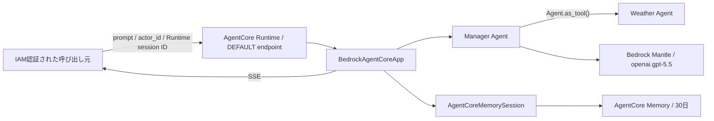
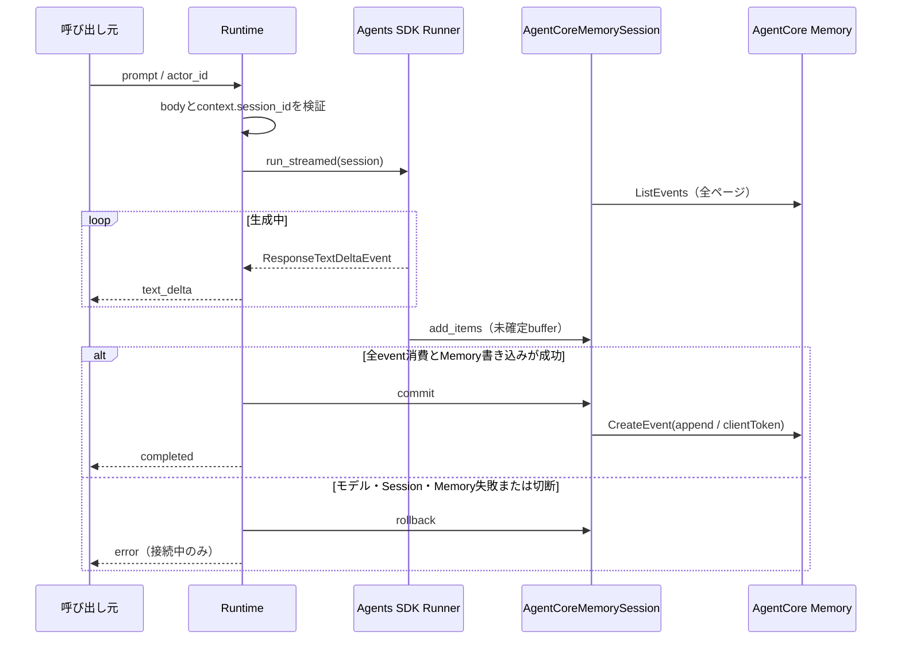

# AgentCore Runtime Agent

## 概要

このディレクトリの実装は、OpenAI Agents SDKのマネージャーAgentとWeather AgentをAmazon Bedrock AgentCore Runtimeで実行するPoC基盤です。マネージャーAgentが会話と最終回答を所有し、Weather AgentをAgent-as-Toolとして利用します。Weather Agentには実天気データを取得するToolがないため、取得不能であることを回答し、天気を推測しません。



AgentCore Runtime、Memory、CDKスタックは`us-east-2`専用です。モデル呼び出しはRuntime実行ロールの標準AWS認証情報チェーンとSigV4を使用します。OpenAI API key、Bedrock API key、静的AWS認証情報は設定しません。

## ディレクトリ構成

```text
agents/
├── main.py
├── requirements.txt
├── Dockerfile
├── .dockerignore
└── src/agent_app/
    ├── config.py
    ├── contracts.py
    ├── models.py
    ├── agent_factory.py
    ├── session.py
    ├── service.py
    └── runtime.py
```

- `contracts.py`: 入力検証、HTTPエラー、SSEイベント
- `models.py`: Bedrock provider付きResponses model
- `agent_factory.py`: Manager / Weather AgentとAgent-as-Tool
- `session.py`: AgentCore Memoryを永続化先とするSession
- `service.py`: stream全消費、commit / rollback、SSE変換
- `runtime.py`: `BedrockAgentCoreApp`と依存注入境界
- `main.py`: トレース無効化とポート8080での起動

## 固定依存

コンテナ依存の正本は`agents/requirements.txt`です。テスト環境にも同じ完全一致バージョンを`pyproject.toml`で定義し、自動テストで一致を検査します。

| パッケージ | バージョン |
| --- | --- |
| `openai-agents` | `0.19.4` |
| `openai[bedrock]` | `2.53.0` |
| `bedrock-agentcore` | `1.20.0` |

## 環境変数

| 変数 | 値 | 秘密情報 |
| --- | --- | --- |
| `AWS_REGION` | `us-east-2` | いいえ |
| `BEDROCK_OPENAI_MODEL_ID` | `openai.gpt-5.5` | いいえ |
| `OPENAI_AGENTS_DISABLE_TRACING` | `1` | いいえ |
| `AGENTCORE_MEMORY_ID` | CDKで作成したMemory ID | いいえ |

値の欠落や固定値との不一致は、安全な起動時設定エラーとして扱います。`OPENAI_API_KEY`、`AWS_BEARER_TOKEN_BEDROCK`、`AWS_ACCESS_KEY_ID`、`AWS_SECRET_ACCESS_KEY`をアプリケーション設定へ追加しないでください。

## HTTP入力契約

`POST /invocations`のJSON bodyは次の2項目を必須とします。

```json
{
  "prompt": "今日の天気を教えてください。",
  "actor_id": "poc-user-001"
}
```

- `prompt`: 空でない文字列
- `actor_id`: 1～255文字のAgentCore Memory互換ID
- Runtime session ID: bodyには含めず、AgentCore Runtimeの実行コンテキストから取得

入力不正はstream開始前にHTTP 400となり、モデルとMemoryを呼び出しません。Runtime session IDや設定の不備は安全なHTTP 5xxとなります。

## SSE出力契約

正常応答は`text/event-stream`です。各`data`はJSON objectです。

```text
data: {"type":"text_delta","delta":"現在、"}

data: {"type":"text_delta","delta":"天気取得Toolは未実装です。"}

data: {"type":"completed"}
```

| `type` | フィールド | 条件 |
| --- | --- | --- |
| `text_delta` | `delta` | Responses APIのテキスト差分ごと |
| `completed` | なし | 全event消費とMemory commit成功後に1回 |
| `error` | `message` | stream開始後の失敗時に1回。`completed`とは排他 |

内部例外、スタックトレース、認証情報はHTTP/SSE応答へ含めません。

## Session operation envelope

AgentCore Memoryの短期記憶イベントには、次のJSON documentを`blob` payloadとして保存します。

```json
{
  "schema_version": 1,
  "operation": "append",
  "items": []
}
```

`append`は正常完了した1ターンのSession itemを順序どおり追加します。`pop`と`clear`はimmutableなMemoryイベントを削除せず、論理履歴へ操作を適用します。未知version、未知operation、破損payloadは正常履歴として扱わず、fail-closedにします。`pop`や`clear`で論理的に除外されたデータも、30日のretentionが満了するまでは物理イベントとして残ります。



同じ`actor_id`とRuntime session IDの組み合わせだけが履歴を共有します。同じsessionへの並行呼び出しは読み込み時点とevent順序が競合し得るため、このPoCでは避けてください。また、Memory commit直後かつ`completed`受信前に切断された場合は、履歴が保存済みでも呼び出し元が完了を確認できない可能性があります。

## ローカル検証

リポジトリルートで実行します。

```bash
uv lock --check
uv run pytest
uv run python app.py
```

Linux ARM64イメージを構築します。

```bash
docker build --platform linux/arm64 -t openai-agentcore-poc:local agents
```

実AWSへ接続せずHTTP契約を確認する場合は、テストハーネスをread-only mountして起動します。

```bash
docker run --rm --platform linux/arm64 -p 8080:8080 \
  -v "$PWD/tests/container/harness_main.py:/app/harness_main.py:ro" \
  openai-agentcore-poc:local python /app/harness_main.py
```

別のterminalから確認します。

```bash
curl --fail http://localhost:8080/ping

curl --no-buffer --request POST http://localhost:8080/invocations \
  --header 'Content-Type: application/json' \
  --header 'X-Amzn-Bedrock-AgentCore-Runtime-Session-Id: local-session-001' \
  --data '{"prompt":"テスト","actor_id":"local-user-001"}'
```

異常SSEはコンテナへ`CONTAINER_TEST_MODE=error`を追加して確認できます。

## デプロイと呼び出し

以下は、検証用AWSアカウントへ初めてデプロイし、AgentCore Runtimeの応答と会話履歴を確認するまでの手順です。このスタックは`us-east-2`専用であり、別リージョンへはデプロイできません。デプロイ、Runtime呼び出し、ログ保存にはAWS利用料金が発生する可能性があります。

`cdk deploy`、Runtime呼び出し、`cdk destroy`はAWS環境を変更するため、対象アカウントと実行内容を確認し、作業依頼者の明示的な承認を得てから実行してください。

### 1. 前提ソフトウェアを確認する

次のソフトウェアを用意します。

- Python 3.12
- `uv`
- Node.js 22.x以上
- AWS CDK Toolkit v2
- AWS CLI v2
- Rancher Desktopなど、Linux ARM64イメージを構築できるDocker環境

リポジトリルートでバージョンとDockerの接続状態を確認します。

```bash
python3 --version
uv --version
node --version
cdk --version
aws --version
docker version
docker buildx ls
```

AWS CDK Toolkitが未導入の場合は、次の公式手順でインストールします。

```bash
npm install --global aws-cdk
```

CDK CLIは、プロジェクトが使用する`aws-cdk-lib`のCloud Assembly schemaを読めるversionでなければなりません。両方のversionを確認します。

```bash
cdk --version
uv run python -c "import importlib.metadata as m; print(m.version('aws-cdk-lib'))"
```

`Cloud assembly schema version mismatch`になる場合は、グローバルCDKを変更せず、互換性のあるCLIを`npx`で一時実行できます。以降の`cdk`コマンドも、同じ`npx ... cdk`へ置き換えます。

```bash
npx --yes --package aws-cdk@latest cdk --version
npx --yes --package aws-cdk@latest cdk diff OpenAiAgentCoreBaseStack
```

Rancher Desktopを使用していて`docker`が見つからない場合は、Rancher Desktopを起動したうえで、そのCLIを`PATH`へ追加します。

```bash
export PATH="$HOME/.rd/bin:$PATH"
docker context use rancher-desktop
docker version
```

### 2. AWS認証と対象アカウントを確認する

長期アクセスキーをリポジトリや`.env`へ保存せず、AWS IAM Identity Center（SSO）などの一時認証情報を使用してください。以降の例では、操作対象を明確にするため、作業用変数を設定します。

```bash
export DEPLOY_PROFILE='your-sandbox-profile'
export DEPLOY_REGION='us-east-2'

aws sso login --profile "$DEPLOY_PROFILE"
aws sts get-caller-identity --profile "$DEPLOY_PROFILE"
```

default profileの認証情報を使用する場合は、`--profile "$DEPLOY_PROFILE"`を省略し、`aws sts get-caller-identity`を実行します。`get-caller-identity`の`Account`と`Arn`が、デプロイを許可された検証環境であることを必ず確認してください。

デプロイ主体には、CDK bootstrapで作成されたデプロイロールを引き受ける権限と、このスタックが使用するCloudFormation、ECR、IAM、AgentCore Runtime、AgentCore Memoryの操作権限が必要です。Runtimeの呼び出し主体には、対象Runtime ARNに対する`bedrock-agentcore:InvokeAgentRuntime`を許可します。Runtime自身がモデルとMemoryへアクセスする実行ロールは、このCDKスタックが作成します。

### 3. ローカル検証とARM64イメージの構築を行う

デプロイ前に、依存関係、テスト、CDK synthを確認します。

```bash
uv sync --python 3.12
uv lock --check
uv run pytest
uv run python app.py
```

Intel Macからデプロイする場合も、AgentCore Runtime用のLinux ARM64イメージを構築できることを確認します。`--load`により、構築したイメージをローカルDockerへ読み込みます。

```bash
docker buildx build \
  --platform linux/arm64 \
  --load \
  --tag openai-agentcore-poc:aws-smoke \
  agents
```

### 4. CDK bootstrapを実行する

初回だけ、デプロイ先のAWSアカウントと`us-east-2`をCDK bootstrapします。先ほど確認した`Account`を指定してください。

```bash
export DEPLOY_ACCOUNT_ID='123456789012'

cdk bootstrap \
  "aws://${DEPLOY_ACCOUNT_ID}/${DEPLOY_REGION}" \
  --profile "$DEPLOY_PROFILE"
```

bootstrapは`CDKToolkit`スタックを作成し、CDK asset用のS3 bucket、ECR repository、IAM roleなどを準備します。再実行は可能ですが、既存のbootstrap設定を変更する場合は、同じアカウントを利用するほかのCDKスタックへの影響を確認してください。

### 5. 差分を確認してデプロイする

まず、CloudFormationへ反映される差分を確認します。`cdk diff`でもDocker image assetの準備が行われるため、Dockerを起動しておきます。

```bash
cdk diff OpenAiAgentCoreBaseStack \
  --profile "$DEPLOY_PROFILE"
```

少なくとも次を確認します。

- AgentCore RuntimeとMemoryがそれぞれ1つ作成される
- RuntimeがLinux ARM64、Public network、IAM inbound認証で構成される
- Memoryの保持期間が30日で、削除ポリシーが`DESTROY`である
- Runtime実行ロールに、想定したBedrock Mantleのモデル呼び出し権限と対象Memoryの読み書き権限が付与される
- 環境変数にAPI key、アクセスキー、秘密情報が含まれない
- 想定外のリソース削除や権限拡大がない

差分に問題がなければデプロイします。IAM権限が拡大される場合に確認を省略しないよう、`broadening`を指定します。

```bash
cdk deploy OpenAiAgentCoreBaseStack \
  --profile "$DEPLOY_PROFILE" \
  --require-approval broadening
```

CDKはLinux ARM64のコンテナイメージを構築し、bootstrap用ECRへpushした後、CloudFormationスタックを更新します。デプロイに失敗した場合は、同じコマンドを繰り返す前にCloudFormation eventと後述のRuntime状態を確認してください。

### 6. RuntimeとMemoryの作成結果を確認する

Runtime一覧から、このスタックが作成した`OpenAiAgentRuntime`のARN、ID、version、状態を確認します。

```bash
aws bedrock-agentcore-control list-agent-runtimes \
  --region "$DEPLOY_REGION" \
  --profile "$DEPLOY_PROFILE" \
  --query "agentRuntimes[?agentRuntimeName=='OpenAiAgentRuntime'].{Arn:agentRuntimeArn,Id:agentRuntimeId,Version:agentRuntimeVersion,Status:status}" \
  --output table
```

Runtimeの状態が`READY`になってから呼び出します。続けて、IDのprefixが`OpenAiAgentMemory-`であるMemoryが作成され、状態が`ACTIVE`であることを確認します。`list-memories`のsummaryにはMemory名が含まれないため、CDKがMemory名から生成するIDのprefixで絞り込みます。

```bash
aws bedrock-agentcore-control list-memories \
  --region "$DEPLOY_REGION" \
  --profile "$DEPLOY_PROFILE" \
  --query "memories[?starts_with(id, 'OpenAiAgentMemory-')].{Id:id,Status:status}" \
  --output table
```

一覧で確認したRuntime ARNを作業用変数へ設定します。

```bash
export AGENT_RUNTIME_ARN='arn:aws:bedrock-agentcore:us-east-2:123456789012:runtime/REPLACE_ME'
```

### 7. Runtimeを呼び出してSSE応答を確認する

`runtime-session-id`はAgentCore Runtimeの要件に加え、このアプリケーションの検証範囲である33～100文字に収めます。同じ会話を継続するときは、同じ値を再利用します。

```bash
export AGENT_SESSION_ID='aws-smoke-session-0000000000000001'

aws bedrock-agentcore invoke-agent-runtime \
  --region "$DEPLOY_REGION" \
  --profile "$DEPLOY_PROFILE" \
  --agent-runtime-arn "$AGENT_RUNTIME_ARN" \
  --qualifier DEFAULT \
  --runtime-session-id "$AGENT_SESSION_ID" \
  --content-type application/json \
  --accept text/event-stream \
  --cli-binary-format raw-in-base64-out \
  --cli-read-timeout 0 \
  --payload '{"prompt":"私の名前は太郎です。覚えてください。","actor_id":"aws-smoke-user-001"}' \
  response-1.txt

cat response-1.txt
```

`response-1.txt`に1件以上の`text_delta`が出力され、最後に`completed`が1回だけ出力されることを確認します。`error`と`completed`が同時に出力されてはいけません。

### 8. 会話履歴と分離境界を確認する

同じ`actor_id`と同じ`runtime-session-id`でもう一度呼び出し、直前の正常完了済み履歴が復元されることを確認します。

```bash
aws bedrock-agentcore invoke-agent-runtime \
  --region "$DEPLOY_REGION" \
  --profile "$DEPLOY_PROFILE" \
  --agent-runtime-arn "$AGENT_RUNTIME_ARN" \
  --qualifier DEFAULT \
  --runtime-session-id "$AGENT_SESSION_ID" \
  --content-type application/json \
  --accept text/event-stream \
  --cli-binary-format raw-in-base64-out \
  --cli-read-timeout 0 \
  --payload '{"prompt":"私の名前を覚えていますか？","actor_id":"aws-smoke-user-001"}' \
  response-2.txt

cat response-2.txt
```

期待結果は「太郎」を含む回答です。履歴の保持と分離は、次の組み合わせでも確認します。

| 確認内容 | `actor_id` | `runtime-session-id` | 期待結果 |
| --- | --- | --- | --- |
| 履歴継続 | 同じ | 同じ | 正常完了済みの過去履歴を参照する |
| 利用者分離 | 変更 | 同じ | 別の利用者の履歴を参照しない |
| 会話分離 | 同じ | 変更 | 別sessionの履歴を参照しない |
| Weather Agent | 任意 | 任意 | 実天気を推測せず、取得手段がないことを回答する |

異なるsessionを試す場合も、33～100文字の一意な`runtime-session-id`を使用してください。同じsessionへの並行呼び出しは、このPoCの対象外です。

### 9. 問題発生時に状態とログを確認する

Runtimeが`READY`にならない場合は、一覧で取得したRuntime IDから詳細を確認します。

```bash
aws bedrock-agentcore-control get-agent-runtime \
  --region "$DEPLOY_REGION" \
  --profile "$DEPLOY_PROFILE" \
  --agent-runtime-id 'REPLACE_WITH_RUNTIME_ID'
```

Runtime log groupを検索し、一覧に表示された対象のlog group名を作業用変数へ設定してtailします。

```bash
aws logs describe-log-groups \
  --region "$DEPLOY_REGION" \
  --profile "$DEPLOY_PROFILE" \
  --log-group-name-prefix '/aws/bedrock-agentcore/runtimes/' \
  --query 'logGroups[].logGroupName' \
  --output table

export AGENT_LOG_GROUP='/aws/bedrock-agentcore/runtimes/REPLACE_WITH_COMPLETE_LOG_GROUP_NAME'

aws logs tail "$AGENT_LOG_GROUP" \
  --region "$DEPLOY_REGION" \
  --profile "$DEPLOY_PROFILE" \
  --since 30m
```

代表的な確認点は次のとおりです。

- `AccessDeniedException`: 呼び出し主体の`bedrock-agentcore:InvokeAgentRuntime`、Runtime実行ロール、組織のSCPを確認する
- モデル呼び出し失敗: `us-east-2`で`openai.gpt-5.5`を利用できることと、Runtime実行ロールのBedrock Mantle権限を確認する
- `exec format error`: imageがLinux ARM64で構築されていることを`docker buildx`で再確認する
- HTTP 500またはSSEの`error`: クライアントへ詳細を返さない設計のため、Runtime logで設定、モデル、Memoryの例外を確認する
- timeout: 初回起動を考慮してAWS CLIのread timeoutを無効化し、Runtime状態とlogを確認する

ログや問い合わせ資料へ、入力本文、認証情報、個人情報を必要以上に転載しないでください。

### 10. 検証環境を削除する

検証終了後にリソースが不要であれば、対象アカウントを再確認してからスタックを削除します。

```bash
aws sts get-caller-identity --profile "$DEPLOY_PROFILE"

cdk destroy OpenAiAgentCoreBaseStack \
  --profile "$DEPLOY_PROFILE"
```

このスタックのMemoryには`RemovalPolicy.DESTROY`が設定されています。`cdk destroy`を実行すると会話履歴は復旧できないため、必要な検証結果を先に保存してください。CDK bootstrapで作成した`CDKToolkit`スタックは、この操作では削除されません。

### 参考資料

- [AWS CDKの前提条件](https://docs.aws.amazon.com/cdk/v2/guide/prerequisites.html)
- [AWS CDK環境のbootstrap](https://docs.aws.amazon.com/cdk/v2/guide/bootstrapping-env.html)
- [AWS CDKアプリケーションのデプロイ](https://docs.aws.amazon.com/cdk/v2/guide/deploy.html)
- [AgentCore RuntimeのIAM権限](https://docs.aws.amazon.com/bedrock-agentcore/latest/devguide/runtime-permissions.html)
- [AWS CLI: invoke-agent-runtime](https://docs.aws.amazon.com/cli/latest/reference/bedrock-agentcore/invoke-agent-runtime.html)
- [AgentCore Runtimeのトラブルシューティング](https://docs.aws.amazon.com/bedrock-agentcore/latest/devguide/runtime-troubleshooting.html)
- [OpenAI API: Amazon Bedrock](https://developers.openai.com/api/docs/guides/amazon-bedrock)
- [Amazon Bedrock: OpenAI GPT-5.5 model card](https://docs.aws.amazon.com/bedrock/latest/userguide/model-card-openai-gpt-55.html)
- [Amazon Bedrock AgentCore料金](https://aws.amazon.com/bedrock/agentcore/pricing/)

## 運用上の注意

- Memoryは短期記憶のみ、保存期間30日、AWS所有キーによる暗号化です。
- 保存期間を将来変更しても、既存eventの期限が延長されるとは限りません。
- Memoryには`RemovalPolicy.DESTROY`を設定しています。`cdk destroy`またはstack削除でPoC会話履歴は復旧不能になります。
- RuntimeはIAM inbound認証、Public network、DEFAULT endpoint、AgentCore高度トレーシング無効のPoC構成です。
- 本番利用には最小権限化、閉域化、監視、アラーム、同時実行制御などの追加設計が必要です。
