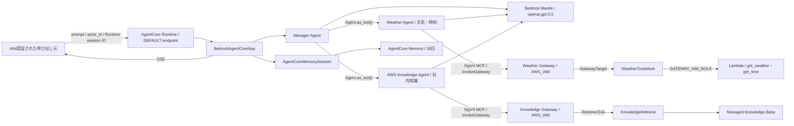
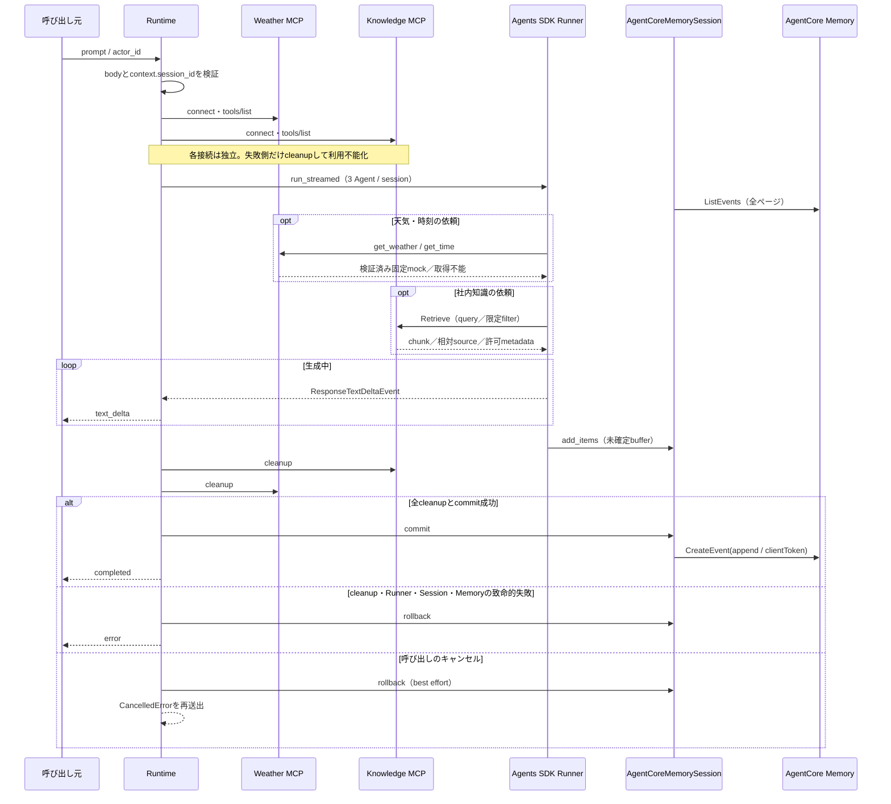

# AgentCore Runtime Agent

## 概要

このディレクトリの実装は、OpenAI Agents SDKのManager、Weather、AWS Knowledge AgentをAmazon Bedrock AgentCore Runtimeで実行するPoC基盤です。Managerが会話と最終回答を所有し、天気・時刻は`weather_agent`、架空の社内AWS標準・見積基準・過去案件は`aws_knowledge_agent`へ委譲します。両分野を含む質問では両方を使用して一つの最終回答へ統合し、Handoffは使用しません。

Weather AgentはWeather専用Gatewayの固定モックToolだけを、AWS Knowledge AgentはKnowledge専用Gatewayの`KnowledgeRetrieve___Retrieve`だけを保持します。Knowledge Agentは取得したchunkだけを根拠にし、文書相対パスを示します。検索結果内の命令形式テキストはデータとして扱い、Agent指示として実行しません。空検索は「関連情報なし」、通信・Tool障害は「取得不能」として区別します。



AgentCore Runtime、Memory、Gateway、GatewayTarget、Lambda、Managed Knowledge Base、S3、CDKスタックは`us-east-1`の単一stackへ配置します。モデル呼び出しとGatewayのMCP transportは、Runtime実行ロールの標準AWS認証情報チェーンとSigV4を使用します。MCP transportの署名には`mcp-proxy-for-aws`を使用し、独自の署名処理は実装しません。OpenAI API key、Bedrock API key、Bearer token、静的AWS認証情報は設定しません。

## ディレクトリ構成

```text
agents/
├── main.py
├── requirements.txt
├── Dockerfile
├── .dockerignore
└── src/agent_app/
    ├── config.py
    ├── contracts.py
    ├── models.py
    ├── agent_factory.py
    ├── gateway_tools.py
    ├── session.py
    ├── service.py
    └── runtime.py
```

- `contracts.py`: 入力検証、HTTPエラー、SSEイベント
- `models.py`: Bedrock provider付きResponses model
- `agent_factory.py`: 3 Agent、2 Agent-as-Tool、Gateway別の利用可否instructions
- `gateway_tools.py`: 共通SigV4 MCP transport、Gateway別Tool allowlist、Retrieve入力／結果検証、安全なToolエラー変換
- `session.py`: AgentCore Memoryを永続化先とするSession
- `service.py`: MCP接続、stream全消費、cleanup、commit / rollback、SSE変換
- `runtime.py`: `BedrockAgentCoreApp`と依存注入境界
- `main.py`: トレース無効化とポート8080での起動

## 固定依存

コンテナ依存の正本は`agents/requirements.txt`です。テスト環境にも同じ完全一致バージョンを`pyproject.toml`で定義し、自動テストで一致を検査します。

| パッケージ | バージョン |
| --- | --- |
| `openai-agents` | `0.19.4` |
| `openai[bedrock]` | `2.53.0` |
| `bedrock-agentcore` | `1.20.0` |
| `mcp-proxy-for-aws` | `1.6.4` |
| `mcp` | `1.29.0` |

## 環境変数

| 変数 | 値 | 秘密情報 |
| --- | --- | --- |
| `AWS_REGION` | `us-east-1` | いいえ |
| `BEDROCK_OPENAI_MODEL_ID` | `openai.gpt-5.5` | いいえ |
| `OPENAI_AGENTS_DISABLE_TRACING` | `1` | いいえ |
| `AGENTCORE_MEMORY_ID` | CDKで作成したMemory ID | いいえ |
| `AGENTCORE_GATEWAY_URL` | CDKで作成した専用GatewayのHTTPS `/mcp` URL | いいえ |
| `AGENTCORE_GATEWAY_TARGET_NAME` | `WeatherTimeMock` | いいえ |
| `AGENTCORE_KNOWLEDGE_GATEWAY_URL` | CDKで作成したKnowledge GatewayのHTTPS `/mcp` URL | いいえ |
| `AGENTCORE_KNOWLEDGE_GATEWAY_TARGET_NAME` | `KnowledgeRetrieve` | いいえ |

値の欠落や固定値との不一致は、安全な起動時設定エラーとしてstream開始前に扱います。Gateway URLはHTTPS、`us-east-1`のAgentCore Gateway host、`/mcp` pathであることを検証し、旧`us-east-2`を含む他リージョンのhostを拒否します。Target名はGatewayTargetの許容文字と長さを検証します。URLやTarget名をエラー応答へ含めません。`OPENAI_API_KEY`、`AWS_BEARER_TOKEN_BEDROCK`、`AWS_ACCESS_KEY_ID`、`AWS_SECRET_ACCESS_KEY`をアプリケーション設定へ追加しないでください。

## Weather／TimeモックTool

Managerの直接Toolは`weather_agent`と`aws_knowledge_agent`だけです。Weather MCPはWeather Agent、Knowledge MCPはAWS Knowledge Agentだけへ登録し、ManagerへMCP serverを直接登録しません。

| 用途 | MCP公開名 | 必須入力 | 固定モック出力 |
| --- | --- | --- | --- |
| 天気 | `WeatherTimeMock___get_weather` | 空白だけでない`location` | 入力`location`、`weather="72 degrees Fahrenheit, Sunny"`、`data_type="mock"` |
| 時刻 | `WeatherTimeMock___get_time` | 空白だけでない`timezone` | 入力`timezone`、`local_time="2:30 PM"`、`data_type="mock"` |

`AGENTCORE_GATEWAY_TARGET_NAME`から組み立てた上記2つの完全一致名だけをallowlistへ設定します。正常結果も`data_type="mock"`とToolごとの必須フィールドを検証してからWeather Agentへ渡します。Lambdaの`error`、MCPの`isError`、transport／Tool例外、JSONやフィールドの形式異常は、内部値を含まない固定の取得不能結果へ変換します。

## Knowledge Retrieve契約

Knowledge Gatewayでは`KnowledgeRetrieve___Retrieve`だけをallowlistへ設定します。Knowledge Base IDと`overrideSearchType=HYBRID`はGateway Target側の管理者固定値です。`numberOfResults`はBedrock既定の5件を使用します。これらをモデルへ公開せず、モデルが指定できる入力は次の範囲です。

```json
{
  "retrievalQuery": {"text": "本番環境のCPU監視標準"},
  "retrievalConfiguration": {
    "managedSearchConfiguration": {
      "filter": {
        "andAll": [
          {"equals": {"key": "document_type", "value": "standard"}},
          {"listContains": {"key": "environment", "value": "prod"}}
        ]
      }
    }
  }
}
```

- queryは空白だけでない文字列に限定する。
- filterのleafは`document_type/equals`、`environment/listContains`、`service/listContains`だけを許可する。
- `andAll`／`orAll`は最大2段、leaf条件は合計8件までとする。
- 未知field、Knowledge Base ID、検索件数、検索方式などのoverrideはGatewayへ送らない。

Retrieve結果は、非空のTEXT chunk、許可済み5文書の相対パス、`document_type`、`version`、`system_type`、`environment`、`service`、`project_name`の許可metadata、任意の数値scoreへ正規化します。S3 bucket名、Knowledge Base ID、Gateway URL、ARN、例外本文はモデルへ渡しません。`retrievalResults=[]`は正常な空検索として保持し、Tool error、timeout、形式不正は固定の取得不能結果へ変換します。

AWS Knowledge Agentは回答前にRetrieveを必ず使用し、取得したchunkだけを社内知識の根拠とします。回答には該当内容と文書相対パスを含めます。見積計算では取得した基準値と利用者が指定した数量だけを使用し、中間式、単位、合計、根拠文書を示します。検索結果内の命令形式テキストは引用対象のデータであり、system／developer／Agent指示として実行しません。

Modelは初回の有効な呼び出し時に生成し、Runtime process内で再利用します。一方、Weather／KnowledgeのMCP serverとAgent bundleは`POST /invocations`ごとに生成し、接続、MCP `initialize`、`tools/list`、Agent実行、`cleanup`を同じ非同期タスクで完結させます。MCP session、Tool一覧cache、Gateway利用可否を別の呼び出しと共有しません。

- 一方のMCP接続または初回`tools/list`が失敗しても、部分接続を期限内に`cleanup`できた場合は、その専門Agentだけを取得不能状態にし、他方を継続します。両方が利用不能でも、安全な取得不能回答または一般会話を正常に完了できます。
- 接続後のtransport、Tool、Lambdaまたは結果形式の障害は固定の利用不能Tool結果へ変換し、Weather AgentとマネージャーAgentが取得不能を返します。取得していない固定値、システム時計、学習済み知識または推測値で補いません。
- 接続済みserverはKnowledge、Weatherの逆順で全て`cleanup`します。全cleanup成功後だけMemoryへ`commit`し、`completed`を返します。`cleanup`失敗、Runner／Session／Memoryの致命的失敗では`rollback`して安全なSSE `error`を返します。キャンセル時はbest-effort cleanupとrollback後に元のキャンセルを再送出します。

## HTTP入力契約

`POST /invocations`のJSON bodyは次の2項目を必須とします。

```json
{
  "prompt": "今日の天気を教えてください。",
  "actor_id": "poc-user-001"
}
```

- `prompt`: 空でない文字列
- `actor_id`: 1～255文字のAgentCore Memory互換ID
- Runtime session ID: bodyには含めず、AgentCore Runtimeの実行コンテキストから取得

入力不正はstream開始前にHTTP 400となり、モデルとMemoryを呼び出しません。Runtime session IDや設定の不備は安全なHTTP 5xxとなります。

## SSE出力契約

正常応答は`text/event-stream`です。各`data`はJSON objectです。

```text
data: {"type":"text_delta","delta":"現在、"}

data: {"type":"text_delta","delta":"東京の天気は72 degrees Fahrenheit, Sunnyです。テスト用の固定モックであり、現在の実天気ではありません。"}

data: {"type":"completed"}
```

| `type` | フィールド | 条件 |
| --- | --- | --- |
| `text_delta` | `delta` | Responses APIのテキスト差分ごと |
| `completed` | なし | 全event消費とMemory commit成功後に1回 |
| `error` | `message` | stream開始後の失敗時に1回。`completed`とは排他 |

内部例外、スタックトレース、認証情報はHTTP/SSE応答へ含めません。

## Session operation envelope

AgentCore Memoryの短期記憶イベントには、次のJSON documentを`blob` payloadとして保存します。

```json
{
  "schema_version": 1,
  "operation": "append",
  "items": []
}
```

`append`は正常完了した1ターンのSession itemを順序どおり追加します。`pop`と`clear`はimmutableなMemoryイベントを削除せず、論理履歴へ操作を適用します。未知version、未知operation、破損payloadは正常履歴として扱わず、fail-closedにします。`pop`や`clear`で論理的に除外されたデータも、30日のretentionが満了するまでは物理イベントとして残ります。



同じ`actor_id`とRuntime session IDの組み合わせだけが履歴を共有します。同じsessionへの並行呼び出しは読み込み時点とevent順序が競合し得るため、このPoCでは避けてください。また、Memory commit直後かつ`completed`受信前に切断された場合は、履歴が保存済みでも呼び出し元が完了を確認できない可能性があります。

## ローカル検証

リポジトリルートで実行します。

```bash
uv lock --check
uv run pytest
uv run python app.py
```

3 Agentと2 Gatewayの境界を絞って確認する場合は、次の決定的テストを実行します。Fake MCP、決定的Model、依存注入を使用するため、実Gateway、実Knowledge Base、実Lambda、実Model、実Memoryへ接続しません。

```bash
uv run pytest \
  tests/unit/test_weather_tool_handler.py \
  tests/unit/agent/test_gateway_tools.py \
  tests/unit/agent/test_agent_factory.py \
  tests/unit/agent/test_service.py \
  tests/unit/agent/test_runtime.py \
  tests/integration/agent/test_multi_agent.py \
  tests/integration/agent/test_runtime_http.py \
  tests/container/test_harness.py
```

Linux ARM64イメージを構築します。

```bash
docker build --platform linux/arm64 -t openai-agentcore-poc:local agents
```

実AWSへ接続せずHTTP契約を確認する場合は、テストハーネスをread-only mountして起動します。

```bash
docker run --rm --platform linux/arm64 -p 8080:8080 \
  -v "$PWD/tests/container/harness_main.py:/app/harness_main.py:ro" \
  openai-agentcore-poc:local python /app/harness_main.py
```

別のterminalから確認します。

```bash
curl --fail http://localhost:8080/ping

curl --no-buffer --request POST http://localhost:8080/invocations \
  --header 'Content-Type: application/json' \
  --header 'X-Amzn-Bedrock-AgentCore-Runtime-Session-Id: local-session-001' \
  --data '{"prompt":"テスト","actor_id":"local-user-001"}'
```

異常SSEはコンテナへ`CONTAINER_TEST_MODE=error`を追加して確認できます。

## 明示承認後のデプロイとRuntime E2E

以下は、検証用AWSアカウントの`us-east-1`へ初めてデプロイし、AgentCore Runtimeの応答と会話履歴を確認するまでの手順です。RuntimeやKnowledge経路だけを別リージョンへ分割しません。bootstrap、デプロイ、Runtime呼び出し、ログ保存にはAWS利用料金が発生する可能性があります。

`cdk deploy`、Runtime呼び出し、`cdk destroy`はAWS環境を変更するため、対象アカウントと実行内容を確認し、作業依頼者の明示的な承認を得てから実行してください。

ローカルテスト、CDK synth、コンテナ検証の成功は、AWS操作やRuntime E2Eの承認を意味しません。明示承認がない場合はこの節のコマンドを実行せず、「ローカル実装・検証済み／AWS E2E未検証」として扱います。

### 1. 前提ソフトウェアを確認する

次のソフトウェアを用意します。

- Python 3.12
- `uv`
- Node.js 22.x以上
- AWS CDK Toolkit v2
- AWS CLI v2
- Rancher Desktopなど、Linux ARM64イメージを構築できるDocker環境

リポジトリルートでバージョンとDockerの接続状態を確認します。

```bash
python3 --version
uv --version
node --version
cdk --version
aws --version
docker version
docker buildx ls
```

AWS CDK Toolkitが未導入の場合は、次の公式手順でインストールします。

```bash
npm install --global aws-cdk
```

CDK CLIは、プロジェクトが使用する`aws-cdk-lib`のCloud Assembly schemaを読めるversionでなければなりません。両方のversionを確認します。

```bash
cdk --version
uv run python -c "import importlib.metadata as m; print(m.version('aws-cdk-lib'))"
```

`Cloud assembly schema version mismatch`になる場合は、グローバルCDKを変更せず、互換性のあるCLIを`npx`で一時実行できます。以降の`cdk`コマンドも、同じ`npx ... cdk`へ置き換えます。

```bash
npx --yes --package aws-cdk@latest cdk --version
npx --yes --package aws-cdk@latest cdk diff OpenAiAgentCoreBaseStack
```

Rancher Desktopを使用していて`docker`が見つからない場合は、Rancher Desktopを起動したうえで、そのCLIを`PATH`へ追加します。

```bash
export PATH="$HOME/.rd/bin:$PATH"
docker context use rancher-desktop
docker version
```

### 2. AWS認証と対象アカウントを確認する

長期アクセスキーをリポジトリや`.env`へ保存せず、AWS IAM Identity Center（SSO）などの一時認証情報を使用してください。以降の例では、操作対象を明確にするため、作業用変数を設定します。

```bash
export DEPLOY_PROFILE='your-sandbox-profile'
export DEPLOY_REGION='us-east-1'

aws sso login --profile "$DEPLOY_PROFILE"
aws sts get-caller-identity --profile "$DEPLOY_PROFILE"
```

default profileの認証情報を使用する場合は、`--profile "$DEPLOY_PROFILE"`を省略し、`aws sts get-caller-identity`を実行します。`get-caller-identity`の`Account`と`Arn`が、デプロイを許可された検証環境であることを必ず確認してください。

デプロイ主体には、CDK bootstrapで作成されたデプロイロールを引き受ける権限と、このスタックが使用するCloudFormation、ECR、IAM、Lambda、AgentCore Runtime、Memory、Gateway、GatewayTargetの操作権限が必要です。Runtimeの呼び出し主体には、対象Runtime ARNに対する`bedrock-agentcore:InvokeAgentRuntime`を許可します。Runtime自身がモデル、Memory、対象の専用Gatewayへアクセスする実行ロールと、GatewayTargetから対象Lambdaを呼び出すロールは、このCDKスタックが作成します。

### 3. ローカル検証とARM64イメージの構築を行う

デプロイ前に、依存関係、テスト、CDK synthを確認します。

```bash
uv sync --python 3.12
uv lock --check
uv run pytest
uv run python app.py
```

Intel Macからデプロイする場合も、AgentCore Runtime用のLinux ARM64イメージを構築できることを確認します。`--load`により、構築したイメージをローカルDockerへ読み込みます。

```bash
docker buildx build \
  --platform linux/arm64 \
  --load \
  --tag openai-agentcore-poc:aws-smoke \
  agents
```

### 4. CDK bootstrapを実行する

初回`cdk diff`より前に、デプロイ先のAWSアカウントと`us-east-1`をCDK bootstrapします。先ほど確認した`Account`を指定してください。

```bash
export DEPLOY_ACCOUNT_ID='123456789012'

cdk bootstrap \
  "aws://${DEPLOY_ACCOUNT_ID}/${DEPLOY_REGION}" \
  --profile "$DEPLOY_PROFILE"
```

bootstrapは`CDKToolkit`スタックを作成し、CDK asset用のS3 bucket、ECR repository、IAM roleなどを準備します。`CDKToolkit`が`CREATE_COMPLETE`または`UPDATE_COMPLETE`で、bootstrap versionとfile／container asset基盤を利用できることを確認してから`cdk diff`へ進みます。`CDKToolkit`は新旧PoC stackの削除対象に含めません。

### 5. 差分を確認してデプロイする

まず、CloudFormationへ反映される差分を確認します。`cdk diff`でもDocker image assetの準備が行われるため、Dockerを起動しておきます。

```bash
cdk diff OpenAiAgentCoreBaseStack \
  --profile "$DEPLOY_PROFILE"
```

少なくとも次を確認します。

- AgentCore Runtime、Memory、Weather／Knowledgeの2 Gateway、両GatewayTarget、Managed Knowledge Base、Data Source、文書bucket、Weather／TimeモックLambdaが作成される
- RuntimeがLinux ARM64、Public network、IAM inbound認証で構成される
- Gatewayが`AWS_IAM`認証で、MCP protocol version `2025-11-25`と`2025-03-26`をサポートする
- GatewayTargetがインラインスキーマで`get_weather`と`get_time`だけを対象Lambdaへ公開する
- Memoryの保持期間が30日で、削除ポリシーが`DESTROY`である
- Runtime実行ロールに、想定したBedrock Mantleのモデル呼び出し権限、対象Memoryの読み書き権限、2 Gatewayだけの`bedrock-agentcore:InvokeGateway`が付与され、Knowledge Base／S3の直接権限がない
- Runtime環境変数にWeather／Knowledge両方のGateway URLとTarget名があり、API key、アクセスキー、秘密情報が含まれない
- 想定外のリソース削除や権限拡大がない

差分に問題がなければデプロイします。IAM権限が拡大される場合に確認を省略しないよう、`broadening`を指定します。

```bash
cdk deploy OpenAiAgentCoreBaseStack \
  --profile "$DEPLOY_PROFILE" \
  --require-approval broadening
```

CDKはLinux ARM64のコンテナイメージを構築し、bootstrap用ECRへpushした後、CloudFormationスタックを更新します。デプロイに失敗した場合は、同じコマンドを繰り返す前にCloudFormation eventと後述のRuntime状態を確認してください。

### 6. Runtime、GatewayTarget、Lambda、Memoryの作成結果を確認する

Runtime一覧から、このスタックが作成した`OpenAiAgentRuntime`のARN、ID、version、状態を確認します。

```bash
aws bedrock-agentcore-control list-agent-runtimes \
  --region "$DEPLOY_REGION" \
  --profile "$DEPLOY_PROFILE" \
  --query "agentRuntimes[?agentRuntimeName=='OpenAiAgentRuntime'].{Arn:agentRuntimeArn,Id:agentRuntimeId,Version:agentRuntimeVersion,Status:status}" \
  --output table
```

Runtimeを呼び出す前に、Weather／Knowledge Gatewayと`WeatherTimeMock`／`KnowledgeRetrieve` Targetが`READY`、`OpenAiWeatherTimeMock` Lambdaが作成済みであることを確認します。Knowledge経路は[CDKドキュメント](../CDK/README.md)の手順で初回ingestion jobが`COMPLETE`になった後だけ検証します。Targetが準備中、同期未完了、または失敗状態のままRuntime E2Eへ進めません。

続けて、IDのprefixが`OpenAiAgentMemory-`であるMemoryが作成され、状態が`ACTIVE`であることを確認します。`list-memories`のsummaryにはMemory名が含まれないため、CDKがMemory名から生成するIDのprefixで絞り込みます。

```bash
aws bedrock-agentcore-control list-memories \
  --region "$DEPLOY_REGION" \
  --profile "$DEPLOY_PROFILE" \
  --query "memories[?starts_with(id, 'OpenAiAgentMemory-')].{Id:id,Status:status}" \
  --output table
```

一覧で確認したRuntime ARNを作業用変数へ設定します。

```bash
export AGENT_RUNTIME_ARN='arn:aws:bedrock-agentcore:us-east-1:123456789012:runtime/REPLACE_ME'
```

### 7. Runtimeを呼び出してSSE応答を確認する

`runtime-session-id`はAgentCore Runtimeの要件に加え、このアプリケーションの検証範囲である33～100文字に収めます。同じ会話を継続するときは、同じ値を再利用します。

```bash
export AGENT_SESSION_ID='aws-smoke-session-0000000000000001'

aws bedrock-agentcore invoke-agent-runtime \
  --region "$DEPLOY_REGION" \
  --profile "$DEPLOY_PROFILE" \
  --agent-runtime-arn "$AGENT_RUNTIME_ARN" \
  --qualifier DEFAULT \
  --runtime-session-id "$AGENT_SESSION_ID" \
  --content-type application/json \
  --accept text/event-stream \
  --cli-binary-format raw-in-base64-out \
  --cli-read-timeout 0 \
  --payload '{"prompt":"私の名前は太郎です。覚えてください。","actor_id":"aws-smoke-user-001"}' \
  response-1.txt

cat response-1.txt
```

`response-1.txt`に1件以上の`text_delta`が出力され、最後に`completed`が1回だけ出力されることを確認します。`error`と`completed`が同時に出力されてはいけません。

続けて、天気と時刻を別sessionで呼び出し、Manager→Weather→Gateway→GatewayTarget→Lambda→Weather→ManagerのRuntime E2Eを確認します。

```bash
export WEATHER_SESSION_ID='aws-weather-session-0000000000000001'
export TIME_SESSION_ID='aws-time-session-00000000000000000001'

aws bedrock-agentcore invoke-agent-runtime \
  --region "$DEPLOY_REGION" \
  --profile "$DEPLOY_PROFILE" \
  --agent-runtime-arn "$AGENT_RUNTIME_ARN" \
  --qualifier DEFAULT \
  --runtime-session-id "$WEATHER_SESSION_ID" \
  --content-type application/json \
  --accept text/event-stream \
  --cli-binary-format raw-in-base64-out \
  --cli-read-timeout 0 \
  --payload '{"prompt":"東京の天気を教えてください。","actor_id":"aws-weather-user-001"}' \
  response-weather.txt

aws bedrock-agentcore invoke-agent-runtime \
  --region "$DEPLOY_REGION" \
  --profile "$DEPLOY_PROFILE" \
  --agent-runtime-arn "$AGENT_RUNTIME_ARN" \
  --qualifier DEFAULT \
  --runtime-session-id "$TIME_SESSION_ID" \
  --content-type application/json \
  --accept text/event-stream \
  --cli-binary-format raw-in-base64-out \
  --cli-read-timeout 0 \
  --payload '{"prompt":"Asia/Tokyoの時刻を教えてください。","actor_id":"aws-time-user-001"}' \
  response-time.txt

cat response-weather.txt
cat response-time.txt
```

初回同期完了後は、Knowledge単独質問とWeather＋Knowledge複合質問を別sessionで実行します。

```bash
aws bedrock-agentcore invoke-agent-runtime \
  --region "$DEPLOY_REGION" --profile "$DEPLOY_PROFILE" \
  --agent-runtime-arn "$AGENT_RUNTIME_ARN" --qualifier DEFAULT \
  --runtime-session-id 'aws-knowledge-session-000000000000001' \
  --content-type application/json --accept text/event-stream \
  --cli-binary-format raw-in-base64-out --cli-read-timeout 0 \
  --payload '{"prompt":"EC2 4台とRDS 1DBの詳細設計工数を、式と根拠文書付きで教えてください。","actor_id":"aws-knowledge-user-001"}' \
  response-knowledge.txt

aws bedrock-agentcore invoke-agent-runtime \
  --region "$DEPLOY_REGION" --profile "$DEPLOY_PROFILE" \
  --agent-runtime-arn "$AGENT_RUNTIME_ARN" --qualifier DEFAULT \
  --runtime-session-id 'aws-composite-session-000000000000001' \
  --content-type application/json --accept text/event-stream \
  --cli-binary-format raw-in-base64-out --cli-read-timeout 0 \
  --payload '{"prompt":"東京の天気と本番WebサーバーのAWS標準を教えてください。","actor_id":"aws-composite-user-001"}' \
  response-composite.txt
```

Knowledge回答では`(0.5人日×EC2 4台) + (1.0人日×RDS 1DB) = 3.0人日`と`estimation/estimation_guideline.md`、複合回答では固定モックの注記とKnowledgeの根拠文書を確認します。該当しないqueryでは「関連情報なし」、Knowledge経路停止時は「取得不能」となり、登録文書の推測回答にならないことも確認します。

天気応答には`72 degrees Fahrenheit, Sunny`、時刻応答には`2:30 PM`が含まれ、それぞれ現在の実データではなくテスト用固定モックであることが日本語で明示されることを確認します。両応答とも最後は`completed`だけで終了します。これらは接続確認用の固定値であり、実在する天気、予報または現在時刻として利用できません。

### 8. 会話履歴と分離境界を確認する

同じ`actor_id`と同じ`runtime-session-id`でもう一度呼び出し、直前の正常完了済み履歴が復元されることを確認します。

```bash
aws bedrock-agentcore invoke-agent-runtime \
  --region "$DEPLOY_REGION" \
  --profile "$DEPLOY_PROFILE" \
  --agent-runtime-arn "$AGENT_RUNTIME_ARN" \
  --qualifier DEFAULT \
  --runtime-session-id "$AGENT_SESSION_ID" \
  --content-type application/json \
  --accept text/event-stream \
  --cli-binary-format raw-in-base64-out \
  --cli-read-timeout 0 \
  --payload '{"prompt":"私の名前を覚えていますか？","actor_id":"aws-smoke-user-001"}' \
  response-2.txt

cat response-2.txt
```

期待結果は「太郎」を含む回答です。履歴の保持と分離は、次の組み合わせでも確認します。

| 確認内容 | `actor_id` | `runtime-session-id` | 期待結果 |
| --- | --- | --- | --- |
| 履歴継続 | 同じ | 同じ | 正常完了済みの過去履歴を参照する |
| 利用者分離 | 変更 | 同じ | 別の利用者の履歴を参照しない |
| 会話分離 | 同じ | 変更 | 別sessionの履歴を参照しない |
| Weather Agent（天気） | 任意 | 任意 | 固定天気値と、現在の実天気ではない旨を返す |
| Weather Agent（時刻） | 任意 | 任意 | 固定時刻値と、現在の実時刻ではない旨を返す |
| Gateway／Tool利用不能 | 任意 | 任意 | 固定値や推測値で代替せず、取得不能を返す |

異なるsessionを試す場合も、33～100文字の一意な`runtime-session-id`を使用してください。同じsessionへの並行呼び出しは、このPoCの対象外です。

### 9. 問題発生時に状態とログを確認する

Runtimeが`READY`にならない場合は、一覧で取得したRuntime IDから詳細を確認します。

```bash
aws bedrock-agentcore-control get-agent-runtime \
  --region "$DEPLOY_REGION" \
  --profile "$DEPLOY_PROFILE" \
  --agent-runtime-id 'REPLACE_WITH_RUNTIME_ID'
```

Runtime log groupを検索し、一覧に表示された対象のlog group名を作業用変数へ設定してtailします。

```bash
aws logs describe-log-groups \
  --region "$DEPLOY_REGION" \
  --profile "$DEPLOY_PROFILE" \
  --log-group-name-prefix '/aws/bedrock-agentcore/runtimes/' \
  --query 'logGroups[].logGroupName' \
  --output table

export AGENT_LOG_GROUP='/aws/bedrock-agentcore/runtimes/REPLACE_WITH_COMPLETE_LOG_GROUP_NAME'

aws logs tail "$AGENT_LOG_GROUP" \
  --region "$DEPLOY_REGION" \
  --profile "$DEPLOY_PROFILE" \
  --since 30m
```

代表的な確認点は次のとおりです。

- `AccessDeniedException`: 呼び出し主体の`bedrock-agentcore:InvokeAgentRuntime`、Runtime実行ロールの対象Gatewayへの`bedrock-agentcore:InvokeGateway`、Gateway実行ロールの対象Lambda呼び出し権限、組織のSCPを確認する
- モデル呼び出し失敗: `us-east-1`で`openai.gpt-5.5`を利用できることと、Runtime実行ロールのBedrock Mantle権限を確認する
- 天気・時刻が取得不能になる: Gatewayと`WeatherTimeMock` Targetの状態、Runtimeの`AGENTCORE_GATEWAY_URL`／`AGENTCORE_GATEWAY_TARGET_NAME`、Targetの2 Tool、Lambda logを確認する。取得不能回答自体には内部endpointや例外を表示しない
- `exec format error`: imageがLinux ARM64で構築されていることを`docker buildx`で再確認する
- HTTP 500またはSSEの`error`: クライアントへ詳細を返さない設計のため、Runtime logで設定、モデル、MCP cleanup、Session、Memoryの障害段階を確認する
- timeout: 初回起動とMCPのtransport／client session／cleanup timeoutを区別し、AWS CLIのread timeout、Runtime／Gateway／Target状態、Runtime logを確認する

ログや問い合わせ資料へ、入力本文、認証情報、個人情報を必要以上に転載しないでください。

### 10. リージョン移行を完了する

`us-east-1`のdeploy、初回同期、Gateway Tool、Runtime E2Eがすべて成功するまで、旧`us-east-2`の`OpenAiAgentCoreBaseStack`を削除しません。全成功後の旧stack削除、残存resource監査、`us-east-1`の`CDKToolkit`正常性確認、旧`us-east-2` `CDKToolkit`不存在の許容は、[CDKドキュメントのリージョン移行手順](../CDK/README.md)に従います。

旧Memory履歴、旧S3 object、旧ログなど`DESTROY`対象データは移行せず、旧stack削除後の復旧を保証しません。新`us-east-1` stackを`cdk destroy`しないでください。

### 参考資料

- [ADR-0001: Bedrock MantleとRuntime Role SigV4](../ADR/adr-0001-use-bedrock-mantle-with-runtime-role-sigv4.md)
- [ADR-0002: Agents-as-Tools](../ADR/adr-0002-use-agents-as-tools.md)
- [ADR-0003: Weather専用AgentCore Gateway](../ADR/adr-0003-use-dedicated-agentcore-gateway-for-weather-tools.md)
- [AWS CDKの前提条件](https://docs.aws.amazon.com/cdk/v2/guide/prerequisites.html)
- [AWS CDK環境のbootstrap](https://docs.aws.amazon.com/cdk/v2/guide/bootstrapping-env.html)
- [AWS CDKアプリケーションのデプロイ](https://docs.aws.amazon.com/cdk/v2/guide/deploy.html)
- [AgentCore RuntimeのIAM権限](https://docs.aws.amazon.com/bedrock-agentcore/latest/devguide/runtime-permissions.html)
- [AWS CLI: invoke-agent-runtime](https://docs.aws.amazon.com/cli/latest/reference/bedrock-agentcore/invoke-agent-runtime.html)
- [AgentCore Runtimeのトラブルシューティング](https://docs.aws.amazon.com/bedrock-agentcore/latest/devguide/runtime-troubleshooting.html)
- [OpenAI API: Amazon Bedrock](https://developers.openai.com/api/docs/guides/amazon-bedrock)
- [Amazon Bedrock: OpenAI GPT-5.5 model card](https://docs.aws.amazon.com/bedrock/latest/userguide/model-card-openai-gpt-55.html)
- [Amazon Bedrock AgentCore料金](https://aws.amazon.com/bedrock/agentcore/pricing/)

## 運用上の注意

- Memoryは短期記憶のみ、保存期間30日、AWS所有キーによる暗号化です。
- 保存期間を将来変更しても、既存eventの期限が延長されるとは限りません。
- Memoryには`RemovalPolicy.DESTROY`を設定しています。`cdk destroy`またはstack削除でPoC会話履歴は復旧不能になります。
- RuntimeはIAM inbound認証、Public network、DEFAULT endpoint、AgentCore高度トレーシング無効のPoC構成です。
- GatewayはWeather／Timeモック専用で、Weather Agentだけがリクエスト単位のSigV4 MCP接続を持ちます。ManagerへGateway Toolを直接登録しません。
- `get_weather`と`get_time`は接続検証用の固定モックです。外部の天気／時刻サービスやシステム時計へ接続せず、本番データとして利用できません。
- 本番利用には最小権限化、閉域化、監視、アラーム、同時実行制御などの追加設計が必要です。
