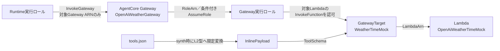
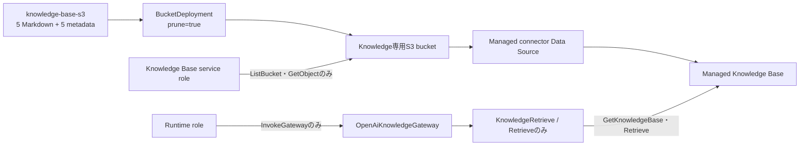
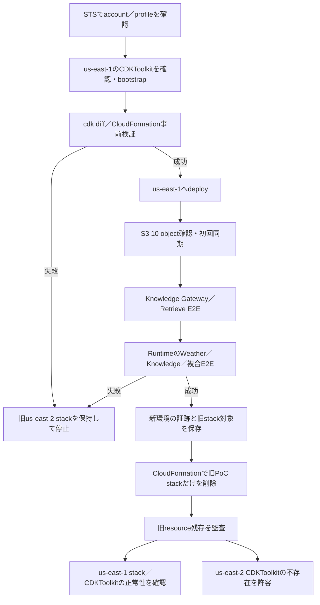

# AWS CDK Pythonプロジェクトへようこそ

このプロジェクトは、Pythonで開発し、[uv](https://docs.astral.sh/uv/)で依存関係を管理するAWS CDKプロジェクトです。

`cdk.json`には、AWS CDK ToolkitがCDKアプリケーションをどのように実行するかを定義します。

このプロジェクトでは、CDKアプリケーションを`uv`経由で実行するように設定しています。

```json
{
  "app": "uv run python app.py"
}
```

## 前提ソフトウェア

このプロジェクトを使用する前に、次のソフトウェアをインストールしてください。

* Python
* uv
* Node.js
* AWS CDK Toolkit
* AWS CLI

インストールされているバージョンは、次のコマンドで確認できます。

```bash
python3 --version
uv --version
node --version
cdk --version
aws --version
```

## 依存関係のインストール

Pythonの依存関係は`pyproject.toml`に定義され、具体的なバージョンは`uv.lock`に固定されています。

リポジトリをクローンした後、次のコマンドを実行してください。

```bash
uv sync
```

このコマンドを実行すると、`.venv`仮想環境が自動的に作成され、`uv.lock`に記録された依存関係がインストールされます。

仮想環境を手動で有効化する必要はありません。

## 依存関係の追加

アプリケーションで使用する依存関係を追加するには、次のコマンドを実行します。

```bash
uv add <パッケージ名>
```

例：

```bash
uv add boto3
```

テストや開発時にのみ使用する開発用依存関係を追加するには、次のコマンドを実行します。

```bash
uv add --dev <パッケージ名>
```

例：

```bash
uv add --dev pytest
```

依存関係を追加または更新した場合は、次の2つのファイルをGitにコミットしてください。

```text
pyproject.toml
uv.lock
```

`.venv`ディレクトリはGitにコミットしないでください。

## テストの実行

テストは`uv`経由で実行します。

```bash
uv run pytest
```

## CloudFormationテンプレートの生成

次のコマンドを実行します。

```bash
cdk synth
```

AWS CDK Toolkitは`cdk.json`を読み込み、内部で次のコマンドを実行してCDKアプリケーションを起動します。

```bash
uv run python app.py
```

Pythonアプリケーションを直接実行することもできます。

```bash
uv run python app.py
```

## AWS環境のブートストラップ

AWSアカウントおよびリージョンへ初めてデプロイする前に、CDKのブートストラップを実行してください。

```bash
cdk bootstrap
```

AWSアカウントIDとリージョンを明示的に指定する場合は、次のように実行します。

```bash
cdk bootstrap aws://<AWSアカウントID>/<AWSリージョン>
```

例：

```bash
cdk bootstrap aws://123456789012/us-east-1
```

`cdk bootstrap`はAWS環境へリソースを書き込む操作です。対象アカウントとリージョンを確認し、作業依頼者の明示的な承認を得てから実行してください。本PoCのデプロイ先リージョンは`us-east-1`です。現行のCDK asset配布基盤である同リージョンの`CDKToolkit`は、PoC stackの廃止対象に含めません。

## 主なコマンド

* `uv sync`：Pythonの依存関係をインストールし、仮想環境を同期します
* `uv run pytest`：テストを実行します
* `uv add <パッケージ名>`：アプリケーション用の依存関係を追加します
* `uv add --dev <パッケージ名>`：開発用の依存関係を追加します
* `cdk ls`：CDKアプリケーションに含まれるスタックを一覧表示します
* `cdk synth`：CloudFormationテンプレートを生成します
* `cdk diff`：デプロイ済みのスタックと現在のコードとの差分を表示します
* `cdk deploy`：設定されたAWSアカウントおよびリージョンへスタックをデプロイします
* `cdk destroy`：デプロイ済みのスタックを削除します
* `cdk docs`：AWS CDKのドキュメントを開きます

## プロジェクト構成

```text
.
├── app.py
├── cdk.json
├── agent_core_cdk_stack/
│   ├── agent_core_stack.py
│   └── constructs/
│       ├── agent_core_memory_construct.py
│       ├── agent_core_runtime_construct.py
│       ├── knowledge_document_bucket_construct.py
│       ├── managed_knowledge_base_construct.py
│       ├── knowledge_data_source_construct.py
│       ├── agent_core_knowledge_gateway_construct.py
│       ├── knowledge_retrieve_gateway_target_construct.py
│       ├── agent_core_weather_gateway_construct.py
│       ├── weather_time_gateway_target_construct.py
│       └── weather_time_mock_lambda_construct.py
├── lambda_tools/
│   └── weather/
│       ├── handler.py
│       └── tools.json
├── pyproject.toml
├── uv.lock
└── tests/
```

主なファイルの役割は次のとおりです。

* [`app.py`](../../app.py)：`us-east-1`向けのCDKアプリケーションを定義し、`OpenAiAgentCoreBaseStack`を生成します
* `cdk.json`：AWS CDK Toolkitがアプリケーションを実行する方法を定義します
* `pyproject.toml`：Pythonプロジェクトの情報と依存関係を定義します
* `uv.lock`：実際に使用する依存パッケージのバージョンを固定します
* [`agent_core_stack.py`](../../agent_core_cdk_stack/agent_core_stack.py)：責務別Constructの参照と作成順を接続します
* [`lambda_tools/weather/`](../../lambda_tools/weather/)：Weather／Time固定モックのハンドラーとTool schemaの正本を配置します
* [`knowledge-base-s3/`](../../knowledge-base-s3/)：Managed Knowledge Baseへ同期する5 Markdownと5 sidecar metadataの正本を配置します

## Weather／Time ToolのCDK構成

既存の`AgentCoreStack`は、Memoryに加えて次の3つのConstructを組み合わせます。スタック自身には個別リソースの詳細を持たせず、Lambda、Gateway、GatewayTarget、Runtimeの参照と作成順だけを接続します。

| Construct | 主な責務 |
| --- | --- |
| [`WeatherTimeMockLambdaConstruct`](../../agent_core_cdk_stack/constructs/weather_time_mock_lambda_construct.py) | 固定モックLambda、専用実行ロール、専用LogGroup、コードasset |
| [`AgentCoreWeatherGatewayConstruct`](../../agent_core_cdk_stack/constructs/agent_core_weather_gateway_construct.py) | IAM受信認証の専用MCP Gateway、条件付き信頼を持つ専用Gateway実行ロール |
| [`WeatherTimeGatewayTargetConstruct`](../../agent_core_cdk_stack/constructs/weather_time_gateway_target_construct.py) | `tools.json`の限定変換、inline schema、Lambda GatewayTarget、Gateway実行ロールのLambda呼び出し権限 |

RuntimeからLambdaまでの認可と参照関係は次のとおりです。Gateway実行ロールからTargetへの矢印は、Target経由で対象Lambdaを呼び出す権限境界を表します。



### 固定名とRuntime設定

公開Tool名の接頭辞を安定させるため、次の名前を固定します。IAM Roleの物理名は固定せず、CDKが生成します。本PoCは同一AWSアカウント／リージョンにこのスタックを1つだけデプロイする前提です。

| 対象 | 固定値 |
| --- | --- |
| Gateway名 | `OpenAiWeatherGateway` |
| GatewayTarget名 | `WeatherTimeMock` |
| Lambda関数名 | `OpenAiWeatherTimeMock` |
| 天気ToolのMCP公開名 | `WeatherTimeMock___get_weather` |
| 時刻ToolのMCP公開名 | `WeatherTimeMock___get_time` |

Gateway URLは生成値をコードへ固定せず、Gatewayの`GatewayUrl`参照としてRuntime環境変数`AGENTCORE_GATEWAY_URL`へ渡します。Target名はCDKの同じ定数からTargetと`AGENTCORE_GATEWAY_TARGET_NAME`へ渡します。

### Gateway、Target、inline schema

Gatewayは`AWS_IAM`受信認証とMCP protocolを使用し、対応versionとして`2025-11-25`と`2025-03-26`を明示します。専用Gateway実行ロールを`RoleArn`へ関連付け、`DEBUG`の例外レベル、静的認証情報、Bearer tokenは設定しません。

GatewayTargetはLambda Targetとして作成し、credential providerを`GATEWAY_IAM_ROLE`へ固定します。[`tools.json`](../../lambda_tools/weather/tools.json)をTool schemaの正本とし、次の2定義をsynth時にCDK L2型へ限定変換して、CloudFormationの`ToolSchema.InlinePayload`へ設定します。

| Tool | 必須入力 | 説明 |
| --- | --- | --- |
| `get_weather` | 文字列`location` | 外部サービスを呼ばず、固定のモック天気を返す |
| `get_time` | 文字列`timezone` | システム時計を参照せず、固定のモック時刻を返す |

未対応のTool定義またはJSON Schema shapeはsynth前に失敗させます。Tool schema用のS3参照やGateway実行ロールのS3権限は作成しません。LambdaコードassetのCDK bootstrap用S3配布は別用途であり、assetから`tools.json`、Python cache、`.DS_Store`を除外します。また、GatewayTargetはGateway実行ロールのLambda invoke policyへ明示的に依存し、権限反映前にTargetを作成しないようにします。

### IAM trustと権限境界

| Role | 信頼先 | 許可する権限 | 許可しない境界 |
| --- | --- | --- | --- |
| Runtime実行ロール | 既存のAgentCore Runtime trust | 対象Gateway ARNへの`bedrock-agentcore:InvokeGateway`。既存のBedrock MantleとMemory権限は維持 | GatewayTargetやLambdaの直接呼び出し |
| Gateway実行ロール | `bedrock-agentcore.amazonaws.com`。`aws:SourceAccount`をstack account、`aws:SourceArn`を同一partition／region／accountの`gateway/openaiweathergateway-*`へ限定 | 対象Lambda ARNとそのversion／aliasへの`lambda:InvokeFunction` | 他Lambda、S3、Secrets Manager、KMS |
| Lambda実行ロール | `lambda.amazonaws.com`のみ | 専用LogGroupへの`logs:CreateLogStream`と`logs:PutLogEvents` | `AWSLambdaBasicExecutionRole`、`logs:CreateLogGroup`、他LogGroup |

Gateway実行ロールのtrustではGateway resourceを直接参照せず、固定Gateway名の小文字prefixからSource ARN patternを組み立てます。これにより対象Gateway名へ限定しながら、Gatewayの`RoleArn`とのCloudFormation循環依存を避けます。

Gatewayの表示名は`OpenAiWeatherGateway`ですが、AgentCoreが生成するgateway IDとARNの名前prefixは`openaiweathergateway`へ小文字正規化されます。trust条件は実際の`aws:SourceArn`へ一致させるため、小文字prefixを使用します。

### Lambda設定

| 項目 | 設定 |
| --- | --- |
| Runtime | Python 3.12 |
| Architecture | ARM64 |
| Handler | `handler.lambda_handler` |
| Memory | 128 MB |
| Timeout | 5秒 |
| LogGroup | `/aws/lambda/OpenAiWeatherTimeMock` |
| Log retention | 7日 |
| 削除方針 | stack削除時にLogGroupも削除する`DESTROY` |
| 環境変数／VPC | 設定しない |

Lambdaは外部の天気・時刻サービスへ接続せず、固定モックだけを返します。API key、Secret、静的AWS認証情報も使用しません。

## Managed Knowledge BaseのCDK構成

Knowledge経路は次の5 Constructへ責務を分離します。Data Source作成まではCloudFormationで管理しますが、非同期の初回ingestion jobはdeployから分離します。

| Construct | 主な責務 |
| --- | --- |
| `KnowledgeDocumentBucketConstruct` | 非公開・SSE-S3・SSL強制の専用bucket、正本10ファイルの検証と配置 |
| `ManagedKnowledgeBaseConstruct` | `OpenAiKnowledgeBase`とBedrock専用service role |
| `KnowledgeDataSourceConstruct` | S3 managed connectorの`OpenAiKnowledgeDataSource` |
| `AgentCoreKnowledgeGatewayConstruct` | IAM受信認証の`OpenAiKnowledgeGateway`とKB限定実行role |
| `KnowledgeRetrieveGatewayTargetConstruct` | Retrieveだけを公開する`KnowledgeRetrieve` Target |



### 文書配置と削除方針

`knowledge-base-s3/`をsynth前に列挙し、仕様の5 Markdownと同名の5 `.metadata.json`だけに完全一致することを検証します。未知ファイル、欠落、sidecar不一致はasset生成前に失敗します。専用bucketのrootへ相対パスを維持して配置し、`prune=true`、`retain_on_delete=false`とします。

bucketはS3 Block Public Accessを全て有効化し、SSE-S3、SSL強制、object自動削除、`RemovalPolicy.DESTROY`を使用します。Knowledge Base、Data SourceもPoC方針として`DESTROY`、Data Sourceの`DataDeletionPolicy`は`DELETE`です。Data SourceはKnowledge Baseと文書配置完了へ明示的に依存します。同期Custom Resourceや定期同期は作成しません。

Data Sourceは`MANAGED_KNOWLEDGE_BASE_CONNECTOR`のS3 connectorを使用し、追加prefixは設定しません。削除保護を`ENABLED`、thresholdを20%へ固定し、5文書中2件以上に相当する一括削除を同期時に止めます。

### 固定名、検索設定、IAM境界

| 対象 | 固定値 |
| --- | --- |
| Knowledge Base | `OpenAiKnowledgeBase`、type `MANAGED`、embedding `MANAGED` |
| Data Source | `OpenAiKnowledgeDataSource` |
| Gateway | `OpenAiKnowledgeGateway`、`AWS_IAM`、MCP |
| GatewayTarget | `KnowledgeRetrieve` |
| MCP公開Tool | `KnowledgeRetrieve___Retrieve` |
| 検索設定 | `numberOfResults`はBedrock既定の5件、`overrideSearchType=HYBRID` |

顧客管理Vector Store、Embedding model、Reranking、KMS keyは設定しません。Knowledge Base service roleは条件付きで`bedrock.amazonaws.com`だけを信頼し、専用bucketの`ListBucket`とobjectの`GetObject`だけを許可します。service-managed embeddingのため`bedrock:InvokeModel`は付与しません。CloudFormation resource providerがConnectorのDocument内にある数値を文字列化するとBedrockの型検証に失敗するため、`numberOfResults`はTargetへ明示せずBedrock既定の5件を使用します。このfieldを`parameterOverrides`へ含めないため、Agentまたは利用者は件数を変更できません。

Knowledge GatewayはWeather Gatewayとroleを共有しません。Gateway roleは条件付きで`bedrock-agentcore.amazonaws.com`だけを信頼し、対象Knowledge Base ARNの`bedrock:GetKnowledgeBase`と`bedrock:Retrieve`だけを許可します。Targetが公開するoperationは`Retrieve`だけで、query textとmetadata filterだけをoverride可能にします。Knowledge Base ID、検索件数、検索方式、`AgenticRetrieveStream`、`userContext`はモデルへ公開しません。

Runtime roleにはWeather／Knowledge両Gateway ARNの`bedrock-agentcore:InvokeGateway`だけを追加し、Knowledge BaseやS3への直接権限は付与しません。Runtimeは両Targetへ依存し、次の非秘密環境変数を受け取ります。

- `AGENTCORE_KNOWLEDGE_GATEWAY_URL`: Knowledge Gatewayの`GatewayUrl`
- `AGENTCORE_KNOWLEDGE_GATEWAY_TARGET_NAME`: `KnowledgeRetrieve`

### 初回同期とAWS E2E

この節のコマンドはAWSへ書き込み、料金が発生し得ます。対象profile、account、`us-east-1`、stack差分を確認し、作業依頼者の明示的な承認を得た場合だけ実行してください。ローカルsynth成功は、deploy、ingestion、E2Eの承認を意味しません。

deploy後、CloudFormation Outputから固定の2 IDを解決します。

```bash
export KNOWLEDGE_BASE_ID="$(aws cloudformation describe-stacks \
  --stack-name OpenAiAgentCoreBaseStack \
  --region "$DEPLOY_REGION" --profile "$DEPLOY_PROFILE" \
  --query "Stacks[0].Outputs[?OutputKey=='KnowledgeBaseId'].OutputValue | [0]" \
  --output text)"
export KNOWLEDGE_DATA_SOURCE_ID="$(aws cloudformation describe-stacks \
  --stack-name OpenAiAgentCoreBaseStack \
  --region "$DEPLOY_REGION" --profile "$DEPLOY_PROFILE" \
  --query "Stacks[0].Outputs[?OutputKey=='KnowledgeDataSourceId'].OutputValue | [0]" \
  --output text)"
```

値が空、`None`、想定外のaccount／regionの場合は停止します。stack内のS3 bucketを解決し、登録対象が正確に10 objectであることも確認します。

```bash
export KNOWLEDGE_BUCKET_NAME="$(aws cloudformation list-stack-resources \
  --stack-name OpenAiAgentCoreBaseStack \
  --region "$DEPLOY_REGION" --profile "$DEPLOY_PROFILE" \
  --query "StackResourceSummaries[?ResourceType=='AWS::S3::Bucket'].PhysicalResourceId | [0]" \
  --output text)"
aws s3api list-objects-v2 --bucket "$KNOWLEDGE_BUCKET_NAME" \
  --region "$DEPLOY_REGION" --profile "$DEPLOY_PROFILE" \
  --query 'sort_by(Contents,&Key)[].Key' --output text
```

Data Sourceが利用可能であることを確認してから、初回ingestion jobを1回だけ開始します。

```bash
aws bedrock-agent get-data-source \
  --knowledge-base-id "$KNOWLEDGE_BASE_ID" \
  --data-source-id "$KNOWLEDGE_DATA_SOURCE_ID" \
  --region "$DEPLOY_REGION" --profile "$DEPLOY_PROFILE"

export KNOWLEDGE_INGESTION_JOB_ID="$(aws bedrock-agent start-ingestion-job \
  --knowledge-base-id "$KNOWLEDGE_BASE_ID" \
  --data-source-id "$KNOWLEDGE_DATA_SOURCE_ID" \
  --client-token 'feature06-initial-ingestion-00000001' \
  --description 'feature 06 initial ingestion' \
  --region "$DEPLOY_REGION" --profile "$DEPLOY_PROFILE" \
  --query 'ingestionJob.ingestionJobId' --output text)"
```

完了するまで同じIDを`get-ingestion-job`で確認します。`COMPLETE`以外ではRetrieve／Runtime E2Eへ進みません。

```bash
aws bedrock-agent get-ingestion-job \
  --knowledge-base-id "$KNOWLEDGE_BASE_ID" \
  --data-source-id "$KNOWLEDGE_DATA_SOURCE_ID" \
  --ingestion-job-id "$KNOWLEDGE_INGESTION_JOB_ID" \
  --region "$DEPLOY_REGION" --profile "$DEPLOY_PROFILE" \
  --query 'ingestionJob.{Status:status,Statistics:statistics,Failures:failureReasons}'
```

- `STARTING`／`IN_PROGRESS`: 待って再確認する。
- `COMPLETE`: `KnowledgeRetrieve` Targetが`READY`であることを確認し、SigV4 MCP clientの`tools/list`と`KnowledgeRetrieve___Retrieve`を検証する。
- `FAILED`／`STOPPED`: `failureReasons`、Data Source状態、S3 object、Knowledge Base service roleを確認し、原因を解消するまで再実行しない。
- `STOPPING`: 停止完了を確認し、新しいjobを重ねて開始しない。

RetrieveではAWS標準、metadata filter、空結果を確認します。その後、[Agentドキュメント](../Agent/README.md)の手順でKnowledge単独、Weather単独、複合質問をRuntimeへ送り、根拠文書、見積式、固定モック注記、片系障害の局所化を確認します。AWS操作を実施していない場合は「ローカル実装・synth済み／AWS初回同期・E2E未確認」と記録します。

## synth、diff、deploy後の確認

### ローカル検証とsynth

まず、依存関係、CDK契約テスト、全体のsynthを確認します。

```bash
uv sync
uv run pytest \
  tests/unit/test_weather_tool_gateway_stack.py \
  tests/unit/test_knowledge_documents.py \
  tests/unit/test_knowledge_base_gateway_stack.py \
  tests/unit/test_open_ai_agent_core_base_stack.py
uv run python app.py
```

`uv run python app.py`の代わりに、次のコマンドでも対象スタックをsynthできます。

```bash
cdk synth OpenAiAgentCoreBaseStack
```

生成されたCloudFormationテンプレートでは、少なくとも次を確認します。

* Gateway、GatewayTarget、Lambda、LogGroup、Gateway実行ロール、Lambda実行ロールが存在する
* 固定名、`AWS_IAM`、MCPの2 version、`GATEWAY_IAM_ROLE`が上記と一致する
* Targetの`InlinePayload`が`tools.json`の2 Toolと一致し、schema用S3参照がない
* Runtime Role→Gateway、Gateway→Gateway Role、Target→Lambdaの参照と、TargetからLambda invoke policyへの依存がある
* IAM action、resource、trust条件が上記の範囲に限定され、`DEBUG`、Secret、静的credentialがない
* LambdaのRuntime、Architecture、Memory、Timeout、Handler、LogGroup設定が上記と一致する
* Runtimeの`AGENTCORE_GATEWAY_URL`が同一Gatewayの`GatewayUrl`参照で、`AGENTCORE_GATEWAY_TARGET_NAME`が`WeatherTimeMock`である
* 文書assetが仕様の5 Markdownと5 metadataだけを相対パスのまま含む
* Managed Knowledge Base、Data Source、Knowledge Gateway／Targetの固定名、MANAGED設定、Retrieve限定設定が一致する
* RuntimeのKnowledge環境変数とInvokeGateway権限がKnowledge Gatewayを参照し、Knowledge Base／S3の直接権限がない
* Data SourceがKnowledge BaseとBucketDeploymentへ依存し、同期Custom Resourceがない

`cdk.out/`は生成物です。直接編集したりGitへコミットしたりしないでください。

### AWS差分の確認と条件付きdeploy

`cdk diff`でもRuntimeのLinux ARM64 image assetを準備するため、Dockerを起動した状態で、対象AWSアカウントと認証主体を確認して実行します。CloudFormationのread-only change setによるresource schemaの事前検証が失敗した場合は、deployへ進みません。

```bash
cdk diff OpenAiAgentCoreBaseStack --profile <AWSプロファイル名>
```

新規リソース、IAM trust／policy、Runtime環境変数、文書配置、Managed Knowledge Base、Data Source、Retrieve Targetが本章の内容に一致し、意図しない削除や権限拡大がないことを確認します。

`cdk deploy`はAWS環境を変更します。対象アカウント、リージョン、差分を提示し、作業依頼者からデプロイの明示的な承認を得た場合に限って実行してください。

```bash
cdk deploy OpenAiAgentCoreBaseStack \
  --profile <AWSプロファイル名> \
  --require-approval broadening
```

`cdk destroy`もAWSリソースを削除するため、別途明示的な承認なしに実行しないでください。

### deploy後の確認

明示承認に基づいてdeployした場合だけ、次を確認します。

1. Weather／Knowledge Gatewayと両GatewayTargetがcontrol plane上で`READY`になっている。
2. SigV4署名したMCP clientの`initialize`が成功し、応答の`protocolVersion`が`2025-11-25`である。
3. Weather側の`tools/list`に2つのWeather Tool、Knowledge側に`KnowledgeRetrieve___Retrieve`だけが公開される。
4. 両方の`tools/call`が固定値と`data_type="mock"`を返す。
5. 初回ingestion jobが`COMPLETE`になった後、Runtimeへ天気、時刻、Knowledge、複合入力を送り、Managerの日本語最終回答、根拠文書、固定モック注記を確認する。
6. Runtime呼び出し後のLambdaの新しいCloudWatch Logs eventまたは`Invocations` metricを時刻で相関し、Runtime→Gateway→Lambdaの実行経路を確認する。
7. 許可された範囲のログに認証情報や不要な入力が記録されていない。

これらを実施していない場合は、AWS E2E検証済みとは扱いません。

## `us-east-1`への移行と旧`us-east-2`環境の廃止

この手順は、新しい`us-east-1`環境を先に構築して全E2Eを成功させ、その証跡を保存した後だけ旧`us-east-2`のPoC stackを削除します。途中で失敗した場合は旧環境を保持します。移行完了後は現行`us-east-1`の`CDKToolkit`だけを維持対象とし、`us-east-2`の`CDKToolkit`は不存在でも復元しません。



### 1. 実行主体と対象を固定する

作業ごとに同じshellで変数を設定し、STS結果のaccountとARNを確認します。想定外のaccountまたはprofileなら停止します。

```bash
export DEPLOY_PROFILE='default'
export DEPLOY_REGION='us-east-1'
export LEGACY_REGION='us-east-2'
export STACK_NAME='OpenAiAgentCoreBaseStack'
export DEPLOY_ACCOUNT_ID="$(aws sts get-caller-identity \
  --profile "$DEPLOY_PROFILE" --query Account --output text)"

aws sts get-caller-identity --profile "$DEPLOY_PROFILE"
printf 'account=%s profile=%s new-region=%s old-region=%s\n' \
  "$DEPLOY_ACCOUNT_ID" "$DEPLOY_PROFILE" "$DEPLOY_REGION" "$LEGACY_REGION"
```

### 2. `us-east-1`をbootstrapする

まず`CDKToolkit`の有無をread-onlyで確認します。存在しない場合だけ、確認済みaccount／profileでbootstrapします。

```bash
aws cloudformation describe-stacks \
  --stack-name CDKToolkit --region "$DEPLOY_REGION" --profile "$DEPLOY_PROFILE"

cdk bootstrap "aws://${DEPLOY_ACCOUNT_ID}/${DEPLOY_REGION}" \
  --profile "$DEPLOY_PROFILE"

aws cloudformation describe-stacks \
  --stack-name CDKToolkit --region "$DEPLOY_REGION" --profile "$DEPLOY_PROFILE" \
  --query 'Stacks[0].{Status:StackStatus,BootstrapVersion:Outputs[?OutputKey==`BootstrapVersion`].OutputValue|[0]}'
aws cloudformation list-stack-resources \
  --stack-name CDKToolkit --region "$DEPLOY_REGION" --profile "$DEPLOY_PROFILE" \
  --query 'StackResourceSummaries[?ResourceType==`AWS::S3::Bucket` || ResourceType==`AWS::ECR::Repository`].[ResourceType,PhysicalResourceId,ResourceStatus]'
```

完了条件は`CREATE_COMPLETE`または`UPDATE_COMPLETE`で、file asset用S3 bucketとcontainer image asset用ECR repositoryが正常なことです。

### 3. 事前検証、deploy、初回同期を実行する

Dockerを起動し、`app.py`が`us-east-1`を指定していることを再確認してから実行します。

```bash
cdk diff "$STACK_NAME" --profile "$DEPLOY_PROFILE"
cdk deploy "$STACK_NAME" --profile "$DEPLOY_PROFILE" \
  --require-approval broadening
```

`cdk diff`のCloudFormation事前検証では、Managed Knowledge Baseの`MANAGED`とData Sourceの`MANAGED_KNOWLEDGE_BASE_CONNECTOR`がresource schemaに受理されること、新規resource、IAM拡張、S3の自動削除とRemoval Policyが本章の設計に限定され、意図しない削除がないことを確認します。失敗した場合はdeployしません。

deploy後はstackが正常状態で、Knowledge用S3 bucketに5 Markdownと同名の5 metadataが正確に配置されていることを確認します。続いて「初回同期とAWS E2E」の手順でIDをOutputから解決し、同じingestion job IDを`COMPLETE`まで監視します。`FAILED`、`STOPPED`、`STOPPING`の場合は失敗理由を保存し、無条件にjobを再作成せず、旧環境も削除しません。

### 4. GatewayとRuntimeの成功ゲートを確認する

初回同期が`COMPLETE`になった後だけ、次の順で確認します。

1. `OpenAiKnowledgeGateway`と`KnowledgeRetrieve`が`READY`である。
2. SigV4 MCPの`initialize`、`tools/list`、`KnowledgeRetrieve___Retrieve`の`tools/call`が成功する。
3. AWS標準の検索、`document_type`／`environment`／`service` filter、空結果が期待どおりで、内部AWS識別子を応答へ漏らさない。
4. RuntimeのKnowledge、Weather、複合質問が成功し、根拠文書、見積式、固定モック注記、捏造防止、HTTP／SSE／Memory境界を満たす。

一つでも失敗した場合は旧`us-east-2` stackを保持します。すべて成功した場合は、実行時刻、stack状態、Output、S3 key一覧、ingestion job IDとstatistics、Gateway／Target状態、E2E応答から秘密情報を除いた証跡を保存します。

### 5. 旧stackの削除対象を確定する

削除直前にSTS結果を再確認し、旧stackのIDとresource一覧を保存します。Memory、S3 object、CloudWatch Logsなど旧stackのデータは新regionへ移行されず、削除後は復旧できません。

```bash
aws sts get-caller-identity --profile "$DEPLOY_PROFILE"
aws cloudformation describe-stacks \
  --stack-name "$STACK_NAME" --region "$LEGACY_REGION" --profile "$DEPLOY_PROFILE" \
  --query 'Stacks[0].{Id:StackId,Status:StackStatus,Outputs:Outputs}'
aws cloudformation list-stack-resources \
  --stack-name "$STACK_NAME" --region "$LEGACY_REGION" --profile "$DEPLOY_PROFILE"
```

削除対象は、この旧CloudFormation stackと、その管理下resourceだけです。名前が一致するだけのstack外resourceと、現行基盤である`us-east-1`の`CDKToolkit`は対象外です。`us-east-2`の`CDKToolkit`は旧PoC stackとは別resourceであり、移行完了後の維持対象には含めません。

### 6. `app.py`に依存せず旧PoC stackだけを削除する

`app.py`はすでに`us-east-1`を指すため、`cdk destroy`やsynth結果で旧環境を選びません。regionを明示したCloudFormation APIで旧stackだけを削除し、完了まで待機します。

```bash
aws cloudformation delete-stack \
  --stack-name "$STACK_NAME" --region us-east-2 --profile "$DEPLOY_PROFILE"
aws cloudformation wait stack-delete-complete \
  --stack-name "$STACK_NAME" --region us-east-2 --profile "$DEPLOY_PROFILE"
```

waitが失敗した場合は、stack外resourceを自動削除せず、次で原因と残存物理IDを確認します。

```bash
aws cloudformation describe-stack-events \
  --stack-name "$STACK_NAME" --region "$LEGACY_REGION" --profile "$DEPLOY_PROFILE"
aws cloudformation list-stack-resources \
  --stack-name "$STACK_NAME" --region "$LEGACY_REGION" --profile "$DEPLOY_PROFILE"
```

### 7. 残存resourceとbootstrap基盤を監査する

削除後、`describe-stacks`が旧PoC stackの不存在を返すことを確認します。さらに、削除前に保存したstack ID／物理IDを正本として、次のread-only APIを`us-east-2`で確認します。

```bash
aws bedrock-agentcore-control list-agent-runtimes \
  --region "$LEGACY_REGION" --profile "$DEPLOY_PROFILE"
aws bedrock-agentcore-control list-memories \
  --region "$LEGACY_REGION" --profile "$DEPLOY_PROFILE"
aws bedrock-agentcore-control list-gateways \
  --region "$LEGACY_REGION" --profile "$DEPLOY_PROFILE"
# list-gatewaysで得た各gateway IDについて実行する
aws bedrock-agentcore-control list-gateway-targets \
  --gateway-identifier <旧Gateway ID> \
  --region "$LEGACY_REGION" --profile "$DEPLOY_PROFILE"
aws lambda list-functions --region "$LEGACY_REGION" --profile "$DEPLOY_PROFILE"
aws bedrock-agent list-knowledge-bases \
  --region "$LEGACY_REGION" --profile "$DEPLOY_PROFILE"
# Knowledge Baseが残る場合だけ各IDについて実行する
aws bedrock-agent list-data-sources --knowledge-base-id <旧Knowledge Base ID> \
  --region "$LEGACY_REGION" --profile "$DEPLOY_PROFILE"
```

PoC識別名はRuntime `OpenAiAgentRuntime`、Memory `OpenAiAgentMemory`、Gateway `OpenAiWeatherGateway`／`OpenAiKnowledgeGateway`、Target `WeatherTimeMock`／`KnowledgeRetrieve`、Lambda `OpenAiWeatherTimeMock`、Knowledge Base `OpenAiKnowledgeBase`、Data Source `OpenAiKnowledgeDataSource`です。ただし、名前だけが一致してownershipを確認できないresourceは削除しません。旧`us-east-2`環境にはKnowledge Baseが作成されていない場合があり、その不存在は正常です。

最後に新stackと`us-east-1`の`CDKToolkit`が正常であることを確認します。`us-east-2`の`CDKToolkit`は存在有無を記録しますが、不存在でも移行失敗とは扱わず、再bootstrapしません。

```bash
aws cloudformation describe-stacks \
  --stack-name "$STACK_NAME" --region us-east-1 --profile "$DEPLOY_PROFILE"
aws cloudformation describe-stacks \
  --stack-name CDKToolkit --region us-east-1 --profile "$DEPLOY_PROFILE"
aws cloudformation describe-stacks \
  --stack-name CDKToolkit --region us-east-2 --profile "$DEPLOY_PROFILE"
```

`us-east-2`の最後のコマンドが`does not exist`を返す場合は許容結果です。完了条件は、旧PoC stackと旧PoC resourceが存在せず、`us-east-1`の新stackと`CDKToolkit`が正常であることです。

## 基本的な開発手順

通常は、次の順序でコマンドを実行します。

```bash
uv sync
uv run pytest
cdk synth OpenAiAgentCoreBaseStack
```

AWS差分の確認とdeployは、前節の対象アカウント確認と明示承認の手順に従ってください。
