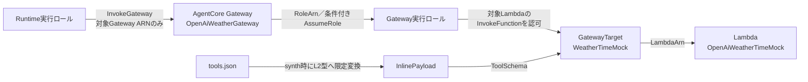

# AWS CDK Pythonプロジェクトへようこそ

このプロジェクトは、Pythonで開発し、[uv](https://docs.astral.sh/uv/)で依存関係を管理するAWS CDKプロジェクトです。

`cdk.json`には、AWS CDK ToolkitがCDKアプリケーションをどのように実行するかを定義します。

このプロジェクトでは、CDKアプリケーションを`uv`経由で実行するように設定しています。

```json
{
  "app": "uv run python app.py"
}
```

## 前提ソフトウェア

このプロジェクトを使用する前に、次のソフトウェアをインストールしてください。

* Python
* uv
* Node.js
* AWS CDK Toolkit
* AWS CLI

インストールされているバージョンは、次のコマンドで確認できます。

```bash
python3 --version
uv --version
node --version
cdk --version
aws --version
```

## 依存関係のインストール

Pythonの依存関係は`pyproject.toml`に定義され、具体的なバージョンは`uv.lock`に固定されています。

リポジトリをクローンした後、次のコマンドを実行してください。

```bash
uv sync
```

このコマンドを実行すると、`.venv`仮想環境が自動的に作成され、`uv.lock`に記録された依存関係がインストールされます。

仮想環境を手動で有効化する必要はありません。

## 依存関係の追加

アプリケーションで使用する依存関係を追加するには、次のコマンドを実行します。

```bash
uv add <パッケージ名>
```

例：

```bash
uv add boto3
```

テストや開発時にのみ使用する開発用依存関係を追加するには、次のコマンドを実行します。

```bash
uv add --dev <パッケージ名>
```

例：

```bash
uv add --dev pytest
```

依存関係を追加または更新した場合は、次の2つのファイルをGitにコミットしてください。

```text
pyproject.toml
uv.lock
```

`.venv`ディレクトリはGitにコミットしないでください。

## テストの実行

テストは`uv`経由で実行します。

```bash
uv run pytest
```

## CloudFormationテンプレートの生成

次のコマンドを実行します。

```bash
cdk synth
```

AWS CDK Toolkitは`cdk.json`を読み込み、内部で次のコマンドを実行してCDKアプリケーションを起動します。

```bash
uv run python app.py
```

Pythonアプリケーションを直接実行することもできます。

```bash
uv run python app.py
```

## AWS環境のブートストラップ

AWSアカウントおよびリージョンへ初めてデプロイする前に、CDKのブートストラップを実行してください。

```bash
cdk bootstrap
```

AWSアカウントIDとリージョンを明示的に指定する場合は、次のように実行します。

```bash
cdk bootstrap aws://<AWSアカウントID>/<AWSリージョン>
```

例：

```bash
cdk bootstrap aws://123456789012/us-east-2
```

`cdk bootstrap`はAWS環境へリソースを書き込む操作です。対象アカウントとリージョンを確認し、作業依頼者の明示的な承認を得てから実行してください。本PoCのデプロイ先リージョンは`us-east-2`です。

## 主なコマンド

* `uv sync`：Pythonの依存関係をインストールし、仮想環境を同期します
* `uv run pytest`：テストを実行します
* `uv add <パッケージ名>`：アプリケーション用の依存関係を追加します
* `uv add --dev <パッケージ名>`：開発用の依存関係を追加します
* `cdk ls`：CDKアプリケーションに含まれるスタックを一覧表示します
* `cdk synth`：CloudFormationテンプレートを生成します
* `cdk diff`：デプロイ済みのスタックと現在のコードとの差分を表示します
* `cdk deploy`：設定されたAWSアカウントおよびリージョンへスタックをデプロイします
* `cdk destroy`：デプロイ済みのスタックを削除します
* `cdk docs`：AWS CDKのドキュメントを開きます

## プロジェクト構成

```text
.
├── app.py
├── cdk.json
├── agent_core_cdk_stack/
│   ├── agent_core_stack.py
│   └── constructs/
│       ├── agent_core_memory_construct.py
│       ├── agent_core_runtime_construct.py
│       ├── agent_core_weather_gateway_construct.py
│       ├── weather_time_gateway_target_construct.py
│       └── weather_time_mock_lambda_construct.py
├── lambda_tools/
│   └── weather/
│       ├── handler.py
│       └── tools.json
├── pyproject.toml
├── uv.lock
└── tests/
```

主なファイルの役割は次のとおりです。

* [`app.py`](../../app.py)：`us-east-2`向けのCDKアプリケーションを定義し、`OpenAiAgentCoreBaseStack`を生成します
* `cdk.json`：AWS CDK Toolkitがアプリケーションを実行する方法を定義します
* `pyproject.toml`：Pythonプロジェクトの情報と依存関係を定義します
* `uv.lock`：実際に使用する依存パッケージのバージョンを固定します
* [`agent_core_stack.py`](../../agent_core_cdk_stack/agent_core_stack.py)：責務別Constructの参照と作成順を接続します
* [`lambda_tools/weather/`](../../lambda_tools/weather/)：Weather／Time固定モックのハンドラーとTool schemaの正本を配置します

## Weather／Time ToolのCDK構成

既存の`AgentCoreStack`は、Memoryに加えて次の3つのConstructを組み合わせます。スタック自身には個別リソースの詳細を持たせず、Lambda、Gateway、GatewayTarget、Runtimeの参照と作成順だけを接続します。

| Construct | 主な責務 |
| --- | --- |
| [`WeatherTimeMockLambdaConstruct`](../../agent_core_cdk_stack/constructs/weather_time_mock_lambda_construct.py) | 固定モックLambda、専用実行ロール、専用LogGroup、コードasset |
| [`AgentCoreWeatherGatewayConstruct`](../../agent_core_cdk_stack/constructs/agent_core_weather_gateway_construct.py) | IAM受信認証の専用MCP Gateway、条件付き信頼を持つ専用Gateway実行ロール |
| [`WeatherTimeGatewayTargetConstruct`](../../agent_core_cdk_stack/constructs/weather_time_gateway_target_construct.py) | `tools.json`の限定変換、inline schema、Lambda GatewayTarget、Gateway実行ロールのLambda呼び出し権限 |

RuntimeからLambdaまでの認可と参照関係は次のとおりです。Gateway実行ロールからTargetへの矢印は、Target経由で対象Lambdaを呼び出す権限境界を表します。



### 固定名とRuntime設定

公開Tool名の接頭辞を安定させるため、次の名前を固定します。IAM Roleの物理名は固定せず、CDKが生成します。本PoCは同一AWSアカウント／リージョンにこのスタックを1つだけデプロイする前提です。

| 対象 | 固定値 |
| --- | --- |
| Gateway名 | `OpenAiWeatherGateway` |
| GatewayTarget名 | `WeatherTimeMock` |
| Lambda関数名 | `OpenAiWeatherTimeMock` |
| 天気ToolのMCP公開名 | `WeatherTimeMock___get_weather` |
| 時刻ToolのMCP公開名 | `WeatherTimeMock___get_time` |

Gateway URLは生成値をコードへ固定せず、Gatewayの`GatewayUrl`参照としてRuntime環境変数`AGENTCORE_GATEWAY_URL`へ渡します。Target名はCDKの同じ定数からTargetと`AGENTCORE_GATEWAY_TARGET_NAME`へ渡します。

### Gateway、Target、inline schema

Gatewayは`AWS_IAM`受信認証とMCP protocolを使用し、対応versionとして`2025-11-25`と`2025-03-26`を明示します。専用Gateway実行ロールを`RoleArn`へ関連付け、`DEBUG`の例外レベル、静的認証情報、Bearer tokenは設定しません。

GatewayTargetはLambda Targetとして作成し、credential providerを`GATEWAY_IAM_ROLE`へ固定します。[`tools.json`](../../lambda_tools/weather/tools.json)をTool schemaの正本とし、次の2定義をsynth時にCDK L2型へ限定変換して、CloudFormationの`ToolSchema.InlinePayload`へ設定します。

| Tool | 必須入力 | 説明 |
| --- | --- | --- |
| `get_weather` | 文字列`location` | 外部サービスを呼ばず、固定のモック天気を返す |
| `get_time` | 文字列`timezone` | システム時計を参照せず、固定のモック時刻を返す |

未対応のTool定義またはJSON Schema shapeはsynth前に失敗させます。Tool schema用のS3参照やGateway実行ロールのS3権限は作成しません。LambdaコードassetのCDK bootstrap用S3配布は別用途であり、assetから`tools.json`、Python cache、`.DS_Store`を除外します。また、GatewayTargetはGateway実行ロールのLambda invoke policyへ明示的に依存し、権限反映前にTargetを作成しないようにします。

### IAM trustと権限境界

| Role | 信頼先 | 許可する権限 | 許可しない境界 |
| --- | --- | --- | --- |
| Runtime実行ロール | 既存のAgentCore Runtime trust | 対象Gateway ARNへの`bedrock-agentcore:InvokeGateway`。既存のBedrock MantleとMemory権限は維持 | GatewayTargetやLambdaの直接呼び出し |
| Gateway実行ロール | `bedrock-agentcore.amazonaws.com`。`aws:SourceAccount`をstack account、`aws:SourceArn`を同一partition／region／accountの`gateway/openaiweathergateway-*`へ限定 | 対象Lambda ARNとそのversion／aliasへの`lambda:InvokeFunction` | 他Lambda、S3、Secrets Manager、KMS |
| Lambda実行ロール | `lambda.amazonaws.com`のみ | 専用LogGroupへの`logs:CreateLogStream`と`logs:PutLogEvents` | `AWSLambdaBasicExecutionRole`、`logs:CreateLogGroup`、他LogGroup |

Gateway実行ロールのtrustではGateway resourceを直接参照せず、固定Gateway名の小文字prefixからSource ARN patternを組み立てます。これにより対象Gateway名へ限定しながら、Gatewayの`RoleArn`とのCloudFormation循環依存を避けます。

Gatewayの表示名は`OpenAiWeatherGateway`ですが、AgentCoreが生成するgateway IDとARNの名前prefixは`openaiweathergateway`へ小文字正規化されます。trust条件は実際の`aws:SourceArn`へ一致させるため、小文字prefixを使用します。

### Lambda設定

| 項目 | 設定 |
| --- | --- |
| Runtime | Python 3.12 |
| Architecture | ARM64 |
| Handler | `handler.lambda_handler` |
| Memory | 128 MB |
| Timeout | 5秒 |
| LogGroup | `/aws/lambda/OpenAiWeatherTimeMock` |
| Log retention | 7日 |
| 削除方針 | stack削除時にLogGroupも削除する`DESTROY` |
| 環境変数／VPC | 設定しない |

Lambdaは外部の天気・時刻サービスへ接続せず、固定モックだけを返します。API key、Secret、静的AWS認証情報も使用しません。

## synth、diff、deploy後の確認

### ローカル検証とsynth

まず、依存関係、CDK契約テスト、全体のsynthを確認します。

```bash
uv sync
uv run pytest tests/unit/test_weather_tool_gateway_stack.py tests/unit/test_open_ai_agent_core_base_stack.py
uv run python app.py
```

`uv run python app.py`の代わりに、次のコマンドでも対象スタックをsynthできます。

```bash
cdk synth OpenAiAgentCoreBaseStack
```

生成されたCloudFormationテンプレートでは、少なくとも次を確認します。

* Gateway、GatewayTarget、Lambda、LogGroup、Gateway実行ロール、Lambda実行ロールが存在する
* 固定名、`AWS_IAM`、MCPの2 version、`GATEWAY_IAM_ROLE`が上記と一致する
* Targetの`InlinePayload`が`tools.json`の2 Toolと一致し、schema用S3参照がない
* Runtime Role→Gateway、Gateway→Gateway Role、Target→Lambdaの参照と、TargetからLambda invoke policyへの依存がある
* IAM action、resource、trust条件が上記の範囲に限定され、`DEBUG`、Secret、静的credentialがない
* LambdaのRuntime、Architecture、Memory、Timeout、Handler、LogGroup設定が上記と一致する
* Runtimeの`AGENTCORE_GATEWAY_URL`が同一Gatewayの`GatewayUrl`参照で、`AGENTCORE_GATEWAY_TARGET_NAME`が`WeatherTimeMock`である

`cdk.out/`は生成物です。直接編集したりGitへコミットしたりしないでください。

### AWS差分の確認と条件付きdeploy

`cdk diff`でもRuntimeのLinux ARM64 image assetを準備するため、Dockerを起動した状態で、対象AWSアカウントと認証主体を確認して実行します。

```bash
cdk diff OpenAiAgentCoreBaseStack --profile <AWSプロファイル名>
```

新規リソース、IAM trust／policy、Runtime環境変数が本章の内容に一致し、意図しない削除や権限拡大がないことを確認します。

`cdk deploy`はAWS環境を変更します。対象アカウント、リージョン、差分を提示し、作業依頼者からデプロイの明示的な承認を得た場合に限って実行してください。

```bash
cdk deploy OpenAiAgentCoreBaseStack \
  --profile <AWSプロファイル名> \
  --require-approval broadening
```

`cdk destroy`もAWSリソースを削除するため、別途明示的な承認なしに実行しないでください。

### deploy後の確認

明示承認に基づいてdeployした場合だけ、次を確認します。

1. GatewayとGatewayTargetがcontrol plane上で`READY`になっている。
2. SigV4署名したMCP clientの`initialize`が成功し、応答の`protocolVersion`が`2025-11-25`である。
3. `tools/list`に`WeatherTimeMock___get_weather`と`WeatherTimeMock___get_time`が含まれる。Gateway組み込みToolが追加で存在しても、この2 Toolの不一致とは扱わない。
4. 両方の`tools/call`が固定値と`data_type="mock"`を返す。
5. Runtimeへ天気と時刻の入力を送り、Managerの日本語最終回答が固定モックであることを明示する。
6. Runtime呼び出し後のLambdaの新しいCloudWatch Logs eventまたは`Invocations` metricを時刻で相関し、Runtime→Gateway→Lambdaの実行経路を確認する。
7. 許可された範囲のログに認証情報や不要な入力が記録されていない。

これらを実施していない場合は、AWS E2E検証済みとは扱いません。

## 基本的な開発手順

通常は、次の順序でコマンドを実行します。

```bash
uv sync
uv run pytest
cdk synth OpenAiAgentCoreBaseStack
```

AWS差分の確認とdeployは、前節の対象アカウント確認と明示承認の手順に従ってください。
