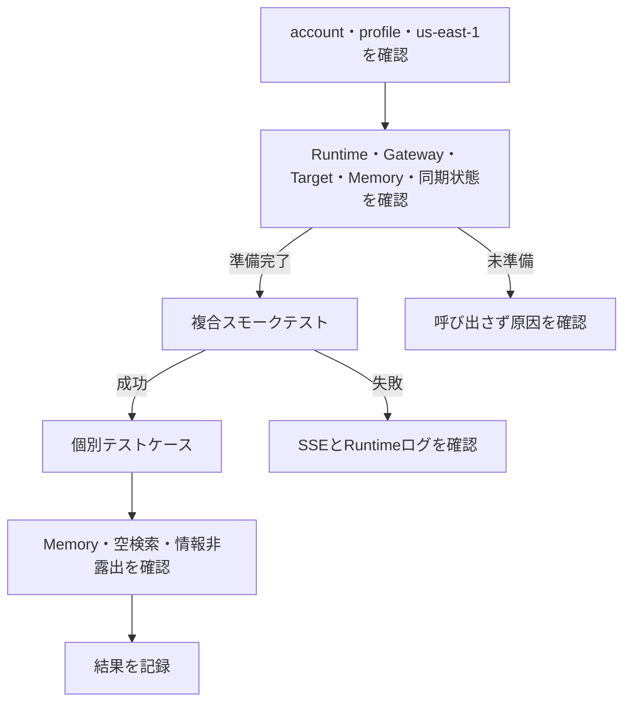

# AgentCore Runtime手動テストガイド

## 目的

このガイドは、`us-east-1`へデプロイ済みの`OpenAiAgentRuntime`をAWS CLIから呼び出し、Manager、Weather Agent、AWS Knowledge Agent、2つのGateway、Managed Knowledge Base、Memory、SSE応答が連携して動作していることを手動確認するための手順です。

- デプロイと初回同期: [CDKドキュメント](../CDK/README.md)
- Agent、HTTP／SSE、Memoryの詳細契約: [Agentドキュメント](../Agent/README.md)

Runtime呼び出しはAWS利用料金が発生する可能性があります。検証を許可されたAWSアカウント、profile、`us-east-1`だけを使用してください。

## テストフロー



短時間の稼働確認は共通準備とMT-001、機能全体の確認はMT-001～MT-010を実施します。

## 1. 共通準備

### 1.1 対象AWS環境を確認する

リポジトリルートで実行します。別profileを使う場合は`DEPLOY_PROFILE`を変更してください。

```bash
DEPLOY_PROFILE='default'
DEPLOY_REGION='us-east-1'
STACK_NAME='OpenAiAgentCoreBaseStack'

aws sts get-caller-identity --profile "$DEPLOY_PROFILE"

aws cloudformation describe-stacks \
  --stack-name "$STACK_NAME" \
  --region "$DEPLOY_REGION" \
  --profile "$DEPLOY_PROFILE" \
  --query 'Stacks[0].{Status:StackStatus,Id:StackId}' \
  --output table
```

STSのaccount／ARNが許可された環境で、stackが`CREATE_COMPLETE`または`UPDATE_COMPLETE`であることを確認します。想定外なら停止します。

### 1.2 Runtime、Gateway、Target、Memoryを確認する

```bash
aws bedrock-agentcore-control list-agent-runtimes \
  --region "$DEPLOY_REGION" --profile "$DEPLOY_PROFILE" \
  --query "agentRuntimes[?agentRuntimeName=='OpenAiAgentRuntime'].{Arn:agentRuntimeArn,Version:agentRuntimeVersion,Status:status}" \
  --output table

aws bedrock-agentcore-control list-gateways \
  --region "$DEPLOY_REGION" --profile "$DEPLOY_PROFILE" \
  --query "items[?name=='OpenAiWeatherGateway' || name=='OpenAiKnowledgeGateway'].{Name:name,Id:gatewayId,Status:status}" \
  --output table

aws bedrock-agentcore-control list-memories \
  --region "$DEPLOY_REGION" --profile "$DEPLOY_PROFILE" \
  --query "memories[?starts_with(id, 'OpenAiAgentMemory-')].{Id:id,Status:status}" \
  --output table
```

Runtimeと両Gatewayが`READY`、Memoryが`ACTIVE`であることを確認します。次に両Targetを確認します。

```bash
WEATHER_GATEWAY_ID="$(
  aws bedrock-agentcore-control list-gateways \
    --region "$DEPLOY_REGION" --profile "$DEPLOY_PROFILE" \
    --query "items[?name=='OpenAiWeatherGateway'].gatewayId | [0]" \
    --output text
)"
KNOWLEDGE_GATEWAY_ID="$(
  aws bedrock-agentcore-control list-gateways \
    --region "$DEPLOY_REGION" --profile "$DEPLOY_PROFILE" \
    --query "items[?name=='OpenAiKnowledgeGateway'].gatewayId | [0]" \
    --output text
)"

aws bedrock-agentcore-control list-gateway-targets \
  --gateway-identifier "$WEATHER_GATEWAY_ID" \
  --region "$DEPLOY_REGION" --profile "$DEPLOY_PROFILE" \
  --query "items[].{Name:name,Status:status}" --output table

aws bedrock-agentcore-control list-gateway-targets \
  --gateway-identifier "$KNOWLEDGE_GATEWAY_ID" \
  --region "$DEPLOY_REGION" --profile "$DEPLOY_PROFILE" \
  --query "items[].{Name:name,Status:status}" --output table
```

`WeatherTimeMock`と`KnowledgeRetrieve`が`READY`でない場合はRuntimeを呼び出しません。

### 1.3 Knowledge Baseの同期状態を確認する

```bash
KNOWLEDGE_BASE_ID="$(
  aws cloudformation describe-stacks \
    --stack-name "$STACK_NAME" --region "$DEPLOY_REGION" --profile "$DEPLOY_PROFILE" \
    --query "Stacks[0].Outputs[?OutputKey=='KnowledgeBaseId'].OutputValue | [0]" \
    --output text
)"
KNOWLEDGE_DATA_SOURCE_ID="$(
  aws cloudformation describe-stacks \
    --stack-name "$STACK_NAME" --region "$DEPLOY_REGION" --profile "$DEPLOY_PROFILE" \
    --query "Stacks[0].Outputs[?OutputKey=='KnowledgeDataSourceId'].OutputValue | [0]" \
    --output text
)"

aws bedrock-agent list-ingestion-jobs \
  --knowledge-base-id "$KNOWLEDGE_BASE_ID" \
  --data-source-id "$KNOWLEDGE_DATA_SOURCE_ID" \
  --region "$DEPLOY_REGION" --profile "$DEPLOY_PROFILE" \
  --query 'ingestionJobSummaries[0].{Id:ingestionJobId,Status:status,Statistics:statistics}' \
  --output json
```

最新jobが`COMPLETE`でない場合はKnowledgeテストを実行しません。`FAILED`／`STOPPED`時は同期を無条件に再実行せず、[CDKドキュメント](../CDK/README.md#初回同期とaws-e2e)で原因を確認します。

### 1.4 Runtime ARNと一時出力先を準備する

```bash
AGENT_RUNTIME_ARN="$(
  aws bedrock-agentcore-control list-agent-runtimes \
    --region "$DEPLOY_REGION" --profile "$DEPLOY_PROFILE" \
    --query "agentRuntimes[?agentRuntimeName=='OpenAiAgentRuntime' && status=='READY'].agentRuntimeArn | [0]" \
    --output text
)"
test -n "$AGENT_RUNTIME_ARN"
test "$AGENT_RUNTIME_ARN" != 'None'

MANUAL_TEST_OUTPUT_DIR="$(
  mktemp -d "${TMPDIR:-/tmp}/openai-agentcore-manual-test.XXXXXX"
)"
printf 'Runtime: %s\nOutput: %s\n' "$AGENT_RUNTIME_ARN" "$MANUAL_TEST_OUTPUT_DIR"
```

## 2. Runtime呼び出し用の共通関数

bashまたはzshで定義します。JSONはPythonで生成するため、日本語や引用符を安全に扱えます。

```bash
invoke_runtime() {
  local test_id="$1"
  local runtime_session_id="$2"
  local actor_id="$3"
  local prompt="$4"
  local output_file="$MANUAL_TEST_OUTPUT_DIR/${test_id}.txt"
  local payload

  payload="$(
    python3 -c \
      'import json, sys; print(json.dumps({"prompt": sys.argv[1], "actor_id": sys.argv[2]}, ensure_ascii=False))' \
      "$prompt" "$actor_id"
  )"

  aws bedrock-agentcore invoke-agent-runtime \
    --region "$DEPLOY_REGION" \
    --profile "$DEPLOY_PROFILE" \
    --agent-runtime-arn "$AGENT_RUNTIME_ARN" \
    --qualifier DEFAULT \
    --runtime-session-id "$runtime_session_id" \
    --content-type application/json \
    --accept text/event-stream \
    --cli-binary-format raw-in-base64-out \
    --cli-read-timeout 0 \
    --payload "$payload" \
    "$output_file"

  printf '\n===== %s =====\n' "$test_id"
  cat "$output_file"
}
```

正常時は`text_delta`が1件以上あり、最後が1件の`completed`です。`error`と`completed`の併存は失敗です。

## 3. 手動テストケース

### MT-001: 複合スモークテスト

Manager、両専門Agent、両Gateway、Lambda、Managed Knowledge Baseを一度に確認する推奨ケースです。

```bash
invoke_runtime 'MT-001' \
  "aws-composite-check-$(date +%s)-0000000001" \
  'manual-composite-user-001' \
  '東京の天気と、EC2 4台とRDS 1DBの詳細設計工数を、式と根拠文書付きで教えてください。'
```

期待結果:

- `72 degrees Fahrenheit, Sunny`相当と、固定モックである旨を返す。
- `(0.5人日 × EC2 4台) + (1.0人日 × RDS 1DB) = 3.0人日`を返す。
- `estimation/estimation_guideline.md`を根拠として示す。
- 最後が`completed`で、`error`がない。

### MT-002～MT-008: 機能別ケース

各ケースは別sessionで実行します。モデルの文章表現は完全一致ではなく、固定値、計算、根拠文書、安全性で判定します。

| ID | プロンプト | 期待結果 |
| --- | --- | --- |
| MT-002 Weather | 東京の天気を教えてください。 | `72 degrees Fahrenheit, Sunny`相当。実天気ではなく固定モックと明示 |
| MT-003 Time | Asia/Tokyoの時刻を教えてください。 | `2:30 PM`相当。実時刻ではなく固定モックと明示 |
| MT-004 Architecture | 本番環境のRDSバックアップ保持期間とWebサーバーの可用性要件を、根拠文書付きで教えてください。 | 14日、2 AZ以上、ALB配下、`standards/aws_architecture_standard.md` |
| MT-005 Monitoring | 本番CloudWatch Logsの保持期間とCPUアラーム条件を、根拠文書付きで教えてください。 | 90日、80%／90%を各5分、`standards/monitoring_standard.md` |
| MT-006 Estimation | EC2 4台とRDS 1DBの詳細設計工数を、中間式、単位、合計、根拠文書付きで教えてください。 | 0.5×4 + 1.0×1 = 3.0人日、`estimation/estimation_guideline.md` |
| MT-007 Project | Sample Project Alphaのフェーズ別実績工数と合計を、根拠文書付きで教えてください。 | 6.0、8.0、7.0、5.0、合計26.0人日、`projects/sample_project_alpha.md` |
| MT-008 Empty | 社内標準に登録されている量子コンピューターの障害対応手順を教えてください。 | 関連情報なし。未登録の手順、数値、文書名を捏造しない |

実行例:

```bash
invoke_runtime 'MT-002' "aws-weather-check-$(date +%s)-00000000001" \
  'manual-weather-user-001' '東京の天気を教えてください。'

invoke_runtime 'MT-003' "aws-time-check-$(date +%s)-0000000000001" \
  'manual-time-user-001' 'Asia/Tokyoの時刻を教えてください。'

invoke_runtime 'MT-004' "aws-architecture-check-$(date +%s)-000001" \
  'manual-architecture-user-001' \
  '本番環境のRDSバックアップ保持期間とWebサーバーの可用性要件を、根拠文書付きで教えてください。'

invoke_runtime 'MT-005' "aws-monitoring-check-$(date +%s)-00000001" \
  'manual-monitoring-user-001' \
  '本番CloudWatch Logsの保持期間とCPUアラーム条件を、根拠文書付きで教えてください。'

invoke_runtime 'MT-006' "aws-estimation-check-$(date +%s)-0000001" \
  'manual-estimation-user-001' \
  'EC2 4台とRDS 1DBの詳細設計工数を、中間式、単位、合計、根拠文書付きで教えてください。'

invoke_runtime 'MT-007' "aws-project-check-$(date +%s)-0000000001" \
  'manual-project-user-001' \
  'Sample Project Alphaのフェーズ別実績工数と合計を、根拠文書付きで教えてください。'

invoke_runtime 'MT-008' "aws-empty-check-$(date +%s)-000000000001" \
  'manual-empty-user-001' \
  '社内標準に登録されている量子コンピューターの障害対応手順を教えてください。'
```

### MT-009: Memory継続

同じactorとsessionを再利用します。

```bash
MEMORY_SESSION_ID="aws-memory-check-$(date +%s)-00000000001"
MEMORY_ACTOR_ID='manual-memory-user-001'

invoke_runtime 'MT-009-1' "$MEMORY_SESSION_ID" "$MEMORY_ACTOR_ID" \
  '私の検証名はミズキです。覚えてください。'
invoke_runtime 'MT-009-2' "$MEMORY_SESSION_ID" "$MEMORY_ACTOR_ID" \
  '私の検証名を覚えていますか？'
```

2回目が`ミズキ`を復元し、両方とも`completed`で終了すれば成功です。

### MT-010: Memory分離

MT-009と異なるactor、または異なるsessionでは名前を復元しないことを確認します。

```bash
invoke_runtime 'MT-010-actor' "$MEMORY_SESSION_ID" \
  'manual-memory-other-user-001' '私の検証名を覚えていますか？'

invoke_runtime 'MT-010-session' \
  "aws-memory-other-session-$(date +%s)-00001" \
  "$MEMORY_ACTOR_ID" '私の検証名を覚えていますか？'
```

## 4. 共通の安全性確認

全出力について、実account ID、ARN、Gateway URL、Knowledge Base ID、S3 bucket名、認証情報、内部例外が露出していないことを確認します。

```bash
rg -n \
  'arn:aws|s3://|amazonaws\.com|AKIA[0-9A-Z]{16}|ASIA[0-9A-Z]{16}|Gateway URL|Knowledge Base ID|bucket名|スタックトレース' \
  "$MANUAL_TEST_OUTPUT_DIR"

rg -n '"type"\s*:\s*"text_delta"' "$MANUAL_TEST_OUTPUT_DIR"
rg -n '"type"\s*:\s*"completed"' "$MANUAL_TEST_OUTPUT_DIR"
rg -n '"type"\s*:\s*"error"' "$MANUAL_TEST_OUTPUT_DIR"
```

内部情報の検索と最後の`error`検索は該当なしが期待結果です。各ファイルで`completed`が1件だけかつ最後のeventであることも確認します。

## 5. 失敗時の確認

1. account、profile、region、Runtime ARN、33～100文字のsession IDを確認する。
2. Runtime、Gateway、Target、Memory、最新ingestion jobの状態を再確認する。
3. SSEの`error`は安全な固定文言のため、詳細をRuntimeログで確認する。
4. 入力本文、個人情報、認証情報をログやPull Requestへ転載しない。

```bash
aws logs describe-log-groups \
  --log-group-name-prefix '/aws/bedrock-agentcore/runtimes/' \
  --region "$DEPLOY_REGION" --profile "$DEPLOY_PROFILE" \
  --query 'logGroups[].logGroupName' --output table

RUNTIME_LOG_GROUP='<確認済みロググループ名>'
aws logs tail "$RUNTIME_LOG_GROUP" \
  --since 10m \
  --region "$DEPLOY_REGION" --profile "$DEPLOY_PROFILE"
```

GatewayやTargetを停止・削除して障害を起こす試験は通常の手動確認に含めません。明示承認された専用環境だけで行い、部分障害、timeout、cleanup、rollbackは`uv run pytest`で決定的に検証します。

## 6. 結果記録

| 項目 | 記録内容 |
| --- | --- |
| 実行日時 | タイムゾーンを含む日時 |
| AWS環境 | profile、account ID、`us-east-1` |
| Runtime | name、version、status |
| Knowledge同期 | ingestion job ID、status、失敗件数 |
| テストケース | MT-001～MT-010の成功／失敗／未実施 |
| SSE | `text_delta`、`completed`、`error` |
| 期待値 | Weather／Time固定値、Knowledgeの数値、根拠文書 |
| 情報露出 | ARN、URL、bucket名、認証情報、内部例外の非露出 |
| 未実施理由 | 実行しなかったケースと理由 |

完全なAWS認証情報、入力に含まれる個人情報、不要な内部識別子は証跡へ保存しません。
