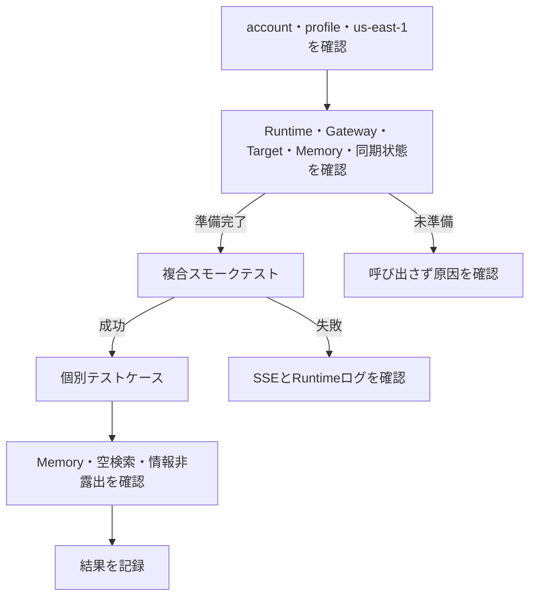
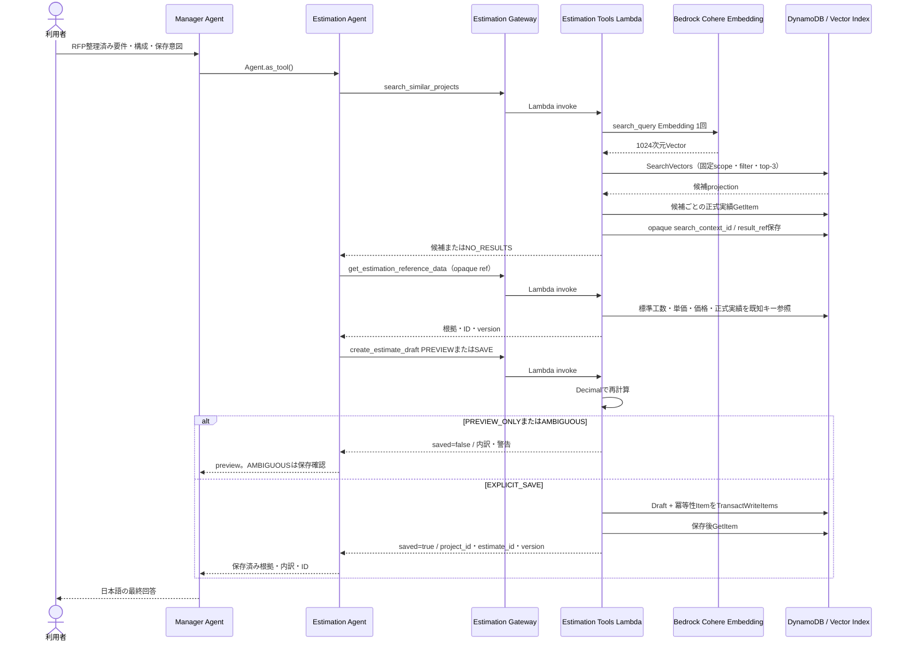

# AgentCore Runtime手動テストガイド

## 目的

このガイドは、`us-east-1`へデプロイ済みの`OpenAiAgentRuntime`をAWS CLIから呼び出し、Manager、Weather、AWS Knowledge、Estimation Agent、3つのGateway、Managed Knowledge Base、DynamoDB Vector Search、Memory、SSE応答が連携して動作していることを手動確認するための手順です。

- デプロイと初回同期: [CDKドキュメント](../CDK/README.md)
- Agent、HTTP／SSE、Memoryの詳細契約: [Agentドキュメント](../Agent/README.md)

Runtime呼び出しはAWS利用料金が発生する可能性があります。検証を許可されたAWSアカウント、profile、`us-east-1`だけを使用してください。

## テストフロー



短時間の稼働確認は共通準備とMT-001、機能全体の確認はMT-001～MT-010を実施します。

## 1. 共通準備

### 1.1 対象AWS環境を確認する

リポジトリルートで実行します。別profileを使う場合は`DEPLOY_PROFILE`を変更してください。

```bash
DEPLOY_PROFILE='default'
DEPLOY_REGION='us-east-1'
STACK_NAME='OpenAiAgentCoreBaseStack'

aws sts get-caller-identity --profile "$DEPLOY_PROFILE"

aws cloudformation describe-stacks \
  --stack-name "$STACK_NAME" \
  --region "$DEPLOY_REGION" \
  --profile "$DEPLOY_PROFILE" \
  --query 'Stacks[0].{Status:StackStatus,Id:StackId}' \
  --output table
```

STSのaccount／ARNが許可された環境で、stackが`CREATE_COMPLETE`または`UPDATE_COMPLETE`であることを確認します。想定外なら停止します。

### 1.2 Runtime、Gateway、Target、Memoryを確認する

```bash
aws bedrock-agentcore-control list-agent-runtimes \
  --region "$DEPLOY_REGION" --profile "$DEPLOY_PROFILE" \
  --query "agentRuntimes[?agentRuntimeName=='OpenAiAgentRuntime'].{Arn:agentRuntimeArn,Version:agentRuntimeVersion,Status:status}" \
  --output table

aws bedrock-agentcore-control list-gateways \
  --region "$DEPLOY_REGION" --profile "$DEPLOY_PROFILE" \
  --query "items[?name=='OpenAiWeatherGateway' || name=='OpenAiKnowledgeGateway'].{Name:name,Id:gatewayId,Status:status}" \
  --output table

aws bedrock-agentcore-control list-memories \
  --region "$DEPLOY_REGION" --profile "$DEPLOY_PROFILE" \
  --query "memories[?starts_with(id, 'OpenAiAgentMemory-')].{Id:id,Status:status}" \
  --output table
```

Runtimeと両Gatewayが`READY`、Memoryが`ACTIVE`であることを確認します。次に両Targetを確認します。

```bash
WEATHER_GATEWAY_ID="$(
  aws bedrock-agentcore-control list-gateways \
    --region "$DEPLOY_REGION" --profile "$DEPLOY_PROFILE" \
    --query "items[?name=='OpenAiWeatherGateway'].gatewayId | [0]" \
    --output text
)"
KNOWLEDGE_GATEWAY_ID="$(
  aws bedrock-agentcore-control list-gateways \
    --region "$DEPLOY_REGION" --profile "$DEPLOY_PROFILE" \
    --query "items[?name=='OpenAiKnowledgeGateway'].gatewayId | [0]" \
    --output text
)"

aws bedrock-agentcore-control list-gateway-targets \
  --gateway-identifier "$WEATHER_GATEWAY_ID" \
  --region "$DEPLOY_REGION" --profile "$DEPLOY_PROFILE" \
  --query "items[].{Name:name,Status:status}" --output table

aws bedrock-agentcore-control list-gateway-targets \
  --gateway-identifier "$KNOWLEDGE_GATEWAY_ID" \
  --region "$DEPLOY_REGION" --profile "$DEPLOY_PROFILE" \
  --query "items[].{Name:name,Status:status}" --output table
```

`WeatherTimeMock`と`KnowledgeRetrieve`が`READY`でない場合はRuntimeを呼び出しません。

### 1.3 Knowledge Baseの同期状態を確認する

```bash
KNOWLEDGE_BASE_ID="$(
  aws cloudformation describe-stacks \
    --stack-name "$STACK_NAME" --region "$DEPLOY_REGION" --profile "$DEPLOY_PROFILE" \
    --query "Stacks[0].Outputs[?OutputKey=='KnowledgeBaseId'].OutputValue | [0]" \
    --output text
)"
KNOWLEDGE_DATA_SOURCE_ID="$(
  aws cloudformation describe-stacks \
    --stack-name "$STACK_NAME" --region "$DEPLOY_REGION" --profile "$DEPLOY_PROFILE" \
    --query "Stacks[0].Outputs[?OutputKey=='KnowledgeDataSourceId'].OutputValue | [0]" \
    --output text
)"

aws bedrock-agent list-ingestion-jobs \
  --knowledge-base-id "$KNOWLEDGE_BASE_ID" \
  --data-source-id "$KNOWLEDGE_DATA_SOURCE_ID" \
  --region "$DEPLOY_REGION" --profile "$DEPLOY_PROFILE" \
  --query 'ingestionJobSummaries[0].{Id:ingestionJobId,Status:status,Statistics:statistics}' \
  --output json
```

最新jobが`COMPLETE`でない場合はKnowledgeテストを実行しません。`FAILED`／`STOPPED`時は同期を無条件に再実行せず、[CDKドキュメント](../CDK/README.md#初回同期とaws-e2e)で原因を確認します。

### 1.4 Runtime ARNと一時出力先を準備する

```bash
AGENT_RUNTIME_ARN="$(
  aws bedrock-agentcore-control list-agent-runtimes \
    --region "$DEPLOY_REGION" --profile "$DEPLOY_PROFILE" \
    --query "agentRuntimes[?agentRuntimeName=='OpenAiAgentRuntime' && status=='READY'].agentRuntimeArn | [0]" \
    --output text
)"
test -n "$AGENT_RUNTIME_ARN"
test "$AGENT_RUNTIME_ARN" != 'None'

MANUAL_TEST_OUTPUT_DIR="$(
  mktemp -d "${TMPDIR:-/tmp}/openai-agentcore-manual-test.XXXXXX"
)"
printf 'Runtime: %s\nOutput: %s\n' "$AGENT_RUNTIME_ARN" "$MANUAL_TEST_OUTPUT_DIR"
```

## 2. Runtime呼び出し用の共通関数

bashまたはzshで定義します。JSONはPythonで生成するため、日本語や引用符を安全に扱えます。応答の生SSEはファイルに保存し、標準出力には`text_delta`を連結した本文と終端イベントを表示します。

```bash
invoke_runtime() {
  local test_id="$1"
  local runtime_session_id="$2"
  local actor_id="$3"
  local prompt="$4"
  local output_file="$MANUAL_TEST_OUTPUT_DIR/${test_id}.txt"
  local payload

  payload="$(
    python3 -c \
      'import json, sys; print(json.dumps({"prompt": sys.argv[1], "actor_id": sys.argv[2]}, ensure_ascii=False))' \
      "$prompt" "$actor_id"
  )"

  aws bedrock-agentcore invoke-agent-runtime \
    --region "$DEPLOY_REGION" \
    --profile "$DEPLOY_PROFILE" \
    --agent-runtime-arn "$AGENT_RUNTIME_ARN" \
    --qualifier DEFAULT \
    --runtime-session-id "$runtime_session_id" \
    --content-type application/json \
    --accept text/event-stream \
    --cli-binary-format raw-in-base64-out \
    --cli-read-timeout 0 \
    --payload "$payload" \
    "$output_file"

  printf '\n===== %s =====\n' "$test_id"

  python3 - "$output_file" <<'PY'
import json
import sys

output_file = sys.argv[1]

with open(output_file, encoding="utf-8") as stream:
    for line in stream:
        if not line.startswith("data: "):
            continue

        event = json.loads(line.removeprefix("data: "))
        event_type = event.get("type")

        if event_type == "text_delta":
            print(event.get("delta", ""), end="", flush=True)
        elif event_type == "completed":
            print("\n\n[SSE: completed]")
        elif event_type == "error":
            detail = json.dumps(event, ensure_ascii=False)
            print(f"\n\n[SSE ERROR] {detail}")
PY
}
```

画面では分割された`text_delta`が通常の文章として連結表示されます。調査用の生SSEは`$MANUAL_TEST_OUTPUT_DIR/<test_id>.txt`に残ります。正常時は`text_delta`が1件以上あり、最後が1件の`completed`です。`error`と`completed`の併存は失敗です。

## 3. 手動テストケース

### MT-001: 複合スモークテスト

Manager、両専門Agent、両Gateway、Lambda、Managed Knowledge Baseを一度に確認する推奨ケースです。

```bash
invoke_runtime 'MT-001' \
  "aws-composite-check-$(date +%s)-0000000001" \
  'manual-composite-user-001' \
  '東京の天気と、EC2 4台とRDS 1DBの詳細設計工数を、式と根拠文書付きで教えてください。'
```

期待結果:

- `72 degrees Fahrenheit, Sunny`相当と、固定モックである旨を返す。
- `(0.5人日 × EC2 4台) + (1.0人日 × RDS 1DB) = 3.0人日`を返す。
- `estimation/estimation_guideline.md`を根拠として示す。
- 最後が`completed`で、`error`がない。

### MT-002～MT-008: 機能別ケース

各ケースは別sessionで実行します。モデルの文章表現は完全一致ではなく、固定値、計算、根拠文書、安全性で判定します。

| ID | プロンプト | 期待結果 |
| --- | --- | --- |
| MT-002 Weather | 東京の天気を教えてください。 | `72 degrees Fahrenheit, Sunny`相当。実天気ではなく固定モックと明示 |
| MT-003 Time | Asia/Tokyoの時刻を教えてください。 | `2:30 PM`相当。実時刻ではなく固定モックと明示 |
| MT-004 Architecture | 本番環境のRDSバックアップ保持期間とWebサーバーの可用性要件を、根拠文書付きで教えてください。 | 14日、2 AZ以上、ALB配下、`standards/aws_architecture_standard.md` |
| MT-005 Monitoring | 本番CloudWatch Logsの保持期間とCPUアラーム条件を、根拠文書付きで教えてください。 | 90日、80%／90%を各5分、`standards/monitoring_standard.md` |
| MT-006 Estimation | EC2 4台とRDS 1DBの詳細設計工数を、中間式、単位、合計、根拠文書付きで教えてください。 | 0.5×4 + 1.0×1 = 3.0人日、`estimation/estimation_guideline.md` |
| MT-007 Project | Sample Project Alphaのフェーズ別実績工数と合計を、根拠文書付きで教えてください。 | 6.0、8.0、7.0、5.0、合計26.0人日、`projects/sample_project_alpha.md` |
| MT-008 Empty | 社内標準に登録されている量子コンピューターの障害対応手順を教えてください。 | 関連情報なし。未登録の手順、数値、文書名を捏造しない |

実行例:

```bash
invoke_runtime 'MT-002' "aws-weather-check-$(date +%s)-00000000001" \
  'manual-weather-user-001' '東京の天気を教えてください。'

invoke_runtime 'MT-003' "aws-time-check-$(date +%s)-0000000000001" \
  'manual-time-user-001' 'Asia/Tokyoの時刻を教えてください。'

invoke_runtime 'MT-004' "aws-architecture-check-$(date +%s)-000001" \
  'manual-architecture-user-001' \
  '本番環境のRDSバックアップ保持期間とWebサーバーの可用性要件を、根拠文書付きで教えてください。'

invoke_runtime 'MT-005' "aws-monitoring-check-$(date +%s)-00000001" \
  'manual-monitoring-user-001' \
  '本番CloudWatch Logsの保持期間とCPUアラーム条件を、根拠文書付きで教えてください。'

invoke_runtime 'MT-006' "aws-estimation-check-$(date +%s)-0000001" \
  'manual-estimation-user-001' \
  'EC2 4台とRDS 1DBの詳細設計工数を、中間式、単位、合計、根拠文書付きで教えてください。'

invoke_runtime 'MT-007' "aws-project-check-$(date +%s)-0000000001" \
  'manual-project-user-001' \
  'Sample Project Alphaのフェーズ別実績工数と合計を、根拠文書付きで教えてください。'

invoke_runtime 'MT-008' "aws-empty-check-$(date +%s)-000000000001" \
  'manual-empty-user-001' \
  '社内標準に登録されている量子コンピューターの障害対応手順を教えてください。'
```

### MT-009: Memory継続

同じactorとsessionを再利用します。

```bash
MEMORY_SESSION_ID="aws-memory-check-$(date +%s)-00000000001"
MEMORY_ACTOR_ID='manual-memory-user-001'

invoke_runtime 'MT-009-1' "$MEMORY_SESSION_ID" "$MEMORY_ACTOR_ID" \
  '私の検証名はミズキです。覚えてください。'
invoke_runtime 'MT-009-2' "$MEMORY_SESSION_ID" "$MEMORY_ACTOR_ID" \
  '私の検証名を覚えていますか？'
```

2回目が`ミズキ`を復元し、両方とも`completed`で終了すれば成功です。

### MT-010: Memory分離

MT-009と異なるactor、または異なるsessionでは名前を復元しないことを確認します。

```bash
invoke_runtime 'MT-010-actor' "$MEMORY_SESSION_ID" \
  'manual-memory-other-user-001' '私の検証名を覚えていますか？'

invoke_runtime 'MT-010-session' \
  "aws-memory-other-session-$(date +%s)-00001" \
  "$MEMORY_ACTOR_ID" '私の検証名を覚えていますか？'
```

## 4. 共通の安全性確認

全出力について、実account ID、ARN、Gateway URL、Knowledge Base ID、S3 bucket名、認証情報、内部例外が露出していないことを確認します。

```bash
rg -n \
  'arn:aws|s3://|amazonaws\.com|AKIA[0-9A-Z]{16}|ASIA[0-9A-Z]{16}|Gateway URL|Knowledge Base ID|bucket名|スタックトレース' \
  "$MANUAL_TEST_OUTPUT_DIR"

rg -n '"type"\s*:\s*"text_delta"' "$MANUAL_TEST_OUTPUT_DIR"
rg -n '"type"\s*:\s*"completed"' "$MANUAL_TEST_OUTPUT_DIR"
rg -n '"type"\s*:\s*"error"' "$MANUAL_TEST_OUTPUT_DIR"
```

内部情報の検索と最後の`error`検索は該当なしが期待結果です。各ファイルで`completed`が1件だけかつ最後のeventであることも確認します。

## 5. 失敗時の確認

1. account、profile、region、Runtime ARN、33～100文字のsession IDを確認する。
2. Runtime、Gateway、Target、Memory、最新ingestion jobの状態を再確認する。
3. SSEの`error`は安全な固定文言のため、詳細をRuntimeログで確認する。
4. 入力本文、個人情報、認証情報をログやPull Requestへ転載しない。

```bash
aws logs describe-log-groups \
  --log-group-name-prefix '/aws/bedrock-agentcore/runtimes/' \
  --region "$DEPLOY_REGION" --profile "$DEPLOY_PROFILE" \
  --query 'logGroups[].logGroupName' --output table

RUNTIME_LOG_GROUP='<確認済みロググループ名>'
aws logs tail "$RUNTIME_LOG_GROUP" \
  --since 10m \
  --region "$DEPLOY_REGION" --profile "$DEPLOY_PROFILE"
```

GatewayやTargetを停止・削除して障害を起こす試験は通常の手動確認に含めません。明示承認された専用環境だけで行い、部分障害、timeout、cleanup、rollbackは`uv run pytest`で決定的に検証します。

## 6. 結果記録

| 項目 | 記録内容 |
| --- | --- |
| 実行日時 | タイムゾーンを含む日時 |
| AWS環境 | profile、account ID、`us-east-1` |
| Runtime | name、version、status |
| Knowledge同期 | ingestion job ID、status、失敗件数 |
| テストケース | MT-001～MT-010の成功／失敗／未実施 |
| SSE | `text_delta`、`completed`、`error` |
| 期待値 | Weather／Time固定値、Knowledgeの数値、根拠文書 |
| 情報露出 | ARN、URL、bucket名、認証情報、内部例外の非露出 |
| 未実施理由 | 実行しなかったケースと理由 |

完全なAWS認証情報、入力に含まれる個人情報、不要な内部識別子は証跡へ保存しません。

## 7. Estimation DynamoDB Vector Searchの手動確認

この節はMT-001～MT-010へ追加するEstimation専用シナリオです。ローカルテスト、synth、コンテナbuildの成功だけではAWS書き込みを許可しません。PoC責任者から対象account、profile、月額予算額、通知先、deploy・Seed・Runtime保存・cleanupの明示承認がそろった場合だけ実行します。

### 7.1 予算と実行前提

実行前に次を記録します。値をリポジトリ、Issue、Pull Requestへ固定しません。

| 項目 | 必須確認 |
| --- | --- |
| AWS主体 | `aws sts get-caller-identity`で許可済みaccount／roleである |
| Region | `us-east-1` |
| Bedrock | `cohere.embed-multilingual-v3`を呼び出せる |
| DynamoDB | Vector Searchが利用可能で、テーブル／Index quotaに余裕がある |
| Budget | PoC責任者が月額予算額と通知先を指定済み |
| 通知 | AWS Budgetsの実績コスト50%／80%／100%を同じ通知先へ設定済み |
| 承認 | CDK deploy、Seed、実Vector評価、Draft保存、cleanupの範囲が明示されている |

AWS Billing and Cost ManagementのBudgetsで月次Cost Budgetを作成し、50%、80%、100%の`ACTUAL`通知を設定します。既存Budgetを使う場合は、対象accountで次のread-only確認を行い、金額とsubscriberが責任者指定と一致することを画面または安全な作業記録へ残します。

```bash
AWS_ACCOUNT_ID="$(aws sts get-caller-identity \
  --profile "$DEPLOY_PROFILE" --query Account --output text)"
BUDGET_NAME='<PoC責任者が指定したBudget名>'

aws budgets describe-budget \
  --account-id "$AWS_ACCOUNT_ID" \
  --budget-name "$BUDGET_NAME" \
  --profile "$DEPLOY_PROFILE"

aws budgets describe-notifications-for-budget \
  --account-id "$AWS_ACCOUNT_ID" \
  --budget-name "$BUDGET_NAME" \
  --profile "$DEPLOY_PROFILE"
```

予算額、通知先、3閾値の一つでも未確認ならdeployへ進みません。メールアドレスなどの通知先はリポジトリへ記録しません。

### 7.2 Estimation構成のdeployと準備状態

承認後、[CDKドキュメント](../CDK/README.md#estimation-dynamodb-vector-search構成)に従って`cdk diff`をレビューし、意図した新規リソースとIAMだけであることを確認してdeployします。

```bash
cdk diff OpenAiAgentCoreBaseStack --profile "$DEPLOY_PROFILE"
cdk deploy OpenAiAgentCoreBaseStack \
  --profile "$DEPLOY_PROFILE" \
  --require-approval broadening
```

CloudFormation出力から対象を解決します。

```bash
ESTIMATION_TABLE_NAME="$(
  aws cloudformation describe-stacks \
    --stack-name "$STACK_NAME" --region "$DEPLOY_REGION" --profile "$DEPLOY_PROFILE" \
    --query "Stacks[0].Outputs[?OutputKey=='EstimationTableName'].OutputValue | [0]" \
    --output text
)"
ESTIMATION_INDEX_NAME="$(
  aws cloudformation describe-stacks \
    --stack-name "$STACK_NAME" --region "$DEPLOY_REGION" --profile "$DEPLOY_PROFILE" \
    --query "Stacks[0].Outputs[?OutputKey=='EstimationVectorIndexName'].OutputValue | [0]" \
    --output text
)"

test "$ESTIMATION_TABLE_NAME" = 'OpenAiEstimationData'
test "$ESTIMATION_INDEX_NAME" = 'EstimationProjectVectorIndexV1'
```

テーブル、Index、Gateway、Target、Lambdaを確認します。

```bash
aws dynamodb describe-table \
  --table-name "$ESTIMATION_TABLE_NAME" \
  --region "$DEPLOY_REGION" --profile "$DEPLOY_PROFILE" \
  --query "Table.{Status:TableStatus,VectorIndexes:VectorIndexes[?IndexName=='$ESTIMATION_INDEX_NAME'].{Name:IndexName,Status:IndexStatus,Dimensions:Dimensions,Distance:DistanceFunction}}" \
  --output json

aws bedrock-agentcore-control list-gateways \
  --region "$DEPLOY_REGION" --profile "$DEPLOY_PROFILE" \
  --query "items[?name=='OpenAiEstimationGateway'].{Id:gatewayId,Status:status}" \
  --output table

ESTIMATION_GATEWAY_ID="$(
  aws bedrock-agentcore-control list-gateways \
    --region "$DEPLOY_REGION" --profile "$DEPLOY_PROFILE" \
    --query "items[?name=='OpenAiEstimationGateway'].gatewayId | [0]" --output text
)"
aws bedrock-agentcore-control list-gateway-targets \
  --gateway-identifier "$ESTIMATION_GATEWAY_ID" \
  --region "$DEPLOY_REGION" --profile "$DEPLOY_PROFILE" \
  --query "items[?name=='EstimationTools'].{Name:name,Status:status}" --output table

aws lambda get-function --function-name OpenAiEstimationTools \
  --region "$DEPLOY_REGION" --profile "$DEPLOY_PROFILE" \
  --query 'Configuration.{State:State,Architecture:Architectures,Timeout:Timeout}'
```

テーブル、Gateway、Target、Lambdaが利用可能で、Indexが`ACTIVE`、1024次元、`COSINE`でない場合は停止します。CLIでも対象Indexだけを待機できます。

```bash
uv run python scripts/estimation_seed.py \
  --region "$DEPLOY_REGION" --stack-name "$STACK_NAME" wait-index
```

### 7.3 Sample Dataの検証、明示投入、冪等再実行

最初にAWS書き込みなしで正本を検証します。

```bash
uv run python scripts/estimation_seed.py validate --source dynamodb-seed
```

`VALID`を確認後、承認された実行であることを再確認し、`--apply`付きで投入します。

```bash
uv run python scripts/estimation_seed.py \
  --region "$DEPLOY_REGION" --stack-name "$STACK_NAME" \
  apply --apply
```

初回は`embedded=3`、`structured_upserted=15`が目安です。同じコマンドをもう一度実行し、`embedded=0`、`summary_skipped=3`となることを確認します。hash一致時はBedrock呼び出しと案件サマリー書き込みをskipします。Vectorを`dynamodb-seed/`へ書き戻していないことも`git status --short`で確認します。

### 7.4 実Vector検索のSample Data回帰評価

一時ファイルへ評価証跡を出します。

```bash
ESTIMATION_EVAL_OUTPUT="$MANUAL_TEST_OUTPUT_DIR/estimation-vector-evaluation.json"
uv run python scripts/estimation_vector_e2e.py evaluate \
  --region "$DEPLOY_REGION" --stack-name "$STACK_NAME" \
  --source dynamodb-seed --output "$ESTIMATION_EVAL_OUTPUT"
```

期待結果:

- 正本6件と`SAMPLE-PROJECT-DELTA`の合計7件が評価される。
- 各ケースの`passed=true`で、HIST-001／002／003を期待する各ケースがtop-1になる。
- Sample Project Deltaは`HIST-001`がtop-1になる。
- reportに実行日時、region、モデル、1024次元、正規化version、Seed hash、Index名、順位がある。
- `evaluation_scope=POC_SAMPLE_DATA_REGRESSION_ONLY`である。この合格を本番データの検索品質保証とは表現しない。
- COSINE scoreの絶対値や完全一致を合否条件にしない。

### 7.5 検索・参照・preview・SAVEの主要シーケンス



Runtime、Gateway、Toolの権限は分離されています。RuntimeはDynamoDBとCohereモデルを直接呼びません。Vector検索結果の物理キーを正本とせず、opaque refを同じactor/session、30分期限に束縛し、正式数値をベーステーブルから再取得します。

### 7.6 Sample Project Deltaのpreview、明示保存、曖昧保存

Sample Dataからプロンプトを読み込みます。プロンプトや認証値をshell history以外の共有成果物へ固定しません。

```bash
DELTA_SAVE_PROMPT="$(python3 -c \
  'import json; print(json.load(open("dynamodb-seed/sample-inputs/sample-project-delta.json", encoding="utf-8"))["prompt"])')"
```

preview-onlyでは「保存しない」を明示します。

```bash
invoke_runtime 'MT-EST-001-PREVIEW' \
  "est-preview-$(date +%s)-0000000000001" \
  'manual-estimation-user-001' \
  "${DELTA_SAVE_PROMPT/Draftとして保存してください/計算結果を表示してください。保存しないでください}"
```

期待結果は`15.7人日`、役割別`AWS_ARCHITECT 5.0`／`INFRA_ENGINEER 10.7`人日、原価`1,356,000円`、提示価格`1,695,000円`、`HIST-001`、参照マスターversion 1、類似実績26.0人日を自動補正しない旨、Multi-AZ追加工数が未反映の警告です。保存IDや「保存済み」を返さず、DynamoDBへDraftを追加しません。

明示保存は新しいsessionで実行します。

```bash
DELTA_SAVE_SESSION="est-save-$(date +%s)-0000000000000001"
DELTA_SAVE_ACTOR='manual-estimation-save-user-001'
invoke_runtime 'MT-EST-002-SAVE' \
  "$DELTA_SAVE_SESSION" "$DELTA_SAVE_ACTOR" "$DELTA_SAVE_PROMPT"
```

追加確認を挟まず同一turnで保存し、`saved=true`を確認できた後だけ、状態`DRAFT`、`project_id`、`estimate_id`、`version=1`を返すことが期待結果です。回答から3値を作業用変数へ転記します。

```bash
DELTA_PROJECT_ID='<回答で確認したproject_id>'
DELTA_ESTIMATE_ID='<回答で確認したestimate_id>'
DELTA_VERSION='1'
```

同じactor/sessionで完全IDを指定して再取得します。

```bash
invoke_runtime 'MT-EST-003-GET' \
  "$DELTA_SAVE_SESSION" "$DELTA_SAVE_ACTOR" \
  "project_id=${DELTA_PROJECT_ID}、estimate_id=${DELTA_ESTIMATE_ID}、version=${DELTA_VERSION}の見積Draftを再取得してください。"
```

保存時と同じ根拠、版、15.7人日、原価、価格、警告が返ることを確認します。

曖昧な依頼は別sessionで実行します。

```bash
invoke_runtime 'MT-EST-004-AMBIGUOUS' \
  "est-ambiguous-$(date +%s)-0000000000001" \
  'manual-estimation-ambiguous-user-001' \
  "${DELTA_SAVE_PROMPT/Draftとして保存してください/見積を作ってください}"
```

previewの対象、主要金額、根拠と「保存するとDraftが永続化される」ことを示して確認を求め、確認前に保存IDや保存済み表現を返さないことを確認します。

### 7.7 類似案件0件の継続

Sample Data内で組み合わせが存在しない`MIGRATION`かつ`EC2_RDS_WEB`になる案件を、明示保存で依頼します。

```bash
invoke_runtime 'MT-EST-005-NO-RESULTS' \
  "est-no-results-$(date +%s)-00000000001" \
  'manual-estimation-no-results-user-001' \
  '既存のEC2 2台とRDS 1DBの業務Webを同構成のままAWSへ移行します。基本設計、詳細設計、構築、単体テストの見積をDraftとして保存してください。見積基準日は2026-08-19です。'
```

検索0件をエラー扱いせず、標準工数・単価・価格だけで同一turn保存を継続します。回答とDraftに「類似案件なし」、`similar_project_ids=[]`、`similar_project_search_status=NO_RESULTS`、`calculation_basis=STANDARD_MASTERS_ONLY`があることを確認します。

### 7.8 opaque refの安全性

正常検索で発行された`search_context_id`と`result_ref`は、Agentが案件IDへ置き換えず後続Toolへ渡します。GatewayのSigV4対応MCP検証クライアントを使える承認済み環境では、次を別々に確認します。値そのものは共有証跡へ保存せず、statusだけを記録します。

1. 正常検索と同じactor/session、未改変refで`get_estimation_reference_data`を呼ぶと`OK`。
2. `result_ref`を1文字変更すると`CONTEXT_INVALID`。
3. 同じcontext/refを別actorまたは別Runtime sessionから使うと`CONTEXT_INVALID`。
4. 発行から30分後、またはテスト用fake clockによる期限超過では、DynamoDB TTL削除前でも`CONTEXT_EXPIRED`。
5. 任意の`project_id`、`PK`、`SK`、`top_k`、filter式をTool入力へ追加しても正式参照へ使われない。

実AWSで30分待機しない場合、期限切れは自動テスト`tests/unit/test_estimation_repository_context.py`の結果を証跡とし、AWS E2Eでは未実施理由を記録します。期限検証のためにDynamoDB Itemを直接改変しません。

### 7.9 DynamoDB Item、ログ、EMF

明示保存で記録した完全キーだけを取得します。Scanやテーブル全量exportは行いません。

```bash
aws dynamodb get-item \
  --table-name "$ESTIMATION_TABLE_NAME" \
  --key "{\"PK\":{\"S\":\"ESTIMATE_PROJECT#${DELTA_PROJECT_ID}\"},\"SK\":{\"S\":\"ESTIMATE#${DELTA_ESTIMATE_ID}#V0001\"}}" \
  --consistent-read \
  --region "$DEPLOY_REGION" --profile "$DEPLOY_PROFILE" \
  --output json > "$MANUAL_TEST_OUTPUT_DIR/delta-draft.json"
```

`DRAFT`、計算内訳、根拠、マスターversion、`HIST-001`、警告、作成者が保存されていることを確認します。生成Vectorは過去案件の`SUMMARY` Itemだけにあり、Draft、実績、マスター、正本JSONにはありません。

```bash
aws logs tail '/aws/lambda/OpenAiEstimationTools' \
  --since 30m --region "$DEPLOY_REGION" --profile "$DEPLOY_PROFILE" \
  > "$MANUAL_TEST_OUTPUT_DIR/estimation-tools.log"

rg -n 'EmbeddingCalls|EmbeddingRetries|EmbeddingThrottles|EmbeddingLatency' \
  "$MANUAL_TEST_OUTPUT_DIR/estimation-tools.log"

rg -n 'search_summary|embedding|SearchVector|daily_rate_jpy|proposed_price_jpy|PRIVATE|AKIA|ASIA' \
  "$MANUAL_TEST_OUTPUT_DIR/estimation-tools.log"
```

最初の検索でEmbedding call、初回Seedで3件のdocument Embeddingが観測できること、再Seedのhash一致skipでは追加呼び出しがないことをメトリクスで確認します。最後の禁止情報検索は該当なしが期待です。EMFに本文、Vector、単価、価格を含めません。

### 7.10 完全キーcleanup

Itemと再取得を確認し、削除対象の完全な3 IDを記録した後だけcleanupします。`--apply`なしでは削除されません。

```bash
uv run python scripts/estimation_seed.py \
  --region "$DEPLOY_REGION" --stack-name "$STACK_NAME" \
  cleanup-draft --apply \
  --project-id "$DELTA_PROJECT_ID" \
  --estimate-id "$DELTA_ESTIMATE_ID" \
  --version "$DELTA_VERSION"
```

当該Draftと関連する冪等性Itemだけが削除され、過去案件、実績、マスター、他Draftが残ることを確認します。CLIはScan、一括削除、管理外Item削除を行いません。追加で作成した0件ケースのDraftも、そのケースで記録した完全IDを使って個別にcleanupします。

### 7.11 Estimation結果記録

| 項目 | 記録内容 |
| --- | --- |
| 承認 | deploy／Seed／保存／cleanupの承認範囲と日時 |
| Budget | Budget名、月額上限確認、50%／80%／100%通知確認。通知先実値は記録しない |
| Index | 名、`ACTIVE`、1024、COSINE |
| Seed | 初回件数、再実行skip件数、正本差分なし |
| Vector評価 | 7件の順位・合否、Delta=`HIST-001` top-1、Sample Data限定である旨 |
| Delta preview | 15.7、5.0／10.7、1,356,000、1,695,000、非保存 |
| Delta SAVE | 同一turn、保存後再取得、完全ID、version 1 |
| 曖昧保存 | preview後の確認、確認前は非保存 |
| 0件 | 標準マスター継続、`STANDARD_MASTERS_ONLY`、類似案件なし |
| opaque ref | 正常、改変、別actor/session、期限切れのstatus。未実施は理由 |
| ログ／EMF | 呼出回数、再試行、throttle、latency、禁止情報なし |
| cleanup | 削除した完全ID、関連2 Itemだけの削除確認 |

AWS認証情報、account ID、ARN、Gateway URL、opaque token、生成Vector、入力全文、メールアドレスをリポジトリへ保存しません。実施していない項目は成功とせず、理由と再実行条件を記録します。
