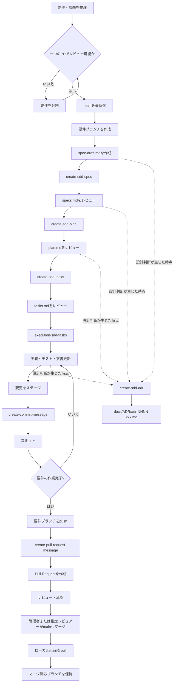
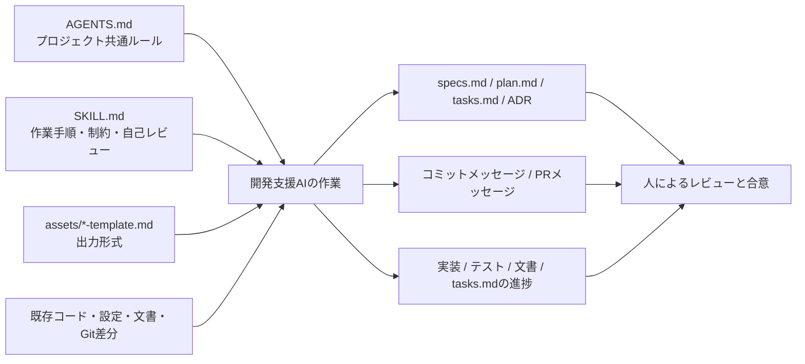

# このプロジェクトにおける仕様駆動開発（SDD）ガイド

## 1. このガイドの目的

このプロジェクトでは、実装を始める前に仕様、実装方針、実装タスクを段階的に整理する仕様駆動開発（SDD: Specification-Driven Development）を採用します。

本ガイドは、SDDを初めて経験するメンバーを含むチームが、同じ手順、同じ成果物、同じGitHub運用で開発を進めるための入口です。

このプロジェクトにおけるSDDの目的は、次のとおりです。

- 実装前に「何を作るか」と「どこまで作るか」を明確にする
- 仕様と実装方針を分け、設計上の判断をレビュー可能にする
- 実装作業を、担当と完了条件が分かる粒度へ分解する
- 要件単位のブランチとPull Requestにより、変更範囲とレビュー対象を明確にする
- 複数人が同時に作業しても、判断や作業の抜け漏れを減らす
- 開発支援AIの出力をそのまま採用せず、人が確認・合意した内容をプロジェクトの記録として残す

## 2. SDDの適用範囲と基本原則

### 2.1 適用範囲

原則として、次の変更ではSDD成果物を作成し、本ガイドの手順に従います。

- 新機能の追加、既存機能の動作変更、削除
- 公開API、ツールスキーマ、イベント、設定値、環境変数などの契約変更
- AWSリソース、IAM権限、ネットワーク、デプロイ方式、監視・運用方式の追加または変更
- 複数の実装領域にまたがり、受け入れ条件を定義してレビューする必要がある変更
- 利用者、運用者、外部システムから見える挙動に影響する変更

次の変更では、実行時の挙動、公開契約、インフラ構成に影響しないことを確認できる場合に限り、`specs.md`、`plan.md`、`tasks.md` を省略できます。

- 誤字、表記、リンク、説明文だけを修正する軽微なドキュメント変更
- コメント、空白、整形など、動作を変えない修正
- `.gitignore` など、実行時の挙動を変えない開発環境・リポジトリ管理上の軽微な保守
- コードや設定を変更しない調査、説明、レビュー

省略可能か判断できない場合は、変更を開始する前にSDD対象として扱うか確認します。SDD成果物を省略しても、依頼範囲の確認、差分確認、必要な検証、ドキュメントの整合性確認は省略しません。

### 2.2 基本原則

このプロジェクトでは、次の原則を守ります。

1. **要件を適切な大きさに分割する**
   一つのfeature directory、一つのブランチ、一つのPull Requestでレビューできる大きさにします。

2. **要件ブランチを作成してから作業する**
   最新の `main` から要件専用ブランチを作成し、SDD成果物、実装、テスト、関連文書を同じブランチで管理します。

3. **仕様を決めてから実装する**
   実装前に `specs.md` を作成し、目的、スコープ、要件、受け入れ条件を確認します。

4. **仕様と実装方針を分ける**
   `specs.md` には「何を満たすか」、`plan.md` には「どう実現するか」を記載します。

5. **実装前に作業を分解する**
   `tasks.md` に、前提確認、実装、テスト・検証、ドキュメント更新、完了確認を記載します。

6. **未確定事項を推測で決めない**
   決まっていない内容は、未確定事項、未解決事項、要確認事項として残します。

7. **重要な設計判断はADRに残す**
   採用方針、判断理由、代替案、影響を、`docs/ADR/` 配下のADRに記録します。

8. **意味のある変更単位でコミットする**
   一つのコミットは一つの目的に集中させ、コミットメッセージはステージ済み差分だけを説明します。

9. **Pull Requestで要件全体を説明する**
   Pull Requestは、`main` と要件ブランチの差分全体、検証結果、レビュー観点を説明します。

10. **各段階で人がレビューする**
    開発支援AIは文書作成や整理を支援しますが、仕様、設計、実装、マージの責任はチームが持ちます。次の段階へ進む場合は、会話またはレビュー記録で承認と進行可否を明示します。

11. **既存の指示と実装を優先する**
    対象ディレクトリに適用される `AGENTS.md`、既存コード、既存設定、既存文書、既存ADRを確認します。

## 3. SDDとGitHubの全体フロー



ADRは、必ず `plan.md` の後に作成するものではありません。要求整理や仕様ドラフトの作成中を含め、後から判断理由を説明する必要がある設計判断が生じた時点で作成します。

コミットは、要件の最後に一度だけ作成するのではありません。実装、テスト、文書更新などを、レビュー可能な意味のある変更単位でコミットします。要件全体がPull Requestとしてレビュー可能な状態になったら、ブランチをGitHubへpushします。

要件ブランチには、`feature/NNN-short-feature-name` または `NN-short-feature-name-NN` の形式を使用できます。後者は `02-agent-core-basic-01` のように、要件番号、内容、追加対応の連番を表します。マージ後に不足していた小規模な対応を追加する場合は、最新の `main` から末尾の連番を変えた新しいブランチを作成し、マージ済みブランチ自体は再利用しません。

## 4. SDDとGitで使用する成果物

| 成果物                 | 役割 | 主に書くこと | 書かないこと |
|---------------------|---|---|---|
| `spec-draft.md`     | 要求や検討内容の下書き | 要望、課題、会話で分かったこと、未整理の論点 | 確定していない内容を確定事項として書かない |
| `specs.md`          | 実装前の仕様書 | 目的、スコープ、要件、受け入れ条件、制約、未確定事項 | 詳細な実装方法 |
| `plan.md`           | 実装計画書 | 実装方針、変更対象、技術方針、影響、リスク、検証方針、実施順序 | 仕様の追加や再定義、具体的な作業チェックリスト |
| `tasks.md`          | 実装タスクリスト | 前提確認、実装、テスト、文書更新、完了確認、依存関係 | 仕様や実装方針の再定義 |
| ADR                 | 設計判断の記録 | 背景、課題、判断軸、決定、代替案、影響、未決事項 | 会話や資料で確認できない判断理由 |
| コミットメッセージ           | 一つのコミットの説明 | ステージ済み差分で何を変更したか | ブランチ全体の説明、未ステージの変更 |
| Pull Requestタイトル・本文 | 要件ブランチ全体のレビュー依頼 | 背景、目的、変更内容、SDD成果物、検証結果、レビュー観点、対象外 | コミットメッセージの単純な連結、未確認の検証結果 |

## 5. 標準ディレクトリ構成

```text
project-root/
├── AGENTS.md
├── .agents/
│   └── skills/
│       ├── create-sdd-spec/
│       │   ├── SKILL.md
│       │   └── assets/spec-template.md
│       ├── create-sdd-plan/
│       │   ├── SKILL.md
│       │   └── assets/plan-template.md
│       ├── create-sdd-tasks/
│       │   ├── SKILL.md
│       │   └── assets/tasks-template.md
│       ├── execution-sdd-tasks/
│       │   ├── SKILL.md
│       │   └── agents/openai.yaml
│       ├── create-adr/
│       │   ├── SKILL.md
│       │   └── assets/adr-template.md
│       ├── create-commit-message/
│       │   ├── SKILL.md
│       │   └── assets/commit-message-template.md
│       └── create-pull-request-message/
│           ├── SKILL.md
│           └── assets/pull-request-template.md
├── specs/
│   └── NNN-feature-name/
│       ├── spec-draft.md
│       ├── specs.md
│       ├── plan.md
│       └── tasks.md
├── docs/
│   ├── ADR/
│   │   └── adr-NNNN-decision-title.md
│   └── SDD/
│       ├── README.md
│       ├── workflow.md
│       └── team-development.md
└── ...
```

実際の命名規則や配置ルールが `AGENTS.md` やリポジトリ内の文書で定義されている場合は、そのルールを優先します。

## 6. AGENTS.md、Skill、テンプレート、成果物の関係



- `AGENTS.md` には、プロジェクト全体または対象領域で常に守るルールを記載します。
- `SKILL.md` には、特定の成果物を作成する手順、禁止事項、自己レビューを記載します。
- `assets/*-template.md` には、生成するMarkdownやメッセージの形式を記載します。
- 開発支援AIの呼び出し方法は、使用するツールによって異なります。依頼時には、使用するSkill名と対象を明示してください。

## 7. Skillの使い分け

| Skill | 主な入力                                 | 出力         | 使用する時点 |
|---|--------------------------------------|------------|---|
| `create-sdd-spec` | `spec-draft.md`、既存コード・文書             | `specs.md` | 要件整理後 |
| `create-sdd-plan` | `specs.md`、既存コード・文書                  | `plan.md`  | 仕様レビュー後 |
| `create-sdd-tasks` | `specs.md`、`plan.md`                 | `tasks.md` | 計画レビュー後 |
| `execution-sdd-tasks` | レビュー済みの`tasks.md`、`specs.md`、`plan.md`、ADR、既存実装 | 実装・テスト・文書、進捗更新済みの`tasks.md` | タスクレビュー後、実装開始・再開時 |
| `create-sdd-adr` | 会話で合意した設計判断、明示的に参照された情報              | ADR        | 設計判断が確定した時点 |
| `create-commit-message` | `git diff --cached` のステージ済み差分        | コミットメッセージ  | コミット直前 |
| `create-pull-request-message` | `main` と要件ブランチの差分全体、コミット履歴、確認済みの検証結果 | PRタイトル・本文  | push後、PR作成前 |

### コミットメッセージとPull Requestメッセージの違い

| 観点 | コミットメッセージ | Pull Requestメッセージ |
|---|---|---|
| 対象 | 一つのコミット | 要件ブランチ全体 |
| 根拠 | ステージ済み差分 | `main` とブランチの差分全体 |
| 目的 | Git履歴に変更単位を残す | レビューとマージ判断に必要な情報を伝える |
| 内容 | 何を変更したか | なぜ必要か、何を変更したか、どう検証したか |
| 長さ | 原則として簡潔 | レビュー可能な情報を具体的に記載 |

両者を機械的に同じ内容にはしません。要件ブランチが一つのコミットだけの場合、コミットの件名とPRタイトルが近い表現になることはありますが、PR本文には背景、変更内容、検証結果、レビュー観点などを記載します。

## 8. 初めてSDDを行う場合の最短手順

1. 要件が一つのPull Requestでレビューできる大きさか確認する
2. `main` を最新化する
3. 最新の `main` から要件ブランチを作成する
4. `specs/NNN-feature-name/` を作成する
5. 要求や会話の内容を `spec-draft.md` に整理する
6. `create-sdd-spec` を使って `specs.md` を作成し、チームでレビューする
7. `create-sdd-plan` を使って `plan.md` を作成し、チームでレビューする
8. 必要な設計判断を `create-sdd-adr` でADRに記録する
9. `create-sdd-tasks` を使って `tasks.md` を作成し、チームでレビューする
10. `execution-sdd-tasks` を使い、`tasks.md` の未完了タスクを上から順番に実装、テスト、文書更新する
11. 意味のある変更単位をステージし、`create-commit-message` でコミットメッセージを作成する
12. 差分とメッセージを確認してコミットする。必要な回数だけ繰り返す
13. 受け入れ条件と完了条件を確認し、要件ブランチをGitHubへpushする
14. `create-pull-request-message` でPRタイトルと本文を作成する
15. GitHubでPull Requestを作成し、レビューを受ける
16. マージ権限を持つ管理者または指定レビュアーが `main` へマージする
17. マージ後、ローカルの `main` を `git pull --ff-only origin main` で更新する
18. マージ済みブランチは削除せず保持し、新しい要件には再利用しない

詳細は次の文書を参照してください。

- [SDDの実施手順](./workflow.md)
- [複数人で進めるための共同開発ルール](./team-development.md)

## 9. 開発支援AIを使用するときの注意

- 一度の依頼で `specs.md`、`plan.md`、`tasks.md`、実装をすべて進めさせないでください。
- 各成果物を作成した後、次の段階へ進む前に人がレビューし、会話またはレビュー記録で承認と次段階への進行を明示してください。ファイルが存在することだけを承認済みの根拠にしないでください。
- AIが既存コードや既存文書を確認せずに提案している場合は、そのまま採用しないでください。
- 未確定事項をAIに推測させず、文書に未確定事項として残してください。
- 会話中に重要な設計判断が確定した場合は、会話が失われる前にADRとして記録してください。
- `execution-sdd-tasks` で実装する場合は、タスク完了直後に `[x]` を付け、完了できないタスクには `- 未実施理由:` を記録してください。
- 中断後に再開する場合は、完了済みの `[x]` を保持し、上から最初の `[ ]` タスクから実行してください。
- コミットメッセージは、必ずステージ済み差分と一致することを人が確認してください。
- Pull Request本文は、ブランチ全体の差分と実際の検証結果に一致することを人が確認してください。
- 明示的に依頼しない限り、AIに `git add`、`git commit`、`git push`、Pull Request作成、マージを実行させません。
- AIツールが異なっても、作成する成果物とレビュー基準は同じです。

## 10. 図の作成方針

READMEや `docs/` 配下の文書で、次の内容を文章だけで説明しにくい場合は、Mermaidを使用します。

- システム構成
- コンポーネント間の関係
- データフローや処理フロー
- シーケンス
- 状態遷移
- タスクやシステムの依存関係

図を追加しても理解が改善しない場合は、形式的に図を作成しません。Mermaid図は本文と整合させ、未確定の構成や関係を推測で追加しないでください。

## 11. 困ったときの判断

- 要件が大きすぎる場合は、実装を始める前に分割します。
- 何を作るかが曖昧な場合は、実装せず `spec-draft.md` と `specs.md` を見直します。
- どう作るかが曖昧な場合は、実装せず `plan.md` の未解決事項を見直します。
- タスクが大きすぎる場合は、独立して完了を確認できる単位へ分割します。
- タスクが細かすぎる場合は、同じ目的で単独確認できない編集を一つにまとめます。
- コミットに複数の独立した変更目的が混在する場合は、ステージ内容を分けてコミットします。
- ブランチに複数の独立した要件が混在する場合は、PRメッセージでまとめず、要件とブランチの分割を検討します。
- 判断理由を後から説明する必要がある場合は、ADRを作成します。
- 成果物同士が矛盾する場合は、上流の成果物から修正し、下流の成果物へ反映します。
