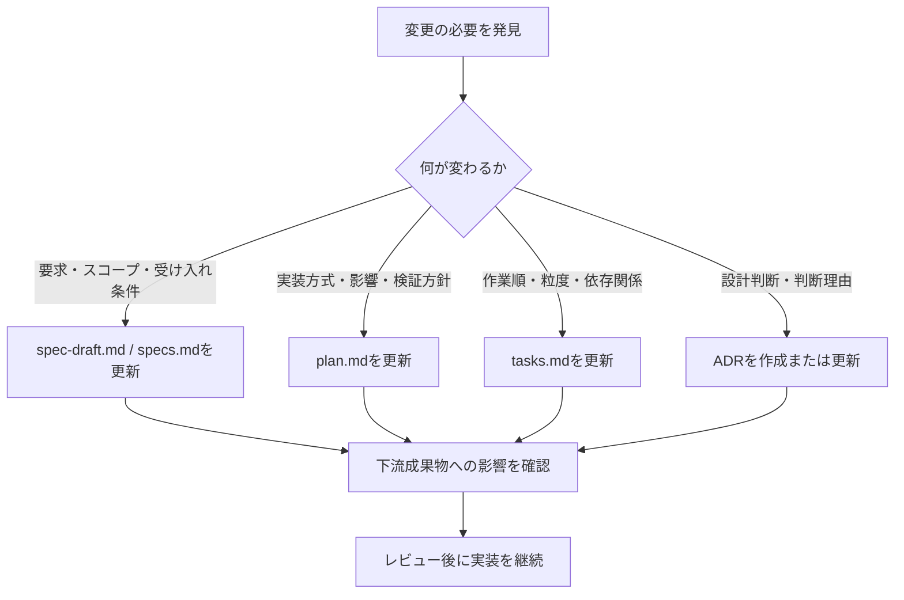

# 複数人で進めるためのSDD共同開発ルール

## 1. 目的

この文書は、複数人が同じGitHubリポジトリでSDDを行う際に、仕様、設計、タスク、実装、Git履歴、Pull Requestの不整合を防ぐための共同開発ルールを定めます。

本ルールは、機能、公開契約、インフラ構成などを変更するSDD対象の要件に適用します。誤字やリンクの修正、動作を変えない整形、軽微なリポジトリ保守、変更を伴わない調査などは、実行時の挙動に影響しないことを確認できる場合に限り、SDD成果物を省略できます。

リポジトリに、より具体的なブランチ、Pull Request、レビュー、承認ルールがある場合は、そのルールを優先します。

## 2. 一要件・一feature directory・一ブランチ・一Pull Request

要件は、一つのfeature directory、一つの要件ブランチ、一つのPull Requestで管理できる大きさに分割します。

```text
specs/NNN-feature-name/
├── spec-draft.md
├── specs.md
├── plan.md
└── tasks.md
```

```text
feature/NNN-feature-name
または
NN-feature-name-NN
```

- 独立した目的や受け入れ条件を持つ変更は、別要件として分割します。
- 一つのブランチに複数の独立した要件を混在させません。
- SDD成果物、実装、テスト、関連文書を同じ要件ブランチで管理します。
- チームメンバーは、実装やレビューを始める前に、feature directoryと要件ブランチの最新状態を確認します。

## 3. Gitブランチ運用

### 3.1 作業開始

要件ブランチは、最新の `main` から作成します。

```bash
git status --short
git switch main
git pull --ff-only origin main
git switch -c feature/NNN-short-feature-name
```

- `main` 上で要件のSDD成果物や実装を変更しません。
- 新しい要件には `feature/NNN-short-feature-name`、要件番号と追加対応の連番を示す場合は `NN-short-feature-name-NN` の形式を使用できます。
- `02-agent-core-basic-01` は後者の有効な例です。
- マージ済みブランチを、新しい要件に再利用しません。
- 作業ツリーに未コミットの変更がある場合は、そのままブランチを切り替えたり、pullしたりしません。

### 3.2 作業中

- 同じファイルやリソースを複数人で変更する場合は、着手前に担当を調整します。
- 他の要件の変更や、依頼範囲外の修正を混在させません。
- 想定外の差分や他の担当者の変更を検出した場合は、勝手に破棄または修正しません。
- 意味のある変更単位でコミットします。

### 3.3 push、Pull Request、マージ

- 要件全体がレビュー可能な状態になったら、要件ブランチをGitHubへpushします。
- pushした要件ブランチから `main` に対するPull Requestを作成します。
- `main` へ直接pushしません。
- Pull Requestを経由せずに `main` へ変更を反映しません。
- マージ権限を持つ管理者または指定レビュアーが、レビュー完了後に `main` へマージします。

### 3.4 マージ後

```bash
git status --short
git switch main
git pull --ff-only origin main
```

- マージ済みの要件ブランチは、ローカル、リモートとも削除せずに保持します。
- 保持したブランチを新しい要件に再利用しません。
- 次の要件では、更新後の `main` から新しいブランチを作成します。
- マージ後に不足していた小規模な対応を追加する場合も、最新の `main` から末尾の連番を変えた新しいブランチを作成します。

## 4. 成果物と責任

開発支援AIが文書やメッセージを生成した場合でも、内容に対する責任はチームが持ちます。

| 対象           | チームが確認すること |
|--------------|---|
| `specs.md`   | 要求、スコープ、受け入れ条件が正しいこと |
| `plan.md`    | 実装方針、影響、リスク、検証方針が現実的であること |
| `tasks.md`   | タスクの粒度、順序、依存関係、完了条件が適切であること |
| ADR          | 決定内容、判断理由、代替案、影響が会話や参照情報と一致すること |
| コード          | 仕様と計画に沿い、テストと文書が更新されていること |
| コミットメッセージ    | ステージ済み差分だけを正しく説明していること |
| Pull Request | 要件ブランチ全体の差分、検証結果、未解決事項を正しく説明していること |

## 5. 段階ごとのレビューゲート

各成果物の承認と次段階への進行可否は、会話またはレビュー記録で明示します。ファイルが存在することだけを理由に、レビュー済みまたは承認済みとは扱いません。

### 5.1 仕様レビュー

`specs.md` が承認されるまで、原則として実装計画と実装へ進みません。

確認項目:

- 背景と目的が明確か
- スコープと対象外が明確か
- 機能要件と非機能要件が必要十分か
- 受け入れ条件が検証可能か
- 制約と依存関係が明確か
- 未確定事項が認識されているか

### 5.2 計画レビュー

確認項目:

- 仕様を追加・変更していないか
- 変更対象と変更しない対象が明確か
- 既存コードや既存方式との整合があるか
- データ、契約、インフラ、運用への影響を確認しているか
- リスクと検証方針が具体的か
- 実施順序が依存関係に沿っているか
- ADRや文書更新の要否が整理されているか

### 5.3 タスクレビュー

確認項目:

- 各タスクが `specs.md` または `plan.md` に根拠を持つか
- 各タスクが一つの目的に集中しているか
- 対象、実施内容、完了条件、依存関係が明確か
- 実装と検証が分離されているか
- 並列実行できるタスクに `[P]` が付いているか
- 同じファイルやリソースを同時変更する競合がないか
- ドキュメント更新と完了確認が含まれているか

### 5.4 実装・Pull Requestレビュー

確認項目:

- `specs.md` の受け入れ条件を満たすか
- `plan.md` の実装方針に沿っているか
- `tasks.md` の対象外の変更が混ざっていないか
- テスト結果が確認できるか
- README、docs、ADRが更新されているか
- シークレットや不要ファイルが含まれていないか
- コミットが意味のある変更単位になっているか
- Pull Request本文が差分と検証結果に一致しているか

## 6. タスクの担当と並行作業

### 6.1 タスクIDを使用する

共同作業の会話、Issue、Pull Request、必要に応じてコミットメッセージでは、`tasks.md` のタスクIDを参照します。

例:

```text
T020を担当します。
T020はT010の完了後に着手します。
```

### 6.2 `[P]` の意味

`[P]` は、依存関係上は並列に進められることを示します。ただし、次の場合は担当者間で調整します。

- 同じファイルを変更する
- 同じ設定やインフラリソースを変更する
- 一方の設計変更が他方の実装内容に影響する
- 共通テスト環境や共有リソースを使用する

### 6.3 タスクの粒度

タスクは、レビュー可能な成果が一つ確認できる程度の粒度にします。

分割した方がよい例:

- 新規コンポーネントの作成と、既存コンポーネントへの接続が独立して確認できる
- 権限設定とアプリケーション実装を別担当者が作業できる
- 正常系と例外処理が大きく異なる

まとめた方がよい例:

- 一行ずつの設定変更など、単独では成果を確認できない
- 同じ目的のために複数ファイルを同時に変更する必要がある
- 分割すると、どのタスクでも完了条件を確認できない

## 7. コミットの共同運用

### 7.1 コミット単位

- 一つのコミットは、一つの目的または一つの確認可能な変更に集中させます。
- SDD文書、実装、テスト、ドキュメント更新は、履歴を分けた方が理解しやすい場合は別コミットにします。
- 動作変更と無関係な大規模整形を同じコミットに混在させません。
- コミット前に、ステージ済み差分が意図した範囲だけであることを確認します。

### 7.2 create-commit-messageの利用

コミット直前に、`create-commit-message` Skillを使用します。

このSkillは、`git diff --cached` のステージ済み差分だけを根拠に、原則としてConventional Commits形式の日本語メッセージを作成します。

```text
create-commit-message Skillを使用し、
現在のステージ済み差分に対応するコミットメッセージを作成してください。
git commitは実行しないでください。
```

- 作成されたメッセージを、そのまま採用せず差分と照合します。
- 複数の独立した目的が混在している場合は、コミットを分割します。
- 未ステージの変更や、ブランチ全体の内容をコミットメッセージへ含めません。
- 明示的に依頼しない限り、開発支援AIに `git add`、`git commit`、`git push` を実行させません。

## 8. 仕様や計画の変更管理

実装中に変更が必要になった場合は、コードだけを先に変更しません。



変更によって不要になったタスクや前提がある場合は、`tasks.md` を更新します。変更内容は、対応するコミットとPull Requestへ反映します。

## 9. ADRの共同運用

ADRには、一つの主要な意思決定を記録します。

共同開発では、次を確認します。

- 会話で合意した内容が記録されているか
- 決定済みと未決事項が区別されているか
- 検討していない代替案や理由をAIが推測して追加していないか
- 採用しない案と理由が必要に応じて記録されているか
- 影響やリスクが一方的な内容になっていないか
- 図が必要な場合、Mermaid図が本文と一致しているか

設計判断が変更された場合は、既存ADRを黙って書き換えるのではなく、プロジェクトのADR運用に従い、StatusやSupersedes / Superseded byの関係を整理します。

## 10. ドキュメントとMermaid図のレビュー

READMEや `docs/` に図を追加する場合は、次を確認します。

- 図を追加する目的が明確か
- 文章だけより理解しやすくなっているか
- 図の構成要素と関係が実装または確定した設計と一致するか
- 未確定の要素を推測で追加していないか
- 本文と図の説明が矛盾していないか
- Mermaid構文が利用する表示環境で正しく描画されるか
- 図を変更した場合、関連する本文も更新されているか

## 11. Pull Requestの共同運用

### 11.1 create-pull-request-messageの利用

要件ブランチをpushした後、Pull Requestを作成する前に `create-pull-request-message` Skillを使用します。

```text
create-pull-request-message Skillを使用し、
現在の要件ブランチからmainへのPull Requestタイトルと本文を作成してください。
Pull Request自体は作成しないでください。
```

このSkillは、`main` と要件ブランチの差分全体、コミット履歴、差分に含まれるSDD成果物と文書、確認できる検証結果を整理します。

### 11.2 Pull Requestで確認する内容

少なくとも次を確認できる状態にします。

- 対象feature directory
- 背景と目的
- ブランチ全体の変更内容
- 対応したタスクID
- 変更した仕様、計画、ADRの有無
- 実施したテストと結果
- 未実施のテストと理由
- 更新したREADMEまたは `docs/`
- レビュアーに確認してほしい点
- 対象外
- 残っている未確定事項、未解決事項、後続タスク

### 11.3 コミットメッセージとの違い

- コミットメッセージは、一つのコミットのステージ済み差分を説明します。
- Pull Requestは、要件ブランチ全体を説明します。
- PR本文を、コミットメッセージの一覧だけで済ませません。
- 要件ブランチが一つのコミットだけの場合でも、PR本文には背景、検証結果、レビュー観点を記載します。

### 11.4 レビューとマージ

- Pull Requestのレビュー指摘によってSDD成果物へ影響がある場合は、成果物も更新します。
- 修正後に必要な検証を再実施し、PR本文の検証結果も更新します。
- マージ権限を持つ管理者または指定レビュアーが、レビュー完了後に `main` へマージします。

## 12. 引き継ぎ時に共有すること

担当者が変わる場合は、口頭説明だけでなく、少なくとも次を共有します。

- 対象feature directory
- 現在の段階: 仕様、計画、タスク、実装、検証、PRレビューのどこか
- 完了したタスクと未完了タスク
- 次に着手可能なタスク
- 未確定事項、未解決事項
- 関連ADR
- 作業中のブランチまたはPull Request
- 最新のコミット
- 実施済みのテストと確認結果

## 13. 避けるべき進め方

- 要件を分割せず、一つのブランチに複数の独立した目的を入れる
- `main` 上で要件のSDD文書や実装を変更する
- `specs.md` が曖昧なまま、AIに実装を開始させる
- 一度の依頼で仕様、計画、タスク、実装をすべて作らせる
- AIが追加した要件を、レビューせずに仕様へ入れる
- `plan.md` と異なる方式で実装し、文書を更新しない
- `tasks.md` にない大きな作業を、相談せず追加する
- 未確定事項を、担当者またはAIが独自判断で確定する
- 設計判断を会話だけに残し、ADRを作成しない
- `[P]` だけを見て、ファイルやリソースの競合を確認せず並行作業する
- 複数の独立した変更を一つのコミットにまとめる
- コミットメッセージとPRメッセージを機械的に同じ内容にする
- テストを実施していないのに完了または成功と記載する
- PRを経由せず `main` へ変更を反映する
- マージ済みブランチを削除または新しい要件に再利用する
- 実装と一致しないREADME、docs、Mermaid図を残す

## 14. レビューで意見が分かれた場合

意見が分かれた場合は、次の順序で整理します。

1. 争点が要求なのか、実装方式なのか、作業方法なのかを分ける
2. 要求の争点は `specs.md`、実装方式の争点は `plan.md` またはADR、作業方法の争点は `tasks.md` で扱う
3. 判断軸、選択肢、影響、未確定事項を明確にする
4. 合意した内容を該当成果物へ反映する
5. 下流成果物、実装、コミット、Pull Requestへの影響を確認する

会話で合意しただけで終わらせず、後から参照できる成果物へ反映してください。
