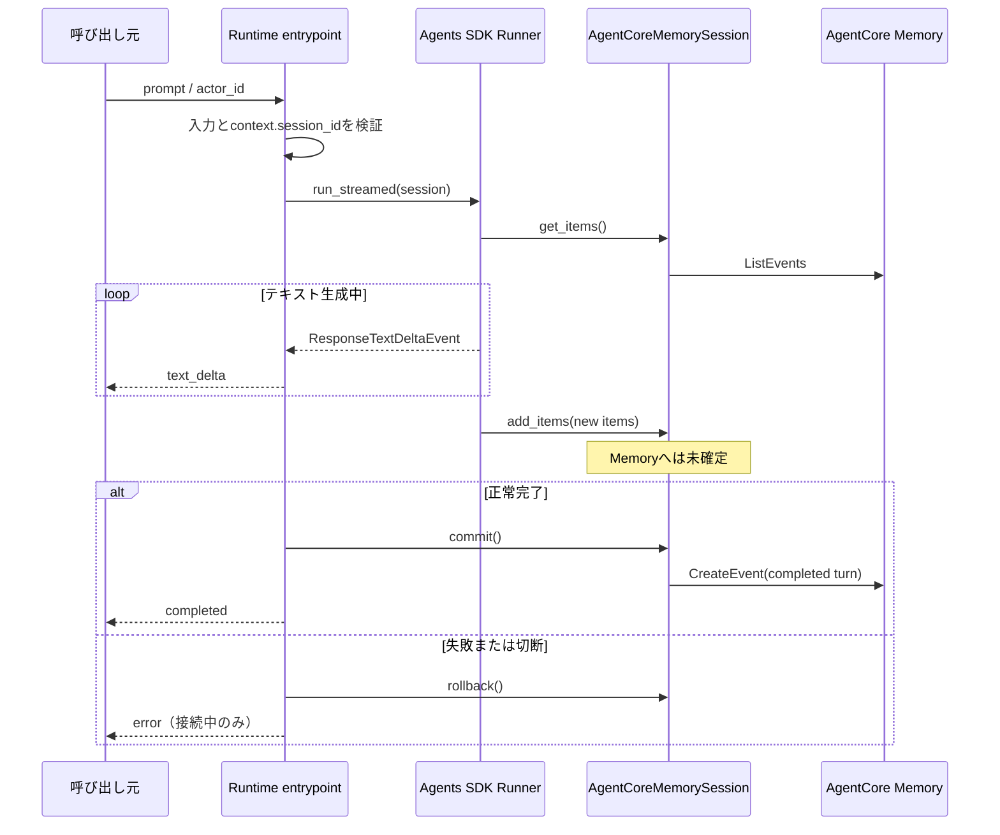

# Plan: OpenAI Agents SDK AgentのAgentCore Runtime基盤

## 実装方針

本featureは、Agentアプリケーション、会話履歴、コンテナ、AWS CDK、テスト、利用手順にまたがる複数領域の変更として実装する。

Agentアプリケーションは、外部とのHTTP/SSE境界、Agent実行、モデル生成、Session永続化を分離する。`BedrockAgentCoreApp`のentrypointでは入力とRuntimeコンテキストをストリーム開始前に検証し、検証成功後にのみ非同期ジェネレーターを返す。ジェネレーター内で`Runner.run_streamed()`を最後まで消費し、OpenAI Responses APIのテキスト差分を仕様のSSEイベントへ変換する。

マルチエージェントはADR-0002に従い、マネージャーAgentがWeather Agentを`Agent.as_tool()`で利用する。モデル接続はADR-0001に従い、OpenAI PythonのAmazon Bedrock providerを設定した`AsyncOpenAI`と`OpenAIResponsesModel`を各Agentへ明示的に注入する。グローバルな既定クライアントへ依存させず、テスト時にモデル実装を差し替えられる構造にする。

OpenAI Agents SDK Sessionは、AgentCore Memoryの短期記憶を唯一の永続化先とする独自実装を用意する。1回のAgent実行中にSDKから追加されたSession itemをメモリ内へ一時保持し、ストリームの消費、Agent実行、Memory書き込みがすべて成功した後に、そのターンを単一の完了済みイベントとして確定する。失敗またはクライアント切断時は未確定バッファを破棄する。

AWS CDKは、MemoryとRuntimeを責務別Constructへ分割し、既存`AgentCoreStack`はConstructの組み立てだけを担う。Runtimeの自動生成実行ロールへMemory権限とPoC用管理ポリシーを付与する。`app.py`でスタックのリージョンを`us-east-2`へ固定する。

ローカル自動テストでは、モデルとMemory APIをテストダブルへ差し替え、AWS認証情報やAWSリソースを必要とせずにAgent、Session、SSE、CDKテンプレートを検証する。AWS上のモデル接続とMemory統合は、ユーザーから明示的な依頼があった場合だけスモークテストする。

## 変更対象

### Agentアプリケーション

| パス | 変更内容 |
| --- | --- |
| `agents/main.py` | `BedrockAgentCoreApp`を生成し、ポート`8080`で起動するコンテナentrypointを追加する |
| `agents/src/agent_app/__init__.py` | ローカル実装をOpenAI Agents SDKの`agents` packageと分離したpackageとして定義する |
| `agents/src/agent_app/config.py` | `AWS_REGION`、`BEDROCK_OPENAI_MODEL_ID`、Memory IDを読み込み、起動時に検証する設定オブジェクトを追加する |
| `agents/src/agent_app/contracts.py` | `prompt`、`actor_id`の入力検証、RuntimeセッションIDの検証、SSEイベント生成を担当する契約層を追加する |
| `agents/src/agent_app/models.py` | Bedrock provider付き`AsyncOpenAI`と`OpenAIResponsesModel`を生成するモデルファクトリーを追加する |
| `agents/src/agent_app/agent_factory.py` | マネージャーAgent、Weather Agent、Weather Agent-as-Toolを生成するファクトリーを追加する |
| `agents/src/agent_app/session.py` | OpenAI Agents SDKのSession protocolをAgentCore Memory短期記憶へ接続するSession実装を追加する |
| `agents/src/agent_app/service.py` | `Runner.run_streamed()`の実行、イベント変換、Sessionのcommit/rollbackを制御するサービスを追加する |
| `agents/src/agent_app/runtime.py` | 入力を先に検証してからストリームを返す`BedrockAgentCoreApp`アプリケーションファクトリーを追加する |
| `agents/requirements.txt` | Agentコンテナの実行依存を完全一致バージョンで固定する |
| `agents/Dockerfile` | Python 3.12、Linux ARM64、ポート`8080`のRuntime用イメージを定義する |
| `agents/.dockerignore` | Git情報、キャッシュ、テスト生成物、ローカル設定をビルドコンテキストから除外する |

`agents/`自体はPython packageにせず、実装packageを`agents/src/agent_app/`とする。これにより、OpenAI Agents SDKが公開するPython package名`agents`とリポジトリのディレクトリ名が衝突することを避ける。

### AWS CDK

| パス | 変更内容 |
| --- | --- |
| `agent_core_cdk_stack/constructs/agent_core_memory_construct.py` | 短期記憶30日、長期記憶戦略なし、AWS所有キー、`RemovalPolicy.DESTROY`のMemory Constructを追加する |
| `agent_core_cdk_stack/constructs/agent_core_runtime_construct.py` | ARM64コンテナアセット、HTTP Runtime、IAM認証、Publicネットワーク、環境変数、Runtime実行ロールの権限を定義するConstructを追加する |
| `agent_core_cdk_stack/constructs/.gitkeep` | Construct追加後は不要となるplaceholderを削除する |
| `agent_core_cdk_stack/agent_core_stack.py` | Memory ConstructとRuntime Constructを生成し、MemoryをRuntimeへ接続する構成へ更新する |
| `app.py` | `cdk.Environment`のリージョンを`us-east-2`へ固定する |

Runtime Constructでは、`AgentRuntimeArtifact.from_asset()`に`agents/`と`ecr_assets.Platform.LINUX_ARM64`を渡す。Runtimeの`authorizer_configuration`、`network_configuration`、`protocol_configuration`、`tracing_enabled`は、既定値へ依存せず仕様値を明示する。名前付きendpointを追加する`add_endpoint()`は呼び出さず、`DEFAULT` endpointだけを使用する。

### 依存関係とテスト実行環境

| パス | 変更内容 |
| --- | --- |
| `pyproject.toml` | `uv run pytest`からAgentコードをimportできるよう、Agent実行依存と同じバージョンを開発依存へ追加し、`agents/src`をテスト用Python pathへ設定する |
| `uv.lock` | `pyproject.toml`の変更に対して`uv lock`で整合するlockfileへ更新する |

Agentコンテナの依存関係の正本は`agents/requirements.txt`とする。リポジトリ側では既存方針どおり`uv`を使用し、自動テストに必要な同一パッケージを開発依存として保持する。二つの定義がずれないよう、主要3パッケージの完全一致バージョンを比較するテストを追加する。

計画作成時点で固定する組み合わせは次のとおりとする。

| パッケージ | 固定バージョン | 用途 |
| --- | --- | --- |
| `openai-agents` | `0.19.4` | Agent、Agent-as-Tool、`Runner.run_streamed()`、Session protocol |
| `openai[bedrock]` | `2.53.0` | Bedrock provider、標準AWS認証情報チェーン、SigV4、Responses API |
| `bedrock-agentcore` | `1.20.0` | `BedrockAgentCoreApp`とAgentCore Memoryクライアント |

実装開始時にPython 3.12およびLinux ARM64で依存解決と主要importを先行確認する。解決不能または公開インターフェースの不整合がある場合は、実装を進めず本planのバージョン組み合わせを再検討する。

### 自動テスト

| パス | 変更内容 |
| --- | --- |
| `tests/unit/agent/` | 設定、入力検証、Agent構成、モデルファクトリー、ストリーム変換、エラー処理を単体テストする |
| `tests/unit/session/` | Session protocol、Memoryイベント変換、ページング、履歴分離、commit/rollbackを単体テストする |
| `tests/unit/test_open_ai_agent_core_base_stack.py` | 既存の空テストを、Runtime、Memory、IAM、環境変数、ARM64アセット、リージョンを検査するCDK assertionへ置き換える |
| `tests/integration/agent/` | テスト用ModelとMemoryクライアントを注入し、`BedrockAgentCoreApp`の`/invocations`とSSE契約をHTTP境界で検証する |
| `tests/container/` | 本番コードと同じアプリケーションファクトリーへテストダブルを注入するコンテナ契約テスト用ハーネスを配置する |

### ドキュメント

| パス | 変更内容 |
| --- | --- |
| `docs/Agent/README.md` | Agent構成、入力/SSE契約、依存関係、ローカルコンテナ検証、CDKデプロイおよびRuntime呼び出し手順を記載する |
| `docs/Agent/.gitkeep` | Agent文書追加後は不要となるplaceholderを削除する |
| `README.md` | Agentドキュメントへの導線と主要検証コマンドを追加する |
| `docs/ADR/adr-0001-use-bedrock-mantle-with-runtime-role-sigv4.md` | 設計判断は変更せず、`Related specs`と`Related plan`の参照を現在のSDD成果物へ合わせる |
| `docs/ADR/adr-0002-use-agents-as-tools.md` | 設計判断は変更せず、`Related specs`と`Related plan`の参照を現在のSDD成果物へ合わせる |

## 変更しないもの

- `specs/03-agent-base-01/spec-draft.md`、`specs/03-agent-base-01/specs.md`、`specs/03-agent-base-01/prompts.md`は参照のみとし、この実装計画では変更しない。
- `lambda_tools/weather/handler.py`と`lambda_tools/weather/tools.json`は参照のみとし、Weather Agentから呼び出さず、コードとツールスキーマを変更しない。
- AgentCore Observability、OpenAI Agents SDKのトレース出力、追加のアプリケーション監視、メトリクス、アラームは実装しない。
- 長期記憶戦略、カスタマー管理KMSキー、OAuth/JWT、AgentCore Identity、VPC接続、PrivateLink、名前付きRuntime endpointは追加しない。
- `specs/backlog/backlog.md`に記載済みの本番運用対応、実天気Tool、Observability、MMDSv2確認・条件付きカスタムリソースは本featureで実装しない。
- `GetAgentRuntime`によるMMDSv2のデプロイ後確認は、AWS検証が別途依頼された場合もバックログ項目として扱い、本featureの完了条件へ追加しない。
- ユーザーから明示的に依頼されない限り、`cdk deploy`、Runtime呼び出し、AWSリソースの作成・更新・削除は行わない。

## 技術方針

### 1. 設定と起動

- `config.py`は`AWS_REGION`、`BEDROCK_OPENAI_MODEL_ID`、`AGENTCORE_MEMORY_ID`を必須設定として読み込む。秘密値は扱わない。
- `AWS_REGION=us-east-2`と`BEDROCK_OPENAI_MODEL_ID=openai.gpt-5.5`以外を起動時エラーとし、CDK設定とAgent設定の不一致を早期に検出する。
- `OPENAI_AGENTS_DISABLE_TRACING=1`をRuntime環境変数へ設定し、Agent初期化時にも`set_tracing_disabled(True)`を適用してOpenAI Agents SDKのトレースを無効にする。
- `main.py`はアプリケーション生成と`app.run(port=8080)`だけを担当し、Agent生成やMemory処理を持たせない。

### 2. 入力検証とHTTP境界

- entrypointは非同期ジェネレーター関数にせず、先に入力と`context.session_id`を検証する非同期関数として実装し、成功時だけ内部の非同期ジェネレーターを返す。これにより、入力エラーをSSE開始後のイベントではなくHTTP 4xxで返す。
- 入力payloadがJSONオブジェクトであること、`prompt`が空でない文字列であること、`actor_id`が1～255文字かつAgentCore Memoryの許容パターンに一致することを検証する。
- `actor_id`の検証パターンはAgentCore Memory `CreateEvent`契約の`[a-zA-Z0-9][a-zA-Z0-9-_/]*(?::[a-zA-Z0-9-_/]+)*[a-zA-Z0-9-_/]*`を使用する。
- `context.session_id`は入力payloadから受け取らず、1～100文字かつ`[a-zA-Z0-9][a-zA-Z0-9-_]*`であることをMemory呼び出し前に確認する。
- 入力エラーはモデルとMemoryを呼び出さず、安全な固定メッセージを持つHTTP 400 JSONレスポンスとする。Runtimeコンテキストや必須環境変数の不備は利用者入力エラーと混同せず、安全な5xxレスポンスとする。
- 予期しない例外を`BedrockAgentCoreApp`の既定例外処理へ漏らさず、クライアント向けレスポンスとログのどちらにも例外本文、スタックトレース、認証情報を出さない。

### 3. モデルとAgent構成

- `AsyncOpenAI(provider=bedrock(region=config.aws_region))`を生成し、そのクライアントとモデルIDを`OpenAIResponsesModel`へ渡す。API key、Bearer token、アクセスキーをコードまたは引数へ設定しない。
- すべてのAgentへ同一の`OpenAIResponsesModel`を明示的に設定し、OpenAI Agents SDKの既定モデルやグローバルクライアントへフォールバックさせない。
- Weather Agentは日本語instructionsで「実データ取得Toolがない」「現在の天気は取得できない」「推測や架空情報を回答しない」を明示する。
- `WeatherAgent.as_tool()`の名前と日本語descriptionで天気関連質問の責務を限定し、マネージャーAgentの`tools`へ登録する。`handoffs`は設定しない。
- マネージャーAgentは日本語instructionsで、利用者との対話、Weather Agentの選択、専門結果の統合、最終回答の所有、天気情報を独自に推測しないことを明示する。
- Agentファクトリーとモデルファクトリーを分け、単体テストでは実モデルを呼び出さず、OpenAI Agents SDKのModelインターフェースに沿ったテストダブルを注入する。

### 4. ストリーミングとエラー制御

- `Runner.run_streamed(manager_agent, input=prompt, session=session)`の結果に対して`stream_events()`を最後まで反復する。
- `raw_response_event`のうち`ResponseTextDeltaEvent`だけを`{"type":"text_delta","delta":"..."}`へ変換し、`BedrockAgentCoreApp`へdictとしてyieldする。SDK側がdictを`data: <JSON>\n\n`へ変換するため、アプリケーションでSSEを二重エンコードしない。
- ストリームを最後まで消費し、SessionのMemory commitにも成功した後だけ`{"type":"completed"}`を1回yieldする。
- ストリーム開始後にモデル、Agent、Session、Memoryのいずれかが失敗した場合は未確定Session itemをrollbackし、`{"type":"error","message":"処理中にエラーが発生しました。"}`を1回yieldして終了する。`completed`はyieldしない。
- クライアント切断によるキャンセルでは未確定Session itemをrollbackし、切断済みクライアントへ追加イベントを送ろうとしない。
- OpenAI Agents SDKでは`stream_events()`の終了までSession保存などの後処理が継続し得るため、最後のテキスト差分だけを完了判定に使用しない。

### 5. SessionとAgentCore Memory

- `AgentCoreMemorySession`はOpenAI Agents SDKの`SessionABC`を実装し、`get_items()`、`add_items()`、`pop_item()`、`clear_session()`を提供する。
- Sessionインスタンスは、CDKから渡されたMemory ID、入力`actor_id`、`context.session_id`を保持し、この組み合わせ以外のイベントを読み書きしない。
- AgentCore Memoryの短期記憶では、OpenAI Agents SDKの`TResponseInputItem`リストをUTF-8 JSONへ直列化したversion付きenvelopeとしてblob payloadへ格納する。1回の正常なAgent実行で追加されたitem群を一つの`append`イベントにまとめ、利用者入力、Agent出力、Agent-as-Toolに必要なitemの順序と型を失わず復元する。
- envelopeには少なくとも`schema_version`、`operation`、`items`を持たせる。`operation`は通常commitの`append`、Session protocol操作の`pop`、`clear`を使用し、immutableなMemoryイベントを更新せずappend-onlyで履歴状態を表現する。未知のschema version、未知のoperation、破損payloadはSession読み込みエラーとして安全に失敗させる。
- `get_items(limit)`は`ListEvents`の全ページを取得し、イベント時刻とイベントIDで安定順序に並べ、version付きenvelopeの`append`、`pop`、`clear`を順に適用して現在の履歴を復元してから末尾`limit`件を返す。
- `add_items()`はRunner実行中のitemをインスタンス内へバッファし、直ちにAgentCore Memoryへ書き込まない。サービス層から正常完了時に呼ぶ`commit()`が、同一リトライで再利用する`clientToken`を付けて一つの`CreateEvent`を実行する。
- `rollback()`はバッファを破棄する。Memoryへのcommitが成功する前に`completed`を送らないことで、Memory失敗を正常完了として扱わない。
- `pop_item()`は復元済み履歴の末尾itemを返したうえで`pop`イベントを、`clear_session()`は`clear`イベントを即時作成する。通常の会話実行では呼び出さないが、物理イベントを削除・再作成せずSession protocol上の論理結果が一致することを単体テストする。論理的に除外されたデータはMemoryの30日retentionまで物理的には残る。
- `bedrock-agentcore`のMemoryクライアントが同期APIを使用する箇所は`asyncio.to_thread()`で実行し、Agentストリーミングのevent loopをブロックしない。
- Memory clientはファクトリー経由で生成し、単体テストではページング、API失敗、別actor/sessionのデータを再現できるテストダブルへ差し替える。

正常時と異常時の確定順序は次のとおりとする。

### 6. CDKリソース

- Memory Constructは`agentcore.Memory`を使用し、`expiration_duration=Duration.days(30)`を設定する。Memory strategiesとKMS keyを渡さず、短期記憶のみ・AWS所有キーとする。`apply_removal_policy(RemovalPolicy.DESTROY)`を設定する。
- Runtime Constructは`agentcore.Runtime`を使用し、IAM authorizer、Public network、HTTP protocol、`tracing_enabled=False`を明示する。
- Runtime環境変数は`AWS_REGION=us-east-2`、`BEDROCK_OPENAI_MODEL_ID=openai.gpt-5.5`、`OPENAI_AGENTS_DISABLE_TRACING=1`、`AGENTCORE_MEMORY_ID=<Memory ID token>`とする。
- Runtimeが生成する実行ロールへ`AmazonBedrockMantleInferenceAccess`を付与する。Memory L2の`grant_read_short_term_memory()`と`grant_write()`を使用し、対象Memoryの読み書き権限を付与する。
- Runtime artifactは`agents/`からビルドし、`Platform.LINUX_ARM64`を明示する。コンテナへ認証情報やシークレットをbuild argument、環境変数、ファイルとして渡さない。
- スタックはMemory Constructの公開するMemoryをRuntime Constructへ渡すだけとし、個別のL1/L2リソース定義を持たせない。
- `app.py`は既存stack IDを維持し、accountはCDK既定値を使用しつつregionだけを`us-east-2`へ明示する。

### 7. コンテナ

- ARM64を提供する公式Python 3.12 slim系イメージを使用する。
- `requirements.txt`を先にcopyして依存をインストールし、その後に`main.py`と`src/agent_app/`だけをcopyしてDocker layer cacheを利用する。
- コンテナ内の依存インストールはユーザー指定どおり`requirements.txt`を使用し、`uv`、`pyproject.toml`、`uv.lock`を持ち込まない。
- `PYTHONPATH=/app/src`をコンテナ内だけに設定し、`main.py`とテストハーネスから`agent_app` packageをimportする。
- 実行ユーザーは非rootとし、書き込みが必要な一時領域以外へ権限を与えない。
- `EXPOSE 8080`と`CMD ["python", "main.py"]`を設定する。`BedrockAgentCoreApp`の標準`/ping`を利用し、独自health serverは追加しない。

## データや契約への影響

### API契約

- 新規の`POST /invocations`は、JSONオブジェクト内の文字列`prompt`と`actor_id`を必須入力とする。
- `runtimeSessionId`は入力契約へ追加せず、Runtimeコンテキストの`session_id`だけを利用する。
- 入力不正はストリーム開始前のHTTP 400 JSON、正常処理は`text/event-stream`とする。
- `GET /ping`は`BedrockAgentCoreApp`標準応答を利用する。
- 既存の公開APIは存在しないため後方互換性のある移行は不要だが、実装後はこの契約をテストで固定する。

### SSEイベント契約

| type | data JSON | 送出条件 |
| --- | --- | --- |
| `text_delta` | `{"type":"text_delta","delta":"..."}` | ManagerのResponses APIテキスト差分を受信した都度 |
| `completed` | `{"type":"completed"}` | Agent実行の全イベント消費とMemory commitが成功した末尾に1回 |
| `error` | `{"type":"error","message":"安全な固定メッセージ"}` | ストリーム開始後の失敗時。送出後に終了し、`completed`は送らない |

### Memoryデータ形式

- 新規の永続データとして、AgentCore Memory短期記憶へ`actorId`、`sessionId`、version付きのappend-only Session operation envelopeを持つイベントを保存する。
- DBスキーマとマイグレーションはない。初回導入のため既存会話データの変換もない。
- envelopeはschema versionを持たせ、将来形式を変更する場合は旧versionの読み取り互換性または移行方針を別途検討する。
- 保存期間はイベント作成時から30日であり、Memory設定の将来変更で既存イベントの期限が延長されないことを運用文書へ明記する。
- スタック削除時はMemoryも削除され、PoC会話履歴は復旧できない。

### 環境変数とSecret

| 変数 | 供給元 | 取扱い |
| --- | --- | --- |
| `AWS_REGION` | CDK Runtime設定 | 非秘密、`us-east-2`固定 |
| `BEDROCK_OPENAI_MODEL_ID` | CDK Runtime設定 | 非秘密、`openai.gpt-5.5`固定 |
| `OPENAI_AGENTS_DISABLE_TRACING` | CDK Runtime設定 | 非秘密、`1`固定 |
| `AGENTCORE_MEMORY_ID` | CDK Memoryの参照token | 非秘密、対象MemoryのID |

`OPENAI_API_KEY`、`AWS_BEARER_TOKEN_BEDROCK`、`AWS_ACCESS_KEY_ID`、`AWS_SECRET_ACCESS_KEY`はアプリケーション設定として追加しない。Runtime実行ロールの一時認証情報はAWS標準認証情報チェーンから取得し、ログやレスポンスへ出力しない。

### インフラ、デプロイ、ロールバック

- 新規にAgentCore Memory、AgentCore Runtime、Runtime実行ロール、コンテナアセット関連リソースがCloudFormationへ追加される。
- `app.py`の明示regionにより、このstackは`us-east-2`以外へデプロイできない構成になる。
- デプロイ前にDocker build、pytest、synth、テンプレート検査を完了させる。AWS deployは別途承認を得て実施する。
- アプリケーション障害時は、正常動作を確認済みのコンテナ依存バージョンとCDK差分へ戻して再デプロイする。スタック自体を削除するとMemoryが`DESTROY`されるため、単なるRuntimeロールバックに`cdk destroy`を使用しない。

## リスク

| リスク | 影響 | 対策・確認方法 |
| --- | --- | --- |
| OpenAI Agents SDK、OpenAI Python Bedrock provider、AgentCore SDKの互換性 | import、Responses API、Session、SSEが実行時に失敗する | 完全一致バージョンを固定し、最初にPython 3.12で依存解決、主要import、テストModelによるstreamを確認する。AWS接続は承認後に別途確認する |
| `BedrockAgentCoreApp`で検証前にストリームが開始される | 入力エラーを4xxで返せない | entrypointを検証する非同期関数と返却する非同期ジェネレーターへ分け、HTTP統合テストでstatusとContent-Typeを確認する |
| SDK既定のstream例外イベントに内部例外が含まれる | 内部情報がクライアントへ漏れる | アプリケーションのジェネレーター内ですべての通常例外を安全な`error`へ変換し、例外文字列や型名がSSEに含まれないことをテストする |
| ストリーム終了前のSession書き込み | 切断・失敗した応答が正常履歴として残る | `add_items()`をバッファ化し、全イベント消費後の`commit()`だけで単一イベントを作成する。失敗・キャンセル・Memory書き込み失敗をテストする |
| Memoryイベントの順序、ページング、形式破損 | 履歴欠落、順序逆転、別履歴混入 | actor/sessionを全APIへ必須指定し、全ページ取得、安定sort、schema version検査、破損時fail-closedをテストする |
| Session protocolの`pop_item()`/`clear_session()`とimmutable eventの差 | 訂正またはclear操作で履歴が不整合になる | `pop`/`clear` operationをappendし、全イベントをfoldした論理結果をテストする。物理削除ではないことを文書化する |
| 同一actor/sessionへの並行呼び出し | イベント順序や履歴読み込み時点が競合する | Runtimeのsession分離に依存しつつ、event IDを含む安定順序を使用する。本PoCでSLAを追加せず、同一session並行呼び出しを検証上の注意点として文書化する |
| 同期Memory APIがevent loopをブロックする | テキスト差分や`/ping`の応答が遅延する | Memory I/Oを`asyncio.to_thread()`へ隔離し、遅延するテストダブルでstreamingが不正に完了扱いされないことを確認する |
| Weather AgentまたはManagerが天気を捏造する | 誤情報を回答する | 両Agentのinstructionsとtool descriptionへ禁止事項を設定し、Agent構成検査と決定的なテストModelによるルーティングテストを行う |
| ARM64非対応のbase imageまたはwheel | Docker buildまたはRuntime起動に失敗する | `docker build --platform linux/arm64`を必須検証とし、Python 3.12 ARM64で全依存が導入できることを確認する |
| PoC用管理ポリシーの権限が広い | 本番利用時に過剰権限となる | 本featureではADR-0001どおり許容し、本番向け最小権限化は既存backlogで追跡する |
| Public network、IAM ingress、監視無効 | 本番運用品質を満たさない | PoC制約として明記し、既存backlogの本番運用対応を維持する |
| `RemovalPolicy.DESTROY`でMemoryが削除される | stack削除時に会話履歴を復旧できない | synthでDeletionPolicyを検査し、deploy/destroy手順へデータ削除警告を記載する |
| Memory commit後、`completed`送信前に接続が切れる | 履歴は保存済みだが呼び出し元は完了を受信できない | commitを`completed`直前に限定し、同一client tokenによる再試行の冪等性を持たせる。分散トランザクションではない制約をPoC運用上の注意として記載する |

## 検証方針

### ACとの対応

| 受け入れ条件 | 検証方法 |
| --- | --- |
| AC-001 CDK構成 | CDK assertionsでRuntime、Memory、IAM role/policy、HTTP、IAM authorizer、Public network、tracing無効、環境変数、Memory 30日、strategiesなし、KMS keyなし、DeletionPolicy、ARM64 assetを検査する。stack regionもオブジェクトから検査する |
| AC-002 モデル接続と認証 | モデルファクトリーの単体テストでBedrock provider、Responses model、model ID、regionを確認する。テンプレートとコンテナ内容を検査し、API key・静的AWS認証情報がないこと、管理ポリシー付与を確認する |
| AC-003 マルチエージェント | Agentファクトリーを検査し、Weather Agentがtoolとして登録され、handoffが空であることを確認する。決定的なテストModelで天気依頼の委譲、未実装回答、Managerの最終回答を確認する |
| AC-004 入力契約 | payload型、各必須fieldの欠落・空・型不正、actor IDの境界値と形式不正、context session IDの使用をparameterized testで確認する。model/session factoryの未呼び出しもassertする |
| AC-005 SSE | 複数delta、正常完了、stream開始後の各種失敗、例外情報の非露出をHTTP/SSE parserで確認する。`completed`と`error`の排他性と回数をassertする |
| AC-006 会話履歴 | fake Memory clientで同一・異なるactor/session、複数page、limit、正常commit、model失敗、Memory失敗、キャンセル、破損payloadを確認する |
| AC-007 コンテナ | Linux ARM64向けbuildを実行し、起動したコンテナの`/ping`を確認する。テスト用依存注入ハーネスで同じコンテナの`/invocations`に対する4xxとSSE正常・異常契約を確認する |
| AC-008 自動検証とAWS検証 | `uv run pytest`、`uv run python app.py`、CloudFormationテンプレート検査、Docker buildを実行する。AWS検証は明示依頼時のみ実行し、未実施時は完了報告へ理由を記載する |

### 実行するローカル検証

実装完了時には少なくとも次を実行する。

1. `uv lock --check`
2. `uv run pytest`
3. `uv run python app.py`
4. 生成された`cdk.out`のCloudFormationテンプレートに対する主要propertyとSecret混入の検査
5. `docker build --platform linux/arm64 -t openai-agentcore-poc:local agents`
6. ローカルコンテナの`/ping`と、テスト用依存注入ハーネスを用いた`/invocations`のHTTP/SSE契約確認
7. `git diff --check`と`git status --short`による不要差分・生成物・認証情報の混入確認

`cdk.out/`、Python cache、pytest cache、Docker一時物は成果物へ含めない。既存プロジェクトにlintまたはtypecheckの設定はないため、本featureだけの独自コマンドを完了条件として追加しない。

### 明示依頼がある場合だけ行うAWS検証

- `cdk diff`で作成・変更リソース、IAM、Memory削除方針を確認する。
- `cdk deploy`後、IAM認証されたRuntime呼び出しでBedrock MantleのSigV4、`openai.gpt-5.5`、SSEを確認する。
- 同一および異なる`actor_id`/Runtime session IDでMemoryの復元と分離を確認する。
- API keyと静的認証情報なしでモデル呼び出しが成功することを確認する。
- AWS検証の実施可否に関係なく、MMDSv2確認は既存backlogの別featureとして扱う。

## ドキュメント更新方針

- `docs/Agent/README.md`を新規作成し、アーキテクチャ、ディレクトリ構成、固定依存バージョン、環境変数、入力/SSE契約、ローカルテスト、ARM64 build、デプロイ・呼び出し手順、Memory削除注意を記載する。
- ルート`README.md`には詳細を重複させず、Agentドキュメントへのリンクと標準検証コマンドだけを追加する。
- AWS検証を実施した場合は実行したregion、検証項目、結果をfeatureの完了報告へ残す。実施しない場合は未実施理由を明記する。
- 新規ADRは不要と判断する。モデル接続・認証はADR-0001、マルチエージェント方式はADR-0002ですでに決定済みであり、本planのSession adapter、Construct分割、依存注入はそれらを実現する実装詳細である。
- 既存ADRの判断本文は変更せず、`Related specs`を`specs.md`、`Related plan`を本ファイルへ更新する。実装中に認証方式、Agent-as-Tool、履歴の正本、失敗時commit方針を変更する必要が生じた場合は、実装を止めてADRの追加または更新要否を再評価する。
- `specs/backlog/backlog.md`にはMMDSv2、本番運用、Observability、実天気Toolがすでに記載されているため、本plan作成時点で追記は不要とする。

## 実施順序

1. 固定した3パッケージをPython 3.12で解決し、Bedrock provider、`OpenAIResponsesModel`、`SessionABC`、`BedrockAgentCoreApp`、Memory clientの公開インターフェースを小さなimport/contract testで確認する。
2. `agents/src/agent_app/`のpackage構成、設定オブジェクト、入力・SSE契約、モデル/Memory/Runnerの依存注入境界を作る。
3. AgentCore Memoryのversion付きblob envelopeと`AgentCoreMemorySession`を実装し、ページング、履歴分離、Session protocol、commit/rollbackをfake clientで検証する。
4. Bedrock provider付きResponses modelのファクトリー、Weather Agent、Agent-as-Tool、マネージャーAgentを実装し、Agent構成と禁止事項を自動テストする。
5. `Runner.run_streamed()`を消費するサービスと、検証後にstreamを返す`BedrockAgentCoreApp` entrypointを実装し、正常、異常、キャンセル時のSSEとSession確定順序をHTTP統合テストする。
6. `requirements.txt`、Dockerfile、`.dockerignore`を追加し、Linux ARM64 build、`/ping`、テストダブルを用いた`/invocations`をコンテナ境界で検証する。
7. Memory ConstructとRuntime Constructを追加し、`AgentCoreStack`と`app.py`を接続する。Memory権限、Mantle管理ポリシー、環境変数、region、ARM64 artifactをCDK assertionで検証する。
8. `pyproject.toml`の開発依存とpytest path、`uv.lock`を更新し、`requirements.txt`との主要version一致テストを追加する。
9. `docs/Agent/README.md`、ルート`README.md`、既存ADRの関連リンクを更新し、対象外とAWS操作の承認境界を明記する。
10. `uv run pytest`、synth、テンプレート検査、ARM64 Docker build、ローカルHTTP契約、差分検査を通し、未実施のAWS検証と理由を整理する。
11. ユーザーからAWS検証を明示依頼された場合だけ、`cdk diff`、`cdk deploy`、Runtime/Memoryスモークテストを別途実施する。

## 未解決事項

ユーザー判断を必要とする未解決事項はない。次の項目は仕様変更ではなく、実装開始時に先行確認する技術的検証事項であり、後続`tasks.md`の最初の作業として扱える。

- 固定した`openai-agents==0.19.4`、`openai[bedrock]==2.53.0`、`bedrock-agentcore==1.20.0`がPython 3.12/Linux ARM64で同時に解決でき、計画で使用する公開インターフェースを提供すること。
- `bedrock-agentcore==1.20.0`の`BedrockAgentCoreApp`で、非同期entrypointが入力検証後に返すstreamに対して、4xx、SSE変換、クライアント切断時のgenerator cancelが計画どおり動作すること。
- AgentCore Memoryのblob payloadでversion付きSession item envelopeが欠落なく往復できること。ローカルではAPI形状をテストダブルで固定し、実サービスでの確認はユーザーがAWS検証を依頼した場合に限る。
