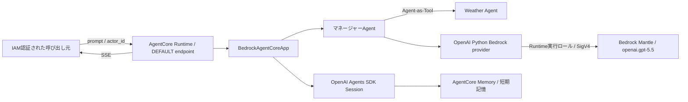

# Spec: OpenAI Agents SDK AgentのAgentCore Runtime基盤

## 概要

OpenAI Agents SDKで構成したマネージャーAgentとWeather Agentを、Amazon Bedrock AgentCore Runtime上で動作させるPoC基盤を提供する。モデル呼び出しにはAmazon BedrockのOpenAI互換APIを使用し、Runtime実行ロールのSigV4認証、SSEストリーミング、OpenAI Agents SDK SessionとAgentCore Memoryによる会話履歴保持に対応する。Agentアプリケーションと関連AWSリソースは、DockerおよびAWS CDKで再現可能に構築できるものとする。



## 背景

現状のリポジトリには最小構成のCDKスタックと、モックデータを返す既存のWeather Lambda Toolが存在するが、OpenAI Agents SDKのAgentアプリケーション、AgentCore Runtime、AgentCore Memory、Agent用コンテナは未実装である。

今後、処理時間の長いスペシャリストAgentを追加できる基盤とするため、マネージャーAgentが会話を所有するAgents-as-Tools構成、逐次応答、永続的な会話履歴、CDKによる再現可能なデプロイ構成が必要である。

モデル接続と認証方式は`docs/ADR/adr-0001-use-bedrock-mantle-with-runtime-role-sigv4.md`、マルチエージェント方式は`docs/ADR/adr-0002-use-agents-as-tools.md`の決定に従う。

## 目的

- OpenAI Agents SDKのマルチエージェントをAgentCore Runtimeで実行可能にする。
- 長時間処理へ拡張できるSSEストリーミング契約を提供する。
- 同一利用者・同一セッションの会話履歴をAgentCore Memoryで保持し、異なる利用者やセッション間で分離する。
- API keyや静的AWS認証情報を使用せず、Runtime実行ロールでモデルを呼び出す。
- Agentアプリケーションと関連AWSリソースを、ローカルで検証可能かつCDKでデプロイ可能な状態にする。

## スコープ

本featureは複数領域にまたがる新規変更であり、対象領域は次のとおりとする。

- `agents/`: OpenAI Agents SDKのAgentアプリケーション、AgentCore Runtime用エントリーポイント、依存関係、Docker定義
- `agent_core_cdk_stack/`: AgentCore Runtime、AgentCore Memory、IAM、コンテナアセットなどのAWS CDK定義
- `tests/`: Agent、入力契約、ストリーミング、セッション、CDKテンプレートの自動テスト
- `app.py`: `us-east-2`へデプロイするCDKアプリケーションの構成

## 対象外

- 実在する天気情報を取得するToolの実装および既存`lambda_tools/weather`との統合
- 既存`lambda_tools/weather`のモック実装やツールスキーマの変更
- AgentCore ObservabilityおよびOpenAI Agents SDKのトレース出力
- AgentCore Memoryの長期記憶戦略と、セッションをまたぐユーザー属性・嗜好の利用
- 本番環境向けの最小権限IAM、OAuth/JWT認証、AgentCore Identity、閉域ネットワーク、監視・アラーム、リリース運用
- 名前付きRuntime endpointの作成
- MMDSv2のデプロイ後確認および条件付きカスタムリソース対応
- ユーザーの明示的な依頼を伴わないAWS環境へのデプロイ、更新、Runtime呼び出し

対象外の項目は`specs/backlog/backlog.md`で管理する。

## ユーザーストーリー / 利用シナリオ

- IAMで認証された呼び出し元として、質問と利用者識別子を送信し、生成途中から回答を受け取りたい。
- 同じ利用者識別子とRuntimeセッションIDで再度呼び出す利用者として、過去の会話を踏まえた応答を受け取りたい。
- 天気について質問する利用者として、取得されていない架空の天気ではなく、現在は天気取得機能を利用できないという正確な回答を受け取りたい。
- 開発者として、Agentアプリケーションをローカルコンテナで検証し、同じ成果物をAWS CDKからAgentCore Runtimeへデプロイしたい。
- 運用者として、PoCスタックを削除したときにPoC用の会話履歴も残存しないようにしたい。

## 機能要件

### FR-001: マルチエージェント構成

- システムは、利用者との対話、スペシャリストAgentの選択、最終回答を担当するマネージャーAgentを持たなければならない。
- システムは、Weather AgentをスペシャリストAgentとして持たなければならない。
- マネージャーAgentはWeather AgentをAgent-as-Toolとして利用し、Handoffを使用してはならない。
- Weather Agentは実データを取得する天気取得Toolを持たず、天気取得機能が未実装であることを回答しなければならない。
- マネージャーAgentとWeather Agentは、取得していない天気情報や架空の天気を回答してはならない。
- AgentのinstructionsおよびAgent-as-Toolの説明は、原則として日本語でなければならない。

### FR-002: 呼び出し入力

- AgentCore Runtimeへの入力はJSONオブジェクトとし、文字列型の`prompt`と`actor_id`を必須としなければならない。
- `actor_id`はAgentCore Memoryの`actorId`として使用可能な形式と長さを満たさなければならない。
- `prompt`または`actor_id`が欠落、空文字、文字列以外、または許容されない形式の場合、システムはモデルを呼び出さず、ストリーミング開始前に4xx系の入力エラーを返さなければならない。
- AgentCore Runtimeの`runtimeSessionId`は入力JSONには含めず、Runtimeが提供する実行コンテキストから取得しなければならない。

入力例:

```json
{
  "prompt": "今日の天気を教えてください。",
  "actor_id": "poc-user-001"
}
```

### FR-003: ストリーミング出力

- 正常なAgent呼び出しは、最終応答を一括返却せず、SSEで逐次応答しなければならない。
- 各SSEの`data`はJSONオブジェクトでなければならない。
- ストリームは少なくとも次のイベント型を持たなければならない。

| `type` | 必須フィールド | 意味 |
| --- | --- | --- |
| `text_delta` | `delta` | 生成されたテキスト差分 |
| `completed` | なし | 正常完了。正常なストリームの末尾で1回だけ返す |
| `error` | `message` | ストリーミング開始後に処理を継続できない場合の安全なエラー |

- `error.message`には、内部例外、スタックトレース、認証情報を含めてはならない。
- `error`を返したストリームは`completed`を返さずに終了しなければならない。
- Agent実行が正常に完了するまでストリーミングイベントを消費し、セッション処理を完了させなければならない。

### FR-004: モデル接続

- すべてのAgentは、`us-east-2`で利用するモデルID`openai.gpt-5.5`を使用しなければならない。
- モデル呼び出しにはAmazon BedrockのOpenAI互換Responses APIを使用しなければならない。
- モデル呼び出しはAgentCore Runtime実行ロールの一時AWS認証情報を使用し、SigV4で認証しなければならない。
- システムは`OPENAI_API_KEY`、Amazon Bedrock API key、静的AWSアクセスキーを必要としてはならない。

### FR-005: セッションと会話履歴

- Agent実行はOpenAI Agents SDKのSessionインターフェースを使用しなければならない。
- Sessionの会話履歴はAgentCore Memoryの短期記憶へ永続化し、別の履歴ストアへ二重保存してはならない。
- 入力の`actor_id`をAgentCore Memoryの`actorId`、Runtimeの実行コンテキストから取得したセッションIDをAgentCore Memoryの`sessionId`へ対応付けなければならない。
- 同じ`actorId`と`sessionId`による後続の呼び出しは、以前に正常完了した会話履歴を復元できなければならない。
- 異なる`actorId`または`sessionId`の間で会話履歴が混在してはならない。
- ストリーミングが正常完了した場合、利用者入力とAgentの最終応答を次回の呼び出しで復元可能にしなければならない。
- ストリーミング中断またはモデル呼び出し失敗による不完全なAgent応答を、正常完了した会話履歴として確定してはならない。

### FR-006: AgentCore Runtime

- AgentアプリケーションはAgentCore RuntimeのHTTPプロトコルで動作しなければならない。
- AgentCore RuntimeはIAMによるインバウンド認証を要求し、Publicネットワークを使用しなければならない。
- Runtime endpointは`DEFAULT`のみを使用しなければならない。
- Agentアプリケーションはポート`8080`で待ち受け、`/invocations`と`/ping`を提供しなければならない。
- `/invocations`はFR-002およびFR-003の入出力契約を満たさなければならない。
- `/ping`はAgentCore Runtimeがコンテナの正常性を判定できる応答を返さなければならない。

### FR-007: AgentCore Memory

- AgentCore Memoryは短期記憶のみを使用し、長期記憶戦略を持ってはならない。
- 短期記憶の保存期間は30日でなければならない。
- 暗号化にはAWS所有キーを使用し、本featureではカスタマー管理KMSキーを作成してはならない。
- PoCスタックの削除時にMemoryリソースも削除されなければならない。
- Runtime実行ロールは、対象Memoryの会話履歴を読み書きするために必要な権限を持たなければならない。

### FR-008: CDKによる構成管理

- AgentCore Runtime、AgentCore Memory、Runtime実行ロール、必要な権限、AgentコンテナアセットをAWS CDKで定義しなければならない。
- CDKスタックのデプロイ先は`us-east-2`に固定し、異なるリージョンへのデプロイを許容してはならない。
- AgentCore RuntimeはLinux ARM64のコンテナイメージを使用しなければならない。
- Runtime実行ロールには、PoC用途としてAWS管理ポリシー`AmazonBedrockMantleInferenceAccess`を付与しなければならない。
- Runtimeには少なくとも次の非秘密環境変数を設定しなければならない。

| 環境変数 | 値または内容 |
| --- | --- |
| `AWS_REGION` | `us-east-2` |
| `BEDROCK_OPENAI_MODEL_ID` | `openai.gpt-5.5` |
| `OPENAI_AGENTS_DISABLE_TRACING` | `1` |
| Memory IDを表す環境変数 | 作成したAgentCore MemoryのID |

- AgentCore Runtime、AgentCore Memory、IAMなどのリソース定義は責務ごとのConstructに分割し、既存スタックへ直接集約してはならない。

### FR-009: Agentコンテナと依存関係

- Agentアプリケーションは`agents/`配下に配置し、Dockerビルド可能でなければならない。
- `agents/`配下のPython依存関係は`requirements.txt`で管理しなければならない。
- Agentコンテナは、OpenAI Agents SDK、Amazon Bedrockプロバイダーを含むOpenAI Python、`bedrock-agentcore`を利用可能でなければならない。
- Agentコンテナの依存バージョンは互換性を確認した組み合わせに固定しなければならない。
- リポジトリ側のCDKアプリケーションとテストの依存関係およびコマンド実行には、既存どおり`uv`を使用しなければならない。

## 非機能要件

### セキュリティ

- RuntimeおよびコンテナへAPI key、静的AWS認証情報、その他のシークレットを埋め込んではならない。
- モデルアクセスとMemoryアクセスはRuntime実行ロールへ集約しなければならない。
- 入力値を検証し、不正な入力によってモデルまたはMemoryを呼び出してはならない。
- 利用者およびセッションごとの会話履歴を分離しなければならない。
- エラーレスポンスとログへ認証情報、内部例外、スタックトレースを出力してはならない。

### 応答性・信頼性

- 生成済みのテキスト差分は、最終回答の完了を待たずにSSEへ送出しなければならない。
- 正常終了、異常終了、クライアント切断を区別し、不完全な応答を正常完了として扱ってはならない。
- 同一セッションの正常完了済み会話履歴は、Runtimeの個別実行をまたいで復元可能でなければならない。
- 本PoCでは具体的な応答時間、同時実行数、可用性SLAを定めない。

### 保守性

- Agent、Runtime、Memory、IAM、テストの責務を分離し、将来スペシャリストAgentを追加できる構成でなければならない。
- モデルID、リージョン、Memory IDなど環境依存の値をAgentコードへ直接埋め込んではならない。
- Agent向け依存関係とCDK向け依存関係を、それぞれ`requirements.txt`と`uv`で独立して管理しなければならない。

### 監視・トレーシング

- OpenAI Agents SDKの既定トレーシングは無効でなければならない。
- AgentCore Runtimeの高度なトレーシングは無効でなければならない。
- AgentCore Observability、詳細ログ、メトリクス、アラームは本featureの完了条件に含めない。

## 受け入れ条件

### AC-001: CDK構成

- `cdk synth`または同等のローカルsynthが成功する。
- 生成されたCloudFormationテンプレートに、AgentCore Runtime、AgentCore Memory、Runtime実行ロール、必要なIAM設定が含まれる。
- RuntimeがHTTP、IAMインバウンド認証、Publicネットワーク、`DEFAULT` endpoint、Linux ARM64、トレーシング無効の要件を満たすことを確認できる。
- Memoryが短期記憶30日、長期記憶戦略なし、AWS所有キー、スタック削除時削除の要件を満たすことを確認できる。
- CDKスタックのデプロイ先が`us-east-2`に固定されていることを確認できる。

### AC-002: モデル接続と認証

- Agentのモデル設定が`openai.gpt-5.5`とAmazon BedrockのOpenAI互換Responses APIを使用することを自動テストまたは設定検査で確認できる。
- Agentコンテナ、Runtime環境変数、CDKテンプレートにAPI keyまたは静的AWS認証情報が含まれない。
- Runtime実行ロールに`AmazonBedrockMantleInferenceAccess`が付与されていることをCDKテストで確認できる。

### AC-003: マルチエージェント

- Weather AgentがAgent-as-ToolとしてマネージャーAgentへ登録され、Handoffが設定されていないことをテストで確認できる。
- 天気に関する入力に対し、Weather Agentが天気取得機能の未実装を回答し、取得していない天気情報を生成しないことをテストで確認できる。
- マネージャーAgentが利用者向けの最終回答を所有することをテストで確認できる。

### AC-004: 入力契約

- 有効な`prompt`と`actor_id`を含む入力がAgent実行へ渡される。
- `prompt`または`actor_id`の欠落、空文字、型不正、形式不正ごとに、モデルを呼び出さず4xx系エラーを返すことをテストで確認できる。
- Runtimeの実行コンテキストのセッションIDがMemoryの`sessionId`へ使用されることを確認できる。

### AC-005: SSEストリーミング

- 複数の`text_delta`イベントを完了前に逐次受信できる。
- 正常時はストリーム末尾に`completed`が1回だけ返る。
- ストリーミング開始後の失敗時は安全な`error`イベントを返し、`completed`を返さずに終了する。
- SSEの各`data`が仕様どおりのJSONとして解析できる。

### AC-006: 会話履歴

- 同じ`actorId`と`sessionId`で複数回実行した場合、以前に正常完了した会話を踏まえた入力履歴がAgentへ渡される。
- `actorId`または`sessionId`が異なる場合、ほかの会話履歴がAgentへ渡されない。
- 正常完了した利用者入力と最終応答がAgentCore Memoryへ保存される。
- 中断または失敗した不完全なAgent応答が、正常完了した会話履歴として保存されない。

### AC-007: コンテナ

- AgentコンテナをLinux ARM64向けにビルドできる。
- ローカル起動したコンテナのポート`8080`で`/ping`が正常性を返す。
- ローカル起動したコンテナの`/invocations`が入力検証とSSE出力契約を満たす。
- コンテナ内のPython依存関係を`agents/requirements.txt`から再現できる。

### AC-008: 自動検証とAWS検証

- Agent、入力検証、ストリーミング、Session、Weather Agentの自動テストが成功する。
- CDKリソースと主要プロパティを検査する自動テストが成功する。
- `uv run pytest`および`uv run python app.py`または`cdk synth`が成功する。
- AWS環境での`cdk deploy`、Runtime呼び出し、SigV4認証、Memory統合のスモークテストは、ユーザーが明示的に依頼した場合に限って実施する。
- AWS検証を実施していない場合は、未実施であることと理由を完了報告へ明記する。

## 制約

- 本featureはPoC用途であり、本番運用要件を満たすものではない。
- AWSリージョンは`us-east-2`、モデルIDは`openai.gpt-5.5`に限定する。
- AgentCore Runtimeが要求するLinux ARM64、ポート`8080`、HTTPプロトコルのコンテナ契約を満たす必要がある。
- PoCではAWS管理ポリシー`AmazonBedrockMantleInferenceAccess`、IAMインバウンド認証、Publicネットワーク、`DEFAULT` endpoint、AWS所有のMemory暗号化キーを許容する。
- AgentCore Memoryの保存期間は30日とし、PoCスタック削除時にMemoryも削除する。
- Agentコンテナの依存関係管理には`requirements.txt`、既存CDKプロジェクトとテストには`uv`を使用する。
- 既存の`lambda_tools/weather`はモック値を返すため、本featureのWeather Agentから呼び出してはならない。
- AWS環境を変更する操作には、ユーザーの明示的な依頼が必要である。

## 依存関係

- OpenAI Agents SDK
- Amazon Bedrockプロバイダーを含むOpenAI Python
- `bedrock-agentcore`のRuntimeおよびMemory連携機能
- AWS CDK `aws_bedrockagentcore` Construct Library
- AgentCore Runtime、AgentCore Memory、Amazon Bedrock Mantle、IAM
- 既存CDKエントリーポイント`app.py`とスタック`agent_core_cdk_stack/agent_core_stack.py`
- 既存テスト領域`tests/`
- `docs/ADR/adr-0001-use-bedrock-mantle-with-runtime-role-sigv4.md`
- `docs/ADR/adr-0002-use-agents-as-tools.md`
- 後続要件を管理する`specs/backlog/backlog.md`

既存の`lambda_tools/weather/handler.py`と`lambda_tools/weather/tools.json`は参照対象だが、本featureでは変更・統合しない。

## 未確定事項 / 要確認事項

現時点で、仕様レビューまたは実装計画の作成を妨げる未確定事項はない。ライブラリの具体的なバージョン、OpenAI Agents SDK SessionとAgentCore Memoryの接続方法、Constructの分割、テストダブルなどの実装詳細は、仕様を追加・変更せず`plan.md`で決定する。
