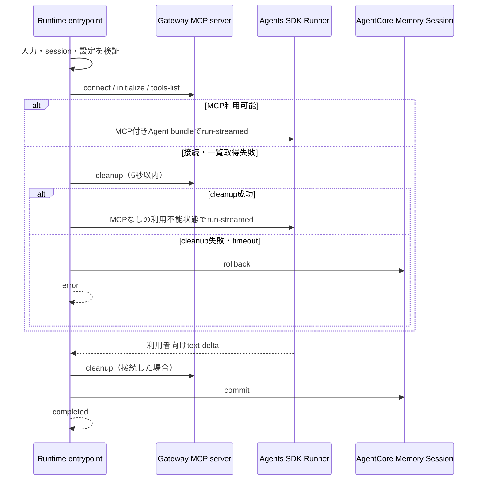

# Plan: AgentCore Gateway Weather／TimeモックTool統合

## 実装方針

本featureは、Lambda Tool、AWS CDK、IAM、AgentCore Runtime上のAgentアプリケーション、テストおよび文書にまたがる複数領域の変更として実装する。

承認済みの`specs.md`とADR-0003に従い、既存スタックへWeather／TimeモックTool専用のAgentCore Gateway、LambdaおよびLambda GatewayTargetを追加する。Weather AgentはRuntime実行ロールのAWS認証情報で署名したMCP接続を通じて`get_weather`と`get_time`を利用し、マネージャーAgentは既存どおりWeather AgentだけをAgent-as-Toolとして呼び出して最終回答を所有する。

主な実装方針は次のとおりとする。

- Lambda、Gateway、GatewayTargetを責務別のConstructへ分け、既存の`AgentCoreStack`ではMemory、Lambda、Gateway、GatewayTarget、Runtimeの依存関係だけを組み合わせる。
- `lambda_tools/weather/tools.json`をツール定義の正本としてsynth時に読み込み、AWS CDKのL2型へ変換してGatewayTargetのインラインスキーマへ設定する。
- Gateway URLとGatewayTarget名を、CDKからRuntime環境変数へ非秘密設定として渡す。生成されたGateway ID、URLおよびAWSアカウントIDをAgentコードへ埋め込まない。
- MCPのSigV4 transportにはAWSが公開するOSSの`mcp-proxy-for-aws`を使用し、独自の署名アルゴリズムを実装しない。
- MCP serverとAgent bundleはRuntime呼び出しごとに生成する。接続、`tools/list`、Agent実行、接続終了を同一の非同期タスク内で完結させ、正常終了、失敗およびキャンセルのすべてで接続を解放する。モデルだけは既存どおり遅延生成後に再利用する。
- Gateway接続またはToolが利用できない場合は、例外詳細をモデルや利用者へ渡さない。部分接続を安全にcleanupできた場合はMCP Toolを持たない利用不能状態のWeather Agentへ切り替え、cleanupできない場合はfail-closedとする。Weather AgentとマネージャーAgentは固定値で代替せず、取得不能を日本語で回答する。
- 既存のHTTP／SSE、Memory、モデル接続およびAgent-as-Toolの契約は維持し、追加するテストダブルによって実モデル、実Gateway、実Lambdaを呼び出さずに正常系と障害系を検証する。

## 変更対象

### Lambda Tool

| パス | 変更内容 |
| --- | --- |
| `lambda_tools/weather/handler.py` | Gateway context、入力およびTool名を型安全に検証し、正常時は既存の固定モック契約、異常時は正常フィールドを含まない固定の`error`結果を返す。未知Tool応答から受信Tool名を除き、内部値を利用者側へ返さない |
| `lambda_tools/weather/tools.json` | ツールスキーマの正本としてCDKとテストから利用する。現在の2 Tool、入力名、必須指定およびモック説明は仕様と一致しているため、契約内容は変更しない |

### AWS CDKとIAM

| パス | 変更内容 |
| --- | --- |
| `agent_core_cdk_stack/constructs/weather_time_mock_lambda_construct.py` | Weather／TimeモックLambda、専用実行ロール、専用LogGroupおよびLambdaコードassetを定義する新規Construct |
| `agent_core_cdk_stack/constructs/agent_core_weather_gateway_construct.py` | 条件付き信頼ポリシーを持つGateway実行ロールと、IAM受信認証・MCP protocolの専用Gatewayを定義する新規Construct |
| `agent_core_cdk_stack/constructs/weather_time_gateway_target_construct.py` | `tools.json`の読込とL2型変換、Lambda GatewayTarget、`GATEWAY_IAM_ROLE`およびGatewayからLambdaへの権限・作成順を定義する新規Construct |
| `agent_core_cdk_stack/constructs/agent_core_runtime_construct.py` | Gateway参照とGatewayTarget名を受け取り、Runtimeへ非秘密環境変数を渡し、Runtimeロールへ対象Gatewayだけの`InvokeGateway`を付与する |
| `agent_core_cdk_stack/agent_core_stack.py` | Memory、Lambda、Gateway、GatewayTarget、Runtimeの順でConstructを生成し、参照と依存関係を接続する |

### Agentアプリケーションと依存関係

| パス | 変更内容 |
| --- | --- |
| `agents/src/agent_app/gateway_tools.py` | AgentCore Gateway向けSigV4 MCP server、Tool allowlist、結果検証、安全なToolエラー変換および生成factoryを実装する新規モジュール |
| `agents/src/agent_app/config.py` | Gateway URLとGatewayTarget名を必須の非秘密設定として追加し、stream開始前に形式を検証する |
| `agents/src/agent_app/agent_factory.py` | Weather AgentだけへMCP serverを登録し、天気・時刻のルーティング、モック明示および利用不能時のinstructionsを定義する。マネージャーAgentの直接ToolはWeather Agentだけに維持する |
| `agents/src/agent_app/runtime.py` | Managerのプロセス単位キャッシュをリクエスト単位のAgent生成へ変更し、モデル、MCP factoryおよびAgent factoryをストリーミングサービスへ注入する。既存の入力・設定エラーのHTTP境界は維持する |
| `agents/src/agent_app/service.py` | MCP接続の開始、Tool一覧の確認、Agent実行、接続終了、Memory確定の順序と、失敗・キャンセル時のcleanup／rollbackを制御する |
| `agents/requirements.txt` | Runtimeで直接利用する`mcp-proxy-for-aws`とMCP clientを完全一致バージョンで追加する |
| `pyproject.toml` | ローカルテスト環境にもRuntimeと同じ完全一致依存を追加する |
| `uv.lock` | `uv`で依存解決した結果を反映する。手作業では編集しない |

### テスト

| パス | 変更内容 |
| --- | --- |
| `tests/unit/test_weather_tool_handler.py` | スキーマ、正常な2 Tool、入力不正、metadata不正、未知Tool、エラー契約およびJSON互換性を検証する新規テスト |
| `tests/unit/test_open_ai_agent_core_base_stack.py` | 既存Memory／Runtime検証を維持し、Runtime環境変数と対象Gatewayへの権限を追加検証する |
| `tests/unit/test_weather_tool_gateway_stack.py` | Gateway、Lambda、GatewayTarget、インラインスキーマ、IAM、依存関係、Lambda設定およびasset内容を検証する新規CDKテスト |
| `tests/unit/agent/test_gateway_tools.py` | SigV4 transportの設定、Tool allowlist、Tool一覧キャッシュ、正常結果検証、安全なエラー変換およびMCP server factoryを検証する新規テスト |
| `tests/unit/agent/test_config.py` | Gateway URL／Target名の正常値、欠落および不正値を追加検証する |
| `tests/unit/agent/test_agent_factory.py` | Weather AgentだけがMCP serverを持つこと、Managerの直接Tool、Handoffなし、天気・時刻・モック・障害時instructionsを検証する |
| `tests/unit/agent/test_runtime.py` | モデルの再利用、Agentのリクエスト単位生成、MCP関連依存注入および設定不正時の既存HTTP 5xx契約を検証する |
| `tests/unit/agent/test_service.py` | connect／list／run／cleanup／Memory commitの順序と、接続失敗、Tool失敗、cleanup失敗、通常例外、キャンセル時の結果を検証する |
| `tests/unit/agent/test_dependencies.py` | Runtimeと開発環境の依存バージョン一致、追加する公開APIのimportおよびMCP clientの最新protocol versionが`2025-11-25`であることを検証する |
| `tests/integration/agent/test_multi_agent.py` | 決定的ModelとFake MCP serverで、天気・時刻のManager→Weather→MCP Tool→Weather→Manager経路、モック明示および障害時の取得不能を検証する |
| `tests/integration/agent/test_runtime_http.py` | Gateway統合後も既存HTTP／SSE契約が変わらないことを検証する |
| `tests/container/harness_main.py`、`tests/container/test_harness.py` | 更新後の依存注入境界を使用し、本番と同じアプリケーションfactoryおよびコンテナ起動契約を維持する |

### ドキュメント

| パス | 変更内容 |
| --- | --- |
| `README.md` | 専用GatewayとWeather／TimeモックToolを含むPoC概要、関連文書への導線および主要なローカル検証コマンドを更新する |
| `docs/Agent/README.md` | Agent構成、Gateway設定、SigV4 MCP接続、リクエスト単位のライフサイクル、モック制約、安全な障害時動作および検証手順を更新する |
| `docs/CDK/README.md` | Gateway、Lambda、GatewayTarget、IAM境界、リソース名、synth結果の確認点および条件付きAWS E2E手順を更新する |
| `specs/backlog/backlog.md` | 本featureが実データを提供しないことと、実天気／実時刻データ取得が後続要件であることを、承認済み仕様とADR-0002の参照に合わせて記録する |
| `docs/ADR/adr-0003-use-dedicated-agentcore-gateway-for-weather-tools.md` | 決定内容は変更せず、`Related plan`を本ファイルへ更新する |

## 変更しないもの

- `specs/05-agent-tool-weather-01/spec-draft.md`、`specs/05-agent-tool-weather-01/specs.md`および`specs/05-agent-tool-weather-01/prompts.md`は参照のみとし、この実装計画では変更しない。
- `docs/ADR/adr-0001-use-bedrock-mantle-with-runtime-role-sigv4.md`と`docs/ADR/adr-0002-use-agents-as-tools.md`の既存の設計判断は変更しない。ADR-0002のTool未実装時の振る舞いは、ADR-0003に記載済みのとおり本featureの固定モックTool利用へ置き換わる。
- AgentCore Memoryのリソース設定、Sessionの保存形式、commit／rollback方式およびactor／session分離は変更しない。
- Runtimeの`POST /invocations`入力、`GET /ping`、HTTP 4xx／5xx境界、SSEイベント形式、モデルID、Bedrock Mantle接続、IAM受信認証、Public network、トレース無効化および`DEFAULT` endpointは変更しない。
- ManagerとWeather Agentの名称、Agent-as-Tool、Managerによる会話・最終回答の所有およびHandoffを使わない構成は変更しない。
- 外部の天気／時刻サービス、システム時計、API key、OAuth、Secrets Manager、静的AWS認証情報、共有Gateway、追加GatewayTarget、Policy in AgentCore、Interceptor、VPCおよびPrivateLinkは追加しない。
- AgentCore Observability、メトリクス、アラーム、SLA、クォータおよびコスト予算などの本番運用対応は実装しない。
- ユーザーから明示的に依頼されない限り、`cdk deploy`、AWSリソースの作成・更新・削除、実Gateway／Lambda／Runtimeの呼び出しは実行しない。
- `cdk.out/`、`.cdk.staging/`、`__pycache__/`、`.pytest_cache/`などの生成物、および本featureと無関係な既存の未コミットファイルは変更またはコミットしない。

## 技術方針

### 1. リソース名とRuntime設定名

公開Tool名の接頭辞を安定させるため、次の物理名と設定名を固定する。IAM Roleの物理名は環境間の衝突を避けるため固定せず、CDKに生成を任せる。

| 対象 | 値 |
| --- | --- |
| Gateway名 | `OpenAiWeatherGateway` |
| GatewayTarget名 | `WeatherTimeMock` |
| Lambda関数名 | `OpenAiWeatherTimeMock` |
| 天気ToolのMCP公開名 | `WeatherTimeMock___get_weather` |
| 時刻ToolのMCP公開名 | `WeatherTimeMock___get_time` |
| Gateway URL環境変数 | `AGENTCORE_GATEWAY_URL` |
| GatewayTarget名環境変数 | `AGENTCORE_GATEWAY_TARGET_NAME` |

Gateway URLには`gateway.gateway_url`のCloudFormation参照を使用する。GatewayTarget名は同一のCDK定数からTargetとRuntime環境変数へ渡し、CDKとAgentの接頭辞が別々に定義されないようにする。

本PoCは同一AWS account／regionにこのstackを1つだけデプロイする前提とする。固定物理名により同一account／regionへ複数stackを並行デプロイする必要が生じた場合は、実装でsuffixを推測せず、デプロイ前に命名要件とTool名互換性を仕様へ戻して決定する。

### 2. Lambdaハンドラーとツールスキーマ

- Lambdaハンドラーは`event`、`context.client_context`、`custom`および`bedrockAgentCoreToolName`を順に検証する。Mappingでない値、空のTool名、`___`区切りを正しく持たないTool名はmetadata不正として扱う。
- `event`がMappingでない場合、必須入力がない場合、文字列でない場合または空白だけの場合は、固定の安全な`error`だけを返す。
- 正常時は、入力値を受け取ったまま、仕様で固定された`weather`または`local_time`と`data_type="mock"`を返す。外部I/Oやシステム時刻の参照は追加しない。
- 未知Toolでは受信Tool名やGatewayTarget名を返さず、固定の`error`だけを返す。
- `tools.json`は現在の`type`、`description`、`properties`、`required`で入力の名前・型・必須性を表現する。空白だけの入力に対する意味的制約はLambdaハンドラーで強制し、自動テストで固定する。
- CDK側ではJSONを直接`ToolSchema.from_inline()`へ渡さない。固定済み`aws-cdk-lib`のL2 APIに合わせ、JSONのTool定義を`ToolDefinition`、`SchemaDefinition`および`SchemaDefinitionType`へ再帰的に変換する。現在サポートするJSON Schema形状以外を検出した場合は、synth時に安全に失敗させる。
- Lambdaコードassetから`tools.json`、Pythonキャッシュおよび`.DS_Store`を除外する。CDK bootstrapがLambdaコードassetをS3経由で配布することと、GatewayTargetのツールスキーマを実行時にS3参照しないことは区別し、後者をCloudFormationテストで確認する。

### 3. Lambda実行環境

- runtimeはPython 3.12、architectureはARM64、memoryは128 MB、timeoutは5秒とする。固定JSONを返すだけで外部I/Oと追加packageを持たないため、このPoCに必要な最小構成とする。
- `/aws/lambda/OpenAiWeatherTimeMock`のLogGroupを明示作成し、保持期間を7日、RemovalPolicyを`DESTROY`とする。
- Lambda実行ロールの信頼先は`lambda.amazonaws.com`だけとし、対象LogGroupの`logs:CreateLogStream`と`logs:PutLogEvents`だけを付与する。`AWSLambdaBasicExecutionRole`は使用せず、`logs:CreateLogGroup`のワイルドカード権限も付与しない。
- Lambdaへ環境変数、Secretまたは外部ネットワーク設定を追加しない。

### 4. Gateway、GatewayTargetおよびIAM

- `agentcore.Gateway`を`GatewayAuthorizer.using_aws_iam()`と`role=gateway_execution_role`で作成し、条件付き信頼ポリシーと限定権限を持つ専用Gateway実行ロールを明示的に関連付ける。MCP protocolの`supported_versions`は`MCPProtocolVersion.of("2025-11-25")`と`MCPProtocolVersion.MCP_2025_03_26`の2つを明示する。
- `search_type`とGateway instructionsは追加せず、Gatewayの例外レベルも省略してサニタイズされた既定動作を使用する。`DEBUG`は設定しない。
- Gateway実行ロールの信頼ポリシーは、Principalを`bedrock-agentcore.amazonaws.com`、`aws:SourceAccount`を現在のstack account、`aws:SourceArn`を現在のpartition・region・accountにある`gateway/OpenAiWeatherGateway-*`へ限定する。
- Gateway自身がGateway実行ロールを参照するため、信頼ポリシーから`gateway.gateway_arn`を直接参照しない。固定Gateway名からARN patternを組み立て、CloudFormationの循環依存を避けながら対象Gateway名へ限定する。
- GatewayTargetは`GatewayTarget.for_lambda()`で作成し、credential providerへ`GatewayCredentialProvider.from_iam_role()`を明示して`GATEWAY_IAM_ROLE`を固定する。
- Gateway実行ロールへの`lambda:InvokeFunction`は対象Lambda ARNとそのversion／aliasだけへ限定する。grantをGatewayTargetより前に適用して、Target作成時に権限が存在する依存関係をCloudFormationへ反映する。
- RuntimeロールへのGateway関連権限は`gateway.grant_invoke(runtime.role)`を使用し、対象Gateway ARNへの`bedrock-agentcore:InvokeGateway`だけを追加する。既存のモデル管理ポリシーとMemory grantは維持する。
- Gateway実行ロールへS3、Secrets Manager、KMSまたは他Lambdaの権限を追加しない。

### 5. 設定検証と依存バージョン

- `AppConfig`へ`gateway_url`と`gateway_target_name`を追加する。
- Gateway URLはHTTPS、userinfo／query／fragmentなし、`us-east-2`のAgentCore Gateway host、`/mcp` pathであることを検証する。Target名はGatewayTargetの許容文字と長さに合うことを検証する。
- Gateway設定の欠落または不正は、既存のconfig遅延読込でAgent実行前に検出し、stream開始前の安全なHTTP 5xxへ変換する。設定値そのものを例外、レスポンスまたはログへ含めない。
- 既存の完全一致バージョンは維持し、`mcp-proxy-for-aws==1.6.4`と`mcp==1.29.0`を`agents/requirements.txt`と`pyproject.toml`のdev groupへ直接追加する。
- `mcp==1.29.0`を直接固定し、MCP clientが`2025-11-25`を提示する動作を依存更新で意図せず変化させない。
- `mcp-proxy-for-aws`は標準のboto3認証情報チェーンとSigV4 transportを提供するため採用する。profile名、アクセスキー、Secret keyまたはSession tokenをアプリケーションから渡さず、Runtime実行ロールの一時認証情報を使用する。
- 依存追加は`uv`で行い、Python 3.12での解決、主要import、Linux ARM64コンテナへの導入を実装の早い段階で確認する。

### 6. MCP server、Tool制御および結果検証

- `AgentCoreGatewayMCPServer`はOpenAI Agents SDK 0.19.4の`MCPServerStreamableHttp`を拡張し、`create_streams()`だけをAWS署名済みの`aws_iam_streamablehttp_client()`へ差し替える。server名はURLを含まない固定値`AgentCoreWeatherGateway`、`use_structured_content=False`を明示し、Tool結果の重複したモデル入力を避ける。
- SigV4のserviceは`bedrock-agentcore`、regionは`AppConfig.aws_region`、endpointは`AppConfig.gateway_url`を使用する。静的credentialsまたはBearer tokenは設定しない。
- MCP transport timeoutは30秒、MCP ClientSession timeoutは10秒、cleanup timeoutは5秒、`terminate_on_close=True`、`max_retry_attempts=0`とする。Lambda timeoutが5秒であり、本PoCでは同一呼び出し内の自動再試行より安全な取得不能を優先する。次のRuntime呼び出しを再試行境界とする。
- `cache_tools_list=True`とし、各Runtime呼び出しで接続直後に一度だけ`tools/list`を実行する。接続は呼び出し終了時に破棄するため、Tool一覧をプロセス全体で無期限に保持しない。
- `AGENTCORE_GATEWAY_TARGET_NAME`から組み立てた2つの完全一致Tool名だけをallowlistへ設定し、Gatewayが追加で公開する組み込みToolをWeather Agentへ登録しない。
- 初回`tools/list`で2つのToolが揃わない場合はGateway利用不能として扱い、片方だけを利用可能にして処理を続けない。
- `CallToolResult`は次の順で正規化する。最初に`isError=true`を利用不能とする。`structuredContent`がMappingならそれを正本とし、存在しない場合は`content`が単一のTextContentであることを確認して、そのtextをJSON objectへdecodeする。両方を解釈できる場合は一致を要求し、不一致、複数content、非text、非MappingまたはJSON不正は利用不能とする。
- transport例外、Tool呼び出し例外、Lambda失敗および上記の形式不正は、例外本文を含まない固定の日本語Toolエラーへ変換する。
- 正規化したMappingに`error`がある場合、`data_type="mock"`がない場合またはToolごとの正常フィールドがない場合も、正常な天気／時刻として扱わず同じ利用不能結果へ変換する。
- 正常結果は変更せずWeather Agentへ渡し、Weather Agentが`data_type="mock"`を根拠にモックであることを明示できるようにする。

### 7. MCP接続ライフサイクルと失敗境界

MCP serverをRuntime process全体で共有せず、各`/invocations`のasync iterator内で一つ生成する。接続の作成と終了を同一タスクで行い、並行session間でMCP session、Tool cacheまたは障害状態を共有しない。

処理順序は次のとおりとする。

- connectまたは初回`tools/list`が失敗した場合は、部分的に作成された接続を5秒以内にcleanupする。cleanupが成功した場合だけMCP serverを持たないWeather Agentへ切り替え、Weather AgentとManagerが取得不能を最終回答とする。cleanupが失敗またはtimeoutした場合はfail-closedとし、Sessionをrollbackして安全なSSE `error`で終了し、Memory commitと`completed`を行わない。
- 接続成功後のTool／Lambda失敗はモデルから見える固定の利用不能Tool結果へ変換し、Weather AgentからManagerへ取得不能を返す。
- Runnerの全eventを消費した後、MCP cleanupを完了してからMemoryをcommitし、最後に`completed`を返す。cleanupが完了しない場合はMemoryをcommitせず、既存の安全なSSE `error`で終了する。
- モデル、Runner、SessionまたはMemoryの失敗は既存どおりrollbackし、安全なSSE `error`を返す。
- `asyncio.CancelledError`ではMCP cleanupとSession rollbackを行った後にキャンセルを再送出し、切断済みクライアントへ追加eventを送らない。
- 内部ログには障害段階と安全な分類だけを記録し、認証header、credential、Tool入力、Gateway URL／ARNまたは例外本文を記録しない。`mcp-proxy-for-aws`のloggerを`DEBUG`へ変更せず、固定server名を使用してendpointが間接的にも出力されないようにする。

### 8. Agent構成とinstructions

- `create_agents()`はmodel、利用可能なMCP server群およびGateway利用可否を受け取って、リクエスト単位の`AgentBundle`を生成する。
- Weather Agentの`mcp_servers`だけへGateway MCP serverを登録する。Weather Agentのローカル`tools`と`handoffs`は空、Managerの`mcp_servers`と`handoffs`も空とする。
- Managerの直接`tools`は`weather_agent`だけとし、Agent-as-Tool経由の実行とManagerによる最終回答所有を維持する。
- Weather Agentには、天気質問では`get_weather(location)`、時刻・タイムゾーン・都市の時刻質問では`get_time(timezone)`を使うことを明示する。
- Weather Agentには、正常結果の`data_type`が`mock`であることを確認し、現在の実天気／実時刻ではないテスト用固定値と日本語で明示することを指示する。
- MCPなし、Toolエラー、Lambdaの`error`、形式不正または必要Tool欠落では、固定モック値、システム時計または推測値を使用せず取得不能を返すよう指示する。
- ManagerのinstructionsとWeather Agent-as-Toolのdescriptionを天気と時刻の両方へ拡張し、専門結果のモック明示または取得不能を保持した日本語の最終回答を返すようにする。

### 9. テストダブル

- MCPテストダブルは`connect`、`list_tools`、`call_tool`、`cleanup`の呼び出し回数と順序を記録し、各段階の成功、例外、無期限待機、Tool `isError`、Lambda相当の`error`結果、形式不正およびキャンセルを再現できるようにする。
- Gateway相当の`CallToolResult` fixtureで、`structuredContent`、単一TextContent、両者一致／不一致、複数content、非textおよびJSON不正を検証し、正規化規則を固定する。
- transport factory spyはendpoint、service、region、timeoutおよび静的credentialsが渡されていないことを検証し、実AWSへ接続しない。
- 決定的ModelはManagerのWeather Agent-as-Tool呼び出し、Weather Agentの接頭辞付きMCP Tool呼び出し、WeatherからManagerへの結果返却およびManagerの最終回答を再現する。
- CDKテストはCloudFormation assertionとasset manifest／staged assetの検査を組み合わせる。テストが生成した一時成果物だけを`tmp_path`配下で扱い、リポジトリの`cdk.out/`をソースとして編集しない。

## データや契約への影響

### API、SSEおよびMemory

- `POST /invocations`の入力、`runtimeSessionId`の扱い、`GET /ping`およびHTTP status契約は変更しない。
- SSEの`text_delta`、`completed`、`error`形式と、Memory commit後だけ`completed`を返す契約は変更しない。
- AgentCore Memoryの保存データ、schema version、operationおよびretentionに変更はなく、マイグレーションは不要である。
- MCP接続不能をManagerの安全な最終回答へ変換できた正常なAgent turnは、通常の会話結果としてMemoryへ保存する。Runnerまたはcleanupが致命的に失敗したturnは保存しない。

### Tool契約

| Tool | MCP公開名 | 入力 | 正常出力 | 失敗出力 |
| --- | --- | --- | --- | --- |
| `get_weather` | `WeatherTimeMock___get_weather` | 空白だけでない文字列`location` | `location`、固定`weather`、`data_type="mock"` | 安全な`error`のみ |
| `get_time` | `WeatherTimeMock___get_time` | 空白だけでない文字列`timezone` | `timezone`、固定`local_time`、`data_type="mock"` | 安全な`error`のみ |

Gatewayが提供する組み込みToolが`tools/list`へ現れる可能性は許容するが、Weather Agentへ登録するのは上記2 Toolだけとする。

### 環境変数とSecret

| 変数 | 供給元 | 取扱い |
| --- | --- | --- |
| `AWS_REGION` | 既存CDK Runtime設定 | 非秘密、`us-east-2`固定 |
| `BEDROCK_OPENAI_MODEL_ID` | 既存CDK Runtime設定 | 非秘密、既存値を維持 |
| `OPENAI_AGENTS_DISABLE_TRACING` | 既存CDK Runtime設定 | 非秘密、既存値を維持 |
| `AGENTCORE_MEMORY_ID` | 既存Memory参照 | 非秘密、既存値を維持 |
| `AGENTCORE_GATEWAY_URL` | 新規Gatewayの`GatewayUrl`参照 | 非秘密、コードへ固定しない |
| `AGENTCORE_GATEWAY_TARGET_NAME` | CDKで固定するTarget名 | 非秘密、Tool allowlistの接頭辞に使用 |

API key、Bearer token、静的AWSアクセスキー、Secret keyおよびSession tokenは追加しない。Runtime実行ロールの一時認証情報はAWS標準認証情報チェーンから取得し、設定、レスポンス、ログおよびCloudFormationへ出力しない。

### インフラ、デプロイおよびロールバック

- 既存stackへAgentCore Gateway、GatewayTarget、Weather／TimeモックLambda、LogGroup、Gateway実行ロール、Lambda実行ロールおよび限定ポリシーを追加する。
- Lambdaコードassetの配布には既存CDK bootstrap基盤を使用するが、GatewayTargetのToolSchemaはCloudFormationのinline payloadとし、Gateway実行ロールにS3権限を持たせない。
- Runtimeコンテナは依存追加とAgentコード変更により新しいassetとなる。既存Runtime名と`DEFAULT` endpointは維持する。
- ロールバック時は、Agent側のMCP設定と2つのRuntime環境変数を除去し、RuntimeのGateway invoke grant、GatewayTarget、Gateway、Lambdaおよび関連ロール／LogGroupを同じfeature差分として戻す。
- LambdaとLogGroupには永続的な業務データがなく、DB移行やデータ変換はない。Memoryは既存リソースのままであり、Gatewayのロールバックに`cdk destroy`を使用しない。
- デプロイと実AWS検証はユーザーの明示依頼後だけ実施する。明示依頼がない場合の完了報告は「ローカル実装・検証済み／AWS E2E未検証」とする。

### 後方互換性

- 天気質問に対する既存の「Tool未実装」回答は、固定モックを明示した回答またはGateway利用不能回答へ変わる。これは本featureで承認された意図的な動作変更である。
- 時刻質問がWeather Agentの担当へ追加される。Agent名、Agent-as-Tool名、HTTP／SSE／Memory契約は維持する。
- GatewayTarget名はMCP公開Tool名の一部になるため、導入後は互換性のある公開契約として扱い、同名をテストで固定する。

## リスク

| リスク | 影響 | 対策・確認方法 |
| --- | --- | --- |
| 固定CDK版に`2025-11-25`の名前付き定数がない | Gatewayが旧versionだけを公開し、MCP initializeが失敗する | `MCPProtocolVersion.of("2025-11-25")`を使用し、synthした`SupportedVersions`と条件付きAWS E2Eの応答versionを確認する |
| `tools.json`のdictをL2へ直接渡せない、または変換がスキーマから乖離する | synth失敗、Tool名・入力契約の不一致 | JSONからL2型への限定的な変換helperを作り、未知shapeはfail-fastとする。元JSON、inline payload、handler分岐を同じテストで照合する |
| Gateway ARNをGateway Roleのtrustへ直接参照して循環する | CloudFormation synthまたはdeploy失敗 | 固定Gateway名とstack情報から`gateway/OpenAiWeatherGateway-*`を組み立て、Gateway resourceへのRefを作らない。templateの依存関係を検査する |
| Target作成時にGateway RoleのLambda権限がまだ反映されていない | GatewayTarget作成または初回同期に失敗する | 対象LambdaへのGrantをTargetより前に適用し、Targetの`DependsOn`をtemplateで確認する |
| IAM grantが対象外リソースや追加actionへ広がる | Runtime、GatewayまたはLambdaの過剰権限 | action、resource、trust条件、S3／Secrets権限なしをCloudFormation assertionで固定する |
| 新規MCP／SigV4依存と既存SDKの解決不整合 | import、コンテナbuildまたはRuntime起動失敗 | 完全一致versionを両manifestへ追加し、`uv` lock、import test、Python 3.12 test、Linux ARM64 Docker buildを早期に行う |
| 固定物理名のリソースを同一account／regionへ複数デプロイする | CloudFormationで名前が衝突し、並行stackを作成できない | 本PoCは既存stackを1つだけデプロイする前提を明記する。複数stackが必要になった場合は、Tool名互換性を含む命名要件を仕様へ戻して決定する |
| MCP serverを複数sessionで共有する | session混入、event loop affinityエラー、cleanup漏れ | Runtime呼び出し単位で生成し、同じtaskでconnect／cleanupする。並行呼び出しと呼び出し回数をFake MCPで検証する |
| リクエスト単位のinitialize／tools-listで遅延が増える | Agent応答開始が遅くなる | 1リクエスト内ではTool一覧をcacheし、有限timeoutを設定する。PoCでは分離と回復性を優先し、process全体cacheは導入しない |
| 接続・cleanupがハングまたは失敗する | Runtime呼び出しが完了しない、接続リーク、未確定Memoryが残る | 各operationへ有限timeoutを設け、正常・例外・キャンセルでcleanupとrollbackを検証する。cleanup完了前にcommit／completedしない |
| Target名の変更またはTool欠落 | allowlistと公開Tool名が一致せず利用不能になる | Target名をCDK定数とRuntime設定から共有し、初回listで完全一致の2 Toolを検証する。名前とinline schemaをCDK／Agentテストで固定する |
| Lambdaの`error`結果または形式不正を正常結果と誤認する | モック値の誤表示、モデルによる補完 | MCP adapterで`error`、`isError`、`data_type`および正常フィールドを検査し、異常を固定の利用不能結果へ変換する |
| モデルが固定モックを実データとして断定、または障害時に値を生成する | 利用者へ誤情報を提供する | schema説明、`data_type`、両Agentのinstructions、決定的な正常／障害統合テストでモック明示と推測禁止を固定する |
| Gateway例外やアプリケーションログに内部情報が含まれる | URL、ARN、認証情報または入力の漏えい | Gatewayの`DEBUG`を無効のままにし、MCP serverへ安全な固定名を付け、proxy loggerをINFO以上に保ち、固定Toolエラーと既存SSEエラーを使用する。`caplog`と差分レビューでendpoint、秘密値、入力および例外本文がないことを確認する |
| Lambda code assetとToolSchemaのS3利用を混同する | 必要なCDK assetまで禁止する、またはGatewayへ不要なS3権限を与える | Lambda assetのbootstrap S3利用は許容し、GatewayTargetの`InlinePayload`とGateway RoleのS3権限なしを個別に検証する |
| ローカル検証だけでAWS上のprotocol交渉やTarget READYを保証したと誤認する | 実環境でのみ発生する不整合を見逃す | AWS E2Eは明示依頼時だけ別途実施し、未実施時は未検証と明記する |

## 検証方針

### 受け入れ条件との対応

| 受け入れ条件 | 検証方法 |
| --- | --- |
| AC-001: ツールスキーマとLambdaハンドラー | `tools.json`のJSON parse、Tool名が2つだけであること、説明、入力type／requiredとhandler分岐の一致を単体テストする。Gateway contextを`SimpleNamespace`等で再現し、両正常値、入力欠落・型不正・空・空白、event不正、metadata不正、未知Tool、正常フィールド非混入および`json.dumps`可能性を検証する |
| AC-002: CDK構成とIAM | CloudFormation assertionでGateway、Lambda、Target、LogGroup、Role／Policy、Gatewayの`RoleArn`が専用の条件付き信頼・Lambda限定Policyを持つRoleを参照すること、`AWS_IAM`、MCP 2 version、inline schema、`GATEWAY_IAM_ROLE`、Gateway URL参照、対象ARN限定、SourceAccount／SourceArn、`DEBUG`なし、Schema用S3権限なし、静的credentialなし、regionを確認する。Lambda runtime／architecture／memory／timeout／log retentionとasset内容も確認する |
| AC-003: Agent統合 | Agent構成テストでMCP serverがWeatherだけ、Managerの直接ToolがWeatherだけ、Handoffなしを確認する。決定的ModelとFake MCPで天気・時刻をparameterizeし、Manager→Weather→対応Tool→Weather→Manager、固定モック値、`data_type`、日本語のモック明示および最終AgentがManagerであることを確認する |
| AC-004: 障害時の安全性 | connect、initialize／list、Tool call、cleanupの例外とtimeout、Tool `isError`、Lambda `error`、結果形式不正およびキャンセルをテストダブルで再現する。取得不能回答に固定モック値、架空値、例外、stack trace、URL、ARNおよびcredentialがないこと、安全にcleanupできた接続失敗だけが代替回答へ進むこと、cleanup不能ではrollbackして`completed`を返さないことを確認する。設定欠落・不正はstream前5xxを確認する |
| AC-005: 自動検証とAWS検証 | 下記のローカル検証をすべて実行する。AWS E2Eはユーザーの明示依頼時だけ実施し、Target READY、MCP version、tools/list、両tools/call、Runtime最終回答およびRuntime呼び出し後の対象Lambda実行を時刻またはメトリクスで相関確認する |
| AC-006: ドキュメント | `specs.md`、ADR-0002、ADR-0003、実装、テスト、`README.md`、Agent／CDK文書およびbacklogについて、構成、環境変数、検証コマンド、モック制約、障害時動作と参照リンクが一致することを差分レビューする |

### ローカル自動検証

実装後、少なくとも次を実行する。

1. `uv lock --check`で`pyproject.toml`と`uv.lock`の整合を確認する。
2. dependency contract testで、Runtime／開発環境の固定version、必要な公開APIのimportおよび`mcp.types.LATEST_PROTOCOL_VERSION == "2025-11-25"`を確認する。
3. `uv run pytest`で既存回帰を含む全自動テストを実行する。connect、list、call、cleanupの無期限待機をFake MCPで再現し、timeout、cleanup、rollbackおよび`completed`なしを確認する。
4. `uv run python app.py`または小文字の`cdk synth`でsynthを実行する。
5. 生成CloudFormationテンプレートを確認し、対象リソース、inline schema、IAM action／resource／trust条件、Gatewayの専用`RoleArn`、環境変数、依存関係、`DEBUG`なし、Secretなしを確認する。
6. Lambda assetに`handler.py`が含まれ、`tools.json`、cacheおよび一時ファイルが含まれないことを確認する。
7. `docker build --platform linux/arm64 agents/`相当の既存方式でRuntimeコンテナをbuildし、追加依存のARM64互換性を確認する。
8. `tests/container/test_harness.py`のhost上のTestClientテストで、本番Runtime factoryの`/ping`、入力エラー、正常SSEおよび安全なエラー契約を確認する。このテスト自体はbuild済みimageを起動する検証ではないことを区別する。
9. build済みLinux ARM64 imageへ既存の`harness_main.py`をread-only mountして実際に起動し、別processから`/ping`、正常／異常`/invocations`とSSE終端を確認する。
10. `git diff --check`と`git status --short`を実行し、feature外の差分、Secret／credential、state、一時ファイルおよび生成物が成果物へ混入していないことを確認する。

Dockerを利用できない場合は、未実施の検証と理由を完了報告に明記し、成功扱いにしない。

### 条件付きAWS E2E

ユーザーからAWS環境への変更と検証を明示的に依頼された場合に限り、次を実施する。

1. `cdk diff`で作成・更新対象とIAM差分を確認し、意図しない削除または権限拡大がないことを確認する。
2. 明示承認された方法でdeployし、GatewayとGatewayTargetが`READY`になるまでcontrol planeで確認する。
3. SigV4署名したMCP clientで`initialize`を実行し、応答`protocolVersion`が`2025-11-25`であることを確認する。
4. `tools/list`に`WeatherTimeMock___get_weather`と`WeatherTimeMock___get_time`が含まれることを確認する。Gateway組み込みToolが追加で存在しても失敗とはしない。
5. 両方の`tools/call`を実行し、仕様の固定値と`data_type="mock"`を確認する。
6. 直接`tools/call`の完了後に、対象LambdaのCloudWatch Logs最新event時刻またはCloudWatch `Invocations` metricをbaselineとして記録する。
7. AgentCore Runtimeへ天気と時刻の入力を送り、日本語で固定モックであることを明示したManagerの最終回答を確認する。その後、テスト時間帯に対象Lambdaの新しい`START`／`END` log eventが発生したこと、または`Invocations`がRuntimeから期待される回数だけ増加したことを確認し、Runtime→Weather Agent→Gateway→Lambda→Weather Agent→Managerの経路を最終回答だけでなく実行記録でも相関確認する。
8. 許可された範囲でGateway／Lambda／Runtimeのログを確認し、認証情報や不要な入力が記録されていないことを確認する。相関確認用ログへ入力値を追加記録しない。

AWS E2Eを実行していない段階では、本featureをAWS E2E検証済みとは扱わない。

## ドキュメント更新方針

- `README.md`にはPoCの構成要素と、Agent／CDK文書への短い導線を記載する。詳細手順は重複させない。
- `docs/Agent/README.md`をAgent利用・運用の主文書とし、天気＋時刻を担当するWeather Agent、MCP Tool、2つの新規環境変数、依存バージョン、リクエスト単位の接続、モック明示、取得不能時の動作、ローカル検証およびRuntime E2Eを記載する。
- `docs/CDK/README.md`には3つの新規Construct、固定リソース名、Gateway／Target／Lambda、IAM trustと権限境界、inline schema、Lambda設定、synth／diff／deploy後確認を記載する。コマンド表記はリポジトリ規則に合わせて小文字の`cdk`を使用する。
- `specs/backlog/backlog.md`へ実天気／実時刻データ取得を後続要件として記録し、本featureの固定モック制約と整合させる。
- ADR-0003はすでに専用Gateway、IAM、Agent責務、モックおよび障害時方針を決定しているため、新しいADRは不要である。既存ADRの判断本文は変更せず、ADR-0003の`Related plan`だけを本ファイルへ更新する。

## 実施順序

1. 固定する`mcp-proxy-for-aws`、`mcp`および`aws-cdk-lib`の公開APIを最小のimport／synth probeで確認し、依存manifestとlockを`uv`で更新する。
2. `tools.json`とLambdaハンドラーの契約をテストで固定し、metadata、入力および未知Toolの安全なエラー処理を実装する。
3. Lambda、LogGroupおよび最小権限Lambda RoleのConstructを実装し、Lambda設定とasset内容のCDKテストを追加する。
4. 条件付き信頼ポリシーを持つGateway Constructと、JSONからL2型へ変換したinline schemaを持つGatewayTarget Constructを実装し、IAM、protocol version、Target依存関係およびS3権限なしをCDKテストで固定する。
5. Runtime ConstructへGateway URL／Target名と対象Gatewayのinvoke grantを接続し、StackでMemory、Lambda、Gateway、Target、Runtimeの依存関係を組み合わせる。
6. `AppConfig`へGateway設定を追加し、正常値、欠落、不正URLおよび不正Target名のstream前エラーを単体／HTTP統合テストで確認する。
7. SigV4 MCP server、Tool allowlist、Tool結果検証、有限timeout、安全なToolエラーおよび依存注入可能なfactoryを実装し、実AWSを使わない単体テストを追加する。
8. Runtimeとserviceをリクエスト単位のMCP／Agentライフサイクルへ更新し、connect／list／run／cleanup／commitの順序、接続失敗、cleanup失敗およびキャンセルを検証する。
9. Weather／ManagerのinstructionsとAgent構成を天気＋時刻、モック明示、利用不能時の取得不能へ更新し、決定的なマルチAgent統合テストを実装する。
10. 依存、Session、HTTP／SSE、CDK、container harnessを含む全回帰テスト、synth、template検査およびLinux ARM64 Docker buildを実行する。
11. README、Agent／CDK文書、backlogおよびADR-0003の関連リンクを実装結果と検証手順へ合わせる。
12. ユーザーから明示依頼がある場合だけAWSへdeployし、Target READY、MCP initialize／tools-list／tools-callおよびRuntime E2Eを確認する。依頼がない場合はAWS E2Eを未完了として残す。

## 未解決事項

要件および設計判断上の未解決事項はなく、`tasks.md`作成前にユーザーへ追加確認が必要な項目はない。

ただし、次は実装開始時に解消する技術的な検証項目であり、現時点では未検証とする。

- `mcp-proxy-for-aws==1.6.4`、`mcp==1.29.0`および`openai-agents==0.19.4`を同時に解決でき、Python 3.12／Linux ARM64へ導入できること。
- `MCPServerStreamableHttp`のsubclass化、`create_streams()`差し替え、`use_structured_content=False`および`aws_iam_streamablehttp_client()`の引数・戻り値が、固定version間で互換であること。
- MCP clientのinitialize versionが`2025-11-25`であること。

これらが成立しない場合は、要件を推測で変更せずplan段階へ戻って代替実装を再検討する。実AWSにおけるGateway trust条件、GatewayTargetの`READY`、MCP `2025-11-25`交渉およびRuntimeからLambdaまでの経路は、ユーザーの明示依頼に基づくdeploy後検証を行うまでは未検証として扱う。これは設計上の未決事項ではなく、条件付きの検証項目である。
