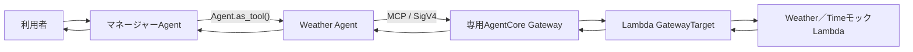

# Spec: AgentCore Gateway Weather／TimeモックTool統合

## 概要

Amazon Bedrock AgentCore Runtime上のWeather Agentから、専用のAmazon Bedrock AgentCore GatewayをMCP経由で呼び出し、Lambdaターゲットとして登録した`get_weather`と`get_time`を利用できるPoCを提供する。

両Toolは外部サービスへ接続せず固定モック値を返す。Weather AgentとマネージャーAgentは、Toolの結果が現在の実天気または実時刻ではなくテスト用データであることを利用者へ明示する。GatewayまたはToolを利用できない場合は、情報を推測せず取得不能を回答する。

## 背景

既存のマルチエージェント構成では、マネージャーAgentがWeather Agentを`Agent.as_tool()`でTool化して利用する一方、Weather Agentには外部Toolがなく、天気取得機能が未実装であることを回答している。

`lambda_tools/weather/handler.py`と`lambda_tools/weather/tools.json`には、AgentCore GatewayのLambdaターゲット形式を想定した`get_weather`と`get_time`の固定モック実装が存在する。しかし、Lambdaリソース、Gateway、GatewayTarget、IAM権限、Runtime設定およびWeather AgentからのMCP接続は未実装であり、ソースコードだけではGatewayターゲットとして利用できない。

本featureではADR-0003に従い、専用GatewayとIAMによる権限境界を構築し、Weather Agentから両Toolまでの接続をエンドツーエンドで実現する。

ADR-0002で定めたAgents-as-Tools構成とマネージャーAgentの会話所有権は維持する。同ADRの外部Tool未実装時の振る舞いだけを、本featureの固定モックTool利用へ更新する。

## 目的

- `lambda_tools/weather`の固定モック実装を、AgentCore GatewayのLambdaターゲットとして再現可能に構築する。
- Weather AgentがMCP経由で`get_weather`と`get_time`を発見し、呼び出せるようにする。
- マネージャーAgentがWeather Agentの結果を受け取り、モックであることを明示した最終回答を返せるようにする。
- Runtime、Gateway、Lambda間の認証と認可をIAMへ統一し、権限を対象リソースへ限定する。
- ToolまたはGatewayの障害時にも、天気または時刻を推測しない既存の安全方針を維持する。

## スコープ

本featureは複数領域にまたがる変更であり、対象は次のとおりとする。

- `lambda_tools/weather/`
  - Lambdaターゲットのハンドラー
  - `get_weather`と`get_time`のツールスキーマ
- `agent_core_cdk_stack/`
  - 専用AgentCore Gateway
  - Weather／TimeモックLambda
  - Lambda GatewayTarget
  - Runtime、Gateway、LambdaのIAM権限と依存関係
  - Runtimeが参照するGateway endpointの非秘密設定
- `agents/`
  - Weather AgentのMCP Tool接続
  - 天気および時刻に関するルーティングとinstructions
  - MCP接続の生成、利用および終了
  - モック明示と障害時の安全な応答
- `tests/`
  - ハンドラー、スキーマ、CDK、Agent統合および障害時動作の自動テスト
- `README.md`および`docs/`
  - 現在の構成、モック制約、設定および検証手順との整合

## 対象外

- 外部の天気サービスから現在の天気または予報を取得すること
- 外部の時刻サービスまたはシステム時計から現在時刻を取得すること
- 天気・時刻サービス用のAPI key、OAuth、Secrets Managerまたはその他の資格情報の導入
- 固定モック値を実在する天気または時刻として提供すること
- 共有Gatewayまたは既存Gatewayへのターゲット追加
- Weather／TimeモックLambda以外のGatewayターゲット追加
- GatewayのJWT認証、No Authorization、Policy in AgentCore、Interceptorまたはエンドユーザー単位の認可
- VPC、PrivateLinkまたは閉域ネットワーク対応
- 本番向けSLA、クォータ設計、コスト予算、アラームおよび高度なAgentCore Observability
- ADR-0002で決定したAgents-as-ToolsからHandoffへの変更
- Weather Agentの分割または名称変更
- AgentCore RuntimeのHTTP／SSE契約、Memory、モデル接続方式またはモデルIDの変更
- ユーザーから明示的に依頼されていないAWS環境へのデプロイおよび変更

## ユーザーストーリー / 利用シナリオ

### 天気モックの利用

1. 利用者が特定の場所の天気を質問する。
2. マネージャーAgentがWeather AgentをAgent-as-Toolとして呼び出す。
3. Weather Agentが専用Gatewayの`get_weather`をMCP経由で呼び出す。
4. Weather Agentが固定モック結果であることを示した専門結果を返す。
5. マネージャーAgentが、現在の実天気ではないことを明示した日本語の最終回答を返す。

### 時刻モックの利用

1. 利用者がタイムゾーンまたは都市の時刻を質問する。
2. マネージャーAgentがWeather AgentをAgent-as-Toolとして呼び出す。
3. Weather Agentが専用Gatewayの`get_time`をMCP経由で呼び出す。
4. Weather Agentが固定モック結果であることを示した専門結果を返す。
5. マネージャーAgentが、現在の実時刻ではないことを明示した日本語の最終回答を返す。

### Toolを利用できない場合

1. Gateway、Lambda、MCP接続またはTool呼び出しで処理を継続できない事象が発生する。
2. Weather Agentが天気または時刻を推測せず、現在はToolを利用できないことを返す。
3. マネージャーAgentが内部エラーを露出せず、取得不能であることを日本語の最終回答として返す。

## 機能要件

### FR-001: 専用GatewayとLambdaターゲット

- システムは、既存CDKスタックの`us-east-2`に、本feature専用のAgentCore Gatewayを一つ作成しなければならない。
- 専用GatewayはMCP Gatewayとして動作しなければならない。
- 専用GatewayのMCP `supportedVersions`には`2025-11-25`と`2025-03-26`を明示し、現在のMCPクライアントが提示する`2025-11-25`をダウングレード交渉に依存せず利用できなければならない。
- システムは、`lambda_tools/weather/handler.py`の`lambda_handler`を実行するLambda関数を作成しなければならない。
- システムは、作成したLambda関数を専用GatewayのLambda GatewayTargetとして登録しなければならない。
- GatewayTargetは`lambda_tools/weather/tools.json`をツールスキーマの正本として使用しなければならない。
- CDKは`lambda_tools/weather/tools.json`をsynth時に読み込み、Lambda GatewayTargetのインラインツールスキーマとして定義しなければならない。Gateway実行時にツールスキーマをS3から読み取る構成としてはならない。
- GatewayTarget名はCDKで安定して管理し、MCP上の公開ツール名に付与される接頭辞が意図せず変化しないようにしなければならない。
- Gateway、Lambda、GatewayTargetおよび関連IAMは既存スタックで依存関係を解決し、手作業によるリソース作成を必要としてはならない。

### FR-002: 公開Toolと入力契約

- GatewayTargetは`get_weather`と`get_time`の2つだけを公開しなければならない。
- MCP上では、AgentCore Gatewayの命名規則に従い、GatewayTarget名を接頭辞とする`${target_name}___get_weather`および`${target_name}___get_time`として発見可能でなければならない。
- `get_weather`は必須入力`location`を一つ受け取らなければならない。
- `get_time`は必須入力`timezone`を一つ受け取らなければならない。
- `location`と`timezone`は空白だけではない文字列でなければならない。
- Tool名、入力名、必須項目および説明は、ツールスキーマとLambdaハンドラーで一致しなければならない。
- 各Toolの説明は、外部サービスを呼び出さず固定モック値を返すことを明示しなければならない。

### FR-003: モック出力契約

正常時の出力は次の契約を満たさなければならない。

| Tool | 出力フィールド | 値または意味 |
| --- | --- | --- |
| `get_weather` | `location` | 呼び出し対象の場所 |
| `get_weather` | `weather` | `72 degrees Fahrenheit, Sunny` |
| `get_weather` | `data_type` | `mock` |
| `get_time` | `timezone` | 呼び出し対象のタイムゾーンまたは都市 |
| `get_time` | `local_time` | `2:30 PM` |
| `get_time` | `data_type` | `mock` |

- Lambdaハンドラーは、AgentCore Gatewayが渡す入力プロパティと`context.client_context.custom`のメタデータを処理できなければならない。
- Lambdaハンドラーは、`${target_name}___${tool_name}`から`___`より後ろのTool名を解決し、対応する処理へ振り分けなければならない。
- Lambdaハンドラーは、Gatewayが解析可能なJSON互換の応答を返さなければならない。
- 入力不正、メタデータ不正および未知Toolを正常なモック結果として扱ってはならない。
- 入力不正、メタデータ不正および未知Toolについて、Lambdaハンドラーは安全な説明を含む`error`フィールドを返し、FR-003の正常なモック値を含めてはならない。
- 呼び出し側は、FR-003の正常なモック結果と`error`フィールドを持つ失敗結果を区別できなければならない。

### FR-004: 認証とIAM権限

- 専用Gatewayの受信認証は`AWS_IAM`でなければならない。
- AgentCore Runtime実行ロールへ本featureで追加するGateway関連権限は、対象の専用Gatewayに対する`bedrock-agentcore:InvokeGateway`に限定しなければならない。既存のモデルおよびMemory用権限は維持する。
- Weather AgentからGatewayへのMCP通信は、Runtime実行ロールの一時AWS認証情報を使用してSigV4署名されなければならない。
- Lambdaターゲットのcredential providerは`GATEWAY_IAM_ROLE`でなければならない。
- Gateway実行ロールは、対象のWeather／TimeモックLambdaに対する`lambda:InvokeFunction`だけを許可されなければならない。
- Gateway実行ロールの信頼ポリシーは`bedrock-agentcore.amazonaws.com`だけにロール引き受けを許可し、送信元AWSアカウントおよび対象Gatewayに限定しなければならない。
- Lambda実行ロールは、Lambdaの実行と必要なログ出力に限定した権限を持たなければならない。
- API key、静的AWSアクセスキーまたはその他のシークレットをAgent、Lambda、環境変数、ツールスキーマおよびCloudFormationテンプレートへ含めてはならない。

### FR-005: Weather AgentとのMCP統合

- Weather Agentは、専用GatewayをMCP serverとして利用し、`get_weather`と`get_time`を発見して呼び出せなければならない。
- 本PoCではWeather Agentの担当範囲を天気と時刻に拡張し、既存のAgent名を維持しなければならない。
- GatewayのMCP ToolはWeather Agentだけへ登録し、マネージャーAgentへ直接登録してはならない。
- マネージャーAgentは、天気および時刻に関する依頼をWeather Agentへ委譲しなければならない。
- マネージャーAgentは、Weather Agentを`Agent.as_tool()`として利用し、Handoffを使用してはならない。
- マネージャーAgentは、利用者との会話と最終回答を引き続き所有しなければならない。
- Weather AgentとマネージャーAgentは、正常なTool結果を回答する場合、テスト用の固定モックであり現在の実天気または実時刻ではないことを明示しなければならない。
- Weather AgentとマネージャーAgentは、モック値を実在する情報として断定してはならない。
- 利用者向け回答は日本語で返さなければならない。

### FR-006: 障害時の振る舞い

- Gateway、Lambda、MCP接続またはTool呼び出しを利用できない場合、Weather Agentは天気または時刻を推測してはならない。
- Agent実行中に発生し、Tool失敗として処理できるGateway接続失敗、Lambda呼び出し失敗またはTool失敗は、Weather Agentが利用不能結果へ変換し、マネージャーAgentが取得不能であることを安全な最終回答として返さなければならない。
- 障害時に、固定モック値をGatewayから取得した結果であるかのように代替利用してはならない。
- ToolまたはGatewayのエラーを利用者へ返す場合、内部例外、スタックトレース、AWSリソース識別子または認証情報を含めてはならない。
- MCP接続は、実装計画で選択した接続ライフサイクルの終了時に解放し、失敗およびキャンセル時にもリークしてはならない。

### FR-007: Runtime設定と再現性

- 専用Gatewayのendpointは、CDKで作成したGatewayの参照から解決し、AgentCore Runtimeが非秘密設定として取得できなければならない。
- Gateway ID、Gateway endpointまたはAWSアカウントIDをAgentコードへ固定値として埋め込んではならない。
- 必須のGateway設定が欠落または不正でAgent実行を開始できない場合は、既存のRuntime HTTP／SSEエラー契約に従って失敗し、固定モック値または推測値へフォールバックしてはならない。
- MCPクライアントの具体的な生成、再利用、Tool一覧キャッシュおよび終了方式は、FR-005とFR-006を満たすよう実装計画で定義しなければならない。

### FR-008: ドキュメント整合

- Agent構成、CDK構成、環境設定、モック制約および検証手順に影響する`README.md`と`docs/`を、実装後の状態へ更新しなければならない。
- 実データ未対応および高度な運用対応が後続要件であることを、関連文書と矛盾なく記載しなければならない。

## 非機能要件

### セキュリティ

- RuntimeからGateway、GatewayからLambdaへの権限は対象リソースへ限定しなければならない。
- 静的な認証情報またはシークレットをコード、設定、ログ、生成テンプレートへ含めてはならない。
- 入力値を検証し、不正な入力を正常なTool結果として処理してはならない。
- 利用者向けエラー応答へ内部例外、スタックトレース、AWSリソース識別子または認証情報を含めてはならない。
- 運用ログへ認証情報または不要な入力内容を記録してはならず、必要な診断情報はサニタイズしなければならない。
- Gatewayの例外レベルを、利用者へ内部詳細を返す`DEBUG`に設定してはならない。

### 信頼性

- Tool障害によって、取得していない天気または時刻を生成してはならない。

### 保守性

- Gateway、Lambda、GatewayTarget、RuntimeおよびIAMの責務を分離し、既存スタックでは依存関係を明示して組み合わせなければならない。
- Tool名と入力契約はツールスキーマとLambdaハンドラーの間で、出力契約はLambdaハンドラーとFR-003の間で、それぞれ整合性を自動テストにより確認できなければならない。
- MCP通信とSigV4認証は、実AWSへ接続しないテストダブルへ差し替え可能でなければならない。
- 既存のAgent-as-Tool構成、モデル接続、SSEおよびMemoryの責務を不必要に変更してはならない。

## 受け入れ条件

### AC-001: ツールスキーマとLambdaハンドラー

- `lambda_tools/weather/tools.json`が有効なJSONとして解析でき、`get_weather`と`get_time`だけを定義している。
- 各Toolの説明から固定モックであり、外部サービスを呼び出さないことを確認できる。
- `location`および`timezone`の必須入力とLambdaハンドラーの分岐がツールスキーマと一致する。
- `${target_name}___get_weather`を表すGateway contextと有効な`location`を渡すと、FR-003の天気モックを返す。
- `${target_name}___get_time`を表すGateway contextと有効な`timezone`を渡すと、FR-003の時刻モックを返す。
- 必須入力の欠落、型不正、空文字、空白文字列、メタデータ不正および未知Toolを安全に失敗として扱い、正常なモック値を返さない。
- 上記の失敗応答が安全な説明を含む`error`フィールドを持ち、FR-003の正常なモックフィールドを持たない。
- Lambda応答がJSON互換であり、正常結果と`error`フィールドを持つ失敗結果を呼び出し側で区別できる。

### AC-002: CDK構成とIAM

- `uv run python app.py`または`cdk synth`が成功する。
- 生成されたCloudFormationテンプレートに、専用AgentCore Gateway、Weather／TimeモックLambda、Lambda GatewayTargetおよび必要なIAM設定が含まれる。
- 専用GatewayがMCPおよび`AWS_IAM`受信認証として構成されていることを確認できる。
- 専用GatewayのMCP `supportedVersions`に`2025-11-25`と`2025-03-26`が含まれることを確認できる。
- GatewayTargetが作成したLambda ARNと`lambda_tools/weather/tools.json`に由来するツールスキーマを参照していることを確認できる。
- GatewayTargetのツールスキーマがインラインで定義され、Gateway実行ロールにツールスキーマ取得用のS3権限がないことを確認できる。
- Runtime実行ロールの`bedrock-agentcore:InvokeGateway`が対象Gatewayに限定されていることを確認できる。
- Gateway実行ロールの`lambda:InvokeFunction`が対象Lambdaに限定されていることを確認できる。
- Gateway実行ロールの信頼ポリシーが`bedrock-agentcore.amazonaws.com`をサービスプリンシパルとし、送信元AWSアカウントと対象Gatewayを条件で限定していることを確認できる。
- Lambdaターゲットが`GATEWAY_IAM_ROLE`を使用することを確認できる。
- RuntimeがGateway endpointを非秘密設定として取得でき、値が生成されたCloudFormation参照から解決されることを確認できる。
- CloudFormationテンプレートとRuntime／Lambda設定にAPI keyまたは静的AWS認証情報が含まれない。
- Gatewayの例外レベルが利用者へ内部詳細を公開する`DEBUG`に設定されていないことを確認できる。
- CDKスタックと追加リソースが`us-east-2`を使用することを確認できる。

### AC-003: Agent統合

- Weather Agentに専用Gatewayの`get_weather`と`get_time`がMCP Toolとして登録されることをテストで確認できる。
- マネージャーAgentへGatewayのMCP Toolが直接登録されず、直接ToolがWeather Agentだけであることを確認できる。
- 天気に関する入力がWeather Agentへ委譲され、`get_weather`の結果を使った最終回答をマネージャーAgentが返す。
- 時刻に関する入力がWeather Agentへ委譲され、`get_time`の結果を使った最終回答をマネージャーAgentが返す。
- 天気と時刻の正常応答が、現在の実データではなくテスト用固定モックであることを日本語で明示する。
- Weather AgentへのHandoffがなく、利用者向け最終回答をマネージャーAgentが所有する。
- 実モデル、実Gatewayまたは実Lambdaを呼び出さない決定的なテストで、上記経路を確認できる。

### AC-004: 障害時の安全性

- Gateway接続失敗、ToolエラーおよびLambdaエラーをテストダブルで再現できる。
- 各障害時にWeather Agentが天気または時刻を推測せず、Toolを利用できないことを返す。
- マネージャーAgentが内部エラーを露出せず、取得不能であることを日本語の最終回答として返す。
- 障害時の回答に固定モック値、架空の天気または架空の時刻が含まれない。
- 選択した接続ライフサイクルの終了時、失敗時およびキャンセル時にMCP接続がリークしないことを確認できる。
- Gateway設定の欠落または不正によりAgent実行を開始できない場合は、既存のRuntime HTTP／SSEエラー契約に従い、固定モック値または推測値を返さないことを確認できる。
- 利用者向けエラー応答および生成テンプレートに認証情報、内部例外またはスタックトレースが含まれない。
- 自動テストまたはコードレビューにより、運用ログへ認証情報や不要な入力内容を記録せず、必要な診断情報をサニタイズしていることを確認できる。

### AC-005: 自動検証とAWS検証

- handler、schema、CDK、設定、Agent統合、ルーティング、モック明示および障害時動作の自動テストが成功する。
- `uv run pytest`が成功する。
- `uv run python app.py`または`cdk synth`が成功する。
- AWS環境でのデプロイと実呼び出しは、ユーザーが明示的に依頼した場合だけ実施する。
- 本featureをAWS E2E検証済みと判断するには、ユーザーの明示依頼に基づくデプロイ後検証を必要とする。明示依頼がない段階は「ローカル実装・検証済み／AWS E2E未検証」と報告し、本項目を未完了として扱う。
- AWS E2E検証では、GatewayTargetが`READY`であること、および`tools/list`に接頭辞付きの`get_weather`と`get_time`が含まれることを確認する。Gatewayが提供する組み込みToolの有無は、このGatewayTargetが公開する2つのTool数には含めない。
- AWS E2E検証では、MCPの`initialize`が成功し、応答の`protocolVersion`が`2025-11-25`であることを確認する。
- AWS E2E検証では、両方の`tools/call`がFR-003のモック結果を返すことを確認する。
- AWS E2E検証では、AgentCore Runtimeへの天気および時刻の入力がWeather Agent、Gateway、Lambda、Weather Agent、マネージャーAgentの順に処理され、モック明示を含む最終回答を返すことを確認する。

### AC-006: ドキュメント

- Agent、CDK、Gateway、Lambda、IAM、設定および検証手順を説明する関連READMEとdocsが実装と一致する。
- 固定モックであり現在の天気または時刻を提供しない制約が、利用者および開発者から確認できる。
- ADR-0002、ADR-0003、本仕様書、実装、テストおよび関連ドキュメントの間に矛盾がない。

## 制約

- 本featureはAgentCore Gateway接続を確認するPoCであり、本番運用要件を満たすものではない。
- `get_weather`と`get_time`は固定モック値だけを返し、実在する天気または時刻を取得してはならない。
- AWSリージョンは既存スタックと同じ`us-east-2`に限定する。
- AgentCore Gatewayの受信認証は`AWS_IAM`、Lambdaターゲットのcredential providerは`GATEWAY_IAM_ROLE`に限定する。
- Gatewayが対応するMCPプロトコル版には`2025-11-25`と`2025-03-26`を含める。
- マネージャーAgentとWeather Agentの関係はADR-0002、Gateway接続方式はADR-0003に従う。
- Agentコンテナの依存関係は`agents/requirements.txt`、CDKプロジェクトとテストの依存関係およびコマンド実行は`uv`で管理する。
- AWS環境を変更する操作には、ユーザーの明示的な依頼が必要である。
- `cdk.out/`、`.cdk.staging/`、`__pycache__/`およびその他の生成物をソースとして編集またはコミットしない。

## 依存関係

- 既存のマネージャーAgentとWeather Agent
- 既存のAgentCore RuntimeとRuntime実行ロール
- `lambda_tools/weather/handler.py`
- `lambda_tools/weather/tools.json`
- Amazon Bedrock AgentCore GatewayおよびGatewayTarget
- AWS Lambda
- AWS IAMおよびSigV4
- OpenAI Agents SDKのMCP Tool連携機能と、同SDKが利用するMCPクライアント
- AWS CDK `aws_bedrockagentcore`および`aws_lambda` Construct Library
- 既存CDKエントリーポイント`app.py`とスタック`agent_core_cdk_stack/agent_core_stack.py`
- 既存テスト領域`tests/`
- `docs/ADR/adr-0001-use-bedrock-mantle-with-runtime-role-sigv4.md`
- `docs/ADR/adr-0002-use-agents-as-tools.md`
- `docs/ADR/adr-0003-use-dedicated-agentcore-gateway-for-weather-tools.md`
- `docs/Agent/README.md`
- `docs/CDK/README.md`
- 後続要件を管理する`specs/backlog/backlog.md`

## 未確定事項 / 要確認事項

要件レベルの未確定事項はない。

次の内容は本仕様を追加または変更しない実装詳細として、`plan.md`で決定する。

- Gateway名、GatewayTarget名、Lambda関数名、Gateway endpointの供給方式および設定名の具体値
- Lambdaのランタイム、アーキテクチャ、メモリ、タイムアウトおよびログ保持期間
- MCPクライアント依存バージョンの固定方法と、CDKで`2025-11-25`を表現する方法
- MCPクライアントの生成、SigV4実装、接続ライフサイクルおよびTool一覧キャッシュ
- 自動テストで使用するMCP、Gatewayおよびモデルのテストダブル
