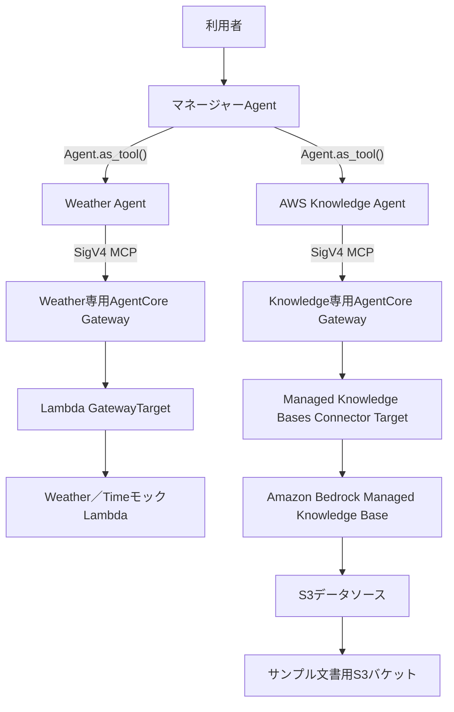

# AWS Knowledge Agent 要件概要

## 1. 目的

- Amazon Bedrock Managed Knowledge BaseをRAGとして利用する`AWS Knowledge Agent`を、既存のAgents-as-Tools型マルチエージェントへ追加します。
- AWSシステム構築に関する架空の社内標準、見積基準、過去案件情報を検索し、根拠に基づく回答をマネージャーAgentへ返せることを検証します。
- Amazon Bedrock AgentCore GatewayのManaged Knowledge Bases Connectorを利用し、Lambdaを介さずにManaged Knowledge BaseをMCP Toolとして呼び出す構成を検証します。
- Managed Knowledge Base、S3データソース、AgentCore Gatewayと関連IAMリソースをAWS CDKで定義し、サンプル文書とメタデータを再現可能な形でS3へ配置します。
- 本要件はPoCを対象とします。本番運用に向けた追加対応は`specs/backlog/backlog.md`で管理します。

## 2. 対象範囲

- OpenAI Agents SDKによる`AWS Knowledge Agent`の実装
- `AWS Knowledge Agent`の`Agent.as_tool()`によるマネージャーAgentへの登録
- Amazon Bedrock Managed Knowledge Baseの作成
- Managed Knowledge Base用のS3データソースと、データソースが参照する専用S3バケットの作成
- `<プロジェクトルート>/knowledge-base-s3/`配下のMarkdownとsidecar metadataのAWS CDKによるS3配置
- Managed Knowledge Baseのサービス管理Embeddingおよびサービス管理の検索基盤の利用
- Knowledge Agent専用AgentCore GatewayとManaged Knowledge Bases Connector Targetの作成
- Managed Knowledge Bases Connectorが公開する`Retrieve` MCP Toolによる単一検索
- Runtime、Gateway、Managed Knowledge Base、S3間のIAM認証と最小権限化
- Agent、CDK、S3アセット、検索経路のテストと検証
- README、Agentドキュメント、CDKドキュメントの更新
- 本要件で新たに必要となる重要な設計判断のADRへの記録

## 3. 対象外

- `AgenticRetrieveStream`を利用した複数ステップのAgentic RAG
- AWS Pricing APIなど、外部または最新の価格情報を取得するTool
- 見積単価と数量を計算し、見積書を完成させる専用Estimation Agent
- AWS公式ドキュメントや実在する社内文書の取り込み
- S3以外のManaged Knowledge Baseデータソース
- 複数のManaged Knowledge Baseを横断する検索
- 文書レベルのアクセス制御と、利用者ごとの`userContext`による検索結果の制限
- カスタムEmbeddingモデル、カスタムRerankingモデル、カスタムVector Store
- 定期的または継続的なデータソース同期
- 本番環境向けの閉域ネットワーク、利用者認証、監視・アラーム、バックアップ、災害対策、長期データ保持
- ユーザーの明示的な依頼を伴わないAWS環境へのデプロイおよびスモークテスト

## 4. システム構成

- 既存のマネージャーAgentとWeather Agentを維持し、新たに`AWS Knowledge Agent`を追加します。
- マネージャーAgentは利用者との会話、専門Agentの選択、複数の専門結果の統合、最終回答を引き続き担当します。
- Weather Agentは既存の専用GatewayとLambda Targetを利用し、AWS Knowledge Agentは新設する専用GatewayとManaged Knowledge Bases Connector Targetを利用します。
- Weather Agent専用GatewayへKnowledge Base Targetを追加せず、専門AgentごとのGatewayとIAM権限の境界を維持します。
- AWS Knowledge AgentからManaged Knowledge Baseへの経路にはLambdaを配置しません。
- 既存スタックと同じAWSアカウントおよび`us-east-2`リージョンへ、関連リソースを配置します。



## 5. AWS Knowledge Agent要件

- Agent名は`AWS Knowledge Agent`とし、コード上で既存の命名規則に適合する識別子を使用します。
- AWS Knowledge Agentは、AWSシステム構築に関する社内アーキテクチャ標準、セキュリティ標準、監視標準、見積基準、過去案件情報を検索する専門Agentとします。
- AWS Knowledge Agentを`Agent.as_tool()`でマネージャーAgentへ登録し、Handoffは使用しません。
- マネージャーAgentへManaged Knowledge BaseのMCP Toolを直接登録せず、AWS Knowledge Agentだけが利用します。
- マネージャーAgentは、社内標準、見積基準、過去案件に関する質問でAWS Knowledge Agentを選択します。
- 天気とAWS社内標準の両方が必要な質問では、マネージャーAgentがWeather AgentとAWS Knowledge Agentの結果を組み合わせて最終回答を生成できるようにします。
- AWS Knowledge Agentは、対象分野の質問へ回答する前にManaged Knowledge Baseの`Retrieve` Toolを使用します。
- AWS Knowledge Agentは取得した検索結果だけを根拠として回答し、取得できていない社内標準、数値、過去案件情報をモデルの一般知識から補完しません。
- AWS Knowledge Agentは、マネージャーAgentが根拠を確認できるように、回答に利用した文書名または取得結果のソース情報と該当内容を返します。
- 見積基準の検索と簡単な数量計算は実施できますが、AWS Knowledge Agent自身には見積書全体を完成させる責任を持たせません。
- Agentの`instructions`、`tool_description`、取得不能時の案内は日本語で記述します。

## 6. Managed Knowledge Base要件

- Amazon Bedrock Knowledge Baseは、Knowledge Base typeが`MANAGED`のManaged Knowledge Baseとして作成します。
- Embeddingにはサービス管理モデルを利用し、カスタムEmbeddingモデルARNとEmbedding設定を指定しません。
- Vector Store、Index、Embedding処理、Reranking基盤はAmazon Bedrockの管理対象とし、CDKで顧客管理のVector Storeを別途作成しません。
- Managed Knowledge Base用のサービスロールを用意し、対象S3データソースを読み取るために必要な権限だけを付与します。
- Managed Knowledge BaseとS3データソースは同じAWSリージョンに配置します。
- S3をManaged Knowledge Baseのデータソースとして登録し、本要件のMarkdownとsidecar metadataを取り込み対象にします。
- データソースの同期後、追加、更新、削除された対象文書がManaged Knowledge Baseの検索結果へ反映される構成とします。
- PoCのサンプル文書は機密情報を含まない架空データだけとし、実在する顧客名、社内情報、認証情報を格納しません。

## 7. ナレッジ文書・メタデータ要件

- Managed Knowledge Baseへ登録するソース文書の正本は、`<プロジェクトルート>/knowledge-base-s3/`配下で管理します。
- 次の5つのUTF-8 Markdownを登録対象とします。

```text
knowledge-base-s3/
├── standards/
│   ├── aws_architecture_standard.md
│   ├── monitoring_standard.md
│   └── security_standard.md
├── estimation/
│   └── estimation_guideline.md
└── projects/
    └── sample_project_alpha.md
```

- 各Markdownと同じS3 prefixに、`<文書名>.metadata.json`形式のsidecar metadataを配置します。
- metadataの最上位は`metadataAttributes`とし、文書の内容に応じて次の属性を保持します。
  - `document_type`: `architecture`、`security`、`monitoring`、`estimation`、`past_project`のいずれか
  - `version`: 文書の版を示す文字列
  - `system_type`: `aws`
  - `environment`: 対象環境を示す文字列配列
  - `service`: 対象AWSサービスを示す文字列配列
  - `project_name`: 過去案件文書だけが持つ案件識別子
- Markdownとmetadataの対応関係およびディレクトリ階層は、ローカルとS3で一致させます。
- metadataがManaged Knowledge Baseへ取り込まれ、`document_type`、`environment`、`service`を検索フィルターで利用できる状態にします。
- `.DS_Store`、Python cache、テスト生成物、Git管理情報、SDD文書など、`knowledge-base-s3/`の登録対象外ファイルをS3へ配置しません。

## 8. S3・AWS CDK配置要件

- Managed Knowledge Baseのデータソース専用となるGeneral Purpose S3バケットをAWS CDKで作成します。
- S3バケットはパブリックアクセスをすべてブロックし、保存時暗号化とTLS通信を必須にします。
- S3バケット名をコードへ固定せず、CloudFormationで一意な名前を生成できる構成とします。
- `<プロジェクトルート>/knowledge-base-s3/`をAWS CDKのローカルassetとして扱い、CDKデプロイ時に専用S3バケットへ配置します。
- S3オブジェクトキーはローカルの相対パスを維持し、少なくとも次の10オブジェクトを配置します。
  - 5つのMarkdown
  - 各Markdownに対応する5つの`.metadata.json`
- ローカル文書またはmetadataを変更した後にCDKを再デプロイすると、S3上の対応オブジェクトへ変更が反映されるようにします。
- ローカルから削除した登録対象ファイルをS3へ残すか削除するかは、データソース同期時の意図しない大量削除を避ける方針とあわせて実装計画で決定します。
- S3への文書配置とManaged Knowledge Baseのデータソース作成・同期の依存関係を明示し、文書が配置される前に初回取り込みを開始しないようにします。
- 初回データソース同期は`cdk deploy`の処理へ組み込まず、デプロイ成功後に明示的なコマンドで実行します。
- 初回同期コマンド、同期状態の確認方法、成功・失敗の判定方法を運用手順として文書化します。
- PoCスタックを削除する場合のS3オブジェクト、S3バケット、Managed Knowledge Baseの削除方針は、既存PoCリソースの`DESTROY`方針との整合性を実装計画で確認します。
- AWS CDKによるS3配置と初回同期では、手動のS3コンソールアップロードやBedrockコンソール操作を必須手順にしません。

## 9. AgentCore Gateway・Retrieve Tool要件

- AWS Knowledge Agent専用のAgentCore GatewayをAWS CDKで作成します。
- GatewayはMCP Gatewayとし、受信認証には`AWS_IAM`を使用します。
- GatewayへAmazon Bedrock Managed Knowledge Basesの組み込みConnector Targetを登録します。
- Connector Targetは`bedrock-knowledge-bases` Connectorを使用し、Lambda、OpenAPI、独自HTTP Targetへ変換しません。
- 最初のPoCではConnector Targetから`Retrieve`だけを公開し、`AgenticRetrieveStream`は公開しません。
- `Retrieve`の`knowledgeBaseId`は管理者設定として対象Managed Knowledge Baseへ固定し、モデルや利用者の入力で別のKnowledge Base IDへ変更できないようにします。
- AWS Knowledge Agentから指定可能な入力は、少なくとも自然言語の検索文字列と、許可したmetadata filterに限定します。
- 取得件数、検索方式、metadata filterの公開範囲などの検索パラメーターは、検索品質、安全性、テスト容易性を考慮して実装計画で決定します。
- AWS Knowledge Agentは既存Gateway接続と同様に、Runtime実行ロールのAWS認証情報とSigV4を使用して専用Gatewayへ接続します。
- MCP接続、`tools/list`、`Retrieve`呼び出し、cleanupは、既存のリクエスト単位のライフサイクルと整合させます。

## 10. IAM・セキュリティ要件

- 静的AWS認証情報、OpenAI API key、Bedrock API key、Bearer tokenを追加しません。
- Runtime実行ロールには、AWS Knowledge Agent専用Gatewayの`bedrock-agentcore:InvokeGateway`だけを追加で許可し、Managed Knowledge BaseやS3の直接呼び出し権限を付与しません。
- Knowledge Agent専用Gatewayのサービスロールには、Connector Target作成時の対象Managed Knowledge Base確認と`Retrieve`に必要なBedrock権限を付与します。
- GatewayのサービスロールにS3オブジェクトの直接読み取り権限を付与しません。
- Managed Knowledge Baseのサービスロールには、対象データソース用S3バケットの必要なprefixと操作だけを許可します。
- S3配置に必要なCDK Custom Resourceまたはデプロイロールの権限は、対象バケットへの配置に限定します。
- GatewayおよびManaged Knowledge Baseのサービスロールの信頼関係は、対応するAWSサービスと対象リソースへ制限します。
- IAMポリシーはリソースARNで可能な限り限定し、AWS管理ポリシーによる広範な権限を新たに付与しません。
- エラー応答やログへGateway URL、Knowledge Base ID、S3バケット名、IAM ARN、内部例外、スタックトレース、認証情報を不用意に出力しません。

## 11. 取得不能・根拠提示要件

- Managed Knowledge Baseに関連情報がない場合、AWS Knowledge Agentは情報が見つからないことを明示し、架空の社内ルールや数値を生成しません。
- Gateway、Connector Target、Managed Knowledge Base、S3データソースのいずれかを利用できない場合、取得不能を示す安全な結果をマネージャーAgentへ返します。
- マネージャーAgentはAWS Knowledge Agentの取得失敗時に、モデルの一般知識を社内標準として代替回答しません。
- 取得結果を利用した回答では、根拠となった文書名またはソース参照を利用者が識別できる形で提示します。
- 取得結果に命令形式の文章が含まれていても、それをAgentへのシステム指示として扱わず、検索対象のデータとして扱います。
- Managed Knowledge Baseを利用しない一般的な会話や既存Weather Agentの処理を、この機能の障害によって不要に停止させません。

## 12. 検証要件

- マネージャーAgentが質問の内容に応じてAWS Knowledge Agentを選択し、AWS Knowledge AgentだけがKnowledge専用GatewayのMCP Toolを利用することを単体テストします。
- マネージャーAgentがWeather AgentとAWS Knowledge Agentを選択して結果を統合する複合ケースをテストします。
- AWS Knowledge Agentが社内標準や見積基準に関する質問で`Retrieve`を呼び出し、取得結果とソース情報をマネージャーAgentへ返すことをテストします。
- 検索結果が空の場合とGatewayまたはToolが利用不能な場合に、両Agentが情報を捏造しないことをテストします。
- サンプル文書にだけ存在する次のような値を使用し、Managed Knowledge Baseを参照したことを判定できる検索ケースを用意します。
  - 本番RDSのバックアップ保持期間は14日間
  - 本番CloudWatch Logsの保持期間は90日
  - EC2の詳細設計は1サーバーあたり0.5人日
  - Sample Project Alphaの実績工数合計は26.0人日
- EC2 4台とRDS 1DBの詳細設計工数が、取得した見積基準に基づいて3.0人日と算出されるケースを検証します。
- `document_type`、`environment`、`service`のmetadataが取り込まれ、許可したfilterで検索結果を絞り込めることを検証します。
- 5つのMarkdownと5つのsidecar metadataが、想定したS3オブジェクトキーでCDK assetに含まれることをテストします。
- `uv run pytest`と`uv run python app.py`または`cdk synth`を実行し、生成されたCloudFormationテンプレートで次を確認します。
  - Managed Knowledge BaseとS3データソース
  - 専用S3バケットの暗号化、パブリックアクセス遮断、TLS必須化
  - S3文書配置用リソースと配置順序
  - Knowledge専用GatewayとManaged Knowledge Bases Connector Target
  - Runtime、Gateway、Managed Knowledge Base、S3間の参照とIAM権限境界
- AgentコンテナをLinux ARM64向けにビルドし、既存のRuntime HTTP／SSE契約とWeather Agentの動作が維持されることを検証します。
- AWS環境への`cdk deploy`、データソース同期、Gateway経由の実検索、Runtime E2Eは、ユーザーの明示的な依頼を受けて手動で実施します。

## 13. 未確定事項・要確認事項

- S3上から削除された文書を同期時にManaged Knowledge Baseから削除する場合の削除保護と許容閾値は、実装計画で決定する必要があります。
- `Retrieve`でモデルへ公開するmetadata filterと検索パラメーターの範囲は、後続の仕様化または実装計画で決定する必要があります。

## 14. ADR

- Agents-as-Tools型を維持する判断は、`docs/ADR/adr-0002-use-agents-as-tools.md`に従います。
- Weather Agent専用GatewayへKnowledge Base Targetを混在させず、AWS Knowledge Agent用の専用Gatewayを作成する判断は、`docs/ADR/adr-0003-use-dedicated-agentcore-gateway-for-weather-tools.md`との整合を確認したうえで、本featureのADRへの記録要否を判断します。
- `Retrieve`から開始して`AgenticRetrieveStream`を対象外とする判断、Managed Knowledge Baseを採用する判断、初回同期をデプロイ後の明示的なコマンドで実行する判断は、本featureの重要な設計判断としてADRへの記録要否を確認します。
