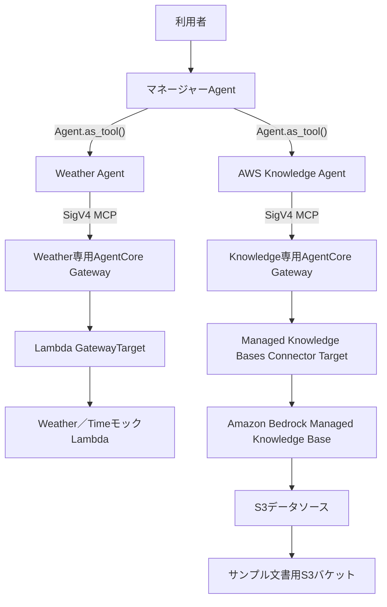

# Spec: Managed Knowledge Baseを利用するAWS Knowledge Agent

## 概要

Amazon Bedrock Managed Knowledge BaseをRAGとして利用する`AWS Knowledge Agent`を、既存のAgents-as-Tools型マルチエージェントへ追加する。AWS Knowledge Agentは、架空の社内AWS標準、見積基準、過去案件を専用のAgentCore Gateway経由で検索し、根拠とソース情報をマネージャーAgentへ返す。Managed Knowledge Base、S3データソース、専用Gateway、関連IAM、およびローカルのナレッジ文書をAWS CDKで再現可能に構成する。



## 背景

既存システムは、マネージャーAgentがWeather Agentを`Agent.as_tool()`として利用し、Weather Agentだけが専用AgentCore GatewayのLambda Targetへ接続する。今後の目標であるAWSシステム構築案件の見積もり支援に向けて、変わりにくい社内標準、見積基準、過去案件を検索するRAG経路を検証する必要がある。

一般的なAWS知識はモデルの学習済み知識でも回答できるため、RAGの利用有無を判定しにくい。本featureでは、モデルが事前に知り得ない架空の社内ルールと過去案件をManaged Knowledge Baseへ登録し、検索結果に基づく回答、根拠提示、metadata filter、取得不能時の安全性を検証する。

既存の会話所有権とAgents-as-Tools構成はADR-0002、Weather Agent専用Gatewayの境界はADR-0003に従う。

当初の`us-east-2`向けCloudFormation差分確認では、同リージョンのresource schemaがManaged Knowledge BaseとManaged Knowledge Base用データソースconnectorを未サポートとして拒否した。AWS公式の対応リージョンと、`openai.gpt-5.5`を同時に利用できるリージョンを確認した結果、本PoC全体を`us-east-1`へ移行する。新リージョンでのE2E成功後、旧`us-east-2`環境を残さないことも本featureの要件とする。

## 目的

- AWS Knowledge AgentがManaged Knowledge Baseを検索し、登録済みの社内知識だけを根拠として回答できるようにする。
- マネージャーAgentが質問に応じてWeather AgentとAWS Knowledge Agentを選択し、必要に応じて両者の結果を統合できるようにする。
- Managed Knowledge Bases Connectorの`Retrieve`を使用し、Lambdaを介さないGatewayからManaged Knowledge Baseまでの経路を検証する。
- Managed Knowledge Base、S3データソース、専用Gateway、IAM、およびナレッジ文書をAWS CDKで再現可能にする。
- ローカル文書をCDKデプロイでS3へ配置し、デプロイ後の明示的なコマンドで初回同期できる運用手順を提供する。
- Runtime、Memory、Weather／Knowledge Gateway、Lambda、Managed Knowledge Base、S3および関連IAMを含むPoC全体を`us-east-1`へ配置する。
- 初回deploy前に同一AWSアカウントの`us-east-1`をAWS CDKでbootstrapし、assetの配置とCloudFormation deployに必要な基盤を用意する。
- `us-east-1`で初回同期とAWS E2Eを完了した後、旧`us-east-2`のPoC stackを安全に削除する。

## スコープ

本featureは複数領域にまたがる変更であり、対象領域は次のとおりとする。

- `knowledge-base-s3/`: Managed Knowledge Baseへ登録するMarkdownとsidecar metadataの正本
- `agents/`: AWS Knowledge Agent、マネージャーAgentのルーティング、Knowledge専用MCP接続、取得結果と障害の処理
- `agent_core_cdk_stack/`: Managed Knowledge Base、S3データソース、S3バケット、文書配置、Knowledge専用Gateway、Connector Target、IAM、Runtime設定
- `app.py`: PoC全体のデプロイ先を`us-east-1`へ固定するCDKエントリーポイント
- `tests/`: Agentルーティング、MCP Tool、RAG結果、障害処理、ナレッジ文書、metadata、CDKテンプレートの自動テスト
- `README.md`および`docs/`: 構成、設定、デプロイ後同期、検証、制約、トラブルシューティングの更新
- `docs/ADR/`: 本featureで確定した重要な設計判断の記録
- AWS移行作業: `us-east-1`のCDK bootstrap、新stackのdeploy／E2E、成功後の旧`us-east-2` stackの削除・残存確認

## 対象外

- `AgenticRetrieveStream`を利用した複数ステップのAgentic RAG
- AWS Pricing APIなど、外部または最新の価格情報を取得するTool
- 見積書全体を完成させる専用Estimation Agent
- AWS公式ドキュメント、実在する社内文書、顧客文書の取り込み
- S3以外のManaged Knowledge Baseデータソース
- 複数のManaged Knowledge Baseを横断する検索
- 文書レベルのアクセス制御と、利用者ごとの`userContext`による検索結果制限
- カスタムEmbeddingモデル、カスタムRerankingモデル、顧客管理Vector Store
- 定期的または継続的なデータソース同期
- 本番環境向けの閉域ネットワーク、利用者認証、監視・アラーム、バックアップ、災害対策、長期データ保持
- ユーザーの明示的な依頼を伴わないAWS環境へのデプロイ、データソース同期、実検索、Runtime E2E

## ユーザーストーリー / 利用シナリオ

- 利用者として、社内のAWSアーキテクチャ標準、セキュリティ標準、監視標準を質問し、根拠となる登録文書を識別できる回答を受け取りたい。
- 見積担当者として、登録済みの見積基準を検索し、指定したリソース数量に基づく簡単な工数計算を確認したい。
- 利用者として、過去案件の構成、前提、実績工数を、モデルの推測ではなく登録文書から確認したい。
- 利用者として、天気と社内標準の両方を含む質問に対し、マネージャーAgentが各専門Agentの結果を統合した回答を受け取りたい。
- 開発者として、ナレッジ文書をリポジトリでレビューし、AWS CDKから同じ階層でS3へ配置したい。
- 運用者として、`cdk deploy`の成功後に明示的なコマンドで初回同期を開始し、同期状態と成否を確認したい。
- 運用者として、未bootstrapの`us-east-1`へ初回deployする前に、対象accountとregionを明示してCDK bootstrapを完了したい。
- 運用者として、`us-east-1`の新環境が正常であることを確認してから旧`us-east-2`環境を削除し、二重課金と利用先の混在を避けたい。
- 利用者として、関連文書がない場合やKnowledge経路が利用不能な場合に、架空の社内ルールではなく取得不能であることを知りたい。

## 機能要件

### FR-001: Agents-as-Tools構成とルーティング

- システムは、既存のマネージャーAgentとWeather Agentを維持し、`AWS Knowledge Agent`を新たなスペシャリストAgentとして持たなければならない。
- マネージャーAgentはAWS Knowledge Agentを`Agent.as_tool()`として利用し、Handoffを使用してはならない。
- マネージャーAgentは利用者との会話と最終回答を引き続き所有しなければならない。
- マネージャーAgentは、社内AWS標準、見積基準、過去案件に関する質問をAWS Knowledge Agentへ委譲しなければならない。
- マネージャーAgentは、天気または時刻に関する質問を既存どおりWeather Agentへ委譲しなければならない。
- 天気または時刻と社内知識の両方を必要とする質問では、マネージャーAgentはWeather AgentとAWS Knowledge Agentの結果を利用者向け最終回答へ統合できなければならない。
- Knowledge GatewayのMCP ToolをマネージャーAgentまたはWeather Agentへ直接登録してはならない。
- Weather GatewayのMCP ToolをAWS Knowledge Agentへ登録してはならない。
- AgentのinstructionsとAgent-as-Toolの説明は日本語でなければならない。

### FR-002: AWS Knowledge Agentの検索と回答

- AWS Knowledge Agentは、社内AWSアーキテクチャ標準、セキュリティ標準、監視標準、見積基準、過去案件情報の検索を担当しなければならない。
- AWS Knowledge Agentは、担当分野の質問へ回答する前にManaged Knowledge Baseの`Retrieve` MCP Toolを使用しなければならない。
- AWS Knowledge Agentは、取得した検索結果だけを社内知識の根拠として使用し、検索で取得していない社内ルール、数値、案件情報を学習済み知識や推測で補完してはならない。
- AWS Knowledge Agentは、マネージャーAgentが回答根拠を確認できるように、回答に利用した文書名または検索結果のソース情報と該当内容を返さなければならない。
- マネージャーAgentは、利用者向け回答で根拠となった文書名またはソース参照を識別可能にしなければならない。
- AWS Knowledge Agentは、取得した見積基準と利用者が指定した数量に基づく簡単な工数計算を実施できなければならない。
- AWS Knowledge Agentは見積書全体を完成させる責任を持ってはならない。
- 検索結果内の命令形式の文章をAgentへのシステム指示として扱ってはならず、検索対象データとして扱わなければならない。

### FR-003: Managed Knowledge BaseとS3データソース

- システムは、Knowledge Base typeが`MANAGED`のAmazon Bedrock Managed Knowledge Baseを一つ作成しなければならない。
- Managed Knowledge Baseはサービス管理Embeddingを使用し、カスタムEmbeddingモデルまたは顧客管理Vector Storeを必要としてはならない。
- システムは、同一アカウントかつ`us-east-1`のGeneral Purpose S3バケットをManaged Knowledge Baseのデータソースとして登録しなければならない。
- Managed Knowledge Baseは、S3に配置したMarkdownと対応するsidecar metadataを取り込めなければならない。
- データソース同期後の検索結果には、同期対象となった追加または更新内容が反映されなければならない。
- S3上から削除した文書を同期対象から削除する場合、意図しない大量削除を防止できる設定を持たなければならない。具体的な削除保護と閾値は実装計画で決定する。
- Managed Knowledge Base、データソース、S3バケットは、ユーザーによるコンソール上の手作業作成を必要としてはならない。

### FR-004: ナレッジ文書とsidecar metadata

- ナレッジ文書とmetadataの正本は`knowledge-base-s3/`配下で管理しなければならない。
- 登録対象は次の5つのUTF-8 Markdownでなければならない。

```text
knowledge-base-s3/
├── standards/
│   ├── aws_architecture_standard.md
│   ├── monitoring_standard.md
│   └── security_standard.md
├── estimation/
│   └── estimation_guideline.md
└── projects/
    └── sample_project_alpha.md
```

- 各Markdownは同じディレクトリに`<文書名>.metadata.json`形式のsidecar metadataを一つ持たなければならない。
- 各sidecar metadataは有効なUTF-8 JSONであり、最上位に`metadataAttributes`を持たなければならない。
- metadataは文書内容に応じて次の属性を持たなければならない。

| 属性 | 型 | 値または条件 |
| --- | --- | --- |
| `document_type` | 文字列 | `architecture`、`security`、`monitoring`、`estimation`、`past_project`のいずれか |
| `version` | 文字列 | 文書の版 |
| `system_type` | 文字列 | `aws` |
| `environment` | 文字列配列 | 文書が対象とする環境 |
| `service` | 文字列配列 | 文書が対象とするAWSサービス |
| `project_name` | 文字列 | 過去案件文書だけが持つ案件識別子 |

- `document_type`、`environment`、`service`はManaged Knowledge Baseの検索フィルターで利用可能でなければならない。
- サンプル文書には、実在する顧客名、社内情報、個人情報、認証情報または秘密情報を含めてはならない。
- `.DS_Store`、Python cache、テスト生成物、Git管理情報、SDD文書を登録対象に含めてはならない。

### FR-005: AWS CDKによるS3配置とデプロイ後同期

- システムは、Managed Knowledge Baseデータソース専用のS3バケットと、文書配置に必要なリソースをAWS CDKで定義しなければならない。
- CDKは`knowledge-base-s3/`をローカルassetとして扱い、デプロイ時に5つのMarkdownと5つのsidecar metadataをS3へ配置しなければならない。
- S3オブジェクトキーは`knowledge-base-s3/`からの相対パスを維持しなければならない。
- ローカルの登録対象ファイルを変更してCDKを再デプロイした場合、S3上の対応オブジェクトへ変更を反映できなければならない。
- 文書配置リソースと、文書を参照するデータソースの依存関係を明示しなければならない。
- 初回データソース同期を`cdk deploy`の処理へ組み込んではならない。
- 初回データソース同期は、`cdk deploy`が成功した後に明示的なコマンドで開始できなければならない。
- ドキュメントは、初回同期コマンド、同期状態の確認方法、成功・失敗の判定方法を示さなければならない。
- S3への文書配置と初回同期に、S3コンソールまたはBedrockコンソールでの手動操作を必須としてはならない。

### FR-006: Knowledge専用GatewayとRetrieve Connector

- システムは、既存Weather Gatewayとは別に、AWS Knowledge Agent専用のAgentCore Gatewayを`us-east-1`へ一つ作成しなければならない。
- Knowledge専用GatewayはMCP Gatewayとして動作し、受信認証に`AWS_IAM`を使用しなければならない。
- Knowledge専用Gatewayは、`bedrock-knowledge-bases`の組み込みConnector Targetを一つ持たなければならない。
- Connector Targetのcredential providerは`GATEWAY_IAM_ROLE`でなければならない。
- Connector Targetは`Retrieve`だけを公開し、`AgenticRetrieveStream`を公開してはならない。
- Connector Targetは`Retrieve`の`knowledgeBaseId`をFR-003のManaged Knowledge Baseへ管理者設定として固定し、Agentまたは利用者が別のKnowledge Base IDへ変更できないようにしなければならない。
- `Retrieve`は自然言語の検索文字列を受け取り、許可されたmetadata filterを適用できなければならない。
- Connector TargetからManaged Knowledge Baseまでの経路にLambda、OpenAPI Targetまたは独自HTTP Targetを配置してはならない。
- AWS Knowledge AgentはRuntime実行ロールの一時AWS認証情報を使用し、SigV4でKnowledge専用Gatewayへ接続しなければならない。
- Knowledge専用MCP接続はリクエスト単位で接続、Tool発見、Agent実行、解放を完結し、失敗またはキャンセル時にも接続をリークしてはならない。

### FR-007: IAMと秘密情報の境界

- Runtime実行ロールへ本featureで追加するKnowledge関連権限は、Knowledge専用Gatewayに対する`bedrock-agentcore:InvokeGateway`へ限定しなければならない。
- Runtime実行ロールへManaged Knowledge Baseの検索権限またはデータソースS3バケットの読み取り権限を直接付与してはならない。
- Knowledge専用Gatewayのサービスロールは、対象Managed Knowledge Baseの確認と`Retrieve`に必要なBedrock権限だけを持たなければならない。
- Knowledge専用GatewayのサービスロールへS3オブジェクトの直接読み取り権限を付与してはならない。
- Managed Knowledge Baseのサービスロールは、対象S3データソースの読み取りに必要な操作とリソースだけへ限定しなければならない。
- S3配置用の実行主体は、対象バケットへの配置に必要な権限だけを持たなければならない。
- GatewayとManaged Knowledge Baseのサービスロールの信頼関係は、対応するAWSサービスと対象リソースへ可能な限り限定しなければならない。
- API key、Bearer token、静的AWSアクセスキー、秘密情報をAgent、Runtime環境変数、S3文書、metadata、CDKテンプレートへ含めてはならない。

### FR-008: 独立した可用性と安全な失敗

- Weather GatewayとKnowledge Gatewayの設定、接続状態、Tool一覧、利用可否を独立して管理しなければならない。
- Knowledge Gateway、Connector Target、Managed Knowledge BaseまたはS3データソースを利用できない場合、AWS Knowledge Agentは取得不能であることを返し、社内知識を推測してはならない。
- 検索結果が空の場合、AWS Knowledge Agentは関連情報が見つからないことを返し、架空の社内ルール、数値または案件情報を生成してはならない。
- マネージャーAgentはAWS Knowledge Agentの取得不能結果を、学習済み知識または推測した社内標準で置き換えてはならない。
- Knowledge経路を利用できない場合も、既存Weather Agentと一般会話を不要に停止させてはならない。
- Weather経路を利用できない場合も、AWS Knowledge Agentによる検索を不要に停止させてはならない。
- 利用者向けエラー応答に、内部例外、スタックトレース、Gateway URL、Knowledge Base ID、S3バケット名、IAM ARN、認証情報を含めてはならない。

### FR-009: ドキュメント整合

- 実装後のAgent構成、CDK構成、環境設定、IAM境界、ナレッジ文書、metadata、デプロイ後同期、検証手順、制約を関連READMEと`docs/`へ反映しなければならない。
- `cdk deploy`、初回同期、実検索、Runtime E2EがAWS環境を変更または利用料金を発生させ得る操作であることを明示しなければならない。
- AWS E2Eを実施していない場合は、ローカル検証済みとAWS未検証を区別して記載しなければならない。
- リージョン移行の順序、成功判定、旧環境の削除条件、削除後確認および復旧不能なデータを関連READMEと`docs/`へ記載しなければならない。

### FR-010: `us-east-1`への移行と旧`us-east-2`環境の廃止

- PoCのRuntime、Memory、Weather／Knowledge Gateway、GatewayTarget、Lambda、Managed Knowledge Base、S3および関連IAMは、同一AWSアカウントの`us-east-1`へ単一stackとして配置しなければならない。
- `us-east-1`への初回`cdk diff`および`cdk deploy`より前に、対象profileとAWSアカウントを確認し、同アカウントの`us-east-1`をCDK bootstrapしなければならない。
- bootstrapで作成する`us-east-1`の`CDKToolkit` stackは正常状態でなければならず、後続のtemplate、file assetおよびcontainer image assetを利用できなければならない。
- Runtimeだけを`us-east-2`に残す構成や、Knowledge経路だけを別リージョンへ配置する構成を採用してはならない。
- `us-east-1`のstackについて、CloudFormation事前検証、deploy、S3文書配置、初回同期、Gateway ToolおよびRuntime E2Eが成功するまで、旧`us-east-2`の`OpenAiAgentCoreBaseStack`を削除してはならない。
- 新環境の検証結果を保存した後、旧`us-east-2`の`OpenAiAgentCoreBaseStack`とstack管理下のPoCリソースを削除しなければならない。
- 旧PoC stackの削除では、現行デプロイ基盤である同アカウントの`us-east-1`の`CDKToolkit` stackを削除してはならない。
- 旧PoC stack削除後の`us-east-2`の`CDKToolkit`は本featureの維持対象に含めず、同リージョンで今後CDK deployを行わない場合は削除済みでもよい。
- 削除後、旧stackが存在せず、旧リージョンに本PoCのRuntime、Memory、Gateway、GatewayTarget、LambdaおよびKnowledge関連リソースが残っていないことを確認しなければならない。
- 新環境のdeploy、同期またはE2Eが失敗した場合は旧環境を保持し、失敗原因を解消するまで削除へ進んではならない。

## 非機能要件

### セキュリティ

- S3バケットはパブリックアクセスをすべてブロックし、保存時暗号化とTLS通信を必須にしなければならない。
- S3バケット名、Gateway ID、Gateway URL、Knowledge Base ID、AWSアカウントIDをAgentコードへ固定値として埋め込んではならない。
- Runtime、Gateway、Managed Knowledge Base、S3配置主体の権限を、それぞれの責務と対象リソースへ限定しなければならない。
- サンプル文書、metadata、設定、ログ、生成テンプレートへ秘密情報または実在する機密情報を含めてはならない。
- 利用者向け応答と運用ログへ内部識別子、内部例外、スタックトレースまたは認証情報を出力してはならない。

### 信頼性

- Knowledge経路の障害または検索結果なしを、正常な検索結果として扱ってはならない。
- MCP接続を正常、失敗、タイムアウト、キャンセルの各経路で有限時間内に解放できなければならない。
- 初回同期が成功するまで、Managed Knowledge Baseを検索可能な状態として扱ってはならない。
- Weather経路とKnowledge経路の一方の障害を、他方の利用不能状態として扱ってはならない。
- 本PoCでは具体的な応答時間、検索時間、同時実行数、可用性SLAを定めない。

### 保守性

- Manager、Weather Agent、AWS Knowledge Agent、各Gateway、Managed Knowledge Base、S3配置、IAMの責務を分離しなければならない。
- 既存CDKスタックは責務ごとのConstructを組み合わせ、個別リソースの詳細をスタックへ直接集約してはならない。
- ナレッジ文書とmetadataの正本をリポジトリでレビュー可能にし、同じ情報をCDKコードへ重複定義してはならない。
- Gateway MCP通信、Managed Knowledge Base検索、Agentルーティングは、実AWSへ接続しないテストダブルへ差し替え可能でなければならない。
- 既存Runtime HTTP／SSE、Memory、モデル接続、Weather Agentの契約を不必要に変更してはならない。

### 運用性

- 初回同期は`cdk deploy`から分離し、運用者が同期の開始と状態を明示的に確認できなければならない。
- 同期失敗時は、同じ同期を無条件に繰り返す前に状態と失敗理由を確認できなければならない。
- 定期同期、同期スケジュール、監視アラームは本featureの完了条件に含めない。
- リージョン移行では、新環境を先に検証してから旧環境を削除する順序を変更してはならない。
- `us-east-1`のbootstrapでは、対象account、profile、regionを個別に確認し、`OpenAiAgentCoreBaseStack`のdeploy前に`CDKToolkit`の成功状態を確認できなければならない。
- 旧環境の削除前に対象account、profile、stack名、旧regionが`us-east-2`であることを再確認できなければならない。

## 受け入れ条件

### AC-001: Agent構成とルーティング

- AWS Knowledge Agentが`Agent.as_tool()`としてマネージャーAgentへ登録され、Handoffが設定されていないことを自動テストで確認できる。
- マネージャーAgentの直接ToolがWeather AgentとAWS Knowledge Agentであり、各GatewayのMCP Toolが直接登録されていないことを確認できる。
- 社内標準、見積基準、過去案件に関する入力がAWS Knowledge Agentへ委譲されることを、実モデルを呼び出さない決定的なテストで確認できる。
- 天気または時刻に関する入力が既存どおりWeather Agentへ委譲されることを確認できる。
- 天気または時刻と社内標準を組み合わせた入力で、両スペシャリストAgentの結果をマネージャーAgentが統合することを確認できる。

### AC-002: RAG回答と安全性

- RAG結果のテストダブルを使用し、本番RDSのバックアップ保持期間を14日間としてソース文書とともに回答することを確認できる。
- 本番CloudWatch Logsの保持期間を90日として、ソース文書とともに回答することを確認できる。
- EC2の詳細設計を1サーバーあたり0.5人日として、ソース文書とともに回答することを確認できる。
- Sample Project Alphaの実績工数合計を26.0人日として、ソース文書とともに回答することを確認できる。
- EC2 4台とRDS 1DBの詳細設計工数を、取得した基準に基づいて3.0人日と算出することを確認できる。
- 検索結果が空の場合、関連情報がないことを返し、上記の登録値や架空情報を生成しないことを確認できる。
- Knowledge経路の障害時、内部情報を含まない取得不能回答を返し、学習済み知識で社内標準を補完しないことを確認できる。
- 検索結果に命令形式の文が含まれても、Agentの指示として実行しないことをテストまたはレビューで確認できる。

### AC-003: 文書とmetadata

- 5つのMarkdownが存在し、UTF-8として読み取れる。
- 各Markdownに対応する5つの`.metadata.json`が存在し、有効なJSONとして解析できる。
- 各metadataの`metadataAttributes`、型、値がFR-004と文書内容に一致する。
- Markdownとmetadataの対応関係が重複または欠落なく一対一である。
- 登録対象に`.DS_Store`、Python cache、テスト生成物、Git管理情報、SDD文書、秘密情報が含まれない。

### AC-004: CDK構成とS3配置

- `uv run python app.py`または`cdk synth`が成功する。
- 生成されたCloudFormationテンプレートに、Managed Knowledge Base、S3データソース、専用S3バケット、文書配置リソース、Knowledge専用Gateway、Connector Target、関連IAMが含まれる。
- Managed Knowledge Baseがtype `MANAGED`とサービス管理Embeddingを使用し、顧客管理Vector Storeを作成しないことを確認できる。
- S3バケットのパブリックアクセス遮断、保存時暗号化、TLS必須化を確認できる。
- CDK assetに5つのMarkdownと5つのmetadataだけが想定した相対パスで含まれることを確認できる。
- 文書配置とデータソースの依存関係がCloudFormationまたはCDK construct treeで確認できる。
- 初回同期を実行するCustom Resourceまたは同等の処理が`cdk deploy`へ含まれないことを確認できる。

### AC-005: Gateway ConnectorとIAM

- Knowledge専用GatewayがWeather専用Gatewayと別リソースであり、MCPと`AWS_IAM`受信認証を使用することを確認できる。
- Connector Targetが`bedrock-knowledge-bases`を使用し、`Retrieve`だけを対象Managed Knowledge Baseへ公開することを確認できる。
- Connector Targetが`AgenticRetrieveStream`を公開せず、Lambda、OpenAPIまたは独自HTTP Targetを使用しないことを確認できる。
- Runtime実行ロールのKnowledge関連権限が、Knowledge専用Gatewayの`bedrock-agentcore:InvokeGateway`へ限定されていることを確認できる。
- GatewayサービスロールのBedrock権限が対象Managed Knowledge Baseの確認と`Retrieve`に限定され、S3読み取り権限がないことを確認できる。
- Managed Knowledge Baseのサービスロールが対象S3データソースだけを読み取れることを確認できる。
- Runtime、CDKテンプレート、文書、metadataにAPI key、Bearer token、静的AWSアクセスキーまたは秘密情報が含まれない。

### AC-006: 独立障害と回帰

- Knowledge Gatewayが利用不能でも、Weather Agentが既存の固定モックToolを利用できることを決定的なテストで確認できる。
- Weather Gatewayが利用不能でも、AWS Knowledge Agentが検索結果を利用できることを決定的なテストで確認できる。
- 両Gatewayが利用不能な場合も、一般会話と既存Runtime HTTP／SSE契約に従う安全な応答またはエラー処理を確認できる。
- Knowledge MCP接続が正常、失敗、タイムアウト、キャンセルの各経路でリークしないことを確認できる。
- 既存のモデル接続、Memory、SSE、Weather／Time Toolの自動テストが成功する。

### AC-007: デプロイ後同期とAWS E2E

- 関連ドキュメントに、`cdk deploy`成功後に実行する初回同期コマンド、状態確認コマンド、成功・失敗の判定方法が記載される。
- 同期手順にS3コンソールまたはBedrockコンソールの手動操作を必要としない。
- AWS環境でのデプロイ、同期、Gateway呼び出し、Runtime E2Eは、ユーザーが明示的に依頼した場合だけ実施する。
- AWS E2Eを実施した場合、5つのMarkdownとmetadataがS3に存在し、初回同期が成功状態で完了したことを確認する。
- AWS E2Eを実施した場合、metadataの`document_type`、`environment`、`service`を使用して検索結果を絞り込めることを確認する。
- AWS E2Eを実施した場合、Gatewayの`tools/list`で接頭辞付きの`Retrieve`を発見し、登録文書に固有の値とソース参照を`tools/call`およびRuntime最終回答で確認する。
- AWS E2Eを実施していない段階は「ローカル実装・検証済み／AWS E2E未検証」と報告し、本項目を未完了として扱う。

### AC-008: 自動検証とドキュメント

- Agent、設定、MCP、ルーティング、RAG結果、障害処理、文書、metadata、CDK、IAMの自動テストが成功する。
- `uv run pytest`が成功する。
- `uv run python app.py`または`cdk synth`が成功する。
- AgentコンテナをLinux ARM64向けにビルドできる。
- README、Agentドキュメント、CDKドキュメント、ADR、本仕様書、実装、テストの間に矛盾がない。

### AC-009: リージョン移行と旧環境削除

- 対象AWSアカウントの`us-east-1`にCDK bootstrapを実行し、`CDKToolkit` stackが正常状態であることを確認できる。
- `us-east-1`のbootstrap資産を使用してCDK template、file asset、Linux ARM64 container image assetを準備できる。
- `us-east-1`のCloudFormation事前検証がManaged Knowledge BaseとManaged Knowledge Base用connectorを受理する。
- `us-east-1`への`cdk deploy`が成功し、stackが正常状態になる。
- 初回同期が成功し、Weather、Knowledge、複合質問を含むGateway／Runtime E2Eが成功する。
- 上記成功前に旧`us-east-2` stackが削除されていないことを確認できる。
- 上記成功後に旧`us-east-2`の`OpenAiAgentCoreBaseStack`を削除し、CloudFormation上で存在しないことを確認できる。
- 旧`us-east-2`に本PoCの名前で識別できるRuntime、Memory、Gateway、GatewayTarget、LambdaおよびKnowledge関連リソースが残っていないことを確認できる。
- 同アカウントの`us-east-1`の`CDKToolkit` stackが旧PoC stack削除後も維持されていることを確認できる。
- `us-east-2`の`CDKToolkit`が存在しないことを、旧PoCリソースの残存または移行失敗として扱わない。

## 制約

- 本featureはPoC用途であり、本番運用要件を満たすものではない。
- 新しいPoC stackのAWSリージョンは`us-east-1`に限定し、単一stackを複数リージョンへ分割しない。
- `us-east-1`は未bootstrapであるため、初回deployの前提作業としてCDK bootstrapを必須とする。
- マネージャーAgentとスペシャリストAgentの関係はADR-0002に従う。
- Weather Agent、Weather Gateway、Lambda Targetの構成と権限境界はADR-0003を維持する。
- Knowledge検索にはManaged Knowledge Bases Connectorの`Retrieve`だけを使用する。
- 初回データソース同期は`cdk deploy`成功後の明示的なコマンドで実施する。
- Agentコンテナの依存関係は`agents/requirements.txt`、CDKプロジェクトとテストの依存関係およびコマンド実行は`uv`で管理する。
- AWS環境を変更する操作には、ユーザーの明示的な依頼が必要である。
- `cdk.out/`、`.cdk.staging/`、`__pycache__/`、`.pytest_cache/`およびその他の生成物をソースとして編集またはコミットしない。

## 依存関係

- 既存のマネージャーAgent、Weather Agent、AgentCore Runtime、AgentCore Memory
- 既存のWeather専用AgentCore Gateway、Weather／Time Lambda GatewayTarget
- OpenAI Agents SDKの`Agent.as_tool()`とMCP連携
- `mcp-proxy-for-aws`によるSigV4 MCP transport
- Amazon Bedrock Managed Knowledge BaseとS3データソース
- Amazon Bedrock AgentCore GatewayとManaged Knowledge Bases Connector
- Amazon S3、AWS IAM、AWS CloudFormation
- 同一AWSアカウントの`us-east-1`におけるAWS CDK bootstrap stackとasset基盤
- AWS CDK `aws_bedrock`、`aws_bedrockagentcore`、`aws_s3`、`aws_s3_deployment`、`aws_iam` Construct Library
- 既存CDKエントリーポイント`app.py`とスタック`agent_core_cdk_stack/agent_core_stack.py`
- `knowledge-base-s3/`配下の5つのMarkdownと5つのsidecar metadata
- 既存テスト領域`tests/`
- `docs/ADR/adr-0001-use-bedrock-mantle-with-runtime-role-sigv4.md`
- `docs/ADR/adr-0002-use-agents-as-tools.md`
- `docs/ADR/adr-0003-use-dedicated-agentcore-gateway-for-weather-tools.md`
- `docs/ADR/adr-0006-migrate-poc-to-us-east-1-before-decommissioning-us-east-2.md`
- `docs/Agent/README.md`
- `docs/CDK/README.md`
- 後続要件を管理する`specs/backlog/backlog.md`

## 未確定事項 / 要確認事項

要件レベルの未確定事項はない。

次の内容は本仕様を追加または変更しない実装・運用詳細として、`plan.md`で決定する。

- Knowledge専用Gateway、Connector Target、Managed Knowledge Base、データソースの具体的な名前
- Runtimeへ複数GatewayのURLとTarget情報を供給する環境変数名と設定構造
- `Retrieve`の取得件数、検索方式、モデルへ公開するmetadata filterの演算子とパラメーター範囲
- Knowledge MCPクライアントの生成、タイムアウト、再試行、Tool allowlist、結果検証、cleanupの具体方式
- S3文書配置でローカル削除をS3へ反映する方式
- S3データソースの削除保護設定と許容閾値
- S3バケット、S3オブジェクト、Managed Knowledge Base、データソースのRemoval Policy
- 初回同期と状態確認に使用する具体的なコマンド、識別子の解決方法、再実行手順
- 自動テストで使用するModel、MCP、Gateway、Managed Knowledge Base、同期処理のテストダブル
- `us-east-1`向けCDK bootstrapの確認・実行方法と、新stackの物理名衝突を避ける確認手順
- `app.py`を`us-east-1`へ変更した後も旧`us-east-2` stackだけを誤りなく削除する具体的なコマンドと対象確認手順
- 旧stack削除後に残存リソースを確認するAWS APIと識別条件
