# 質問 1

```text
現在、このプロジェクト(OpenAIAgentCore-base)をサンプルとして、「AWSインフラ構築の見積もり作成」のAIを使ったアプリケーションを開発しようとしています。

お客様からのRFPから提案する、要件やシステム構成を決めた後に、
見積もりを出す想定です。
工数、単価、価格などを決めて見積もりを作成したいです。

現在、Amazon Bedrock Managed Knowledge BaseをRAGとして使用し、ナレッジベースとして、
`knowledge-base-s3/`に
"AWS構築見積ガイドライン"、"過去案件"、"AWS標準アーキテクチャ"、"監視標準"、"セキュリティ標準"などをサンプルとして入れてます。(ちなみに、これがベストなやり方とは思っていません。)

次に、
https://aws.amazon.com/jp/blogs/news/amazon-dynamodb-now-supports-real-time-vector-search-at-any-scale/
にある、Amazon DynamoDBのベクトル検索に対応しようと考えています。
Amazon DynamoDBは、Agentのtoolsとして、Item追加や参照、集計などの他に、ベクトル検索
も対応したいと考えています。

DynamoDBのには、要員計画の実績(役割、人月、工期など)を入れたり、提案する要員計画のもととなるようなItemを追加して、集計につかうなどのことを考えています。
他にもっと良いユースケースがあれば教えてください。

どのような情報をDynamoDBに入れ、Agentとしてどのような仕様にするとよいかなど検討してください。
```

# 回答 1

結論として、
- **DynamoDBは「見積に使う構造化データの正本」と「類似案件・類似作業パターン検索」に使い、**  
- **Managed Knowledge Baseは「規程・標準・ガイドラインなどの文書検索」に残す**  
 
ハイブリッド構成が適しています。

要員計画の役割・人月・工期そのものは、ベクトル検索より通常のQuery・集計向きです。  
ベクトル検索で特に価値が出るのは、「今回の案件に似た過去案件・作業パターン・リスク」を候補として探す部分です。

## 推奨する役割分担

| 情報 | 保存先 | 理由 |
|---|---|---|
| AWS標準、監視標準、セキュリティ標準 | Managed Knowledge Base | 長文の根拠検索、引用に適する |
| 見積ガイドラインの説明文 | Managed Knowledge Base | 前提や判断ルールを説明できる |
| 標準工数、単価、粗利率、丸め規則 | DynamoDB | 数値を正確・決定的に扱える |
| 案件、構成、見積明細、要員計画 | DynamoDB | 更新、バージョン管理、集計が必要 |
| 実績工数、実績期間、見積差異 | DynamoDB | 類似検索と統計の両方に使える |
| 類似案件検索用の案件要約 | DynamoDBベクトルインデックス | 運用データと一緒に検索できる |
| 全社横断の大量分析・BI | S3＋Athena等 | DynamoDBのScanで集計し続けないため |

現在の [AWS構築見積ガイドライン](/Users/aa003103/PycharmProjects/OpenAIAgentCore-base/knowledge-base-s3/estimation/estimation_guideline.md) のような数値は、説明文だけKnowledge Baseに置くより、「工数マスター」としてDynamoDBにも構造化して持つべきです。

一方、[Sample Project Alpha](/Users/aa003103/PycharmProjects/OpenAIAgentCore-base/knowledge-base-s3/projects/sample_project_alpha.md) は、案件概要だけをRAG文書として重複管理するより、DynamoDBを正本にして検索用要約を生成する方が、実績更新との不整合を防げます。

## DynamoDBに入れる情報

### 1. 案件・要件・構成

```text
project_id
customer_class             # 顧客名そのものではなく分類・匿名ID
industry
project_type               # 新規構築、移行、更改、PoCなど
architecture_family        # Web3層、サーバーレス、データ基盤など
environment_count
account_count
region_count
availability_requirement
security_level
compliance_requirements
delivery_model             # ウォーターフォール、アジャイル等
scope
assumptions
exclusions
constraints
architecture_components
```

AWS構成は文章だけでなく、次のような構造化要素を持たせます。

```json
{
  "service": "EC2",
  "environment": "production",
  "quantity": 4,
  "az_count": 2,
  "design_required": true,
  "build_required": true,
  "test_required": true,
  "complexity": "medium"
}
```

### 2. 見積明細

```text
estimate_id
estimate_version
work_package_id
phase                     # 要件定義、基本設計、詳細設計、構築、試験等
aws_service
task_type
quantity
unit
standard_effort
adjustment_factor
estimated_person_days
role
rate_card_id
unit_rate
labor_cost
selling_price
calculation_formula
evidence_ids
assumption_ids
status                    # draft/reviewed/approved/superseded
```

特に、以下は分離してください。

- 工数
- 原価単価
- 原価
- マークアップ率
- 粗利率
- 提示価格
- 消費税
- 丸め規則

`原価 × (1 + マークアップ率)` と `原価 ÷ (1 - 粗利率)` は異なるため、Agentに曖昧な「利益率計算」をさせないことが重要です。

### 3. 要員計画

```text
estimate_id
role
grade
skill_tags
person_count
person_days
person_months
start_month
end_month
utilization
phase
responsibility
```

この情報は主に通常のQueryと決定的な集計に使います。ベクトル化する場合は、個々の要員レコードではなく、計画全体をまとめた「要員計画パターン」を対象にします。

### 4. 過去実績

見積精度向上には、単なる「実績人月」以上に差異情報が重要です。

```text
estimated_person_days
actual_person_days
estimated_duration_days
actual_duration_days
estimated_cost
actual_cost
variance_person_days
variance_ratio
variance_reason_codes
change_request_count
rework_person_days
incident_count
outcome_quality
lessons_learned
```

差異理由は自由記述だけでなく、コード化します。

```text
SCOPE_ADDITION
REQUIREMENT_AMBIGUITY
SECURITY_REVIEW
NETWORK_DEPENDENCY
CUSTOMER_DELAY
AWS_QUOTA
TEST_ENVIRONMENT_DELAY
SKILL_SHORTAGE
ESTIMATION_ERROR
```

これにより「監視項目が後から追加された案件では平均何人日増えたか」のような分析が可能になります。

### 5. 単価・価格ポリシー

単価は機密性が高いため、案件・ベクトル検索用テーブルとは別テーブルを推奨します。

```text
rate_card_id
role
grade
contract_type
cost_rate_per_day
sell_rate_per_day
currency
effective_from
effective_to
approval_status
approved_by
version
```

`as_of_date`を必須にし、現在の単価で過去見積を再計算しないようにします。

## ベクトル化するItem

すべてのItemに埋め込みを付ける必要はありません。以下の3種類から始めるのが有効です。

### 案件サマリー

```text
案件種別: AWS新規構築
業界: 金融
構成: ALB、EC2、RDS PostgreSQL、CloudWatch
環境: 本番・開発
可用性: 本番Multi-AZ
セキュリティ: KMS暗号化、GuardDuty、Security Hub
作業範囲: 基本設計、詳細設計、構築、単体試験
制約: 平日日中、既存ネットワーク利用
実績: 32人日
差異: 監視追加により3人日増加
```

### 作業パッケージパターン

「RDS Multi-AZ新規構築」「複数アカウントへのCloudTrail統合」など、再利用できるWBS単位です。

### リスク・差異パターン

過去案件で発生した追加工数、その条件、回避策をまとめます。

埋め込みItemには次の管理属性も必要です。

```text
embedding
embedding_model_id
embedding_model_version
embedding_dimension
embedding_source_hash
embedding_status           # pending/ready/failed/stale
embedded_at
source_updated_at
```

DynamoDB自身は埋め込みを生成しません。元データ変更時には同じモデルで再生成する必要があります。AWSもDynamoDB Streamsなどを利用した再生成を推奨しています。[DynamoDB vector index best practices](https://docs.aws.amazon.com/amazondynamodb/latest/developerguide/VectorSearchBestPractices.html)

## ベクトルインデックス設計

推奨例は以下です。

```text
Index name:
  EstimationPatternVectorIndex

Vector attribute:
  embedding

Dimensions:
  採用する埋め込みモデルに合わせる

Distance function:
  COSINE

Vector partition key:
  search_scope

Inline filters:
  entity_type
  architecture_family
  project_type
  complexity
  delivery_model
  lifecycle_status
  outcome_quality
```

`search_scope`は、例えば次のようにします。

```text
ORG001#INTERNAL
ORG001#FINANCIAL
ORG001#PUBLIC
```

プロジェクトIDをパーティションキーにすると、同一パーティション内に比較対象がほとんどなくなります。逆に全データを1値にすると、将来的なレイテンシーと料金に不利です。AWSも低～中程度のカーディナリティで、実際の検索単位に合う値を推奨しています。

DynamoDBベクトル検索には次の制約があります。

- 最大4,096次元
- `TopK`は最大100
- 1テーブルあたりベクトルインデックスは標準で5個
- インラインフィルターは完全一致のみ
- ベクトルインデックスはオンデマンドキャパシティ専用
- 応答上限は16 MBでページングなし
- `SearchVectors`はDynamoDBの細粒度アクセス制御に非対応

詳細は[AWS公式ブログ](https://aws.amazon.com/jp/blogs/news/amazon-dynamodb-now-supports-real-time-vector-search-at-any-scale/)、[要件と制約](https://docs.aws.amazon.com/amazondynamodb/latest/developerguide/VectorSearch.Requirements.html)、[DynamoDBクォータ](https://docs.aws.amazon.com/amazondynamodb/latest/developerguide/ServiceQuotas.html#limits-vector-indexes)に記載されています。

特に細粒度アクセス制御が使えない点から、顧客間・部門間・機密区分の隔離をインラインフィルターだけに任せてはいけません。必要ならテーブルまたはインデックスをセキュリティ境界ごとに分けます。[Security and access control](https://docs.aws.amazon.com/amazondynamodb/latest/developerguide/VectorSearch.Security.html)

また、「リアルタイム検索」という名称でも、ベーステーブルからベクトルインデックスへの反映は非同期です。書き込み直後の検索で必ず見つかるとは限らないため、登録Toolは`embedding_status=ready`になるまで検索可能と扱わない設計にします。[Data synchronization](https://docs.aws.amazon.com/amazondynamodb/latest/developerguide/VectorSearchDataSync.html)

## Agent構成

既存の `AWS Knowledge Agent` にすべてを追加するより、以下の分離を推奨します。

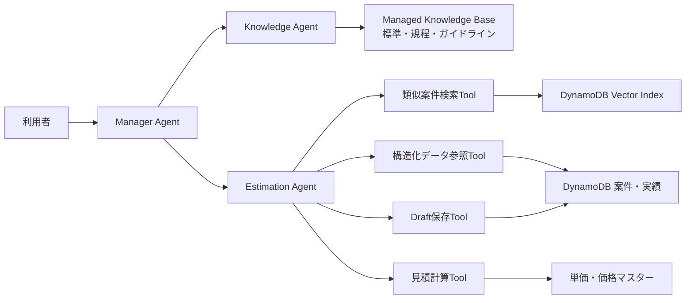

Knowledge Agentは根拠文書を検索し、Estimation Agentは数値と実績を扱います。最終回答と利用者との会話は、現在の [Manager Agent](/Users/aa003103/PycharmProjects/OpenAIAgentCore-base/agents/src/agent_app/agent_factory.py) が引き続き所有できます。

## Agentに公開するTool

汎用的な`put_item`、`scan_table`、`update_item`をそのまま公開するのは避けます。業務操作単位のToolにします。

### `search_similar_estimation_patterns`

```json
{
  "query_text": "Multi-AZのEC2/RDSによる業務Webシステム",
  "search_scope": "ORG001#INTERNAL",
  "filters": {
    "entity_type": "PROJECT_SUMMARY",
    "project_type": "NEW_BUILD",
    "outcome_quality": "ACCEPTED"
  },
  "top_k": 5
}
```

Tool内部で同一モデルによる埋め込み生成と`SearchVectors`を実行します。Agentから生の検索ベクトルを受け取らない方が安全です。

戻り値には以下を含めます。

```text
entity_id
similarity_score
score_semantics
summary
matched_attributes
estimate_version
actual_result
evidence_reference
```

コサイン距離ではスコアが低いほど類似します。Agentが通常の「高スコア＝良い」と誤認しない契約が必要です。

### `get_estimation_case`

類似検索で得たIDから、正式な構成、見積、実績、差異理由を取得します。ベクトル検索結果だけで工数を確定しません。

### `query_actual_effort`

```text
project_type
architecture_family
aws_service
phase
complexity
period
```

完全一致・Query向けの検索です。

### `aggregate_actual_effort`

返す統計値を限定します。

```text
sample_count
average
median
min
max
p75
p90
```

ただし、大量データを毎回ScanしてAgent側で集計する方式は避けます。PoCでは小規模集計、本番ではDynamoDB Streamsで集計Itemを更新するか、S3へエクスポートしてAthena等で分析します。

### `get_rate_card`

```text
role
grade
contract_type
as_of_date
currency
```

承認済みかつ有効期間内の単価だけを返します。

### `calculate_estimate`

計算はLLMではなくTool内の決定的なコードで実行します。

```text
工数 = 数量 × 標準工数 × 複雑度係数
原価 = Σ(役割別工数 × 原価単価)
提示価格 = 原価 ÷ (1 - 目標粗利率)
```

戻り値には式、入力値、単位、丸め前後、マスターバージョンを含めます。

### `save_estimate_draft`

保存対象は原則`draft`のみとします。

```text
estimate_id
expected_version
idempotency_key
input_snapshot_id
calculation_result
evidence_ids
```

楽観ロックと冪等キーを必須にします。Agentが既存の承認済み見積を上書きしてはいけません。

### 管理者向けTool

以下は通常の見積Agentから分離します。

- `record_project_actuals`
- `approve_rate_card`
- `approve_estimation_pattern`
- `finalize_estimate`
- `supersede_estimate`

## 見積作成フロー

1. 要件・構成・対象範囲・除外範囲を確定する
2. 入力スナップショットを作成する
3. Knowledge Baseから標準・ガイドラインを取得する
4. DynamoDBベクトル検索で類似案件・作業パターンを候補抽出する
5. 候補案件の構造化実績をID指定で取得する
6. 標準工数と過去実績から調整係数を提案する
7. 単価マスターを取得する
8. 計算Toolで工数・原価・提示価格を算出する
9. 標準値、類似実績、調整理由、リスクを併記する
10. 人がレビューした後にDraftを承認する

Agentには次を禁止します。

- 類似案件1件だけをそのまま採用する
- サンプル数が少ない統計を確定値として扱う
- Knowledge Baseの文章中の単価を最新単価として使う
- 根拠のない調整係数を生成する
- 未承認パターンを見積根拠にする
- 顧客名や機密情報を埋め込みテキストへ含める
- ベクトル類似度を見積信頼度として扱う

## より価値が高いユースケース

要員計画検索以外では、次の順に有効だと思います。

1. 類似案件からのWBSテンプレート生成
2. 過去の見積差異から、漏れやすい作業・リスクを検出
3. サービス・構成・複雑度別の標準工数補正
4. 見積と実績の差異分析によるガイドライン改善
5. 異常に安い・短い見積明細の検出
6. 類似案件で採用された要員構成の提案
7. 案件完了後の振り返りを再利用可能なパターンとして登録

特に「類似案件を探す」だけでなく、「なぜ見積を超過したか」を検索できるようにすることが、将来の見積精度向上へ最も効きます。

## 最初のPoC範囲

まずは以下に絞るのが妥当です。

- 1つの案件・実績テーブル
- 1つの単価マスターテーブル
- ベクトル化対象は案件サマリーと作業パッケージだけ
- `COSINE`のベクトルインデックス1個
- Toolは5個
  - 類似案件検索
  - 案件詳細取得
  - 実績集計
  - 単価取得
  - 見積計算
- 保存はDraftのみ
- 10～30件程度の評価用過去案件
- 人が定義した代表検索質問と正解案件による検索品質評価

DynamoDBベクトル検索は、検索量に加えて「インデックスへの書き込み量」「検索時に処理したデータ量」「インデックス保存量」で課金され、基礎テーブルの料金とは別です。投影属性を絞り、詳細は`GetItem`で取得する設計が有効です。[DynamoDB pricing](https://aws.amazon.com/dynamodb/pricing/#How_pricing_works_for_vector_search)

このPoCで検索精度と見積精度への寄与が確認できた後、要員計画パターン、リスクパターン、モデル比較用の第2ベクトルインデックスへ広げるのがよいでしょう。


# 質問 2

```text
DynamoDBに入れる情報で、事前に入れておく情報は、４，５でしょうか？
1、２、３はRFPから見積もりを作成する際に記載するものですか？
```

# 回答 2

はい、概ねその理解で合っています。ただし、事前登録する情報は「4. 過去実績」「5. 単価・価格ポリシー」だけでなく、標準工数などのマスターデータも必要です。

整理すると次のライフサイクルになります。

| 情報 | 登録タイミング | 作成主体 |
|---|---|---|
| 1. 案件・要件・構成 | RFP分析・要件整理・構成検討時 | 利用者＋Agent |
| 2. 見積明細 | 見積作成時 | AgentがDraft生成、人がレビュー |
| 3. 要員計画 | 見積作成時 | AgentがDraft生成、人が調整 |
| 4. 過去実績 | PoC開始前にサンプル登録。以後は案件完了時 | 実績管理者 |
| 5. 単価・価格ポリシー | 見積開始前にマスター登録 | 管理者・営業責任者 |
| 標準工数・補正ルール | 見積開始前にマスター登録 | 見積管理者 |
| 再利用可能な作業パターン | PoC開始前、または実績から承認登録 | 見積管理者 |

## 1. 案件・要件・構成

これはRFPを受け取った後、見積対象を整理する段階で登録する情報です。

ただし、RFP原文から自動的に確定させるのではなく、次の流れを推奨します。

```text
RFP
  ↓
Agentが要件候補を抽出
  ↓
不足・曖昧・矛盾を提示
  ↓
利用者が要件と前提を確認
  ↓
システム構成を決定
  ↓
案件入力スナップショットとしてDynamoDBへ保存
```

例えば、RFPから以下を抽出します。

- 本番・開発・検証環境の有無
- AWSアカウント数
- 対象リージョン
- EC2、ECS、Lambdaなどの構成
- 可用性、バックアップ、DR要件
- 監視、セキュリティ要件
- 移行、運用設計、教育などの作業範囲
- 顧客提供物
- 対象外
- 未確定事項

この時点では、以下のような状態管理が必要です。

```text
extracted    # RFPから抽出しただけ
proposed     # Agentまたは担当者の提案
confirmed    # 顧客・担当者により確認済み
unknown      # 未確定
```

見積計算には原則として`confirmed`を使用し、`proposed`や`unknown`を使う場合は「見積前提」や「リスク」として明示します。

## 2. 見積明細

これは1の確定した要件・構成を入力として、見積作成時に生成します。

例えば、EC2が5台ある場合は、事前登録された標準工数を使って次のような明細を生成します。

```text
EC2基本設計    1システム × 1.0人日 = 1.0人日
EC2詳細設計    5台 × 0.5人日       = 2.5人日
EC2構築        5台 × 0.5人日       = 2.5人日
EC2単体テスト  5台 × 0.3人日       = 1.5人日
```

この結果に、複雑度や過去実績からの補正を適用します。

```text
標準工数 × 数量 × 複雑度係数 × その他補正
```

見積明細はAgentが作成しますが、最初は`draft`として保存し、人が確認して`approved`にします。

## 3. 要員計画

これも見積作成時に生成する情報です。

2の見積明細を、役割と期間へ割り当てます。

```text
見積明細
  ↓
工程別工数
  ↓
役割別工数
  ↓
月別・週別の要員計画
```

例えば次のようになります。

| 役割 | 工程 | 工数 | 期間 |
|---|---|---:|---|
| PM | 全体管理 | 8人日 | 4か月 |
| AWSアーキテクト | 基本設計 | 10人日 | 1か月 |
| インフラエンジニア | 詳細設計・構築 | 30人日 | 2か月 |
| テスト担当 | 試験 | 12人日 | 1か月 |

Agentは過去案件の要員構成を参考にできますが、そのままコピーせず、今回の工程別工数と工期から再計算します。

## 事前に登録すべき情報

実際には、次の4分類を事前に用意します。

### A. 標準工数マスター

現在の「AWS構築見積ガイドライン」の数値部分です。

```text
work_standard_id
aws_service
task_type
unit
standard_person_days
complexity
effective_from
effective_to
version
approval_status
```

例：

```json
{
  "aws_service": "EC2",
  "task_type": "DETAILED_DESIGN",
  "unit": "INSTANCE",
  "standard_person_days": 0.5,
  "complexity": "STANDARD",
  "effective_from": "2026-04-01",
  "approval_status": "APPROVED"
}
```

### B. 単価・価格マスター

前述の5です。

- 役割別原価単価
- 役割別販売単価
- 粗利率またはマークアップ率
- 通貨
- 有効期間
- 丸め規則
- 承認状態

### C. 過去案件・実績

前述の4です。

- 案件の要件・構成
- 当初見積
- 最終見積
- 実績工数
- 実績工期
- 要員構成
- 見積差異
- 差異理由
- 品質評価
- 振り返り

ベクトル検索の主対象は、この過去案件から作る「案件サマリー」「作業パターン」「リスクパターン」です。

### D. コード・補正ルール

これも事前登録が必要です。

```text
複雑度:
  LOW
  STANDARD
  HIGH

補正例:
  Multi-AZ              × 1.1
  複数AWSアカウント     × 1.2
  新規Direct Connect    × 1.3
  高セキュリティ要件    × 1.2
```

ただし、補正係数はすぐに自動適用せず、最初は「提案値」として理由付きで提示する方が安全です。

## 一連のデータの流れ

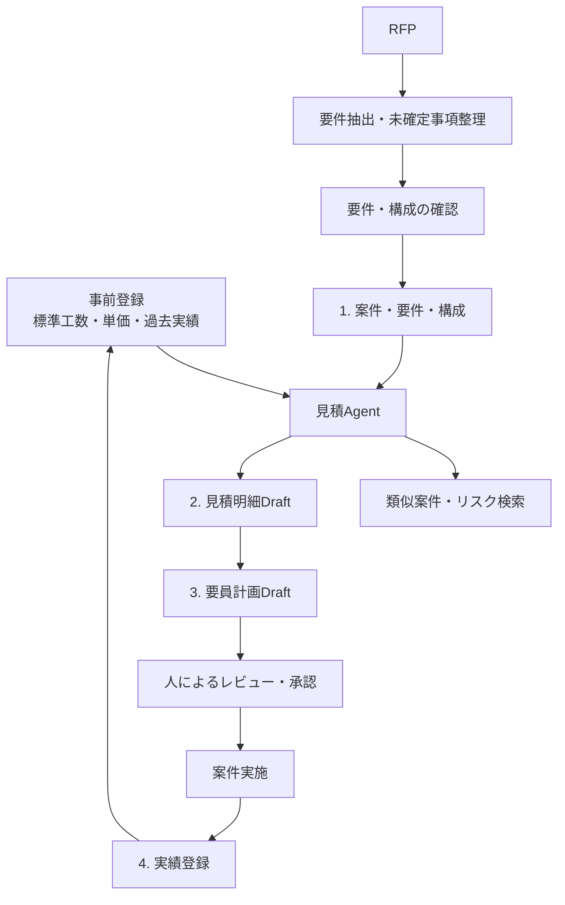

したがって、端的には次の整理です。

- 1はRFP分析後、見積の入力として保存する
- 2は1と標準工数・過去実績から作る見積結果
- 3は2を役割・期間へ割り当てた計画
- 4は事前データであり、案件完了後にも継続して蓄積する
- 5は見積前に管理者が登録するマスター
- これに加えて、標準工数と補正ルールも事前登録する

なお、最初のPoCでは「RFP原文の自動解析」まで一度に含めず、確認済みの要件・構成をJSONなどで入力し、そこから見積明細と要員計画を生成するところから始めると、見積ロジックとDynamoDBの有効性を評価しやすくなります。

# 質問 3
```text
「一連のデータの流れ」だと、どの部分がどのデータを担当するかなどわかりにくいです。
利用者、Manager Agent、Knowledge Agent、Estimation Agent(類似案件検索Tool) 、
Estimation Agent(構造化データ参照Tool) などと、案件・要件・構成、標準工数マスター、
単価・価格マスターなどの情報の関連をシーケンス図で説明してください。
```

# 回答 3

まず、`Estimation Agent（類似案件検索Tool）`と`Estimation Agent（構造化データ参照Tool）`は別々のAgentではなく、1つのEstimation Agentが用途別Toolを呼び分ける構成を推奨します。

## 1. 事前データ登録のシーケンス

見積を開始する前に、マスター・過去実績・社内標準を準備します。

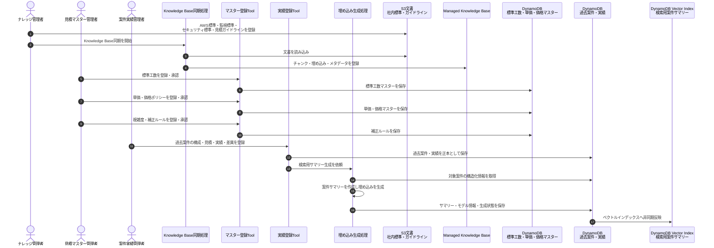

ここでの責任分担は次のとおりです。

- S3／Managed Knowledge Base
  - AWS標準
  - 監視標準
  - セキュリティ標準
  - 見積ガイドラインの説明文
  - 「なぜその作業が必要か」という根拠

- DynamoDBのマスター
  - 標準工数
  - 原価単価・販売単価
  - 粗利率・マークアップ率
  - 補正係数
  - 丸め規則
  - 有効期間・バージョン・承認状態

- DynamoDBの過去案件・実績
  - 過去案件の要件・構成
  - 見積工数・実績工数
  - 要員計画・実績要員
  - 見積差異・差異理由
  - 品質評価・振り返り

- DynamoDB Vector Index
  - 過去案件から生成した案件サマリー
  - 作業パッケージパターン
  - リスク・見積超過パターン

ベクトルインデックスは過去案件データの正本ではなく、正本を探すための索引です。

## 2. RFPから見積を作成するシーケンス

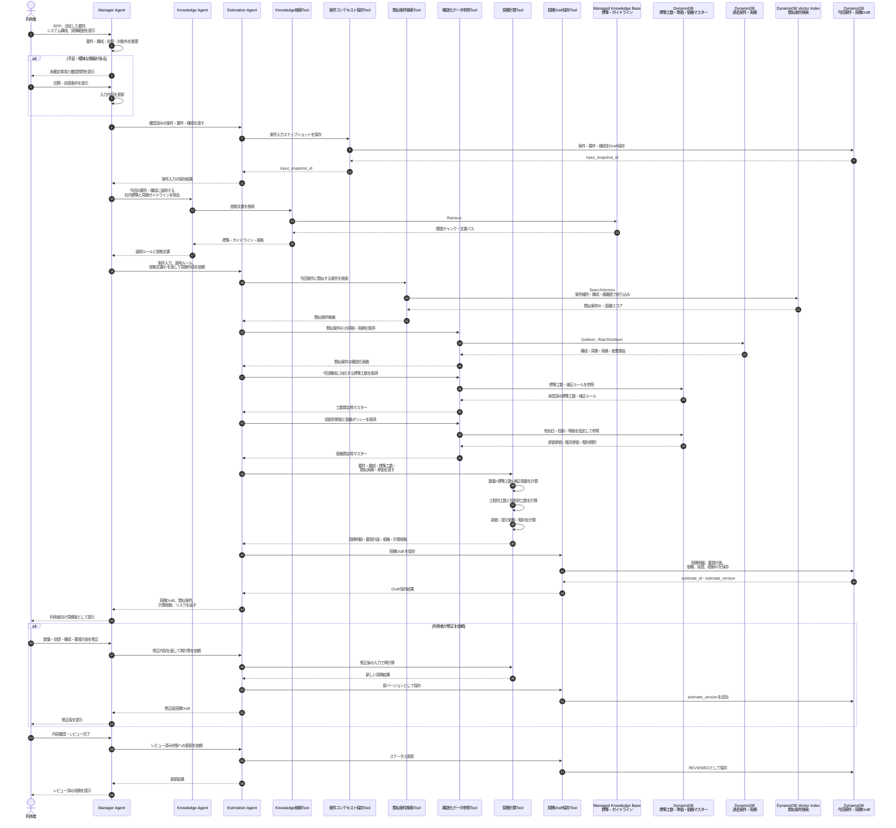

## データごとの担当

| データ | 作成・更新する主体 | 参照する主体 | 保存先 |
|---|---|---|---|
| RFP原文 | 利用者・顧客 | Manager Agent | S3等の案件文書領域 |
| 案件・要件・構成 | 利用者＋Manager Agentが整理 | Knowledge Agent、Estimation Agent | DynamoDB今回案件 |
| 見積前提・対象外 | 利用者＋Manager Agent | Knowledge Agent、Estimation Agent | DynamoDB今回案件 |
| AWS・監視・セキュリティ標準 | ナレッジ管理者 | Knowledge Agent | Managed Knowledge Base |
| 見積ガイドラインの説明 | ナレッジ管理者 | Knowledge Agent | Managed Knowledge Base |
| 標準工数マスター | 見積マスター管理者 | 構造化データ参照Tool | DynamoDBマスター |
| 単価・価格マスター | 単価管理者 | 構造化データ参照Tool | DynamoDBマスター |
| 補正ルール | 見積マスター管理者 | 構造化データ参照Tool、見積計算Tool | DynamoDBマスター |
| 過去案件・実績 | 実績管理者 | 類似案件検索Tool、構造化データ参照Tool | DynamoDB過去案件 |
| 検索用案件サマリー | 埋め込み生成処理 | 類似案件検索Tool | DynamoDB Vector Index |
| 見積明細 | 見積計算Tool | Manager Agent、利用者 | DynamoDB今回案件 |
| 要員計画 | 見積計算Tool | Manager Agent、利用者 | DynamoDB今回案件 |
| 原価・提示価格 | 見積計算Tool | Manager Agent、権限を持つ利用者 | DynamoDB今回案件 |
| 見積根拠 | Knowledge Agent＋Estimation Agent | Manager Agent、利用者 | DynamoDB今回案件 |

## 各AgentとToolの責任境界

### Manager Agent

- 利用者との会話を所有する
- RFPから案件情報を整理する
- 未確定事項を利用者に確認する
- Knowledge AgentとEstimation Agentの結果を統合する
- 見積案を利用者向けに説明する
- 自身ではDynamoDB検索や金額計算を行わない

### Knowledge Agent

- Managed Knowledge Baseだけを検索する
- AWS標準、監視標準、セキュリティ標準を返す
- 見積ガイドラインの説明と根拠文書を返す
- 工数・単価・価格を確定しない
- DynamoDBへ書き込まない

### Estimation Agent

- 見積処理全体を制御する
- 類似案件検索Toolで候補案件を探す
- 構造化データ参照Toolで正確な数値を取得する
- 見積計算Toolへ入力を渡す
- 計算結果と根拠をまとめる
- Draftだけを保存する

### 類似案件検索Tool

- 今回案件の検索文を埋め込みへ変換する
- DynamoDB Vector Indexを検索する
- 類似案件IDと距離スコアを返す
- 工数や価格を計算しない
- ベクトル検索結果だけで見積を確定しない

### 構造化データ参照Tool

- 標準工数、単価、補正ルールを正確に取得する
- 類似案件IDから正式な過去実績を取得する
- 有効期間と承認状態を検証する
- 集計が必要な場合は決められた集計処理を実行する

### 見積計算Tool

- 工数、原価、提示価格を決定的に計算する
- LLMの暗算を利用しない
- 使用した入力値、式、単位、丸め規則を返す
- 見積明細から役割別・期間別の要員計画を作る

重要なのは、Knowledge Agentが返す「標準の説明」と、DynamoDBから取得する「計算用数値」を分離する点です。両者が矛盾した場合はAgentがどちらかを推測採用せず、見積マスターの不整合として利用者へ確認を求めます。

# 質問 3

```text
利用者がこのシステムで、利用する画面をReactなどで作成しようと考えています。
この際、「2. RFPから見積を作成するシーケンス」において、①、③、④　㊺、46、54、59は、
Reactと直接Agentがやり取りする形で、アプリケーションを構築するのが良いですか？

以前、Parantia Businessの質問をしたとき、Palantir AIPのようにするには、
AWS Step Functionsを間に入れるとよいとアドバイスをもらいました。
React - AWS Step Functions - AgentCoreという構成にするのが良いのでしょうか？
```

# 回答 3
結論として、すべてを `React → Step Functions → AgentCore` にするのではなく、次の2経路に分けるのが適しています。

- 会話・確認質問・回答ストリーミング  
  `React → API/BFF → AgentCore Runtime`
- 見積作成、再計算、レビュー待ち、承認などの業務ワークフロー  
  `React → API/BFF → Step Functions Standard → AgentCore／業務処理`

ReactからAgentCoreを直接呼ぶ構成は技術的には可能ですが、この見積システムではBFFを挟むことを推奨します。

## 推奨構成

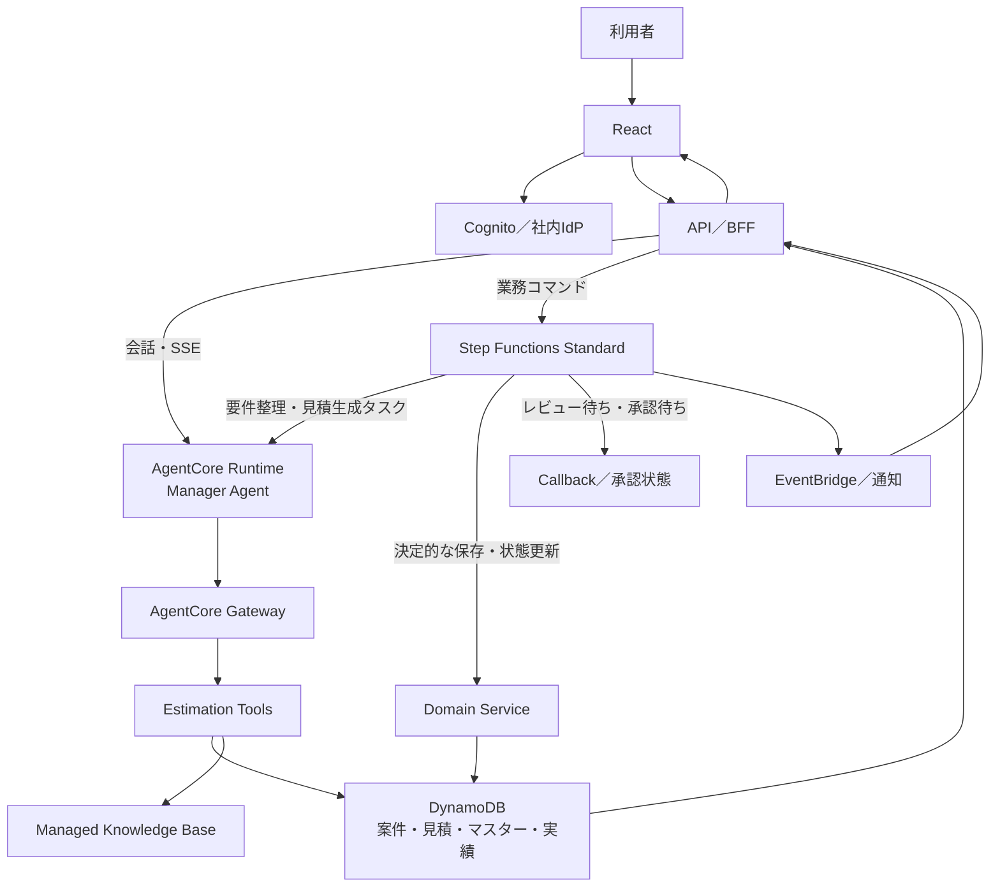

ここでいうBFFは、React専用のバックエンドです。Lambda、ECS/Fargate、App Runnerなど、SSEを中継できる実装方式を選択します。

## ご指定の番号の扱い

Mermaidの自動番号は図の変更でずれるため、前回のシーケンス上で対応すると考えられる操作を分類します。

| 操作 | 推奨経路 | Step Functions |
|---|---|---|
| ① RFP・要件・構成の提示 | React → BFF → AgentCore | RFP処理開始時だけ利用 |
| ③ 未確定事項の提示 | AgentCore → BFF → React、SSE | 不要 |
| ④ 利用者の回答 | React → BFF → AgentCore | 要件確定イベントは記録してもよい |
| ㊺ 見積結果の生成完了 | Step Functions → DynamoDB | 利用推奨 |
| ㊻ 見積案の表示 | React → BFF → DynamoDB | 不要 |
| 54 修正版見積の提示 | React → BFF → DynamoDB | 再計算処理で利用推奨 |
| 59 レビュー済み見積の提示 | React → BFF → DynamoDB | 承認処理で利用推奨 |

重要なのは、Agentの文章応答からReactが見積明細を復元しないことです。見積明細、要員計画、価格はDynamoDBへ構造化保存し、Reactは通常のAPIから取得して画面表示します。

## ① RFPの入力

RFPファイルをReactから直接AgentCoreへ送るより、次の流れが適しています。

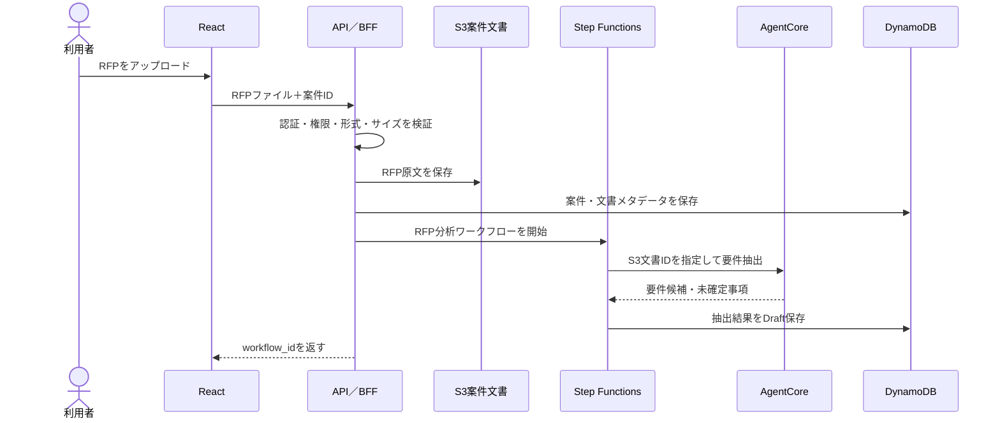

Step FunctionsへRFP全文を渡さず、次のIDだけを渡します。

```json
{
  "workflow_id": "wf-001",
  "project_id": "project-001",
  "document_id": "rfp-001",
  "s3_object_key": "projects/project-001/rfp/rfp-001.pdf",
  "requested_by": "user-001"
}
```

## ③・④ 確認質問と回答

ここは対話性が重要なので、Step Functionsを毎回通す必要はありません。

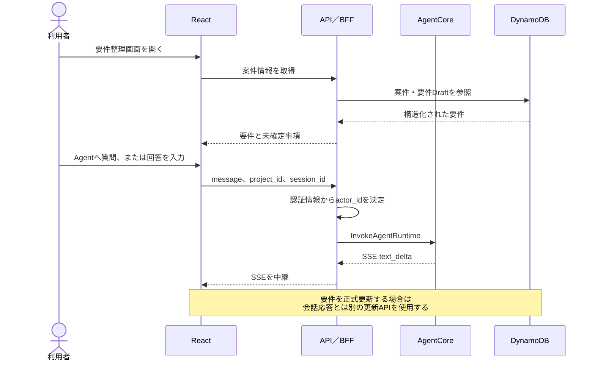

AgentCoreの`InvokeAgentRuntime`はストリーミング応答とセッション管理をサポートしており、対話型アプリケーション向けです。[AgentCore Runtimeの呼び出し](https://docs.aws.amazon.com/bedrock-agentcore/latest/devguide/runtime-invoke-agent.html)

Step Functionsをここへ挟むと、Agentの途中応答をそのままReactへストリーミングしにくくなり、会話のレイテンシーも増えます。

## 見積生成・再計算

見積生成はStep Functionsを使う価値があります。

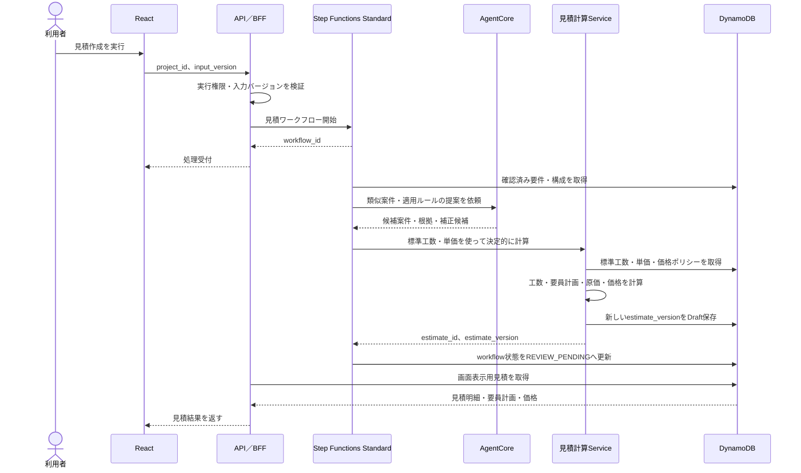

ここでは役割を明確に分けます。

- AgentCore
  - 類似案件を探す
  - 適用すべき標準を判断する
  - 見積漏れやリスクを提案する
  - 補正候補と理由を提示する

- 見積計算Service
  - 工数を計算する
  - 単価を適用する
  - 原価・価格・粗利を計算する
  - バージョン付きで保存する

- Step Functions
  - 処理順序を制御する
  - タイムアウト・再試行・失敗状態を管理する
  - 人のレビュー待ちを管理する
  - 実行履歴を保持する

## 46・54の見積表示

ReactはAgentの最終文章ではなく、DynamoDB上の見積データをBFF経由で取得して表示します。

```text
GET /projects/{projectId}/estimates/{estimateId}/versions/{version}
```

レスポンス例：

```json
{
  "estimate_id": "estimate-001",
  "version": 3,
  "status": "REVIEW_PENDING",
  "input_snapshot_id": "input-005",
  "lines": [
    {
      "phase": "DETAILED_DESIGN",
      "service": "EC2",
      "quantity": 5,
      "unit": "INSTANCE",
      "standard_person_days": "0.5",
      "adjustment_factor": "1.2",
      "estimated_person_days": "3.0"
    }
  ],
  "resource_plan": [],
  "cost_summary": {},
  "evidence": [],
  "risks": []
}
```

Agentの説明文は、これに付随する`explanation`として表示します。説明文を見積の正本にはしません。

## 59 レビュー・承認

承認はAgentへのチャットだけで完了させず、明示的な画面操作にします。

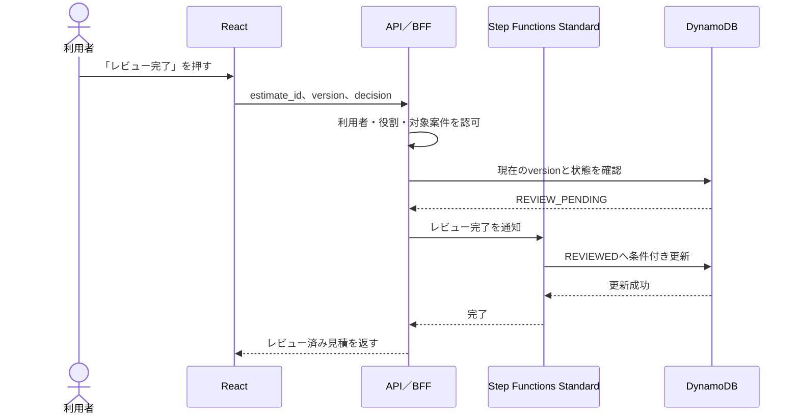

Step FunctionsのTask TokenをReactへ渡してはいけません。Reactは`workflow_id`と承認内容をBFFへ送信し、BFFがサーバー側でStep Functionsを再開します。

人の確認を待つ処理には、最大1年間実行でき、Callbackパターンを利用できるStandard Workflowが向いています。Express Workflowは最大5分で、Callbackや`.sync`パターンをサポートしません。[ワークフロー種別の比較](https://docs.aws.amazon.com/step-functions/latest/dg/choosing-workflow-type.html)、[Step Functionsの連携パターン](https://docs.aws.amazon.com/step-functions/latest/dg/connect-to-resource.html)

## ReactからAgentCoreを直接呼ばない理由

現在のプロジェクトはAgentCore RuntimeをIAM認証で呼び出し、HTTP/SSEで結果を返します。また、現在の入力契約では`actor_id`をbodyで受け取っています。

本番のReactアプリでは、ブラウザが指定した`actor_id`をそのまま信用すべきではありません。BFFで認証済みユーザーのクレームから生成します。

```text
Cognito sub / 社員ID
    ↓
BFFで認証・認可
    ↓
actor_id = 組織ID + ユーザーID
```

例えばReactからは次だけを送ります。

```json
{
  "project_id": "project-001",
  "session_id": "session-001",
  "message": "未確定事項について説明してください"
}
```

BFFがAgentCore向けに変換します。

```json
{
  "prompt": "未確定事項について説明してください",
  "actor_id": "ORG001:user-001"
}
```

BFFを入れることで、以下を一元管理できます。

- 認証・案件単位の認可
- `actor_id`の詐称防止
- AgentCore Runtime ARNの隠蔽
- IAM権限のサーバー側管理
- SSE中継
- レート制限
- 入力検証
- 監査ログ
- 冪等性
- Agentバージョンの切り替え
- 機密情報のマスキング

## Palantir AIPに近づけるための考え方

Step Functionsを追加しただけではPalantir AIPのような構成にはなりません。重要なのは次の4層です。

| Palantir AIP的な概念 | このシステムでの対応 |
|---|---|
| Ontology | 案件、要件、構成、見積、要員計画、実績の型と関連 |
| Governed Actions | 要件確定、見積作成、再計算、レビュー、承認 |
| Workflow | Step Functions Standard |
| AI reasoning | AgentCoreのManager／Knowledge／Estimation Agent |

つまり、Step Functionsは「業務プロセス」を担当し、DynamoDBの構造化データが「業務オブジェクト」を担当し、AgentCoreが「判断支援」を担当します。

最終的な推奨は次の構成です。

```text
React
  └─ API／BFF
      ├─ 対話API ─────────────── AgentCore Runtime
      ├─ 案件・見積参照API ───── DynamoDB
      ├─ 業務コマンドAPI ─────── Step Functions Standard
      │                            ├─ AgentCore Runtime
      │                            ├─ 見積計算Service
      │                            └─ DynamoDB
      └─ ファイルAPI ──────────── S3
```

したがって、`React → Step Functions → AgentCore`は見積生成や承認フローには適していますが、すべての会話までStep Functions経由にせず、対話経路と業務ワークフロー経路を分けるのがよいです。

# 質問 4
```text
ReactからAgentCoreを直接呼ばない理由は、内容が薄いです。React側からCognito認証を使えばよいです。
BFFを入れたほうが良い理由を明確にしてください。
また、BFFを入れるならStep Functionsがなくてもよいのでは？と考えます。Step Functionsを入れるとよい理由を明確にしてください。

このプロンプトの回答は、前回の質問の回答はなかったことにして、再度作成してください。
また、BFFとして、一番良いのは、処理時間の関係上ECS/Fargateが良いのかと思いますが、
今はLambdaでも処理時間を気にしなくても良いのでしょうか？もしLambdaで処理時間を気にしなくても良いのであれば、
BFFとしてLambdaを使用したいです。App Runnerはあまり使いたくありません。
```

# 回答 4
結論から言うと、このシステムでは次の構成を推奨します。

```text
React
  ↓ Cognito JWT
API Gateway
  ↓
Lambda BFF
  ├─ 対話処理 ───────── AgentCore Runtime
  ├─ 参照・更新 ─────── DynamoDB / S3
  └─ 長期業務処理 ───── Step Functions Standard
                         ├─ AgentCore Runtime
                         ├─ 見積計算Lambda
                         └─ DynamoDB
```

BFFは認証のためではなく、「画面から実行できる業務操作を制御する境界」として入れます。Step FunctionsはBFFの代わりではなく、「複数リクエストをまたぐ長時間の業務状態」を管理するために入れます。

Lambdaは現在も最大15分という制限があるため、処理時間を気にしなくてよいわけではありません。ただしBFFを短時間処理とストリーミング中継に限定し、長時間処理をStep Functionsへ逃がすなら、今回の第一候補はLambdaです。

## ReactからAgentCoreを直接呼ぶ構成

Cognitoを利用すれば、次の構成は実現できます。

```text
React
  ↓ Cognito認証
AgentCore Runtime
```

方法としては、例えば以下があります。

- Cognito Identity Poolから一時的なAWS認証情報を取得し、`InvokeAgentRuntime`をSigV4署名して呼び出す
- Cognito User PoolなどのOAuthトークンを使い、AgentCore RuntimeのInbound Authを利用する

したがって、「ReactからAgentCoreを直接呼べない」ということではありません。

純粋な社内チャットや、データを更新しない検索専用Agentなら、この構成も選択肢です。

一方、今回のシステムは以下を行います。

- 顧客案件の参照
- 要件・構成の更新
- 単価情報の参照
- 見積作成
- 見積バージョンの更新
- レビュー
- 承認
- 将来的な実績登録

この場合、Cognito認証だけでは不十分です。

## BFFを入れる最も重要な理由

BFFを入れる最大の理由は、AgentCoreの呼び出し権限と、見積業務の実行権限を分離するためです。

### Cognitoが保証するのは「誰か」

Cognitoで分かるのは基本的に次の情報です。

```text
誰がログインしているか
所属組織
グループ
ロール
トークンの有効性
```

しかし、見積システムで必要なのはそれだけではありません。

```text
この利用者が、この案件を参照できるか
この案件の単価を参照できるか
この見積を更新できるか
このバージョンをレビューできるか
この見積を承認できるか
現在の案件状態で、その操作を実行できるか
```

これらは業務オブジェクト単位の認可です。

例えば、同じ`Estimator`グループの利用者でも、

- 担当案件だけ参照可能
- 他部門の案件は参照不可
- 原価単価は非表示
- 提示価格だけ参照可能
- 承認はマネージャーのみ

といった制御が必要です。

### AgentCore直接呼び出しの問題

Reactに`InvokeAgentRuntime`権限を持たせると、利用者はReact画面を通さずにAgentCore Runtimeを呼び出せます。

```text
React画面
    └─ 正常な入力

AWS SDK・curl・独自スクリプト
    └─ 任意のprompt
    └─ 任意のproject_id
    └─ 任意のsession_id
    └─ 大量呼び出し
```

Cognitoの一時認証情報が正当でも、次のような呼び出しを防ぐ必要があります。

```text
担当外の案件IDをpromptに指定
「承認済み見積を上書きして」と依頼
UIに存在しない管理操作を要求
別ユーザーのactor_idを指定
短時間にAgentを大量呼び出し
意図的に長時間処理を発生させる
```

AgentCore Runtime内ですべての認可を実装することもできますが、その場合、AgentCore Runtimeが次の責任を抱えます。

- ユーザー認証
- 案件ACL
- 画面API
- 入力検証
- 利用量制限
- 見積状態遷移
- 監査ログ
- Agent実行
- Tool実行

これは、Agent Runtimeが実質的にBFFを内包している状態です。

### BFFで業務コマンドへ変換する

ReactからAgentへ自由なpromptだけを送るのではなく、BFFで用途を分けます。

```text
POST /chat/messages
POST /projects/{id}/requirements
POST /projects/{id}/estimate-jobs
POST /estimates/{id}/recalculate
POST /estimates/{id}/submit-review
POST /estimates/{id}/approve
```

例えば承認処理は、次のような明示的なAPIにします。

```json
{
  "estimate_id": "estimate-001",
  "expected_version": 4,
  "decision": "APPROVE",
  "comment": "見積条件を確認済み"
}
```

BFFは以下を検証します。

```text
ログインユーザーは承認者か
案件へのアクセス権があるか
対象バージョンは現在も最新か
現在状態はREVIEW_PENDINGか
同じ操作が既に実行されていないか
```

Agentへの「この見積を承認して」という自然言語だけでは承認を完了させません。

## BFFが担当すべき具体的な責務

### 1. 案件単位の認可

```text
Cognito sub
  ↓
organization_id
role
project_membership
cost_visibility
approval_authority
```

Cognitoのクレームだけで完結しない場合、DynamoDBの案件ACLも確認します。

### 2. Agentセッションの固定

ブラウザから`actor_id`を受け取らず、BFFが認証情報から生成します。

```text
actor_id = organization_id + ":" + cognito_sub
```

また、`session_id`と`project_id`の対応をサーバー側で管理し、他案件のセッションを流用できないようにします。

### 3. AgentCoreの公開契約を隠す

ReactはAgentCore固有の以下を知りません。

- Runtime ARN
- qualifier
- Runtime session IDの規則
- Agentのバージョン
- AgentCoreのエラー形式
- AgentCoreのSSEイベント形式

BFFが画面用の安定したAPIへ変換します。

これによりAgentの構成を変更しても、Reactへの影響を抑えられます。

### 4. 書き込み操作の強制分離

チャット経由で実行可能な操作と、業務API経由でのみ実行可能な操作を分けます。

| 操作 | Agent経由 | 業務API経由 |
|---|---:|---:|
| 標準の説明 | 可 | 不要 |
| 類似案件検索 | 可 | 可 |
| 見積Draftの提案 | 可 | 可 |
| 要件の正式確定 | 不可 | 必須 |
| 見積のレビュー提出 | 不可 | 必須 |
| 見積の承認 | 不可 | 必須 |
| 単価マスター更新 | 不可 | 必須 |
| 実績確定 | 不可 | 必須 |

### 5. 利用量・コスト制御

AgentCoreへの呼び出し前に、次を制御できます。

- ユーザー別・組織別レート制限
- 同時実行数
- 1案件あたりの見積生成回数
- promptサイズ
- 添付ファイルサイズ
- 1日あたりのモデル利用上限
- 同一リクエストの重複実行防止

### 6. 監査

業務監査では、Agentの会話ログだけでなく、次を記録する必要があります。

```text
誰が
いつ
どの案件に対して
どの操作を
どの入力バージョンで実行し
どの見積バージョンが生成され
誰がレビュー・承認したか
```

これはBFFの業務APIで記録する方が確実です。

## BFFがあればStep Functionsは不要か

単純な構成なら、不要です。

例えば以下だけなら、Lambda BFFからAgentCoreを呼び出してDynamoDBへ保存すれば十分です。

```text
利用者が質問
  ↓
Agentが回答
  ↓
回答を表示
```

または、

```text
利用者が見積作成を実行
  ↓
AgentCoreを1回呼び出す
  ↓
見積計算を1回実行
  ↓
DynamoDBへ保存
  ↓
結果を返す
```

この処理が数分以内に完了し、人の承認待ちや途中再開がなければ、Step Functionsを入れるメリットは小さいです。

## 今回Step Functionsを入れる理由

今回の見積作成は、実際には1回のAPIリクエストではなく、複数段階の業務プロセスです。

```text
RFP登録
  ↓
要件抽出
  ↓
利用者の確認待ち
  ↓
要件確定
  ↓
類似案件検索
  ↓
標準工数取得
  ↓
単価取得
  ↓
見積計算
  ↓
見積Draft保存
  ↓
レビュー待ち
  ↓
修正・再計算
  ↓
承認待ち
  ↓
確定
```

この処理は、数時間から数日かかる可能性があります。

BFFだけで実装する場合、実質的に次の仕組みを自作することになります。

- 現在の処理状態
- 次に実行する処理
- 失敗した処理だけの再実行
- リトライ回数
- タイムアウト
- 人の回答待ち
- 承認待ち
- キャンセル
- 重複実行防止
- 実行履歴
- 障害復旧
- 中断箇所からの再開

Step Functionsは、この「時間をまたぐ処理状態」を担当します。

### BFFとStep Functionsの違い

| 観点 | BFF | Step Functions |
|---|---|---|
| 主な責務 | ReactとのAPI境界 | 業務処理の進行管理 |
| 寿命 | 1 HTTPリクエスト | 数秒～最大1年 |
| ユーザー認証 | 担当 | 原則担当しない |
| 案件認可 | 担当 | 検証済み情報を受け取る |
| SSE中継 | 担当 | 不向き |
| 人の承認待ち | 不向き | 得意 |
| タスク単位リトライ | 自作が必要 | 標準機能 |
| 処理履歴 | アプリログ | ステート実行履歴 |
| 障害後の再開 | 自作が必要 | ワークフローで管理 |
| Agent呼び出し順序 | 短い処理なら可能 | 複数段階の処理に適する |

BFFは「入口」、Step Functionsは「業務プロセスエンジン」です。

### Agentに業務状態を持たせない

Agentの会話履歴を、次のような業務状態の正本にすべきではありません。

```text
要件確認済み
見積計算済み
レビュー待ち
修正依頼中
承認済み
```

AgentのMemoryは会話文脈のために使い、業務状態はDynamoDBとStep Functionsで管理します。

### 人のレビュー待ち

Standard Workflowは最大1年間実行でき、Callbackパターンで外部の承認を待てます。Express Workflowは最大5分で、Callbackに対応しないため、今回利用するならStandardです。[Step Functionsのワークフロー種別](https://docs.aws.amazon.com/step-functions/latest/dg/choosing-workflow-type.html)

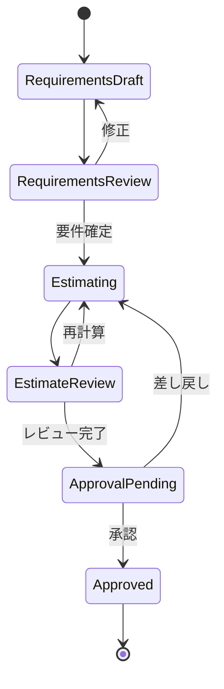

この状態遷移をLambda BFF内へ書くこともできますが、最終的にはDynamoDB上の状態、EventBridge、リトライ、定期確認などを組み合わせた独自ワークフローエンジンになります。

## Step Functionsを使わない方がよい範囲

すべてをStep Functionsへ通す必要はありません。

### Step Functionsを使わない

- 通常のAgentチャット
- Knowledge Baseへの質問
- 類似案件の検索だけ
- 案件一覧取得
- 見積明細表示
- 入力フォームの保存
- 入力バリデーション
- 単純なDraft更新

### Step Functionsを使う

- RFP解析ジョブ
- 見積生成ジョブ
- 大量案件の埋め込み生成
- 複数Toolを順番に実行する処理
- 失敗時に途中から再開したい処理
- 人のレビュー・承認待ち
- 差し戻し・再計算
- 最終確定処理
- 案件完了後の実績反映

## 推奨する実行経路

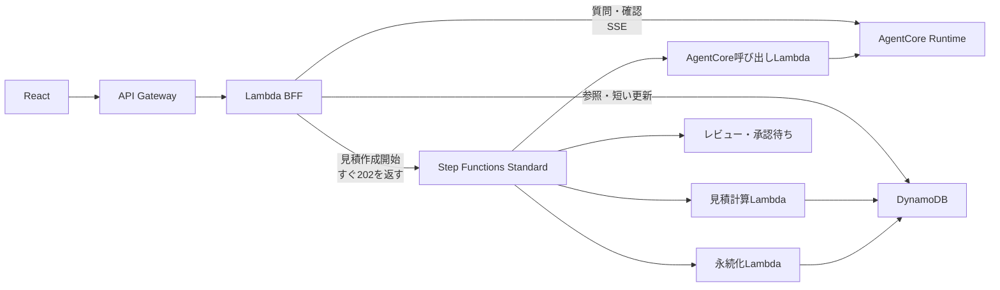

## LambdaをBFFに使えるか

使えます。今回の第一候補として妥当です。

ただし、「現在のLambdaでは処理時間を気にしなくてよい」ということではありません。Lambdaの最大実行時間は現在も900秒、つまり15分です。[Lambda timeout](https://docs.aws.amazon.com/lambda/latest/dg/configuration-timeout.html)

AgentCoreの1回の呼び出しが15分を超える可能性があるなら、その接続をLambdaで保持できません。

### Lambda BFFに向いている処理

- Cognito JWTの検証後の追加認可
- 案件一覧・詳細取得
- 入力フォーム保存
- S3用署名付きURLの発行
- Step Functions実行開始
- ワークフロー状態取得
- 承認API
- 数分程度のAgentCore呼び出し
- AgentCoreのSSE中継

### Lambda BFFに向かない処理

- 15分を超えるAgent処理
- 数十分接続し続けるストリーム
- 常時大量の長時間接続
- 長時間のバッチ処理
- コンテナ内に大きな常駐状態を持つ処理
- 独自プロトコルや高度な接続制御

## LambdaでAgentCoreのSSEを中継できるか

可能です。

Lambdaは次の方法でレスポンスストリーミングに対応しています。

- Lambda Function URL
- `InvokeWithResponseStream`
- API GatewayのLambda proxy response streaming

Lambdaレスポンスストリーミングは最大200 MBで、先頭6 MB以降には帯域制限があります。AgentのテキストSSEで200 MBへ達することは通常ありません。[Lambda response streaming](https://docs.aws.amazon.com/lambda/latest/dg/configuration-response-streaming.html)

API GatewayもLambdaの`InvokeWithResponseStream`を利用したストリーミングプロキシに対応しています。[API Gateway Lambda response streaming](https://docs.aws.amazon.com/apigateway/latest/developerguide/response-transfer-mode-lambda.html)

注意点は次のとおりです。

- Lambdaの実行時間上限は15分のまま
- ストリーム接続中はLambdaが実行中
- Lambda同時実行数を消費する
- 利用者が接続を切ってもLambda実行が直ちに停止しない場合がある
- ストリーム中のLambda実行時間も課金される
- API Gateway側の統合タイムアウトも設計が必要
- Regional REST APIの統合タイムアウトは標準29秒で、上限緩和申請が可能だが、リージョン全体のスロットリングクォータへ影響する場合がある

API Gatewayのタイムアウトについては[AWS公式クォータ](https://docs.aws.amazon.com/apigateway/latest/developerguide/api-gateway-execution-service-limits-table.html)を確認する必要があります。

### Lambda BFFはNode.jsを推奨

Lambdaのマネージドランタイムでネイティブなレスポンスストリーミングを使いやすいのはNode.jsです。

Reactと合わせてTypeScriptで実装すれば、次の型を共有できます。

- Agent SSEイベント
- 案件API
- 見積明細
- 要員計画
- ワークフロー状態
- エラーコード

PythonでもLambda Web Adapterやカスタムランタイムでストリーミングできますが、BFFだけならNode.js/TypeScriptの方が単純です。

## ECS/Fargateを選ぶ条件

次の条件があるなら、LambdaよりECS/Fargateが適しています。

- Agent応答が頻繁に15分を超える
- SSE接続が長時間継続する
- 同時接続数が多く、Lambda実行時間課金が不利
- コネクションプールやローカルキャッシュを活用したい
- PythonのASGIアプリをそのまま長時間稼働させたい
- WebSocketやストリーム接続を細かく制御したい
- VPC内の複数リソースへ常時接続したい
- 一定以上の継続トラフィックがある

現段階の見積PoCでは、そこまでの条件は見えていません。

## 今回の推奨判断

### BFF

Lambdaを採用します。

```text
API Gateway Regional REST API
  ＋ Cognito User Pool Authorizer
  ＋ Node.js/TypeScript Lambda BFF
```

Lambda BFFは用途を分けます。

```text
ChatStreamFunction
  - AgentCore呼び出し
  - SSE中継
  - 例: タイムアウト3～5分

ApiFunction
  - 案件参照
  - 入力保存
  - ワークフロー開始
  - 承認
  - 例: タイムアウト10～30秒
```

ストリーミング用と通常API用を分けることで、タイムアウト、同時実行数、障害範囲を個別管理できます。

### Step Functions

Standard Workflowを採用します。ただし、チャットには使いません。

対象は次だけです。

```text
RFP解析
見積生成
見積再計算
レビュー待ち
承認待ち
差し戻し
最終確定
```

### AgentCore

以下に限定します。

```text
自然言語の理解
Knowledge検索
類似案件検索
見積項目・リスク・補正候補の提案
結果の説明
```

### 決定的な業務処理

LambdaまたはTool Serviceに分離します。

```text
工数計算
単価適用
価格計算
バージョン採番
状態遷移
承認
DynamoDBへの条件付き更新
```

最終的には、Lambda BFFとStep Functionsは競合するものではありません。

- Lambda BFF：誰が、何を実行できるか
- Step Functions：開始した業務処理が、今どこまで進んでいるか
- AgentCore：何を提案するか
- DynamoDB：何が正式な業務データか

この分離が、今回の見積アプリケーションでは最も重要です。

# 質問 5
```text
Palantir AIPに近づけるための考え方
の記述がなくなってます。追記してください。
```
以下を前回回答への追記としてください。

## Palantir AIPに近づけるための考え方

Palantir AIPに近づけるうえで重要なのは、単に「ReactからAgentと会話できる」ことではありません。

中心となる考え方は次の3点です。

1. 業務データを意味のあるオブジェクトと関連として定義する
2. 更新操作を、権限・条件・副作用を持つ業務Actionとして定義する
3. AIは業務データを直接自由更新せず、Actionを提案・実行する

PalantirはOntologyを、データの上に構築される組織の運用レイヤーとして位置付けています。Ontologyには、オブジェクト・プロパティ・リンクという意味的要素に加え、Action・Function・セキュリティなどの動的要素が含まれます。[Palantir Ontology](https://www.palantir.com/docs/foundry/ontology/overview/)

### AWS構成との対応

| Palantirの概念 | 今回のAWSアプリケーション |
|---|---|
| Foundry Data | DynamoDB、S3、Managed Knowledge Base、必要に応じてAthena |
| Ontology Object | 案件、要件、構成、見積、見積明細、要員計画、過去実績 |
| Ontology Property | 工数、数量、単価、価格、状態、バージョン |
| Ontology Link | 案件と要件、案件と見積、見積と明細、案件と過去実績 |
| Ontology Action | 要件確定、見積生成、再計算、レビュー提出、承認 |
| Ontology Function | 工数計算、価格計算、実績集計、類似度評価 |
| AIP Logic／Agent | AgentCoreのManager・Knowledge・Estimation Agent |
| Workflow | Step Functions Standard |
| Workshop／Application | Reactアプリケーション |
| Object Security | Cognito、BFF、Action Service、IAM、案件ACL |
| Audit／Lineage | DynamoDB履歴、Step Functions履歴、CloudTrail、CloudWatch |
| AIP Evals | 類似案件検索評価、見積精度評価、Agent回答評価 |

Palantir AIPはAIを組織のデータと業務処理へ接続し、既存のセキュリティ、監査、リソース管理の枠組みの中でAgentやワークフローを構築する考え方です。[Palantir AIP overview](https://www.palantir.com/docs/foundry/aip/overview/)

## Reactをチャット画面だけにしない

Palantir AIP的なアプリケーションでは、React画面の中心はチャットではなく業務オブジェクトです。

例えば、案件画面では次のオブジェクトを表示します。

```text
Project
├── Requirements
├── Architecture
├── Assumptions
├── Estimate
│   ├── EstimateLines
│   ├── ResourcePlan
│   ├── CostSummary
│   └── Evidence
├── Workflow
└── ActualResults
```

Agentとのチャットは、これらのオブジェクトを操作する補助インターフェースです。

```text
「この要件から見積を作成してください」
「類似案件との差を説明してください」
「RDS部分だけ再計算してください」
「不足しているセキュリティ作業を提案してください」
```

Agentは自然言語を理解しますが、結果は構造化された業務オブジェクトとして保存します。

```json
{
  "object_type": "EstimateProposal",
  "project_id": "project-001",
  "input_snapshot_version": 5,
  "proposed_lines": [],
  "proposed_resource_plan": [],
  "evidence_ids": [],
  "risk_ids": []
}
```

## BFFだけでなくAction Serviceを設ける

Palantir AIPに近づけるなら、業務ルールをLambda BFFだけに実装するべきではありません。

BFFはReact専用のAPI変換層ですが、業務ActionはReact以外からも呼び出されます。

- React画面
- AgentCoreのTool
- Step Functions
- 管理バッチ
- 将来の外部API

そこで、BFFの下に共通のAction Serviceを設けます。

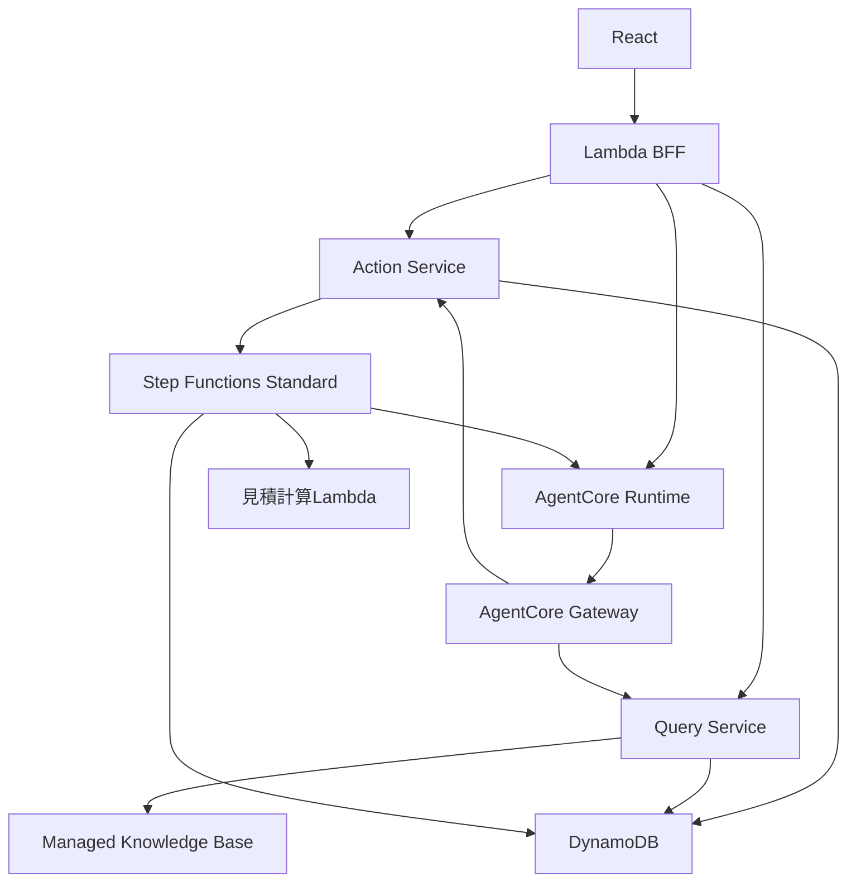

### BFFの責務

- React向けAPI
- Cognito JWTの受け入れ
- React用のレスポンス変換
- SSE中継
- 画面単位の入力検証
- Action Serviceへの利用者情報伝達

### Action Serviceの責務

- 案件単位の権限検証
- Action実行条件の検証
- 状態遷移
- バージョンチェック
- 条件付き更新
- 冪等性
- 監査記録
- Step Functions開始
- 副作用の制御

BFFを経由してもAgentCore Gatewayを経由しても、最終的には同じAction Serviceを呼び出します。

これにより、ReactとAgentで異なる業務ルールが適用されることを防げます。

## 業務操作をActionとして定義する

PalantirのActionは、オブジェクトのプロパティやリンクを変更する、ユーザー定義ロジックに基づいた業務操作です。Actionには入力パラメータ、検証、認可、副作用を含められます。[Palantir Action types](https://www.palantir.com/docs/foundry/action-types/overview/)

この考え方を今回のアプリケーションへ適用します。

### `ConfirmRequirements`

```text
対象:
  Project
  RequirementSet

入力:
  project_id
  requirement_version
  confirmed_items
  unresolved_items
  expected_version

実行条件:
  利用者が案件メンバー
  RequirementSetがDRAFT
  expected_versionが最新

結果:
  RequirementSetをCONFIRMEDへ更新
  入力スナップショットを作成
  監査ログを記録
```

### `GenerateEstimate`

```text
対象:
  Project
  RequirementSnapshot
  ArchitectureSnapshot

入力:
  project_id
  input_snapshot_version
  estimation_policy_id
  rate_card_id

実行条件:
  要件がCONFIRMED
  システム構成が確認済み
  単価マスターが承認済み
  同一入力の実行中ジョブが存在しない

結果:
  Step Functionsを開始
  EstimateJobを作成
  Agentへ提案を依頼
  見積計算を実行
  Estimate Draftを生成
```

### `RecalculateEstimate`

```text
対象:
  Estimate

入力:
  estimate_id
  expected_version
  changed_assumptions
  changed_lines

実行条件:
  EstimateがDRAFTまたはREVIEW_PENDING
  APPROVEDではない
  利用者に編集権限がある

結果:
  元バージョンを保持
  新しいestimate_versionを生成
  変更理由を記録
```

### `SubmitEstimateForReview`

```text
対象:
  Estimate

実行条件:
  必須明細が存在
  単価が有効
  未解決の重大リスクがない
  利用者にレビュー提出権限がある

結果:
  REVIEW_PENDINGへ遷移
  レビュー担当者へ通知
```

### `ApproveEstimate`

```text
対象:
  Estimate

入力:
  estimate_id
  expected_version
  approval_comment

実行条件:
  EstimateがREVIEW_PENDING
  利用者が承認者
  expected_versionが最新
  提示価格と原価が再検証済み

結果:
  APPROVEDへ遷移
  承認者・日時を記録
  承認後の上書きを禁止
```

## AgentはActionを自由実行しない

Agentには、読み取りと提案を中心に担当させます。

```text
Agentができること:
  類似案件を検索する
  適用標準を調査する
  見積明細を提案する
  リスクを提案する
  修正案を作る
  Action実行案を提示する

Agentが直接行わないこと:
  要件を確定する
  単価を変更する
  承認済み見積を上書きする
  見積を承認する
  実績を確定する
```

例えば利用者がチャットで「この内容で承認して」と入力した場合、Agentが承認処理を直接実行するのではなく、次のように返します。

```json
{
  "proposed_action": "ApproveEstimate",
  "target": {
    "estimate_id": "estimate-001",
    "expected_version": 4
  },
  "requires_explicit_confirmation": true,
  "confirmation_message": "見積バージョン4を承認しますか？"
}
```

Reactは確認ダイアログを表示し、利用者が明示的に承認ボタンを押した後でAction APIを呼び出します。

```text
自然言語
  ↓
AgentがAction候補へ変換
  ↓
Reactが構造化内容を表示
  ↓
利用者が明示的に確認
  ↓
Action Serviceが権限・状態を再検証
  ↓
Actionを実行
```

## Step Functionsの位置付け

Palantir AIP的な構成において、Step FunctionsはActionそのものではなく、Actionによって開始される長期ワークフローを担当します。

```text
GenerateEstimate Action
  ↓
Step Functions
  ├─ 入力スナップショット確認
  ├─ Knowledge Agent実行
  ├─ 類似案件検索
  ├─ 標準工数取得
  ├─ 単価取得
  ├─ 見積計算
  ├─ Draft保存
  └─ レビュー待ち
```

役割を分けると次のようになります。

```text
Action Service:
  この操作を開始してよいか

Step Functions:
  開始した操作をどの順序で進めるか

AgentCore:
  どのような提案をするか

計算Lambda:
  数値をどう決定的に計算するか

DynamoDB:
  現在の正式な業務状態は何か
```

## Ontology相当のデータモデル

Palantir AIPに近づけるには、DynamoDBを単なるItem置き場にせず、オブジェクト型と関連を明示します。

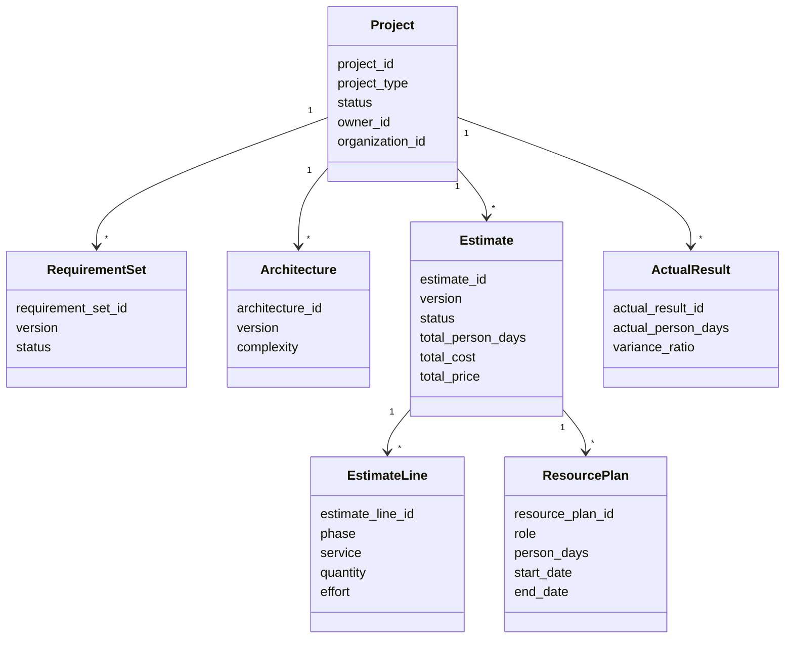

これらの関連をIDだけでなく、APIやToolの契約としても固定します。

## データリネージ

見積結果から、使用した入力と根拠を逆引きできるようにします。

```text
Estimate Version 4
├── Project project-001
├── RequirementSnapshot version 5
├── ArchitectureSnapshot version 3
├── EstimationPolicy version 2
├── RateCard version 7
├── SimilarProject project-087
├── SimilarProject project-102
├── KnowledgeDocument security_standard version 4
├── AgentVersion estimation-agent-3
└── CalculationVersion estimate-calculator-2
```

見積金額だけでなく、「なぜこの金額になったか」を再現できることが重要です。

これはAIPのセキュリティ、監査、説明可能性に相当する部分です。

## React画面の構成

Palantir AIPに近づけるなら、画面は次のように構成します。

```text
案件画面
├── 案件概要
├── RFP・関連文書
├── 要件
├── システム構成
├── 見積
│   ├── 工数明細
│   ├── 要員計画
│   ├── 原価・価格
│   ├── 類似案件
│   ├── 根拠
│   └── リスク
├── ワークフロー
│   ├── 現在状態
│   ├── 担当者
│   └── Actionボタン
├── 変更履歴
└── Agentパネル
```

Agentパネルは常に現在表示しているオブジェクトをコンテキストとして受け取ります。

```json
{
  "active_object": {
    "type": "Estimate",
    "id": "estimate-001",
    "version": 4
  },
  "active_project_id": "project-001",
  "user_message": "RDS部分の工数が過去案件より多い理由を説明してください"
}
```

Agentへ案件全体をpromptで渡すのではなく、認可済みのオブジェクト参照を渡し、必要な情報はToolで取得させます。

## 最終的な対応関係

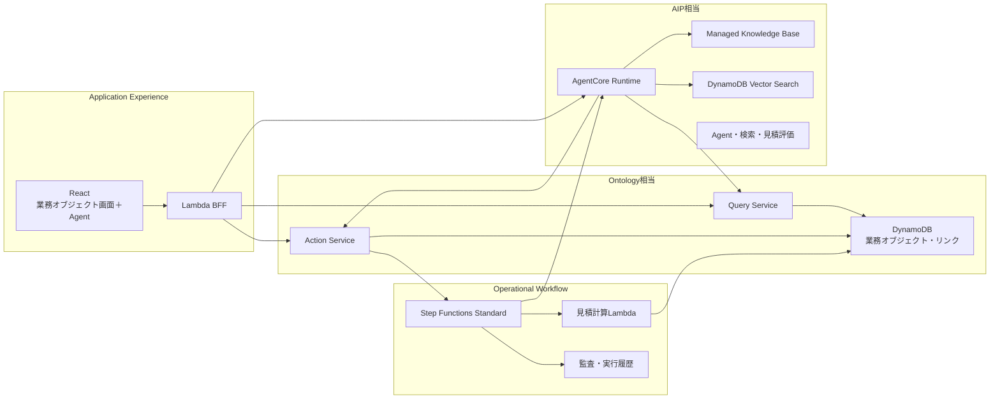

要するに、Palantir AIPに近づけるために必要なのは、Agentを高性能にすることだけではありません。

- DynamoDB上に業務オブジェクトと関連を定義する
- 変更操作をActionとして定義する
- ReactとAgentが同じAction Serviceを使う
- Step Functionsで時間をまたぐ業務処理を管理する
- AIの提案と、正式な業務更新を分離する
- すべての結果から入力・根拠・バージョンを追跡できるようにする

この構造が、今回のAWS見積アプリケーションにおける「Palantir AIP的な設計」の中心になります。

# 質問 5
```text
上記に
「Lambdaは現在も最大15分という制限があるため、処理時間を気にしなくてよいわけではありません。
ただしBFFを短時間処理とストリーミング中継に限定し、長時間処理をStep Functionsへ逃がすなら、今回の第一候補はLambdaです。」
という記述がありました。そこで、AWS LambdaとStep　Functionsを併用するという案になりましたが、

AWS Lambda durable functions(https://aws.amazon.com/jp/blogs/aws/build-multi-step-applications-and-ai-workflows-with-aws-lambda-durable-functions/)を使うことで、
Step　Functionsを使わないという選択肢も増えるのでしょうか？
```

# 回答 5
