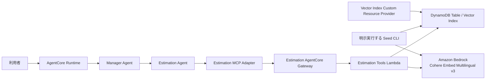
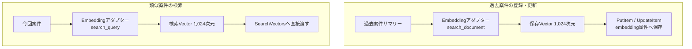

# Plan: DynamoDB Vector Search を利用した類似案件見積 PoC

## 実装方針

本機能は、Estimation Agent が DynamoDB の構造化データと Vector Search を同じ見積ワークフローで利用し、類似案件検索、標準工数・単価参照、見積 Draft の計算・保存・再参照を実行できる PoC として実装する。

実装では、次の境界を維持する。

- Manager Agent は利用者との対話と最終回答を担当する。
- Estimation Agent は見積領域の判断と、Estimation Gateway 上の4つの Tool の選択を担当する。
- DynamoDB、Amazon Bedrock Embeddings、価格計算、保存可否の最終検証は Lambda Tool 側で行う。
- AgentCore Runtime のIAMロールには DynamoDB と Embeddings モデルへの直接権限を付与しない。
- 類似案件が0件でも標準工数と単価を用いた preview を継続し、回答に類似案件がないことを明記する。
- 見積 Draft の永続化は、利用者の明示的な保存依頼がある場合だけ実施する。曖昧な依頼では preview を返して保存確認を求める。

全体構成は次のとおりとする。



DynamoDB は PoC のデータ関連と一貫した権限制御を分かりやすくするため、1つのテーブルを使用する。過去案件、実績、標準工数、単価・価格、検索コンテキスト、見積 Draft、冪等性情報を論理的なキーで分離する。Vector Search の対象は過去案件の検索用サマリーだけとし、マスター、Draft、制御データには Embedding を保存しない。

Amazon Bedrock の Cohere Embed Multilingual v3 を唯一の Embedding モデルとし、文書登録時は `input_type=search_document`、検索時は `input_type=search_query`、次元数は1024、距離関数は cosine とする。正規化、ハッシュ、再試行、検索品質評価の方針は ADR-0007 に従う。

Seed は CDK Custom Resource から実行しない。デプロイ後に運用者が明示的かつ冪等に実行する CLI とし、サンプルファイルを `dynamodb-seed/` 配下で成果物として管理する。

## 変更対象

| 領域 | 変更対象 | 変更内容 |
|---|---|---|
| CDKスタック | `agent_core_cdk_stack/agent_core_stack.py` | Estimation用Construct、DynamoDBテーブル、Vector Index管理、Gateway、Lambda、環境変数、IAMをスタックへ組み込む。 |
| Estimationインフラ | `agent_core_cdk_stack/` 配下の新規Construct | テーブル、Vector Index Provider、Estimation Gateway、Gateway Target、Tool Lambda、ログ、権限を責務別に定義する。 |
| Vector Index管理 | `lambda_tools/dynamodb_vector_index/` | CloudFormation Custom Resource Providerとして Vector Index の作成、状態確認、更新、削除を行う。 |
| Estimation Tool | `lambda_tools/estimation/` | 4つのToolの受付、入力検証、Embedding、検索コンテキスト、マスター参照、計算、Draft保存・参照を実装する。 |
| Agent設定 | `agents/src/agent_app/config.py` | Estimation GatewayのURL、Target名などを独立した設定として追加する。 |
| MCPアダプター | `agents/src/agent_app/gateway_tools.py` | Estimation Tool契約、許可リスト、結果検証、内部実行コンテキスト注入、Estimation向けタイムアウトを追加する。 |
| Agent構成 | `agents/src/agent_app/agent_factory.py` | Estimation Agentを追加し、Manager AgentからAgent-as-Toolとして利用できるようにする。 |
| Runtimeサービス | `agents/src/agent_app/service.py`、`agents/src/agent_app/runtime.py` | Estimation Gatewayの生成、接続、部分障害、後片付けを既存Gatewayと独立して扱う。 |
| Agent指示 | `agents/src/agent_app/agent_factory.py` の既存instructions定義 | 保存意図、類似案件0件、preview、根拠、信頼度、再確認のルールを既存パターンに沿って追加する。 |
| 依存関係 | `pyproject.toml`、`uv.lock`、Lambda用ビルド定義 | `SearchVectors` と Vector Index API を持つ boto3/botocore を明示的に固定し、Lambdaイメージへ同じ版を組み込む。 |
| Sample Data | `dynamodb-seed/` | 過去案件3件、実績、標準工数、単価、価格ポリシー、Sample Project Delta入力、検索品質質問セットをJSONで管理する。 |
| Seed/E2E CLI | `scripts/` 配下の新規CLI | Sample Data検証、Embedding生成、冪等投入、Index準備確認、検索品質評価を明示コマンドで実行できるようにする。 |
| CDKテスト | `tests/unit/` | DynamoDB、Vector Index、Gateway、Lambda、IAM、環境変数、ログ、Agent Runtime設定のテンプレート契約を検証する。 |
| Toolテスト | `tests/unit/` | Tool契約、入力制限、検索、参照、計算、保存、冪等性、検索コンテキスト、例外変換を検証する。 |
| Agentテスト | `tests/unit/`、`tests/integration/` | Estimation Agent構成、Tool選択、保存確認、0件継続、部分障害、最終回答を検証する。 |
| 手動確認文書 | `docs/ManualTesting/README.md` | デプロイ、予算設定、Seed、Index確認、Agent利用、Draft再参照、CloudWatch確認、後片付けの手順を追加する。 |
| 設計判断 | `docs/ADR/` | Vector Index管理方式、単一テーブルと安全な参照・保存境界、単一Gateway Targetと書き込み権限境界をADRとして実装前に記録する。 |

## 変更しないもの

- 既存の Weather Agent、AWS Knowledge Agent、各Gatewayの公開Tool契約は変更しない。
- AgentCore Runtime の公開HTTP/SSE契約、Cognito認証契約、Memoryのcommit/rollback契約は変更しない。
- Bedrock Managed Knowledge Base のデータや `knowledge-base-s3/` は変更しない。
- RFP全文解析、最終見積書の帳票生成、承認ワークフロー、正式な原価・販売価格管理は実装しない。
- 外部の実案件データ、顧客情報、個人情報、機密単価はSample Dataへ含めない。
- Agentに DynamoDB PartiQL、任意のキー、任意のテーブル名、任意の検索条件を入力させる汎用DB Toolは提供しない。
- DynamoDBのSeed投入をデプロイ時に自動実行しない。
- OpenAI Embeddings APIやOpenAIのEmbeddingモデルは使用しない。
- `specs.md` の要件、受け入れ条件、ADR-0007の決定事項は本計画で再定義しない。

## 技術方針

### 1. DynamoDBテーブルとキー設計

物理名 `OpenAiEstimationData` のオンデマンド課金の単一テーブルを新設し、物理キーを `PK` と `SK` の文字列とする。TTL属性は `expires_at_epoch` とする。暗号化はAWS所有キー、Point-in-Time RecoveryはPoCのコストを考慮して無効を初期値とし、削除ポリシーはPoC用スタックと同じライフサイクルで削除できる設定とする。

主要なItemは次のキーで区別する。

| Item | PK | SK | 用途 |
|---|---|---|---|
| 過去案件検索サマリー | `PROJECT#<project_id>` | `SUMMARY` | Embedding生成元の `search_summary`、生成先の `embedding`、生成メタデータ、検索フィルター、表示用概要を保持する。 |
| 過去案件実績 | `PROJECT#<project_id>` | `ACTUAL#FINAL` | 役割別人月、工期、実績補足、品質評価を保持する。 |
| 標準工数 | `MASTER#EFFORT#<service>#<task_type>` | `VALID_FROM#<date>#VERSION#<version>` | サービス・作業単位の標準人日と有効期間を保持する。 |
| 単価 | `MASTER#RATE#<role>` | `VALID_FROM#<date>#VERSION#<version>` | 役割別単価と有効期間を保持する。 |
| 価格ポリシー | `MASTER#PRICING#<policy_id>` | `VALID_FROM#<date>#VERSION#<version>` | リスク率、利益率、丸め規則を保持する。 |
| 検索コンテキスト | `SEARCH_CONTEXT#<search_context_id>` | `CONTEXT` | 検索条件、候補参照、利用者・セッション束縛、期限を保持する。 |
| 見積Draft | `ESTIMATE_PROJECT#<project_id>` | `ESTIMATE#<estimate_id>#V<version>` | 入力スナップショット、根拠、計算内訳、金額、作成者を保持する。 |
| 冪等性情報 | `IDEMPOTENCY#<actor_id>` | `CREATE_ESTIMATE#<idempotency_key>` | 同じ保存要求から作成済みDraftを解決する。 |

マスター参照は、Tool側で生成する既知のPartition Keyに対する `Query` を使用する。テーブル全体の `Scan` は使用しない。有効日で一致する承認済みレコードが0件または複数件の場合は、推測で選ばずデータ不整合エラーとする。

価格と工数の計算には `decimal.Decimal` を使用する。JSON浮動小数点を計算の正本にせず、DynamoDB Numberとの変換時にもDecimalを維持する。価格は仕様の計算式を順番どおり適用し、最終段階で1000円単位に丸める。

### 2. Vector Index

Vector Indexは次の固定契約で作成する。

- Index名: `EstimationProjectVectorIndexV1`
- Vector属性: `embedding`
- 次元数: 1024
- 距離関数: `COSINE`
- Search SchemaのHASH属性: `search_scope`
- INLINE_FILTER属性: `entity_type`、`project_type`、`architecture_family`、`outcome_quality`
- 固定 `search_scope`: `ORG_SAMPLE#INTERNAL`
- Projection: 候補一覧と後続参照に必要な `project_id`、`project_name`、`search_summary`、検索フィルター属性だけを含める。

`search_scope` はAgentや利用者から受け取らず、Tool Lambdaの環境変数とコード側の許可値で固定する。Vector検索は `entity_type=HISTORICAL_PROJECT` を必須条件とし、任意入力をそのまま検索式へ連結しない。

2026年8月19日時点では、DynamoDBのサービスAPIはVector Indexの作成・削除・状態参照に対応しており、AWS SDKやAWS CLIからそのAPIを呼び出せる。一方、CloudFormationの `AWS::DynamoDB::Table` にはVector Indexを定義するプロパティまたは専用リソースがなく、最新の `aws-cdk-lib 2.265.0` にもVector Indexを直接表現するL1/L2 APIがない。

そのため、DynamoDBテーブル本体は通常のCDK／CloudFormationリソースで作成し、Vector IndexについてはCloudFormation Custom Resourceを定義する。Custom Resourceから専用Provider Lambdaを呼び出し、ProviderがDynamoDB APIを実行してVector Indexを作成する。

| 対象 | 使用する仕組み | 理由 |
|---|---|---|
| DynamoDBテーブル | CDKのDynamoDB Construct／`AWS::DynamoDB::Table` | CloudFormationが標準対応しているため。 |
| DynamoDB Vector Index | CloudFormation Custom ResourceとProvider Lambda | CloudFormationが未対応であり、DynamoDB API、AWS SDK、AWS CLIでは作成できるため。 |
| Sample DataとEmbedding | デプロイ後に明示実行するSeed CLI | インフラの作成・rollbackと、Bedrock呼び出し・データ投入を分離するため。 |

Custom Resourceは、CloudFormationのCreate、Update、DeleteイベントをProviderへ伝える。ProviderはそのイベントをDynamoDB APIの操作へ変換し、Vector IndexのライフサイクルをCloudFormation Stackと連動させる。

Providerは次を行う。

1. Create/Updateで `UpdateTable` のVector Index更新APIを呼ぶ。テーブル作成時の`AttributeDefinitions`はPK／SKだけとし、Search Schemaの文字列属性定義は`VectorIndexUpdates.Create`と同じ`UpdateTable`リクエストへ渡す。
2. `DescribeTable` でテーブルとIndexが利用可能になるまで非同期に確認する。
3. 同一設定の再実行を成功として扱う。
4. 設定変更時は新しいバージョン付きIndex名を作成し、CloudFormationの置換ライフサイクルで旧Indexを削除する。
5. Deleteでは対象Indexだけを削除し、他のIndexやテーブルItemを操作しない。
6. エラーにはテーブル名、Index名、状態、AWS request IDを含めるが、Vectorや本文は記録しない。

Sample Data投入用Custom Resourceは作成しない。

### 3. Embeddingアダプター

Estimation Tool LambdaとSeed CLIで共通のEmbeddingアダプター実装を再利用する。実行環境に応じてBedrockクライアントだけを注入し、正規化、リクエスト生成、レスポンス検証、ハッシュ、再試行、メトリクスの契約を一致させる。

Embeddingアダプターは、DynamoDBの `PutItem` や `UpdateItem` によって自動起動されるLambda Triggerではない。文章をAmazon Bedrockへ渡し、DynamoDB Vector Searchで使用する検証済みの1,024次元Vectorを返す共通Pythonモジュールである。アダプター自身はDynamoDBへ書き込まず、呼び出し元のSeed CLIまたはEstimation Toolが後続のDynamoDB操作を行う。

事前登録する保存VectorのEmbedding生成元は、過去案件検索サマリーItem（`PK=PROJECT#<project_id>`、`SK=SUMMARY`）の文字列属性 `search_summary` である。Seed CLIは `search_summary` の値だけをEmbedding対象の本文として正規化し、Bedrockへ渡す。`project_id`、`project_name`、検索filter、正式な実績、工数、単価、価格はEmbedding入力へ連結しない。検索に必要な技術構成、数量、作業範囲、前提をVectorへ反映したい場合は、それらを正本の `search_summary` 本文へ明示する。

Embedding生成元、生成先、付随する生成属性を次のように区別する。

| 属性 | DynamoDB型 | 区分 | 内容 |
|---|---|---|---|
| `search_summary` | String | 正本・Embedding生成元 | Bedrockへ渡す架空の過去案件検索用サマリー。 |
| `embedding` | List of Number | 生成値・Vector Index対象 | `search_summary`から生成した1,024個の有限な浮動小数点値。 |
| `embedding_model_id` | String | 生成メタデータ | `cohere.embed-multilingual-v3`。 |
| `embedding_input_type` | String | 生成メタデータ | 保存Vectorでは `search_document`。 |
| `embedding_dimensions` | Number | 生成メタデータ | `1024`。 |
| `embedding_source_hash` | String | 生成メタデータ | 正規化済み `search_summary` と生成条件から計算したSHA-256。 |
| `embedding_normalization_version` | String | 生成メタデータ | ADR-0007で固定した `v1`。 |
| `embedding_generated_at` | String | 生成メタデータ | Seed処理が生成したUTC日時。 |

過去案件検索サマリーItemの概念例は次のとおりとする。`embedding`の数値は説明用に省略しており、実際には1,024要素を保存する。

```json
{
  "PK": "PROJECT#HIST-001",
  "SK": "SUMMARY",
  "entity_type": "HISTORICAL_PROJECT",
  "project_id": "HIST-001",
  "project_name": "Sample Project Alpha",
  "search_summary": "ALB、EC2 5台、RDS 2DB、CloudWatchアラーム12個を使用した社内業務WebシステムのAWS構築案件。対象作業は基本設計、詳細設計、構築、単体テスト。",
  "embedding": [0.01234, -0.03821, 0.09125],
  "embedding_model_id": "cohere.embed-multilingual-v3",
  "embedding_input_type": "search_document",
  "embedding_dimensions": 1024,
  "embedding_source_hash": "<sha256>",
  "embedding_normalization_version": "v1",
  "embedding_generated_at": "<UTC timestamp>"
}
```

利用時の検索VectorにはDynamoDB Itemの属性を使用しない。`search_similar_projects` が利用者入力から作成した今回案件の検索文を正規化し、`search_query` としてEmbeddingを生成して `SearchVectors` へ直接渡す。この検索VectorはDynamoDB Itemへ保存しない。

呼び出しタイミングは次の2つに限定する。

1. Seed CLIが過去案件サマリーを新規登録または変更するとき、`PutItem` または `UpdateItem` の前に `search_document` 用Vectorを生成する。
2. `search_similar_projects` が今回案件を検索するとき、`SearchVectors` の前に `search_query` 用Vectorを生成する。



Seed CLIでは、正規化済みサマリー、モデルID、入力種別、次元数、正規化versionから生成したhashを既存Itemと比較する。hashが一致する再実行ではEmbeddingアダプターとDynamoDB更新をスキップする。hashが異なる場合だけアダプターを呼び、`search_summary`、`embedding`、生成元hash、生成時刻を同じ書き込みで更新する。Vectorの数値Listを `dynamodb-seed/` の正本JSONへ手作業で保存しない。

検索時は、`search_similar_projects` の1回の呼び出しにつきEmbeddingアダプターを1回呼び、返された検索Vectorを `SearchVectors` へ直接渡す。検索Vectorは通常のDynamoDB Itemとして保存しない。

| 処理 | Embeddingアダプター | DynamoDBとの関係 |
|---|---|---|
| 過去案件サマリーの初回Seed | 呼ぶ | Vector生成後に `PutItem` する。 |
| 過去案件サマリーの変更 | 呼ぶ | Vector再生成後に `UpdateItem` する。 |
| 内容とhashが変わらないSeed再実行 | 呼ばない | Item更新もスキップする。 |
| `search_similar_projects` | 検索ごとに1回呼ぶ | Vector生成後に `SearchVectors` へ渡す。検索Vectorは保存しない。 |
| `get_estimation_reference_data` | 呼ばない | 構造化Itemだけを参照する。 |
| `create_estimate_draft` | 呼ばない | マスター参照、計算、Draft保存だけを行う。 |
| `get_estimate_draft` | 呼ばない | 既知の完全キーでDraftを参照する。 |
| マスター、実績、Draftの登録・更新 | 呼ばない | これらはVector検索対象ではない。 |

- モデルIDは `cohere.embed-multilingual-v3` に固定する。
- 文書登録は `input_type=search_document`、検索は `input_type=search_query` とする。
- 暗黙の切り詰めを禁止し、上限超過は検証エラーとする。
- 正規化とEmbedding再利用判定はADR-0007の正規化バージョンとSHA-256計算に従う。
- 再試行対象はthrottling、タイムアウト、5xx相当の一時障害だけとする。
- 初回を含め最大3回、各試行15秒、総時間45秒を超えない。
- 呼出回数、成功、失敗、throttling、再試行、レイテンシをCloudWatch Embedded Metric Formatで記録する。
- 入力本文、Vector、単価、見積金額をログまたはメトリクス次元へ出力しない。

Agent RuntimeにはEmbedding権限を付与せず、Estimation Tool Lambdaと明示実行するSeed CLIの実行主体だけが利用する。依存版は `boto3==1.43.65` と `botocore==1.43.65` に固定し、Tool Lambda、Vector Index Provider、Seed/E2E CLIで同じAPIモデルを使用する。

### 4. Estimation GatewayとTool Lambda

Estimation専用のAgentCore GatewayとGateway Targetを作成する。

- Gateway名: `OpenAiEstimationGateway`
- Target名: `EstimationTools`
- Lambda名: `OpenAiEstimationTools`
- Target種別: Lambda
- Tool実装: 1つのLambda内でTool名により4つのユースケースへ振り分ける。

提供するToolは次の4つに限定する。

1. `search_similar_projects`
2. `get_estimation_reference_data`
3. `create_estimate_draft`
4. `get_estimate_draft`

Lambdaのハンドラーはルーティングと共通エラー変換だけを担当し、入力契約、Repository、Embedding、計算、検索コンテキスト、保存処理をモジュール分割する。boto3/botocoreはLambdaランタイム同梱版へ依存せず、`SearchVectors` とVector Index APIを確認した版を `uv.lock` で明示固定してコンテナイメージへ組み込む。

Toolの入力上限はJSON SchemaとLambda側の両方で検証する。少なくとも次を固定する。

- `top_k` は3で固定し、利用者やAgentから変更させない。
- 1回の検索でEmbedding生成は1回、Vector検索は1回とする。
- 1見積ワークフローの類似検索は最大3回とし、Agent指示とMCPアダプターのrequest-localカウンターで制限する。
- 検索文は空文字を拒否し、2,000文字以下とし、Bedrockへ `truncate=NONE` 相当で渡す。モデルの512 token上限を超えた場合は切り詰めず検証エラーへ変換する。
- 案件名とIDは200文字以下、説明・構成・対象範囲は各2,000文字以下、前提・対象外・注意事項は各20件かつ1件500文字以下とする。
- 構成要素は50件以下、作業種別は20件以下、選択可能な `result_ref` は検索結果と同じ3件以下とする。数量は0以上10,000以下の有限Decimalとする。
- `search_context_id`、`result_ref`、冪等キー、既知のDraft IDは128文字以下かつ許可したURL-safe文字またはUUID書式に制限する。
- Tool結果はUTF-8 JSON換算64 KiB以下にし、必要な候補、根拠、警告、参照IDだけへ整形する。DynamoDB Item全体やVectorは返さない。

MCPクライアントの自動再試行は無効のままとする。Estimation向けには接続・Tool一覧10秒、Tool呼出60秒、後片付け5秒、HTTP transport 75秒を上限とし、Embedding側の45秒上限とLambda側の処理・エラー返却時間を収める。Lambdaのタイムアウトは60秒を基本とし、実測で短縮可能か確認する。

4 Toolは共通の結果envelopeとして `status`、`data`、`warnings`、`correlation_id` を返す。`status` は `OK`、`NO_RESULTS`、`VALIDATION_ERROR`、`CONTEXT_INVALID`、`CONTEXT_EXPIRED`、`NOT_FOUND`、`DEPENDENCY_UNAVAILABLE`、`SAVE_FAILED`、`INTERNAL_ERROR` の許可値に限定する。MCPアダプターはToolごとの `data` Schema、64 KiB上限、禁止された物理キー・Vector属性を検証してからAgentへ渡す。

### 5. Toolごとの処理

#### `search_similar_projects`

1. 入力案件を検証し、固定順序で検索本文を正規化する。
2. Cohere Embed Multilingual v3で検索Vectorを1回生成する。
3. 固定scopeと許可されたフィルターだけで `SearchVectors` を1回呼び、上位3件を取得する。
4. 検索結果のPK/SKをサーバー側で検証し、完全な過去案件実績を `GetItem` で取得する。
5. 不透明な `search_context_id` と候補ごとの `result_ref` を生成し、候補ID対応表を検索コンテキストItemへ保存する。
6. Agentへは仕様で必要な `result_ref`、案件ID、案件名、検索用サマリー、順位、距離スコア、距離関数と、実績の要約に必要な属性だけを返す。距離スコアは小さいほど近いものとして扱い、絶対値を品質合格条件にはしない。

検索0件でも検索コンテキストを作成し、空の候補配列と `no_similar_projects=true` を返す。Agentは処理を停止せず標準工数参照へ進む。

#### `get_estimation_reference_data`

- 入力で受け取る案件種別、サービス、作業種別、役割、基準日を許可リストと形式で検証する。
- 標準工数、単価、価格ポリシーを既知のPartition Keyへの `Query` で取得する。
- 過去案件を参照する場合は `search_context_id` と `result_ref` だけを受け取り、サーバー側対応表から案件IDを解決する。
- Agentが生成した案件IDを検索結果として信頼しない。
- 参照したマスターID、版、有効日、出典種別を返し、後続Draftへ保存できるようにする。

#### `create_estimate_draft`

既存の4 Tool契約を維持したまま、入力に `operation=PREVIEW|SAVE` を設ける。

- `PREVIEW`: サーバー側で入力、検索参照、マスター版を再検証し、決定論的に再計算して結果を返すが、Draftと冪等性Itemは保存しない。
- `SAVE`: 利用者の明示的保存依頼をAgentが確認した場合だけ呼び出す。previewと同じ再検証・再計算を行った後、Draftと冪等性Itemをトランザクションで保存する。

LambdaはAgentが渡した合計値を正本とせず、工数、単価、リスク率、利益率、丸め規則から必ず再計算する。新規 `project_id` と `estimate_id` はUUIDv4、初期versionは整数 `1` とし、SKではゼロ埋めした `V0001` として表現する。保存前にDynamoDBの型付きシリアライズ結果を計測し、Draft Itemが350 KiBを超える場合は400 KiB上限へ近づけず検証エラーとする。保存後は `GetItem` でDraftを再読し、保存した内容と一致することを確認できた場合だけ成功を返す。

#### `get_estimate_draft`

`project_id`、`estimate_id`、`version` を形式検証し、組み立てた完全キーで `GetItem` を実行する。任意条件検索や一覧取得は提供しない。取得結果は作成者、根拠、マスター版、計算内訳、金額、警告を含む表示用契約へ変換する。

### 6. 検索コンテキストと安全なID引き継ぎ

Vector検索結果の案件IDをAgent経由で直接引き継がない。検索時にサーバー側で次を保存する。

- `search_context_id`
- `result_ref` と正規の `project_id`、順位の対応表
- 検索条件とフィルターのスナップショット
- 検証済みの `actor_id` と `session_id`
- 作成時刻、期限、使用状態

`search_context_id` と `result_ref` は `secrets.token_urlsafe(32)` 相当の推測困難な値とする。TTLは30分とし、DynamoDB TTLによる物理削除を待たず、Tool側で期限を必ず検証する。別利用者、別セッション、期限切れ、対応表にない `result_ref` は拒否する。

MCPアダプターは検証済みのAgentCore実行コンテキストから `actor_id` と `session_id` を取得し、予約済みの内部引数へ上書き注入する。モデルが指定した内部値は破棄する。GatewayのTool Schemaには内部引数を予約プロパティとして定義するが、Agent向け説明では利用させず、Lambdaでも必須検証する。

### 7. 保存意図と冪等性

Agent指示では利用者の依頼を次の3状態として扱う。

- `EXPLICIT_SAVE`: 「保存して」「Draftを作成して」など、永続化が明示されている。
- `PREVIEW_ONLY`: 「見積を計算して」「案を見せて」など、計算・表示だけを求めている。
- `AMBIGUOUS`: 「見積を作って」など、保存を含むか解釈が分かれる。

`EXPLICIT_SAVE` は同一turnで `SAVE` を実行できる。`PREVIEW_ONLY` は `PREVIEW` のみ実行する。`AMBIGUOUS` は `PREVIEW` を返し、保存対象、主な金額、根拠、保存するとDraftが永続化されることを示して再確認する。確認前に `SAVE` を実行しない。

保存時の冪等性キーはモデルに生成させない。MCPアダプターが、検証済み `actor_id`、`session_id`、`search_context_id`、正規化した保存要求のハッシュからSHA-256で導出し、内部引数として上書き注入する。

Tool Lambdaは `TransactWriteItems` で次を同時に条件付き作成する。

1. 冪等性Item
2. 見積Draft Item

同じ冪等性キーと同じ要求ハッシュが既にある場合は既存Draftを再取得して成功として返す。同じキーで異なる要求ハッシュの場合は競合エラーとする。MCP後片付けやRuntime Memory commitに失敗してAgent呼出が再試行されても、Draftを重複作成しない。

### 8. Agent構成と部分障害

Estimation AgentはWeather Agent、AWS Knowledge Agentと同じくManager AgentからAgent-as-Toolとして呼ばれ、最終回答はManager Agentが作成する。handoffは追加しない。

設定には次を追加する。

- `AGENTCORE_ESTIMATION_GATEWAY_URL`
- `AGENTCORE_ESTIMATION_GATEWAY_TARGET_NAME`

Estimation GatewayはWeather、Knowledgeから独立して生成・接続・後片付けする。いずれかのGatewayだけが利用できない場合でも、利用可能な専門AgentでManagerを構成する。Estimationが利用できない状態で見積保存が要求された場合は、保存したと表現せず、利用不能を明示する。

Estimation Agentの回答またはManagerへの戻り値には、少なくとも次を含める。

- previewか保存済みか
- 類似案件の有無と参照根拠
- 標準工数、単価、価格ポリシーの版
- 計算内訳と金額
- 仮定、警告、信頼度
- 保存済みの場合は `project_id`、`estimate_id`、`version`

### 9. Seedデータと明示実行CLI

`dynamodb-seed/` は次の構成とする。

```text
dynamodb-seed/
├── README.md
├── projects/
│   ├── project-summaries.json
│   └── project-actuals.json
├── masters/
│   ├── effort-standards.json
│   ├── rate-cards.json
│   └── pricing-policies.json
├── evaluation/
│   └── search-quality-cases.json
└── sample-inputs/
    └── sample-project-delta.json
```

Seed処理の実装名は `EstimationSeedCli`、ファイルは `scripts/estimation_seed.py` とする。CLIは次の段階を明示的に分ける。

1. ローカルJSON Schema・相互参照検証
2. CloudFormation出力または明示引数からテーブル名とIndex名を解決
3. Vector Indexの準備完了確認
4. 過去案件検索本文の正規化とEmbedding生成
5. Embeddingハッシュが一致するItemをスキップし、変更分だけ条件付きupsert
6. 構造化マスター・実績の冪等upsert
7. 件数、更新、スキップ、失敗の要約を出力

CLIは検証のみを既定動作とし、AWSへ書き込む場合は `--apply` を必須にする。Draft、検索コンテキスト、冪等性ItemはSeed対象外とする。Seed管理対象外のItemを削除しない。

検索品質評価は `scripts/estimation_vector_e2e.py` で質問セットを順に実行し、top-3とtop-1を判定する。質問は6件以上とし、HIST-001、HIST-002、HIST-003それぞれにtop-1必須ケースを2件以上含める。Sample Project DeltaはHIST-001のtop-1を必須とする。距離値の完全一致は判定条件にしない。評価結果には実行日時、リージョン、モデルID、次元数、正規化version、Seed hash、Index名、各ケースの順位と合否を記録し、モデルまたは正規化を変更した場合は同じコマンドですべてのケースを再評価する。

具体的なコマンド契約は次のとおりとする。`<profile>` と `<output.json>` は実行者が指定し、固定値や認証情報をリポジトリへ保存しない。

```bash
uv run python scripts/estimation_seed.py validate --source dynamodb-seed
uv run python scripts/estimation_seed.py wait-index --stack-name OpenAiAgentCoreBaseStack --region us-east-1 --profile <profile>
uv run python scripts/estimation_seed.py apply --source dynamodb-seed --stack-name OpenAiAgentCoreBaseStack --region us-east-1 --profile <profile> --apply
uv run python scripts/estimation_vector_e2e.py evaluate --cases dynamodb-seed/evaluation/search-quality-cases.json --stack-name OpenAiAgentCoreBaseStack --region us-east-1 --profile <profile> --output <output.json>
uv run python scripts/estimation_seed.py cleanup-draft --stack-name OpenAiAgentCoreBaseStack --region us-east-1 --profile <profile> --project-id <project_id> --estimate-id <estimate_id> --version 1 --apply
```

異常系で作成したDraftの後片付けは汎用削除Toolにせず、テストで記録した完全な `project_id`、`estimate_id`、versionを指定する管理者向け `cleanup-draft` サブコマンドと `--apply` の組合せに限定する。Sample Dataやマスターの削除、prefixによる一括削除、Scanによる対象発見は実装しない。

### 10. IAMと監視

IAMロールは次の境界で分離する。

| 実行主体 | 許可する主な操作 |
|---|---|
| AgentCore Runtime | Estimation Gatewayのinvoke。DynamoDB、Embeddingモデルへの直接操作は許可しない。 |
| Estimation Gateway | Estimation Tools Lambdaのinvokeだけを許可する。 |
| Estimation Tools Lambda | 対象テーブルの `GetItem`、`Query`、書き込み先PKを `SEARCH_CONTEXT#*`、`ESTIMATE_PROJECT#*`、`IDEMPOTENCY#*` に限定した `PutItem` と `TransactWriteItems`、対象Indexの `SearchVectors`、固定Embeddingモデルの `InvokeModel`、自身のログ出力を許可する。 |
| Vector Index Provider | 対象テーブルの `DescribeTable`、Vector Index作成・更新・削除に必要な `UpdateTable`、自身のログ出力だけを許可する。 |
| Seed実行者 | 対象テーブルのSeed投入・確認、固定Embeddingモデルのinvoke、必要なCloudFormation出力参照を運用者権限として別途付与する。 |
| E2E後片付け実行者 | 手動確認で記録した完全キーに対応する `ESTIMATE_PROJECT#*` のDraftと `IDEMPOTENCY#*` の関連Itemだけを削除できる運用者権限を別途付与する。 |

Tool Lambdaの書き込み権限には `dynamodb:LeadingKeys` 条件を使用し、過去案件とマスターのPKへ書き込めないようにする。ToolコードでもItem種別とSKを許可リスト検証し、Draftは条件付きトランザクション、検索コンテキストは新規発行または同一要求の再試行だけを許可する。

すべてのLambdaに明示的なCloudWatch Logsグループを作成し、PoC既存方針に合わせて保持期間を1週間とする。ログには構造化された処理名、相関ID、結果、件数、レイテンシ、AWS request IDを記録し、RFP本文、検索全文、Embedding、単価、見積金額は記録しない。

Amazon Bedrockの利用量はCloudWatchメトリクスで確認し、AWS Budgetsは50%、80%、100%の通知を設定する。月額予算額と通知先はリポジトリへ固定せず、AWS E2E実行前にPoC責任者が指定する運用入力とする。

## データや契約への影響

### 公開契約

- AgentCore RuntimeのHTTP/SSE入出力は変更しない。
- Manager Agentの利用者向け自然言語応答に、見積preview、保存状態、根拠、警告、IDが追加される。
- Estimation Gatewayに4つの新規MCP Tool契約を追加する。
- Estimation Agent用の2つの環境変数をAgentCore Runtimeへ追加する。

### 永続データ

- 新規DynamoDBテーブルにSample Dataと利用時データを同居させ、`entity_type`、PK/SK接頭辞、`schema_version` で区別する。
- Sample Dataは再生成可能な成果物であり、Draftは利用者操作で生成される業務データとして区別する。
- Draftには入力スナップショット、参照した類似案件ref、マスター版、計算式の入力と結果、作成者、日時を保持する。
- 検索コンテキストは短期データであり30分後に論理的に無効とする。
- Vectorは過去案件検索サマリーItemだけに保持し、Tool結果やログへ返さない。

### 後方互換性

- WeatherとKnowledgeのGateway設定が存在し、Estimation設定が存在しない従来環境でもRuntimeを起動可能にする。
- Estimation設定が不完全な場合はEstimation Agentだけを無効化し、既存Agentの利用を継続する。
- 既存テーブルや既存Knowledge Baseへ移行処理は行わない。

## リスク

| リスク | 影響 | 対策 |
|---|---|---|
| CloudFormation/CDKがVector Indexを直接管理できない | デプロイや削除でIndexだけが不整合になる可能性がある。 | 専用Providerを用い、非同期状態確認、冪等処理、限定IAM、Create/Update/Deleteテストを実装する。方式をADRへ記録する。 |
| DynamoDB Vector Search APIやSDKの変更 | Lambdaランタイム同梱SDKではAPIが不足する可能性がある。 | 動作確認済みboto3/botocoreを明示固定してLambdaへ同梱し、lock整合性とコンテナbuildを検証する。 |
| Embeddingモデルまたは正規化の差異 | Seedと検索でVector空間が一致せず検索品質が低下する。 | 共通アダプター、固定モデル、固定次元、用途別input_type、正規化版・ハッシュを使用する。 |
| 類似案件の件数が少ない | Sample Dataに過学習した品質評価になる。 | 評価はPoC Sample Data内の回帰確認と明記し、質問を案件ごとに複数用意する。距離値は固定しない。 |
| Agentが案件IDを生成・改変する | 別案件の実績参照や不正保存につながる。 | 不透明なrefを用い、サーバー側対応表、利用者・セッション束縛、TTL、完全キー検証を行う。 |
| 保存意図が曖昧 | 利用者が意図しないDraftを作る可能性がある。 | 曖昧時はpreview後に再確認し、明示的保存だけでSAVE Toolを呼ぶ。Agentテストで表現差を検証する。 |
| LambdaまたはMCPの再試行 | Draftが重複作成される可能性がある。 | アダプター生成の冪等性キーとDynamoDBトランザクションで同じ論理要求を一意にする。 |
| Runtime Memory commit前後の障害 | Draftは保存済みだが会話Memoryがrollbackされる可能性がある。 | 保存は冪等にし、再試行で既存Draftを返す。保存後再読できない場合は成功と断言しない。 |
| DynamoDB TTLの削除遅延 | 期限切れ検索コンテキストが物理的に残る。 | TTL属性に加えてTool側で期限を検証し、期限切れを常に拒否する。 |
| DecimalとJSON数値の混在 | 工数や価格の丸め誤差が発生する。 | 計算内部とDynamoDB NumberはDecimalを使用し、JSON境界だけ明示的に文字列または整数へ変換する。 |
| Gatewayが3系統に増える | 接続・部分障害・cleanupの分岐が増える。 | Gatewayごとに独立生成し、全組合せのfactory/serviceテストとcleanupテストを追加する。 |
| Tool結果が大きい | Agentコンテキスト、MCP応答、Lambda応答制限を圧迫する。 | top-3固定、Projection制限、表示用DTO、配列・文字列長上限で抑制する。 |
| Bedrock利用費の想定超過 | PoC費用が増加する。 | 検索回数上限、Embedding再利用、メトリクス、AWS Budgets 50/80/100%通知を利用する。 |

## 検証方針

### 1. 静的・依存関係確認

- `uv lock --check` で `pyproject.toml` と `uv.lock` の整合性を確認する。
- Pythonの既存lint/type-checkコマンドがある場合はそれを実行する。
- Lambdaイメージに固定したboto3/botocoreで `SearchVectors` とVector Index更新APIの入力モデルが存在することをテストする。
- Sample JSONをJSON Schemaと相互参照検証へ通し、実案件情報や秘密情報が含まれないことをレビューする。

自動テストでは実AWSを呼び出さず、次のテストダブルを使用する。

| 境界 | テストダブル |
|---|---|
| OpenAI Agents SDK Model | 既存のscripted modelパターンを拡張し、Agent-as-Toolの呼出順と最終回答を固定する。 |
| MCP/Gateway | 既存のfake MCP serverとfactoryを拡張し、接続、Tool一覧、call、timeout、cleanupを決定的に返す。 |
| Amazon Bedrock Embedding | 注入可能なfake clientで固定の1,024次元Vector、throttling、一時障害、恒久障害、次元不一致を返す。 |
| DynamoDB Item API | Repositoryへ注入するin-memory fakeまたはbotocore Stubberで `GetItem`、`Query`、条件付き書き込み、transaction cancellationを再現する。 |
| DynamoDB `SearchVectors` | 入力式と回数を記録するfake clientで、HIST-001からHIST-003の順位、0件、不正projection、障害を返す。 |
| Vector Index Provider | fake DynamoDB control-plane clientでIndexの作成中、ACTIVE、失敗、置換、削除済み状態を返す。 |
| CDK | `aws_cdk.assertions.Template` と既存テストヘルパーで生成テンプレートを検査する。 |

### 2. CDKテンプレート検証

`uv run pytest` のCDKテストと `uv run python app.py` のsynthを実行し、生成テンプレートで次を確認する。

- オンデマンドDynamoDBテーブル、PK/SK、TTLが存在する。
- Vector Index Custom ResourceにIndex名、属性、1024次元、cosine、Search Schema、Projectionが表現されている。
- Estimation Gateway、Target、Lambda、ロググループが存在する。
- GatewayからLambda、Lambdaから対象テーブル・Index・Embeddingモデル、Providerから対象テーブルだけへの権限になっている。
- AgentCore RuntimeロールにDynamoDBとEmbeddingの直接権限がない。
- AgentCore RuntimeへEstimation Gateway URLとTarget名が注入される。
- Sample Dataを投入するCustom Resourceが存在しない。

### 3. Vector Index Provider単体テスト

- Create、同一設定の再Create、非同期作成中、ACTIVE、失敗、Update置換、Delete、既に削除済みをfake clientで検証する。
- 対象外テーブルやIndexを操作しないことを検証する。
- AWSエラーをCloudFormationへ意味のある失敗として返し、本文やVectorをログへ含めないことを検証する。

### 4. Embedding・Repository・計算単体テスト

- 正規化、固定フィールド順、NFKC、改行・空白正規化、ハッシュの再現性を検証する。
- 文書と検索で正しい `input_type` が使われ、次元数不一致と上限超過を拒否することを検証する。
- 一時障害だけ最大3回再試行し、恒久エラーを再試行しないことをfake Bedrock clientで検証する。
- `SearchVectors` が1検索1回、top-3、固定scope、許可フィルターで呼ばれることを検証する。
- マスター参照が `Query`/`GetItem` を使い、`Scan` を使用しないことを検証する。
- Decimalによる工数、原価、リスク、利益、1000円単位丸めを境界値を含めて検証する。
- Sample Project Deltaの期待結果として、合計15.7人日、AWSアーキテクト5.0人日、インフラエンジニア10.7人日、原価1,356,000円、提示価格1,695,000円を検証し、HIST-001の実績26.0人日を自動補正に使用しないことを検証する。

### 5. Tool契約・保存テスト

- 4 Toolの正常系、入力不足、列挙値違反、長さ超過、未知Tool、AWS例外を検証する。
- Vector結果のPK/SK異常、別scope、別entityを候補から除外またはエラーにすることを検証する。
- 検索0件でもコンテキストを返し、標準工数参照を継続できることを検証する。
- `result_ref` の正常利用、改変、別利用者、別セッション、期限切れ、未知refを検証する。
- PREVIEWでItemを書かず、SAVEでのみトランザクション保存することを検証する。
- 同じ冪等性キーの再試行が同じDraftを返し、異なる要求との衝突を拒否することを検証する。
- 保存後再読に失敗した場合、保存成功として返さないことを検証する。
- `get_estimate_draft` が完全キーだけを受け入れ、任意検索を実行しないことを検証する。

### 6. Agent・Runtimeテスト

- Estimation AgentがManagerにAgent-as-Toolとして登録され、handoffにならないことを検証する。
- Weather、Knowledge、Estimationの利用可否の組合せでManagerを構成できることを検証する。
- Estimation Gatewayだけの接続失敗やcleanup失敗が既存Agentを不必要に停止しないことを検証する。
- 明示保存は同一turnでSAVE、preview依頼は非保存、曖昧依頼はpreview後に確認となることをscripted modelで検証する。
- 類似案件0件時に処理を継続し、最終回答へ「類似案件なし」を含めることを検証する。
- 保存済み、preview、保存失敗をManagerが混同しないことを検証する。
- 既存HTTP/SSE、Memory commit/rollback、Weather、Knowledgeの回帰テストを実行する。

### 7. コンテナ・ローカル確認

- AgentCore Runtimeと新規Lambdaコンテナを対象アーキテクチャでbuildする。
- Lambdaハンドラーをfake AWS clientでローカル起動し、Gateway相当イベントの入出力を確認する。
- Seed CLIのvalidate-onlyをSample Data一式へ実行する。

### 8. AWS E2Eと手動確認

AWSへの書き込みやデプロイはユーザーの明示依頼後に実施する。実施時は次を確認する。

1. PoC責任者が月額予算額と通知先を指定し、AWS Budgets 50%、80%、100%通知を設定する。
2. CDK deploy後、テーブル、Vector Index、Gateway、Target、Lambdaの状態を確認する。
3. Seed CLIを `--apply` で明示実行し、再実行がskip中心の冪等結果になることを確認する。
4. 検索品質質問セットを実Embeddingと実Vector Searchで実行する。
5. Sample Project DeltaでHIST-001がtop-1、他の評価質問も定義済み期待値を満たすことを確認する。
6. Agentからpreview、明示保存、曖昧保存確認、0件検索、Draft再参照を確認する。
7. DynamoDB Item、CloudWatch Logs、メトリクスに期待する情報があり、禁止データがログへ出ていないことを確認する。

実AWS環境で距離値の完全一致は要求しない。Sample Data以外への一般化性能は本PoCの合格条件としない。

## ドキュメント更新方針

- `dynamodb-seed/README.md` にファイル構成、スキーマ、Sample Dataの関係、Embedding対象、更新方法、禁止データを記載する。
- `docs/ManualTesting/README.md` に環境前提、予算設定、deploy、Seed、Index確認、検索品質評価、Agentシナリオ、Draft確認、ログ・メトリクス確認、cleanupを追記する。
- `docs/Agent/README.md` にEstimation Agent、4 Tool、保存意図、部分障害、設定値を追記する。
- `docs/CDK/README.md` にテーブル、Vector Index Provider、Gateway、Lambda、IAM、Seedをデプロイから分離する理由を追記する。
- ルート `README.md` には利用可能なAgentと主要文書への導線を追記する。
- ADR-0007へのリンクをSample Data、Embedding、手動確認文書から参照する。
- 実装前に次のADRを作成し、レビューする。
  - Vector Indexを通常のCDKテーブルと専用Custom Resource Providerの組合せで管理する判断。
  - 単一テーブルのItem境界、短期検索コンテキスト、不透明ref、冪等なDraft保存境界の判断。
  - 4つの業務Toolを1つのEstimation Gateway TargetとLambdaへ集約し、Runtime、Gateway、Tool、Seed、後片付けの権限を分離する判断。
- CloudFormationまたはCDKが実装時点でVector Indexを正式サポートしていても、勝手に方式を変更せず、ADRと本計画へ戻って再評価する。

## 実施順序

1. 本計画で必要とした3件のADRを作成し、Vector Index管理方式、データ・保存境界、Gateway TargetとIAM境界を確定する。
2. `dynamodb-seed/` のJSON Schema、Sample Data、Sample Project Delta、評価質問セットを作成し、ローカル検証を先に成立させる。
3. DynamoDB Item契約、Tool DTO、共通エラー契約、正規化・Embeddingアダプター、価格計算を純粋なPythonモジュールとして実装する。
4. fake clientによる正規化、Embedding、Repository、計算、検索コンテキスト、冪等性の単体テストを作成する。
5. Estimation Tools Lambdaの4 Tool、入力制限、PREVIEW/SAVE、保存後再読を実装し、ハンドラー契約テストを追加する。
6. DynamoDBテーブルとVector Index ProviderをCDKへ追加し、Providerのライフサイクルテストとテンプレートテストを追加する。
7. Estimation Gateway、Target、Lambda、ログ、限定IAM、Runtime環境変数をCDKへ追加し、権限境界をテンプレートで検証する。
8. Agent側の設定、Estimation MCPアダプター、内部コンテキスト注入、タイムアウト、検索回数制限を実装する。
9. Estimation AgentとManager統合、部分障害、cleanupを実装し、Agent/Runtimeの単体・統合テストを追加する。
10. Seed/E2E CLIを実装し、validate-only、冪等投入、Index待機、評価結果のテストを追加する。
11. `docs/ManualTesting/README.md`、`dynamodb-seed/README.md`、必要な既存READMEを更新する。
12. lock、全自動テスト、CDK synth、コンテナbuild、Sample Data検証を実行し、生成テンプレートと差分を確認する。
13. ユーザーの明示依頼後にAWSへdeployし、予算通知、Seed、実Vector Search、Agentシナリオ、ログ・メトリクスを手動確認する。

## 未解決事項

要件または実装方式として未解決の事項はない。

次はソースコードで固定しないAWS E2E実行時の運用入力であり、実装開始の未解決事項とは扱わない。

- AWS Budgetsの月額予算額
- 予算通知先
- E2Eを実行するAWSアカウント、プロファイル、リージョン
- 実行時点のAmazon Bedrockモデルアクセス、DynamoDB Vector Search利用可否、サービスクォータ
