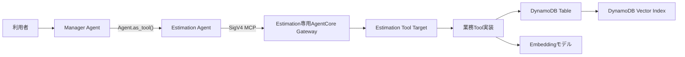
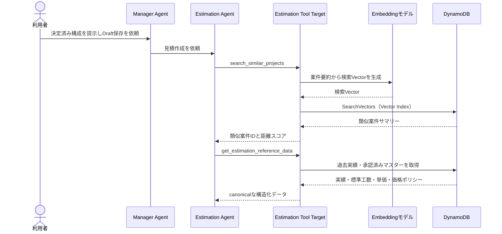
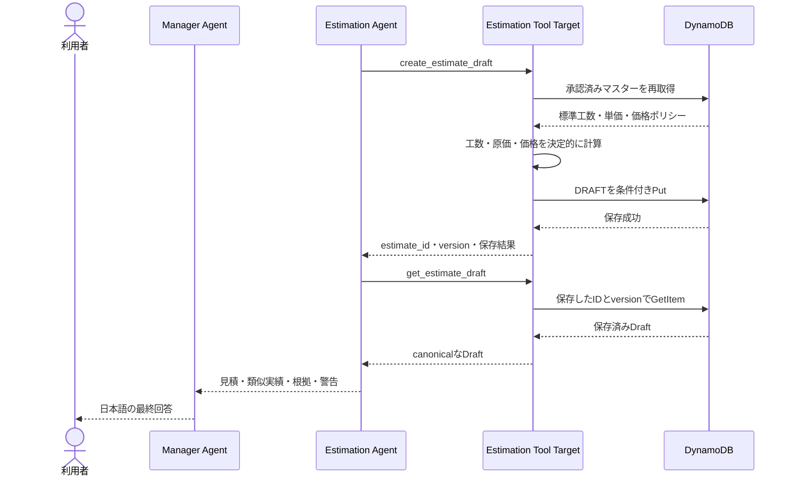

# DynamoDB Vector Search Estimation Agent PoC 要求ドラフト

## 1. 背景

- 現在のプロジェクトは、Amazon Bedrock AgentCore Runtime上でOpenAI Agents SDKのAgents-as-Tools型マルチエージェントを実行するPoCです。
- 既存の`AWS Knowledge Agent`は、Amazon Bedrock Managed Knowledge Baseから社内標準、見積基準、過去案件文書を検索します。
- 次のPoCでは、文書RAGとは異なる用途として、Amazon DynamoDBを構造化データの正本および類似案件のベクトル検索先としてAgentから利用できることを確認したいです。
- 将来の見積アプリケーション全体では、RFP分析、要件確定、システム構成、見積、要員計画、レビュー、承認などを扱う想定ですが、本要件ではAgentCoreからDynamoDBを利用する一つのユースケースに限定します。
- 本文書は要求整理段階のドラフトです。レビューを受けるまで確定仕様として扱いません。

## 2. PoCで採用するユースケース

### 2.1 ユースケース名

**類似する過去案件を根拠にしたAWSインフラ構築見積Draftの作成・保存**

### 2.2 概要

利用者が、要件とシステム構成が決定済みの架空案件について、案件種別、環境、AWSサービスと数量、作業範囲、前提を自然言語で入力します。

Manager Agentは見積依頼を`Estimation Agent`へ委譲します。Estimation Agentは、DynamoDBを利用する業務Toolを使い、次の処理を行います。

1. 今回案件の要件・構成を検索文へ正規化します。
2. DynamoDB Vector Indexから意味的に類似する過去案件を検索します。
3. 類似案件IDを使って、過去案件の正式な構造化実績をDynamoDBから取得します。
4. 今回構成に対応する標準工数、役割別単価、価格ポリシーをDynamoDBから取得します。
5. Tool内の決定的な計算により、見積明細、役割別工数、原価、提示価格を算出します。
6. 類似案件を比較根拠として関連付けた見積DraftをDynamoDBへ保存します。
7. 保存した見積Draftを再取得し、見積ID、バージョン、計算式、類似案件実績、注意事項を利用者へ返します。

### 2.3 このユースケースを選ぶ理由

- 1回の利用者依頼で、DynamoDBのVector検索、構造化参照、Item追加、追加Itemの再参照を確認できます。
- ベクトル検索が得意な「似た案件の候補抽出」と、通常のDynamoDBアクセスが得意な「数値の正確な取得」を分離できます。
- 過去案件の実績をそのまま今回見積へコピーせず、標準工数を使った計算結果と比較情報として扱えます。
- Agentによる書き込みを`DRAFT`の新規作成に限定でき、承認済みデータやマスターの破壊をPoC対象外にできます。
- 既存のManaged Knowledge Baseを置き換えず、文書RAGと構造化データ／Vector検索の役割差を検証できます。

## 3. 利用者ストーリー

- 見積担当者として、決定済みのAWS構成を自然言語で入力し、類似する過去案件と社内の標準工数・単価を根拠にした見積Draftを作成したいです。
- 見積担当者として、利用された過去案件、標準工数、単価マスター、計算式を確認し、Agentが数値を推測していないことを判断したいです。
- PoC確認者として、作成された見積DraftをDynamoDB上で再取得し、Vector検索、構造化参照、Item追加が一つのシナリオで実行されたことを確認したいです。

## 4. 利用時に利用者が入力する情報

### 4.1 必須情報候補

| 分類 | 項目 | 説明 |
|---|---|---|
| 案件 | `project_name` | 架空の案件名 |
| 案件 | `project_type` | 新規構築、移行、更改など。本PoCのサンプルは新規構築 |
| システム | `architecture_summary` | システム用途と構成の自然言語要約 |
| 環境 | `environments` | 本番、開発などの対象環境 |
| 構成 | `components` | AWSサービス、環境、数量、構成条件 |
| 作業 | `work_scope` | 基本設計、詳細設計、構築、単体テストなど |
| 前提 | `assumptions` | 顧客提供物、作業時間帯など |
| 対象外 | `exclusions` | アプリケーション開発、移行などの対象外作業 |
| 基準日 | `estimate_as_of` | 適用する単価・価格ポリシーの基準日 |
| 保存意思 | 見積Draftの保存依頼 | AgentがDynamoDBへ書き込むための明示的な依頼 |

### 4.2 サンプル利用者入力

```text
Sample Project DeltaのAWSインフラ構築見積を作成し、Draftとして保存してください。

新規の社内業務Webシステムで、本番環境と開発環境を構築します。
本番環境は2つのAvailability Zoneを使用します。

構成は次のとおりです。
- Application Load Balancer: 本番1台
- EC2: 本番4台、開発1台
- RDS for PostgreSQL: 本番1DB、開発1DB
- 本番RDSはMulti-AZ
- CloudWatchアラーム: 12個

対象作業は基本設計、詳細設計、構築、単体テストです。
AWSアカウントとネットワーク接続は顧客から提供されます。
アプリケーション開発とデータ移行は対象外です。
作業は平日日中に実施します。
見積基準日は2026-08-19です。
```

### 4.3 不足情報の扱い

- サービス数量、環境、作業範囲、見積基準日など、計算に必要な情報が不足する場合、Estimation Agentは推測で補完せずManager Agentを通じて利用者へ確認します。
- `Multi-AZ`、対象工程、対象環境などの構成条件が標準工数へ影響するか未定義の場合、その条件を自動的な補正係数へ変換せず、未反映の注意事項として示します。
- 利用者が保存を明示していない場合、計算結果を提示してもDynamoDBへの見積Draft追加は行いません。

## 5. 事前にDynamoDBへ登録する情報

### 5.1 データ分類

| データ | 用途 | Vector化 | 更新主体 |
|---|---|---:|---|
| 過去案件サマリー | 類似案件候補の検索 | する | PoCのシード処理 |
| 過去案件実績 | 類似案件ID取得後の正式な数値参照 | しない | PoCのシード処理 |
| 標準工数マスター | 数量から標準工数を計算 | しない | PoCのシード処理 |
| 役割別単価マスター | 原価計算 | しない | PoCのシード処理 |
| 価格ポリシー | 提示価格計算 | しない | PoCのシード処理 |
| 見積Draft | 今回の計算結果と根拠を保存 | しない | Estimation Agentの業務Tool |

### 5.2 DynamoDBの論理キー候補

PoCでは一つのオンデマンドテーブルへ複数のエンティティを格納する案を候補とします。物理キー設計は後続の仕様・計画で確定します。

| エンティティ | `PK`候補 | `SK`候補 |
|---|---|---|
| 過去案件サマリー | `PROJECT#<project_id>` | `SUMMARY` |
| 過去案件実績 | `PROJECT#<project_id>` | `ACTUAL#FINAL` |
| 標準工数 | `MASTER#EFFORT#<version>` | `<service>#<task_type>` |
| 単価 | `MASTER#RATE#<rate_card_id>` | `<role>` |
| 価格ポリシー | `MASTER#PRICING#<policy_id>` | `POLICY` |
| 今回案件 | `PROJECT#<project_id>` | `CONTEXT#<version>` |
| 見積Draft | `PROJECT#<project_id>` | `ESTIMATE#<estimate_id>#V<version>` |

### 5.3 過去案件サマリーとVector属性

Vector Indexへ登録するのは、過去案件実績の全Itemではなく、検索用の案件サマリーItemだけとします。

```json
{
  "PK": "PROJECT#HIST-001",
  "SK": "SUMMARY",
  "entity_type": "PROJECT_SUMMARY",
  "search_scope": "ORG_SAMPLE#INTERNAL",
  "project_id": "HIST-001",
  "project_name": "Sample Project Alpha",
  "project_type": "NEW_BUILD",
  "architecture_family": "THREE_TIER_WEB",
  "outcome_quality": "ACCEPTED",
  "summary_text": "社内業務WebシステムのAWS新規構築。本番と開発を構築。本番は2AZ。ALB、EC2本番4台・開発1台、RDS PostgreSQL本番1DB・開発1DB、本番RDS Multi-AZ、CloudWatchアラーム12個。基本設計、詳細設計、構築、単体テストを実施。AWSアカウントとネットワークは顧客提供。アプリ開発とデータ移行は対象外。",
  "embedding_model_id": "<要決定>",
  "embedding_model_version": "<要決定>",
  "embedding_dimension": "<要決定>",
  "embedding_source_hash": "<シード生成時に設定>",
  "embedding_status": "READY",
  "embedding": ["<summary_textから生成した浮動小数点数のList>"]
}
```

`embedding`を手作業で作成せず、採用するEmbeddingモデルと同じ処理で`summary_text`から生成します。保存Vectorと検索Vectorには同じモデル、バージョン、次元数を使用します。

### 5.4 Vector Index候補

```text
index_name: EstimationProjectVectorIndex
vector_attribute: embedding
distance_function: COSINE
partition_key: search_scope
inline_filters:
  - entity_type
  - project_type
  - architecture_family
  - outcome_quality
projection:
  - PK
  - SK
  - project_id
  - project_name
  - summary_text
  - project_type
  - architecture_family
  - outcome_quality
```

サンプル検索では次の条件を利用する想定です。

```json
{
  "search_scope": "ORG_SAMPLE#INTERNAL",
  "filters": {
    "entity_type": "PROJECT_SUMMARY",
    "project_type": "NEW_BUILD",
    "outcome_quality": "ACCEPTED"
  },
  "top_k": 3
}
```

## 6. 事前登録するサンプル過去案件

Vector検索の意味を確認するため、構成が近い案件、部分的に近い案件、異なる案件を少なくとも3件用意します。すべて架空データとします。

### 6.1 HIST-001: Sample Project Alpha

| 項目 | 値 |
|---|---|
| 案件種別 | AWS新規構築 |
| 構成分類 | 3層Webシステム |
| 環境 | 本番、開発 |
| 構成 | ALB 1台、EC2 5台、RDS 2DB、CloudWatchアラーム12個 |
| 可用性 | 本番2AZ、本番RDS Multi-AZ |
| 作業範囲 | 基本設計、詳細設計、構築、単体テスト |
| 見積工数 | 25.0人日 |
| 実績工数 | 26.0人日 |
| 工期 | 60営業日 |
| 要員実績 | AWSアーキテクト6.0人日、インフラエンジニア20.0人日 |
| 差異理由 | CloudWatchアラームの追加要望により1.0人日増加 |
| 品質評価 | `ACCEPTED` |

今回のSample Project Deltaと最も近い検索結果になることを期待するデータです。ただし、実モデルを利用した検索順位は評価によって確認し、根拠なく固定スコアを仕様化しません。

### 6.2 HIST-002: Sample Project Beta

| 項目 | 値 |
|---|---|
| 案件種別 | AWS新規構築 |
| 構成分類 | サーバーレスAPI |
| 環境 | 本番、開発 |
| 構成 | API Gateway 1 API、Lambda 6 Function、DynamoDB 2 Table、CloudWatchアラーム10個 |
| 作業範囲 | 基本設計、詳細設計、構築、単体テスト |
| 見積工数 | 17.0人日 |
| 実績工数 | 18.0人日 |
| 工期 | 40営業日 |
| 要員実績 | AWSアーキテクト5.0人日、インフラエンジニア13.0人日 |
| 差異理由 | Lambda同時実行数の見直しにより1.0人日増加 |
| 品質評価 | `ACCEPTED` |

環境数と工程は近いものの、AWS構成が異なる比較対象です。

### 6.3 HIST-003: Sample Project Gamma

| 項目 | 値 |
|---|---|
| 案件種別 | AWS新規構築 |
| 構成分類 | コンテナWebシステム |
| 環境 | 本番、ステージング、開発 |
| 構成 | ALB 1台、ECS Service 3個、RDS 2DB、CloudWatchアラーム20個 |
| 可用性 | 本番2AZ、本番RDS Multi-AZ |
| 作業範囲 | 基本設計、詳細設計、構築、結合テスト、運用設計 |
| 見積工数 | 36.0人日 |
| 実績工数 | 38.0人日 |
| 工期 | 80営業日 |
| 要員実績 | PM 5.0人日、AWSアーキテクト10.0人日、インフラエンジニア23.0人日 |
| 差異理由 | セキュリティレビューの追加により2.0人日増加 |
| 品質評価 | `ACCEPTED` |

ALB、RDS、Multi-AZは近いものの、コンテナ、環境数、作業範囲が異なる比較対象です。

### 6.4 過去案件実績Item候補

```json
{
  "PK": "PROJECT#HIST-001",
  "SK": "ACTUAL#FINAL",
  "entity_type": "PROJECT_ACTUAL",
  "project_id": "HIST-001",
  "estimated_person_days": 25.0,
  "actual_person_days": 26.0,
  "duration_business_days": 60,
  "resource_actuals": [
    {"role": "AWS_ARCHITECT", "person_days": 6.0},
    {"role": "INFRA_ENGINEER", "person_days": 20.0}
  ],
  "variance_person_days": 1.0,
  "variance_reason_code": "SCOPE_ADDITION",
  "lessons_learned": "監視項目数を要件確定前に合意する",
  "status": "FINAL"
}
```

## 7. 事前登録する標準工数マスター

現在の`knowledge-base-s3/estimation/estimation_guideline.md`と矛盾しない架空の構造化データとして、次を登録します。

| サービス | 作業 | 単位 | 標準工数 | 標準役割 |
|---|---|---|---:|---|
| EC2 | 基本設計 | `SYSTEM` | 1.0人日 | `AWS_ARCHITECT` |
| EC2 | 詳細設計 | `INSTANCE` | 0.5人日 | `INFRA_ENGINEER` |
| EC2 | 構築 | `INSTANCE` | 0.5人日 | `INFRA_ENGINEER` |
| EC2 | 単体テスト | `INSTANCE` | 0.3人日 | `INFRA_ENGINEER` |
| RDS | 基本設計 | `DB` | 1.5人日 | `AWS_ARCHITECT` |
| RDS | 詳細設計 | `DB` | 1.0人日 | `INFRA_ENGINEER` |
| RDS | 構築 | `DB` | 0.5人日 | `INFRA_ENGINEER` |
| CloudWatch | 監視設計 | `SYSTEM` | 1.0人日 | `AWS_ARCHITECT` |
| CloudWatch | アラーム設定 | `ALARM` | 0.1人日 | `INFRA_ENGINEER` |

Item例は次のとおりです。

```json
{
  "PK": "MASTER#EFFORT#V1",
  "SK": "EC2#DETAILED_DESIGN",
  "entity_type": "EFFORT_STANDARD",
  "service": "EC2",
  "task_type": "DETAILED_DESIGN",
  "unit": "INSTANCE",
  "person_days_per_unit": 0.5,
  "default_role": "INFRA_ENGINEER",
  "effective_from": "2026-04-01",
  "effective_to": "2027-03-31",
  "approval_status": "APPROVED",
  "version": 1
}
```

## 8. 事前登録する単価・価格ポリシー

単価と価格は実在する社内情報ではなく、PoC専用の架空データとします。

### 8.1 役割別原価単価

| 役割 | 原価単価 |
|---|---:|
| `AWS_ARCHITECT` | 100,000円／人日 |
| `INFRA_ENGINEER` | 80,000円／人日 |

```json
{
  "PK": "MASTER#RATE#SAMPLE-2026",
  "SK": "AWS_ARCHITECT",
  "entity_type": "RATE",
  "role": "AWS_ARCHITECT",
  "cost_rate_per_day": 100000,
  "currency": "JPY",
  "effective_from": "2026-04-01",
  "effective_to": "2027-03-31",
  "approval_status": "APPROVED",
  "version": 1
}
```

### 8.2 価格ポリシー

| 項目 | 値 |
|---|---|
| 計算方式 | `GROSS_MARGIN` |
| 目標粗利率 | 20% |
| 計算式 | `提示価格 = 原価 / (1 - 目標粗利率)` |
| 丸め | 1,000円単位、四捨五入 |

```json
{
  "PK": "MASTER#PRICING#SAMPLE-GM20",
  "SK": "POLICY",
  "entity_type": "PRICING_POLICY",
  "pricing_method": "GROSS_MARGIN",
  "gross_margin_rate": 0.20,
  "rounding_unit": 1000,
  "rounding_mode": "HALF_UP",
  "currency": "JPY",
  "effective_from": "2026-04-01",
  "effective_to": "2027-03-31",
  "approval_status": "APPROVED",
  "version": 1
}
```

## 9. Estimation AgentとTool候補

### 9.1 Agent構成

- 既存のManager Agentは利用者との会話と最終回答を所有します。
- 新しい`Estimation Agent`を`Agent.as_tool()`でManager Agentへ登録します。
- Estimation AgentだけがDynamoDB用の専用AgentCore Gatewayへ接続します。
- Manager AgentへDynamoDBのMCP Toolを直接公開しません。
- 既存のWeather AgentとAWS Knowledge Agentの責務およびGatewayを維持します。
- 本ユースケースでは、DynamoDB利用に焦点を当てるため、見積作成時にAWS Knowledge Agentを必須で併用しません。



### 9.2 `search_similar_projects`

目的:

- 自然言語の案件要約から検索Vectorを生成し、DynamoDB Vector Indexで類似する過去案件サマリーを検索します。

入力候補:

```json
{
  "query_text": "新規の社内業務Webシステム。本番・開発。ALB、EC2 5台、RDS PostgreSQL 2DB、本番Multi-AZ、CloudWatchアラーム12個。",
  "search_scope": "ORG_SAMPLE#INTERNAL",
  "project_type": "NEW_BUILD",
  "top_k": 3
}
```

出力候補:

```json
{
  "matches": [
    {
      "project_id": "HIST-001",
      "project_name": "Sample Project Alpha",
      "summary_text": "<検索用サマリー>",
      "distance_score": "<DynamoDBが返した値>",
      "distance_function": "COSINE"
    }
  ]
}
```

制約候補:

- Agentから生のVectorを受け取りません。
- `search_scope`、利用可能なIndex、filter属性、`top_k`の範囲をTool側で固定またはallowlist化します。
- コサイン距離は値が小さいほど類似することを出力契約で明示します。
- 類似度スコアを見積の信頼度や工数補正係数として直接利用しません。

### 9.3 `get_estimation_reference_data`

目的:

- 類似案件IDの正式な実績と、今回構成に必要な標準工数、単価、価格ポリシーを構造化データとして取得します。

入力候補:

```json
{
  "similar_project_ids": ["HIST-001", "HIST-003"],
  "services": ["EC2", "RDS", "CloudWatch"],
  "estimate_as_of": "2026-08-19"
}
```

要件候補:

- `APPROVED`かつ基準日に有効なマスターだけを返します。
- 類似案件IDをVector検索結果のallowlistと照合し、任意の案件ID参照を防ぐ方法を後続で検討します。
- `Scan`をAgentへ公開せず、既知のキーを使った`GetItem`、`BatchGetItem`、`Query`相当の業務処理に限定します。
- マスターが不足、重複、期限切れの場合、推測で代替せず取得不能を返します。

### 9.4 `create_estimate_draft`

目的:

- 利用者入力、参照マスターバージョン、比較対象の過去案件IDを受け取り、Tool内で再検証・再計算して見積Draftを新規保存します。

要件候補:

- Agentが計算済みの合計値をそのまま保存せず、ToolがDynamoDBの承認済みマスターを再取得して計算します。
- 小数計算は浮動小数点ではなく10進数として扱います。
- `estimate_id`と初期versionをTool側で生成します。
- 冪等キーにより、同じAgent呼び出しの再試行で重複Draftを作りません。
- 保存できる状態は`DRAFT`だけとします。
- 既存Itemの任意上書き、マスター更新、過去実績更新は公開しません。
- 保存後のcanonicalな見積Itemを返します。

### 9.5 `get_estimate_draft`

目的:

- 作成した見積IDとversionを指定して保存結果を再取得し、利用者への回答とE2E検証に使用します。

要件候補:

- `DRAFT`の見積と、その計算根拠・参照バージョンを返します。
- Agentが任意の全件検索を行えないよう、既知の`project_id`、`estimate_id`、versionを必須にします。

## 10. 見積計算のサンプル期待値

### 10.1 標準工数

Sample Project Deltaでは、サンプルマスターだけを使用すると次の計算になります。

| 明細 | 計算 | 工数 |
|---|---|---:|
| EC2基本設計 | 1システム × 1.0 | 1.0人日 |
| EC2詳細設計 | 5台 × 0.5 | 2.5人日 |
| EC2構築 | 5台 × 0.5 | 2.5人日 |
| EC2単体テスト | 5台 × 0.3 | 1.5人日 |
| RDS基本設計 | 2DB × 1.5 | 3.0人日 |
| RDS詳細設計 | 2DB × 1.0 | 2.0人日 |
| RDS構築 | 2DB × 0.5 | 1.0人日 |
| CloudWatch監視設計 | 1システム × 1.0 | 1.0人日 |
| CloudWatchアラーム設定 | 12個 × 0.1 | 1.2人日 |
| **合計** |  | **15.7人日** |

### 10.2 役割別工数と原価

| 役割 | 工数 | 単価 | 原価 |
|---|---:|---:|---:|
| AWSアーキテクト | 5.0人日 | 100,000円 | 500,000円 |
| インフラエンジニア | 10.7人日 | 80,000円 | 856,000円 |
| **合計** | **15.7人日** |  | **1,356,000円** |

### 10.3 提示価格

```text
丸め前提示価格
= 1,356,000円 / (1 - 0.20)
= 1,695,000円

1,000円単位の四捨五入後提示価格
= 1,695,000円
```

### 10.4 類似案件実績の扱い

- `HIST-001`の実績26.0人日は、標準工数15.7人日を置き換える値として自動適用しません。
- 過去案件の見積対象に、本サンプルマスターへ存在しないプロジェクト管理、結合試験、ドキュメント作成などが含まれる可能性があるため、差分を比較情報として示します。
- Agentは「標準工数15.7人日」「類似案件実績26.0人日」「両者の対象範囲を確認する必要があること」を分けて回答します。
- 類似案件の差異理由から、CloudWatchアラーム数を早期に確定することを注意事項として提示できます。

## 11. 保存する見積Draftのサンプル

```json
{
  "PK": "PROJECT#POC-DELTA",
  "SK": "ESTIMATE#EST-POC-001#V1",
  "entity_type": "ESTIMATE_DRAFT",
  "project_id": "POC-DELTA",
  "project_name": "Sample Project Delta",
  "estimate_id": "EST-POC-001",
  "estimate_version": 1,
  "status": "DRAFT",
  "estimate_as_of": "2026-08-19",
  "input_snapshot": {
    "project_type": "NEW_BUILD",
    "environments": ["PRODUCTION", "DEVELOPMENT"],
    "components": [
      {"service": "EC2", "quantity": 5, "unit": "INSTANCE"},
      {"service": "RDS", "quantity": 2, "unit": "DB"},
      {"service": "CloudWatch", "quantity": 12, "unit": "ALARM"}
    ]
  },
  "effort_lines": ["<10章の明細を構造化したList>"],
  "total_person_days": 15.7,
  "resource_plan": [
    {"role": "AWS_ARCHITECT", "person_days": 5.0},
    {"role": "INFRA_ENGINEER", "person_days": 10.7}
  ],
  "total_cost": 1356000,
  "total_price": 1695000,
  "currency": "JPY",
  "evidence": {
    "effort_standard_version": 1,
    "rate_card_id": "SAMPLE-2026",
    "rate_card_version": 1,
    "pricing_policy_id": "SAMPLE-GM20",
    "pricing_policy_version": 1,
    "similar_project_ids": ["HIST-001"]
  },
  "warnings": [
    "類似案件の実績工数26.0人日は自動補正へ使用していません。",
    "Multi-AZの追加工数はサンプル標準工数に定義されていないため未反映です。"
  ],
  "idempotency_key": "<リクエストごとに生成>",
  "created_at": "<Toolが設定>",
  "created_by": "<Runtimeの検証済みactorに対応する値>"
}
```

PoCでは一つのDraft Itemに明細Listを含める案を候補とします。本番向けの見積明細分割、更新競合、Itemサイズ、トランザクション設計は対象外とし、後続要件で再検討します。

## 12. 想定シーケンス

### 12.1 類似案件検索と構造化データ参照



### 12.2 見積計算・保存・再取得



## 13. Agentの回答要件候補

- Manager Agentが日本語で最終回答を返します。
- 回答には少なくとも次を含めます。
  - 保存した`project_id`、`estimate_id`、version、status
  - 標準工数の明細、中間式、単位、合計
  - 役割別工数、適用単価、原価
  - 価格ポリシー、価格計算式、提示価格
  - 類似案件名、過去見積、過去実績、差異理由
  - 類似案件実績を自動補正へ使ったかどうか
  - 使用したマスターとversion
  - 未反映条件と注意事項
- Vector検索の結果が0件でも、承認済みマスターが揃う場合は、類似案件なしと明示したうえで標準工数によるDraft作成を継続できる案を候補とします。
- Vector検索、マスター取得、Draft保存、保存後再取得のどこで失敗したかを区別し、成功していない保存を成功と回答しません。

## 14. セキュリティ・安全性の要求候補

- サンプルデータはすべて架空とし、実在する顧客名、社内単価、個人情報、認証情報を含めません。
- Runtime実行ロールへDynamoDBやEmbeddingモデルの直接権限を付与せず、Estimation専用Gatewayの呼び出し権限だけを付与する案を候補とします。
- Estimation Toolの実行ロールだけに、対象テーブル、対象Vector Index、必要なEmbeddingモデルへの最小権限を付与します。
- Vector検索の`SearchVectors`はIndexリソースへ限定します。
- Estimation Agentへ汎用的な`PutItem`、`UpdateItem`、`DeleteItem`、`Scan`を公開しません。
- 書き込みToolは新規`DRAFT`の作成だけを許可し、承認済み見積、マスター、過去実績を変更しません。
- Tool入力の`project_id`、日付、数量、サービス、工程、検索条件、`top_k`、冪等キーを検証します。
- 数量の上限、入力文字列長、取得件数、Tool結果サイズを制限します。
- ログやAgent応答へVector本体、内部例外、スタックトレース、テーブル名、Index ARN、IAM ARNを出力しません。
- DynamoDB Vector Searchは細粒度アクセス制御を`SearchVectors`へ適用できないため、本PoCは単一の架空`search_scope`に限定し、本番の顧客分離をfilterだけで実現したとは扱いません。
- DynamoDBからVector Indexへの反映は非同期であるため、シード後にIndexが`ACTIVE`で、対象サマリーを検索可能な状態になったことを確認してからE2Eを実行します。

## 15. PoCの対象範囲候補

- `Estimation Agent`の追加とManager AgentへのAgent-as-Tool登録
- Estimation Agent専用のDynamoDB業務Tool
- DynamoDBオンデマンドテーブルとVector Index
- Embedding生成経路
- 標準工数、単価、価格ポリシー、過去案件3件の架空シードデータ
- Vector検索、構造化参照、見積Draft作成、見積Draft参照
- CDKによる必要なAWSリソースと最小権限の定義
- Agent、Tool、計算、データアクセス、CDKのテスト
- デプロイ、シード、Index準備確認、手動E2Eの手順書
- 既存Weather Agent、AWS Knowledge Agent、Runtime HTTP／SSE／Memory契約の維持

## 16. 対象外候補

- RFPファイルのアップロード、解析、要件抽出
- React、BFF、Cognito、Step Functionsを含む見積Webアプリケーション
- 要件・システム構成のレビューまたは承認フロー
- 承認済み見積の作成、見積承認、電子見積書の出力
- マスター、過去実績、EmbeddingのAgentによる登録・更新・削除
- 実在する顧客データ、社内単価、個人情報の利用
- AWS Pricing APIからのAWS利用料金取得
- AWSサービス利用料金の見積
- プロジェクト管理、結合試験、運用設計など、サンプル工数マスターに存在しない作業の推測追加
- 類似案件の実績を使用した自動補正係数の算出・適用
- 複数テナント、顧客別アクセス制御、DynamoDB Vector Searchのfilterを使ったセキュリティ分離
- 大量データの分析、全件Scan、BI、S3／Athenaへのエクスポート
- 本番向けのテーブル分割、明細分割、バックアップ、災害対策、Global Tables
- ユーザーの明示的な依頼を伴わないAWS環境へのデプロイ、シード、実検索、スモークテスト

## 17. 検証観点候補

### 17.1 Agent・Tool境界

- Manager Agentが見積依頼でEstimation Agentを選択します。
- Estimation AgentだけがEstimation専用GatewayのToolを利用します。
- Manager AgentへDynamoDB Toolを直接公開しません。
- Weather AgentとAWS Knowledge Agentの既存処理が維持されます。

### 17.2 Vector検索

- 保存済み案件サマリーと検索文に同じEmbeddingモデル・version・次元数を使用します。
- Sample Project Deltaの検索で`HIST-001`が`top_k`内に含まれます。
- 実モデルを使用した評価では`HIST-001`が最上位になることを期待しますが、確定する受け入れ条件は評価データとあわせて後続仕様で決定します。
- unit／integration testでは決定的なVectorまたはSearchVectors応答を使用し、順位、filter、スコア方向、0件を検証します。
- 検索結果0件と検索不能を区別します。

### 17.3 構造化参照・計算

- `APPROVED`かつ`estimate_as_of`に有効なマスターだけを使用します。
- Sample Project Deltaの標準工数が15.7人日になります。
- 役割別工数がAWSアーキテクト5.0人日、インフラエンジニア10.7人日になります。
- 原価が1,356,000円、提示価格が1,695,000円になります。
- 類似案件実績26.0人日を自動的な工数補正へ利用しません。

### 17.4 Item追加・再参照

- 明示的な保存依頼がある場合だけ`DRAFT`を追加します。
- 同じ冪等キーの再試行で見積Draftを重複作成しません。
- 保存後に既知のキーで再取得し、保存した計算結果、根拠、versionが一致します。
- 保存失敗時に見積IDや保存成功を回答しません。
- マスター、過去実績、既存見積を変更しません。

### 17.5 CDK・IAM・運用

- DynamoDBテーブルがオンデマンドで、Vector IndexのVector属性、次元数、距離関数、SearchSchema、projectionが想定どおりです。
- Runtime、Gateway、Tool Target、DynamoDB、EmbeddingモデルのIAM境界が最小権限になっています。
- シードデータとEmbeddingを再現可能な手順で登録できます。
- Vector Indexが検索可能になるまで待つ確認手順があります。
- `uv run pytest`、`uv run python app.py`または`cdk synth`、Agentコンテナbuildを既存ルールに従って検証します。
- AWSへのデプロイ、シード、Runtime E2Eはユーザーの明示的な依頼後に実施します。

## 18. AWS公式仕様から引き継ぐ制約

- DynamoDB Vector Indexはオンデマンドキャパシティのテーブルで利用します。
- Vectorの最大次元数は4,096、`SearchVectors`の`TopK`は最大100です。本PoCでは必要最小限の次元数と`top_k=3`を候補とします。
- インラインfilterは完全一致を前提とし、範囲検索や前方一致へ利用しません。
- Vector Indexのprojectionへ含めない属性は`SearchVectors`で返せないため、検索結果は識別子と要約に絞り、正式な実績はベーステーブルから再取得します。
- Vector Indexへの同期は非同期であり、書き込み直後の検索反映を強整合として扱いません。
- `SearchVectors`へDynamoDBの細粒度アクセス制御条件を適用できない前提で、Index単位のIAMとPoC用単一scopeを使用します。

参考:

- [Amazon DynamoDBがリアルタイムのベクトル検索をサポート](https://aws.amazon.com/jp/blogs/news/amazon-dynamodb-now-supports-real-time-vector-search-at-any-scale/)
- [Using vector indexes in DynamoDB](https://docs.aws.amazon.com/amazondynamodb/latest/developerguide/VectorSearch.html)
- [Requirements and limitations](https://docs.aws.amazon.com/amazondynamodb/latest/developerguide/VectorSearch.Requirements.html)
- [Data synchronization between tables and vector indexes](https://docs.aws.amazon.com/amazondynamodb/latest/developerguide/VectorSearchDataSync.html)
- [Security and access control](https://docs.aws.amazon.com/amazondynamodb/latest/developerguide/VectorSearch.Security.html)

## 19. 未確定事項・レビューで確認する内容

- Embeddingモデル、モデルversion、次元数を何にするか。
- シード用Embeddingをデプロイ前に生成してリポジトリ管理するか、デプロイ後のシード処理で生成するか。
- DynamoDB Table、Vector Index、シード処理をCDKでどこまで管理するか。
- Estimation専用Gateway Targetを一つのLambdaへ集約するか、読み取りと書き込みで分割するか。
- `search_scope`をTool側で固定し、Agent入力から除外するか。
- Vector検索結果の案件IDを後続の構造化参照で安全に引き継ぐ方法。
- 見積Draft作成前に、Agentが一度計算プレビューを返して利用者の再確認を求めるか、最初の依頼に明示的な保存指示があれば同一turnで保存するか。
- 類似案件が0件の場合に、標準工数だけでDraft作成を継続するか。
- 過去案件サマリーの検索品質評価に使用する質問セットと、`HIST-001`の期待順位。
- PoCの単一Table案を採用するか、単価マスターを別Tableへ分離するか。
- Vector SearchのAWSリージョン提供状況と、既存スタックの`us-east-1`配置との整合性。
- 新しいAgent、Gateway、DynamoDB、Embedding、書き込み権限に関する設計判断をADRへ記録する範囲。
