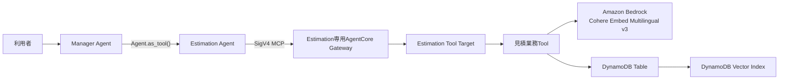

# Spec: DynamoDB Vector Searchを利用するEstimation Agent PoC

## 概要

Amazon Bedrock AgentCore Runtime上の既存Agents-as-Tools構成へ`Estimation Agent`を追加し、決定済みのAWS構成から見積Draftを作成する一つのPoCユースケースを実現する。

Estimation Agentは専用の業務Toolを通じて、Amazon DynamoDBのVector Indexから類似する過去案件を検索し、DynamoDBの構造化データから過去案件実績、標準工数、役割別単価、価格ポリシーを取得する。工数、原価、提示価格はTool内で決定的に計算し、利用者が保存を明示した場合だけ`DRAFT`としてDynamoDBへ追加する。保存後は同じ見積を再取得し、計算根拠、類似案件、注意事項とともにManager Agentから利用者へ返す。



## 背景

既存システムは、Manager AgentがWeather AgentとAWS Knowledge Agentを`Agent.as_tool()`として利用するPoCである。AWS Knowledge AgentはAmazon Bedrock Managed Knowledge Baseを文書RAGとして利用し、社内標準、見積基準、過去案件文書を検索する。

AWSインフラ構築見積では、文書の検索だけでなく、過去案件実績、標準工数、役割別単価、価格ポリシーなどの正確な構造化参照、類似案件の意味検索、決定的な数値計算、および見積Draftの保存が必要になる。本featureでは、Managed Knowledge Baseを置き換えず、DynamoDBを構造化データの正本と類似案件のベクトル検索先としてAgentから利用できることを、一つの見積シナリオで検証する。

既存の会話所有権とAgents-as-Tools構成はADR-0002、専門Agentごとに専用Gatewayを設ける境界はADR-0003およびADR-0004の考え方を継承する。DynamoDB Vector Searchで使用するEmbeddingモデルと生成経路はADR-0007に記録し、その他の構成と権限境界に関する重要な判断は本仕様の承認後にADRの追加要否を判断する。

## 目的

- Manager Agentが見積依頼をEstimation Agentへ委譲し、利用者向け最終回答を所有する。
- Amazon Bedrockの`cohere.embed-multilingual-v3`で生成したVectorとDynamoDB Vector Searchにより、日本語で記述された今回案件と意味的に類似する架空の過去案件候補を検索する。
- 類似案件候補の正式な実績値と、見積に利用する承認済みマスターをDynamoDBの構造化データから取得する。
- Agentの推測ではなく、Tool内の決定的な計算により工数、役割別原価、提示価格を算出する。
- 利用者が保存を明示した場合だけ、計算結果と根拠を持つ見積Draftを冪等に追加し、保存後のItemを再取得する。
- Vector検索、構造化参照、Item追加、Item再参照を一つの手動確認シナリオで検証可能にする。
- 既存のWeather Agent、AWS Knowledge Agent、Runtime HTTP／SSE／Memory契約を維持する。

## スコープ

本featureは複数領域にまたがる変更であり、対象領域は次のとおりとする。

- `agents/`: Estimation Agent、Manager Agentのルーティング、Estimation専用MCP接続、Tool結果と障害の処理
- Estimation Tool実装領域: Vector検索、構造化参照、見積計算、Draft追加、Draft再参照を行う業務Tool
- `agent_core_cdk_stack/`: DynamoDBテーブル、Vector Index、Estimation専用Gateway、Gateway Target、Amazon Bedrock Embeddingモデル呼び出し設定、IAM、Runtime設定
- `dynamodb-seed/`: 架空の過去案件、標準工数、役割別単価、価格ポリシー、および利用者入力サンプルの正本
- `tests/`: Agentルーティング、Tool契約、Vector検索、構造化参照、決定的計算、冪等保存、障害処理、CDK、IAMの自動テスト
- `README.md`および`docs/`: Agent構成、CDK構成、シード、Vector Index準備、検証、制約、トラブルシューティングの更新
- `docs/ManualTesting/README.md`: 本featureで追加するユースケースの手動確認手順
- `docs/ADR/`: 本featureで確定する重要な設計判断について、記録要否を確認する領域

## 対象外

- RFPファイルのアップロード、解析、要件抽出
- React、BFF、Cognito、Step Functionsを含む見積Webアプリケーション
- 要件またはシステム構成のレビュー・承認フロー
- 承認済み見積の作成、見積承認、電子見積書または帳票の出力
- マスター、過去実績、EmbeddingのAgentによる登録、更新、削除
- 実在する顧客データ、社内単価、個人情報の利用
- AWS Pricing APIまたはAWS Pricing Calculatorと連携したAWSサービス利用料金の算出
- `cohere.embed-multilingual-v3`以外のEmbeddingモデル、およびOpenAI Embeddings APIの直接利用
- サンプル工数マスターに存在しない作業の推測追加
- 類似案件の実績または距離スコアを使用した自動補正係数の算出・適用
- 複数テナント、顧客別アクセス制御、およびVector検索filterだけを使用したセキュリティ分離
- 大量データ分析、全件`Scan`、BI、S3またはAthenaへのエクスポート
- 本番向けのテーブル・明細分割、更新競合制御、バックアップ、災害対策、Global Tables
- ユーザーの明示的な依頼を伴わないAWS環境へのデプロイ、シード、実検索、Runtime E2E

## ユーザーストーリー / 利用シナリオ

- 見積担当者として、要件と構成が決定済みの架空案件を自然言語で入力し、類似する過去案件と承認済みマスターを根拠にした見積Draftを作成したい。
- 見積担当者として、標準工数の明細、中間式、単位、役割別工数、単価、原価、価格計算式を確認し、Agentが数値を推測していないことを判断したい。
- 見積担当者として、類似案件の過去見積、実績、差異理由と、今回見積へ自動補正していないことを確認したい。
- 見積担当者として、保存を明示した場合だけ見積Draftを保存し、見積IDとversionを受け取りたい。
- PoC確認者として、保存された見積Draftを既知のキーで再取得し、Vector検索、構造化参照、Item追加、Item再参照が一つのシナリオで実行されたことを確認したい。
- 開発者として、すべて架空のサンプルデータを再現可能な方法で登録し、自動テストと手動確認で同じ期待値を検証したい。

## 機能要件

### FR-001: Agents-as-Tools構成と責務

- システムは、既存のManager Agent、Weather Agent、AWS Knowledge Agentを維持し、新しい`Estimation Agent`をスペシャリストAgentとして追加しなければならない。
- Manager AgentはEstimation Agentを`Agent.as_tool()`として利用し、Handoffを使用してはならない。
- Manager Agentは利用者との会話、追加確認、および日本語の最終回答を引き続き所有しなければならない。
- Manager Agentは、要件とAWS構成が決定済みの見積依頼をEstimation Agentへ委譲しなければならない。
- Estimation AgentだけがEstimation専用Gatewayの業務Toolを利用できなければならない。
- Estimation専用GatewayのToolをManager Agent、Weather Agent、AWS Knowledge Agentへ直接登録してはならない。
- 本ユースケースの実行にAWS Knowledge Agentの利用を必須としてはならず、Managed Knowledge BaseとDynamoDBの責務を混同してはならない。
- AgentのinstructionsおよびAgent-as-Toolの説明は日本語でなければならない。

### FR-002: 利用者入力と不足情報

- システムは、見積対象の`project_name`、`project_type`、`architecture_summary`、`environments`、`components`、`work_scope`、`assumptions`、`exclusions`、`estimate_as_of`を利用者の自然言語入力から扱えなければならない。
- `components`には、見積対象となるAWSサービス、環境、数量、単位、およびMulti-AZなどの構成条件を含められなければならない。
- サービス数量、環境、作業範囲、見積基準日など、計算に必要な情報が不足する場合、Estimation Agentは推測で補完せず、Manager Agentを通じて利用者へ確認しなければならない。
- 構成条件に対応する工数がマスターに未定義の場合、その条件から独自の補正係数を作らず、未反映条件として回答と保存Draftへ記録しなければならない。
- 利用者が最初の入力で「Draftとして保存する」「Draftを登録する」などの保存意思を明示している場合、システムは必要情報、参照データ、および計算結果の検証に成功した後、追加確認を挟まず同一turnで`DRAFT`を保存しなければならない。
- 明示的な保存依頼は新規`DRAFT`の作成だけを許可するものであり、承認、確定、既存見積の更新、マスターまたは過去案件の変更を許可するものとして扱ってはならない。
- 利用者が見積Draftの保存を明示していない場合、または保存意思が曖昧な場合、システムは計算previewを返してもDynamoDBへ見積Draftを追加してはならない。必要な場合はManager Agentが保存意思を確認し、後続turnで明示された場合だけ保存しなければならない。
- 入力不足、必要マスターの不足・重複・未承認・期限外、計算検証エラー、または保存前検証の失敗がある場合、最初の入力に保存依頼が含まれていてもDraftを保存してはならない。類似案件検索が正常に完了して0件だった場合は保存を妨げるエラーとして扱わない。

### FR-003: 事前登録データ

- DynamoDBへ登録するサンプルデータと利用者入力サンプルは、`knowledge-base-s3/`と同様にリポジトリでレビュー可能な成果物として`dynamodb-seed/`配下へ配置し、同ディレクトリを正本として管理しなければならない。
- `dynamodb-seed/`は、少なくとも次の構成と機械可読なUTF-8 JSONを持たなければならない。

```text
dynamodb-seed/
├── README.md
├── projects/
│   ├── project-summaries.json
│   └── project-actuals.json
├── masters/
│   ├── effort-standards.json
│   ├── rate-cards.json
│   └── pricing-policies.json
├── evaluation/
│   └── search-quality-cases.json
└── sample-inputs/
    └── sample-project-delta.json
```

- `dynamodb-seed/README.md`は、各ファイルの用途、データ間の関連、必須属性、正本と生成属性の境界、シード方法、再実行時の扱い、およびサンプル入力の利用方法を説明しなければならない。
- `projects/project-summaries.json`はVector検索対象となる`HIST-001`から`HIST-003`の案件サマリーと、Vector Indexのfilterおよびprojectionに必要な属性を持たなければならない。
- `projects/project-actuals.json`は`HIST-001`から`HIST-003`の正式な構造化実績を持ち、対応するサマリーと同じ`project_id`で関連付けられなければならない。
- `masters/effort-standards.json`、`masters/rate-cards.json`、`masters/pricing-policies.json`は、それぞれ標準工数、役割別原価単価、価格ポリシーの正本でなければならない。
- `evaluation/search-quality-cases.json`は、実Embedding検索の品質を再現可能に評価する日本語検索ケースの正本でなければならない。
- 検索品質ケースは少なくとも6件とし、`HIST-001`、`HIST-002`、`HIST-003`のそれぞれを期待1位とする意味の異なる、または表現を変えたケースを2件以上ずつ持たなければならない。
- 各検索品質ケースは、少なくともケースID、検索文、適用する検索条件、期待する1位の`project_id`を持たなければならない。特定の距離スコアを期待値として固定してはならない。
- `sample-inputs/sample-project-delta.json`は、手動確認でそのまま利用できる自然言語の`prompt`と、その内容を検証するための正規化済み入力項目を持たなければならない。
- Sample Project Deltaの入力サンプルは、少なくとも次の内容を持たなければならない。
  - 架空の案件名`Sample Project Delta`と案件種別`NEW_BUILD`
  - 社内業務Webシステムの本番環境と開発環境
  - 本番環境は2 Availability Zone
  - Application Load Balancerは本番1台
  - EC2は本番4台、開発1台
  - RDS for PostgreSQLは本番1DB、開発1DBで、本番RDSはMulti-AZ
  - CloudWatchアラームは12個
  - 対象作業は基本設計、詳細設計、構築、単体テスト
  - AWSアカウントとネットワーク接続は顧客提供、作業は平日日中
  - アプリケーション開発とデータ移行は対象外
  - 見積基準日は2026-08-19
  - 見積Draftを保存する明示的な依頼
- システムは、次のデータをAgentによる見積実行より前にDynamoDBへ登録できなければならない。
  - Vector検索用の過去案件サマリー
  - 過去案件の正式な構造化実績
  - 標準工数マスター
  - 役割別原価単価マスター
  - 価格ポリシー
- Vector化する対象は過去案件サマリーだけとし、過去案件実績、標準工数、単価、価格ポリシー、見積DraftをVector検索対象にしてはならない。
- 過去案件サマリーと対応する正式な実績は、同じ`project_id`で関連付けられなければならない。
- サンプルデータはすべて架空であり、実在する顧客名、社内単価、個人情報、認証情報、秘密情報を含んではならない。
- サンプルJSONへEmbeddingの数値Listを手作業で記録してはならない。Embedding、生成時刻、生成元hashなどの生成属性は、シード処理がAmazon Bedrockの`cohere.embed-multilingual-v3`を使用して正本データから生成または付与し、正本と生成値を区別しなければならない。
- サンプルJSONの属性名、型、識別子、およびデータ間の参照は、シード処理がDynamoDBへ登録するItemと対応し、自動検証できなければならない。
- Vector検索の比較用として、少なくとも次の3案件を登録しなければならない。

| 案件ID | 案件名 | 主な構成 | 実績工数 | 役割別実績 |
| --- | --- | --- | ---: | --- |
| `HIST-001` | Sample Project Alpha | ALB、EC2 5台、RDS 2DB、CloudWatchアラーム12個 | 26.0人日 | AWSアーキテクト6.0人日、インフラエンジニア20.0人日 |
| `HIST-002` | Sample Project Beta | API Gateway、Lambda 6 Function、DynamoDB 2 Table | 18.0人日 | AWSアーキテクト5.0人日、インフラエンジニア13.0人日 |
| `HIST-003` | Sample Project Gamma | ALB、ECS Service 3個、RDS 2DB、CloudWatchアラーム20個 | 38.0人日 | PM 5.0人日、AWSアーキテクト10.0人日、インフラエンジニア23.0人日 |

- `HIST-001`の構成、作業範囲、過去見積25.0人日、実績26.0人日、工期60営業日、差異理由、品質評価`ACCEPTED`を構造化データとして取得できなければならない。
- 標準工数マスターは、少なくともEC2、RDS、CloudWatchについて、サービス、作業、単位、単位当たり人日、標準役割、有効期間、承認状態、versionを持たなければならない。
- 役割別単価マスターは、少なくとも`AWS_ARCHITECT`の100,000円／人日と`INFRA_ENGINEER`の80,000円／人日を持たなければならない。
- 価格ポリシーは、原価を20%の目標粗利率で割り戻し、1,000円単位で四捨五入する条件を持たなければならない。
- 見積に利用するマスターは`APPROVED`で、見積基準日に有効でなければならない。

### FR-004: 過去案件のVector検索

- Estimation Agentは、自然言語の案件要約を指定して`search_similar_projects`業務Toolを呼び出せなければならない。
- `search_similar_projects`は、Amazon Bedrock Runtimeの`InvokeModel`で案件要約から検索Vectorを生成し、そのVectorをDynamoDB Vector Indexの`SearchVectors`へ渡して過去案件サマリーを検索しなければならない。
- Agentまたは利用者から生のVectorを受け取ってはならない。
- EmbeddingモデルはAmazon Bedrockの`cohere.embed-multilingual-v3`だけを使用し、Amazon Titan、Cohere Embed v4、OpenAI、その他のモデルへ実行時または設定で切り替えてはならない。
- シード処理は、過去案件サマリーを`input_type=search_document`、`embedding_types=["float"]`、`truncate=NONE`でEmbeddingへ変換しなければならない。
- `search_similar_projects`は、今回案件の検索文を`input_type=search_query`、`embedding_types=["float"]`、`truncate=NONE`でEmbeddingへ変換しなければならない。
- 保存Vectorと検索Vectorは、同じ`cohere.embed-multilingual-v3`、1,024次元、および同じ入力正規化規則から生成されなければならない。ただし、検索目的に応じて保存Vectorは`search_document`、検索Vectorは`search_query`を使用しなければならない。
- Embeddingへ渡す過去案件サマリーと検索文は512 token、かつ約2,048文字のモデル入力上限を超えてはならず、上限超過時に暗黙に切り捨ててはならない。
- サマリーItemは、Embedding provider `COHERE`、モデルID`cohere.embed-multilingual-v3`、次元数1,024、入力種別`search_document`、生成元サマリーのhash、およびEmbedding準備状態を追跡できなければならない。
- `SearchVectors`自体はEmbeddingモデルを呼び出さず、Toolが事前生成した1,024次元の検索Vectorだけを検索入力として受け取る責務でなければならない。
- Vector Indexはコサイン距離を使用し、コサイン距離では値が小さいほど類似度が高いことをTool出力とAgentの解釈で一貫させなければならない。
- 検索はPoC用の単一`search_scope`へ限定し、`entity_type`、`project_type`、`architecture_family`、`outcome_quality`を完全一致filterとして利用できなければならない。
- Sample Project Deltaの検索では`top_k=3`を使用し、実際の`cohere.embed-multilingual-v3`による検索で`HIST-001`が第1位でなければならない。ただし、距離スコアの絶対値はモデル側の変更で変動し得るため、合格条件として固定してはならない。
- `evaluation/search-quality-cases.json`に定義された全ケースは、実際の`cohere.embed-multilingual-v3`による検索で、各ケースの`expected_top1_project_id`が第1位でなければならない。この評価は3件の架空サンプル案件間で意図した相対順位を識別できることだけを確認するものであり、本番データに対する検索品質、再現率、適合率、または業務上の十分性を証明するものとして扱ってはならない。
- モデル提供側の出力変化、検索文・サマリーの変更、入力正規化の変更、filterの変更、またはIndex同期状態により期待第1位を満たさなくなった場合、合格条件を`top_k`内へ黙って緩和してはならない。原因を確認し、サンプルデータまたは評価ケースを変更する場合は仕様と差分をレビューしなければならない。
- Toolは検索単位の不透明な`search_context_id`を返し、各検索結果について不透明な`result_ref`、案件ID、案件名、検索用サマリー、順位、距離スコア、距離関数を返さなければならない。
- `search_context_id`は、固定された`search_scope`、検索条件のsnapshot、順位付き候補とその`result_ref`、作成時刻、有効期限、および同一見積実行を識別する相関情報に関連付けられなければならない。
- `search_context_id`と`result_ref`は推測または改ざんによって別の案件へ参照先を変更できない形式でなければならない。`result_ref`は検索結果を後続Toolへ引き継ぐための参照であり、DynamoDBの物理キーまたは案件IDそのものとして扱ってはならない。Agentは検索結果にない案件ID、DynamoDBのpartition key、sort key、または任意の物理キーを後続参照へ指定できてはならない。
- 検索コンテキストは有限の有効期間を持たなければならない。未知、期限切れ、異なる見積実行、異なる`search_scope`、または検索結果と対応しない`search_context_id`と`result_ref`は後続Toolで拒否し、再検索を要求しなければならない。
- 距離スコアを見積の信頼度または工数補正係数として利用してはならない。
- 検索が正常に完了して0件だった場合、Toolはcanonical status `NO_RESULTS`、有効な`search_context_id`、および空の検索結果を返さなければならない。
- 検索結果が0件でも、必要な標準工数、単価、価格ポリシーが承認済みかつ有効であれば、システムはそれらの標準マスターだけを根拠に見積計算とDraft作成を継続しなければならない。
- 類似案件0件で作成する回答とDraftには、`similar_projects=[]`、`similar_project_search_status=NO_RESULTS`、`calculation_basis=STANDARD_MASTERS_ONLY`、および「類似案件がなく標準工数・単価・価格マスターだけを根拠にした見積である」旨の注意事項を記録しなければならない。Agentは類似案件または過去実績を補完してはならない。
- 検索結果0件と、Vector IndexまたはEmbedding経路の利用不能を区別できなければならない。`NO_RESULTS`を検索経路の障害として扱ってはならない。
- Vector本体をAgent応答または通常のTool結果へ含めてはならない。

### FR-005: 構造化データ参照

- Estimation Agentは、Vector検索で得た`search_context_id`、選択した0件以上の`result_ref`、今回構成に含まれるサービス、および見積基準日を指定して`get_estimation_reference_data`業務Toolを呼び出せなければならない。検索結果がある場合は少なくとも1件の`result_ref`を指定し、`NO_RESULTS`の場合は空の`result_ref`一覧を指定できなければならない。
- Toolは、検索コンテキストが存在し有効期限内であること、同一見積実行と固定`search_scope`に属すること、および各`result_ref`がその検索コンテキストの順位付き結果に含まれることを検証しなければならない。検証後の案件IDとDynamoDB物理キーの解決はTool内部だけで行わなければならない。
- 未知、期限切れ、見積実行不一致、`search_scope`不一致、または検索結果に属さない`search_context_id`と`result_ref`を受け取った場合、Toolは安全側に失敗し、過去案件の構造化データを参照せず、再検索が必要であることを返さなければならない。
- Toolは、類似案件の正式な実績、差異理由、標準工数、役割別単価、価格ポリシー、および各マスターのversionをDynamoDBから構造化データとして取得しなければならない。
- Toolは、解決済みの案件IDを構造化結果へ含め、検索結果と正式な実績の対応を検証可能にしなければならない。`NO_RESULTS`の場合は過去案件実績を空で返し、承認済み標準マスターの取得は継続しなければならない。
- Vector Indexのprojectionは識別子と検索結果表示に必要な属性へ限定し、見積または実績の正式な数値はベーステーブルから再取得しなければならない。
- Toolは、`APPROVED`かつ`estimate_as_of`に有効なマスターだけを返さなければならない。
- 必要なマスターが不足、重複、未承認、または期限外の場合、推測または既定値で代替せず、見積計算不能として返さなければならない。
- Agentへ汎用的な`Scan`または任意キーの参照機能を公開してはならない。

### FR-006: 決定的な見積計算

- 見積工数、役割別工数、原価、および提示価格は、LLMではなく`create_estimate_draft`業務Tool内の決定的な処理で計算しなければならない。
- `create_estimate_draft`は、Agentが渡した合計値を正本として保存せず、保存時に承認済みマスターを再取得して入力と参照versionを検証し、再計算しなければならない。
- 人日、単価、粗利率、および価格の計算には、二進浮動小数点による丸め誤差を避けられる10進数計算を使用しなければならない。
- Sample Project Deltaに対するサンプル期待値は次のとおりでなければならない。

| 区分 | 期待値 |
| --- | ---: |
| EC2基本設計 | 1.0人日 |
| EC2詳細設計 | 2.5人日 |
| EC2構築 | 2.5人日 |
| EC2単体テスト | 1.5人日 |
| RDS基本設計 | 3.0人日 |
| RDS詳細設計 | 2.0人日 |
| RDS構築 | 1.0人日 |
| CloudWatch監視設計 | 1.0人日 |
| CloudWatchアラーム設定 | 1.2人日 |
| 合計工数 | 15.7人日 |
| AWSアーキテクト工数 | 5.0人日 |
| インフラエンジニア工数 | 10.7人日 |
| 原価 | 1,356,000円 |
| 提示価格 | 1,695,000円 |

- `HIST-001`の実績26.0人日を今回の15.7人日へ自動反映または置換してはならない。
- 過去案件と今回見積の対象範囲が同一とは限らないこと、およびMulti-AZの追加工数がサンプルマスターに未定義で未反映であることを注意事項として扱わなければならない。

### FR-007: 見積Draftの追加と再参照

- Estimation Agentは、利用者入力、参照したマスターversion、`search_context_id`、選択した`result_ref`一覧、および冪等キーを指定して`create_estimate_draft`を呼び出せなければならない。任意の類似案件IDまたはDynamoDB物理キーを保存根拠として直接指定できてはならない。
- `create_estimate_draft`は保存前に検索コンテキストと`result_ref`を再検証し、期限切れまたは対応不正の場合は保存せず再検索を要求しなければならない。
- Toolが新規作成できる見積状態は`DRAFT`だけでなければならない。
- Toolは`estimate_id`、初期version、作成時刻、およびRuntimeで検証済みのactorに対応する作成者識別情報を設定しなければならない。
- 保存するDraftは、入力snapshot、工数明細、合計工数、役割別工数、原価、提示価格、通貨、参照マスターとversion、Toolが解決した類似案件ID、`similar_project_search_status`、`calculation_basis`、検索コンテキストの相関情報、注意事項、および冪等キーを持たなければならない。
- `NO_RESULTS`の検索コンテキストを使用する場合、Draftは類似案件IDを空とし、`similar_project_search_status=NO_RESULTS`、`calculation_basis=STANDARD_MASTERS_ONLY`、および類似案件がない旨の注意事項を持たなければならない。
- FR-002に従って最初の入力に明示的な保存依頼があり、すべての検証に成功した場合、計算preview後の追加確認を要求せず同一turnで保存しなければならない。
- 同じ冪等キーによる再試行で、内容が同じ見積Draftを重複作成してはならない。
- 新規Draftの作成時は条件付き書き込みを使用し、既存Itemを意図せず上書きしてはならない。
- Toolは既存見積、承認済み見積、マスター、過去案件サマリー、過去案件実績を更新または削除してはならない。
- Estimation Agentは、保存した`project_id`、`estimate_id`、versionを指定して`get_estimate_draft`を呼び出し、保存済みDraftを再取得しなければならない。
- 保存成功として利用者へ回答する前に、再取得したDraftのID、version、状態、計算結果、根拠が保存結果と一致することを確認しなければならない。
- 保存または再取得に失敗した場合、見積IDまたは保存成功を利用者へ回答してはならない。

### FR-008: Estimation専用GatewayとTool契約

- システムは、Weather専用GatewayおよびKnowledge専用Gatewayとは別に、Estimation Agent専用のAgentCore Gatewayを一つ持たなければならない。
- Estimation専用GatewayはMCP Gatewayとして動作し、受信認証に`AWS_IAM`を使用しなければならない。
- Estimation AgentはRuntime実行ロールの一時AWS認証情報を使用し、SigV4で専用Gatewayへ接続しなければならない。
- 専用Gatewayは、次の4つの業務ToolだけをEstimation Agentへ公開しなければならない。
  - `search_similar_projects`
  - `get_estimation_reference_data`
  - `create_estimate_draft`
  - `get_estimate_draft`
- 汎用的な`PutItem`、`UpdateItem`、`DeleteItem`、`Scan`、任意条件の`Query`をAgentへ公開してはならない。
- Tool入力の文字列長、識別子、日付、数量、単位、サービス、工程、検索条件、`top_k`、`search_context_id`、`result_ref`、冪等キーを検証しなければならない。
- 構造化参照とDraft保存のTool schemaは、類似案件の任意IDまたはDynamoDB物理キーをAgentから受け取る入力を持ってはならない。
- Tool出力は、Agentが正常、`NO_RESULTS`、検証エラー、検索コンテキスト不正・期限切れ、取得不能、保存失敗を区別できるcanonicalな構造化結果でなければならない。
- Estimation専用MCP接続はリクエスト単位で接続、Tool発見、Agent実行、解放を完結し、失敗、タイムアウト、キャンセル時にも接続をリークしてはならない。

### FR-009: 利用者向け回答と安全な失敗

- Manager Agentは、見積結果を日本語で利用者へ返さなければならない。
- 保存成功時の回答には、少なくとも次を含めなければならない。
  - `project_id`、`estimate_id`、version、status
  - 標準工数の明細、中間式、単位、合計
  - 役割別工数、適用単価、原価
  - 価格ポリシー、価格計算式、提示価格
  - 利用した類似案件名、過去見積、過去実績、差異理由
  - 類似案件実績を自動補正へ使用していないこと
  - 使用したマスター識別子とversion
  - 未反映条件と注意事項
- 類似案件が0件の場合、回答は類似案件がなかったこと、標準工数・単価・価格マスターだけで計算したこと、および類似案件実績を参照していないことを明示しなければならない。
- 同一turnで保存する場合も、保存成功は保存後の再取得と一致確認が完了した後にだけ回答しなければならない。
- Vector検索、構造化参照、見積計算、Draft保存、保存後再取得のどの段階で失敗したかを区別しなければならない。
- Vector検索または構造化参照が利用不能な場合、Agentは取得していない案件、実績、マスター、単価、価格を推測してはならない。
- Estimation経路が利用不能でも、既存Weather Agent、AWS Knowledge Agent、および一般会話を不要に停止させてはならない。
- Estimation以外の既存経路が利用不能でも、独立して利用可能なEstimation経路を不要に停止させてはならない。

### FR-010: DynamoDB、Vector Index、シード、および準備確認

- システムは、見積PoC用のDynamoDBテーブルをオンデマンドキャパシティで作成しなければならない。
- システムは、過去案件サマリーのEmbedding属性を対象にDynamoDB Vector Indexを作成しなければならない。
- Vector Indexは、1,024のEmbedding次元数、`COSINE`距離関数、PoC用`search_scope`のpartition key、完全一致filter属性、および必要最小限のprojectionを持たなければならない。
- Vector Indexのprojectionには、ベーステーブルのキー、案件ID、案件名、検索用サマリー、および検索filterに必要な属性を含め、Vector本体は検索結果で既定返却してはならない。
- システムは、`dynamodb-seed/`のJSONを正本として読み取り、FR-003のサンプルデータとEmbeddingを再現可能な手順で登録できなければならない。
- シード処理は、AWSへ書き込む前に全JSONの構文、必須属性、型、識別子の一意性、参照整合性、および許可された架空データだけであることを検証しなければならない。
- Embeddingを手作業の固定値として作成せず、Amazon Bedrockの`cohere.embed-multilingual-v3`、`input_type=search_document`、1,024次元を使用して過去案件サマリーから生成しなければならない。
- シード処理は生成したEmbeddingをDynamoDBへ登録できなければならないが、生成したVector本体を`dynamodb-seed/`の正本JSONへ書き戻してはならない。
- シード処理は再実行時に意図しない重複または既存Draftの変更を発生させてはならない。
- Vector Indexの状態と非同期同期を確認し、サンプル案件を検索可能になる前にRuntime E2Eを開始してはならない。
- シード処理、Index準備確認、再実行、および失敗判定をドキュメント化しなければならない。

### FR-011: IAMと秘密情報の境界

- Runtime実行ロールへ本featureで追加する権限は、Estimation専用Gatewayに対する`bedrock-agentcore:InvokeGateway`へ限定しなければならない。
- Runtime実行ロールへDynamoDBテーブル、Vector Index、またはEmbedding用Bedrockモデルの直接アクセスを許可してはならない。
- Estimation Toolの実行ロールだけが、対象テーブルの必要なItem操作、対象Vector Indexの`SearchVectors`、および`cohere.embed-multilingual-v3`の呼び出しに必要な`bedrock:InvokeModel`権限を持たなければならない。
- Estimation Toolへ許可する`bedrock:InvokeModel`は、`us-east-1`の`cohere.embed-multilingual-v3`に対応するFoundation Modelリソースへ限定し、任意のBedrockモデルを呼び出せる権限にしてはならない。
- Embedding生成へ渡せる入力は、架空の過去案件サマリーと今回案件の検索文に限定し、単価、価格、過去実績の数値、見積Draft、actor情報、AWSリソース識別子をモデル入力へ含めてはならない。
- `SearchVectors`権限は対象Vector Indexリソースへ限定しなければならない。
- 見積Draft書き込み権限は新規`DRAFT`作成に必要な範囲へ限定し、マスター、過去実績、承認済み見積の変更を許可してはならない。
- GatewayおよびTool実行ロールの信頼関係は、対応するAWSサービス、AWSアカウント、および対象リソースへ可能な限り限定しなければならない。
- Bedrock API key、Bearer token、静的AWSアクセスキー、その他の秘密情報をAgent、Runtime環境変数、シードデータ、CDKテンプレートへ含めてはならない。Bedrockの呼び出しにはEstimation Tool実行ロールの一時認証情報を使用しなければならない。

### FR-012: 自動テストと回帰検証

- Agentルーティング、Tool公開境界、入力検証、Vector検索結果、0件と障害の区別、構造化参照、マスター有効性判定、計算、冪等保存、再参照、障害処理を実AWSへ接続しない決定的な自動テストで確認できなければならない。
- 自動テストは`dynamodb-seed/`の全JSONを読み取り、構文、必須属性、型、識別子、参照整合性、サンプル期待値、および秘密情報非混入を検証しなければならない。
- シード処理、自動テスト、および手動確認は、値を別々に複製せず、`dynamodb-seed/`の同じサンプルデータを使用しなければならない。
- 自動テストは実Amazon Bedrockを呼び出さず、Bedrock Runtime `InvokeModel`のテストダブルを使用して、model ID、`input_type`、`embedding_types`、`truncate`、入力、応答Vectorの型と1,024次元を検証しなければならない。
- Unitまたはintegration testでは、決定的なVectorまたは`SearchVectors`応答を使用し、順位、filter、コサイン距離の方向、0件、利用不能を検証しなければならない。
- 自動テストは`evaluation/search-quality-cases.json`を読み取り、検索ケースが6件以上あり、`HIST-001`、`HIST-002`、`HIST-003`を期待第1位とするケースがそれぞれ2件以上あること、および必須属性を検証しなければならない。
- 自動テストは、`search_context_id`と`result_ref`の正常な引き継ぎ、未知・期限切れ・見積実行不一致・`search_scope`不一致・結果不一致の拒否、および`NO_RESULTS`コンテキストで空の`result_ref`一覧を受け付けることを決定的に検証しなければならない。
- 自動テストは、最初の入力に保存依頼が明示された場合の同一turn保存、保存意思がない場合と曖昧な場合のpreviewのみの応答、保存前検証失敗時の非保存、および0件検索時の標準マスターだけによる保存を検証しなければならない。
- 実Amazon Bedrockを使用する検索品質E2Eを明示的な許可のもとで実施する場合、`evaluation/search-quality-cases.json`の全ケースで期待案件が第1位になることを検証しなければならない。距離スコアの絶対値は合格条件にしてはならない。
- CDKテストでは、DynamoDBテーブル、Vector Index、Gateway、Target、Runtime設定、Embedding経路、およびIAM境界を生成テンプレートから検証できなければならない。
- 既存のManager、Weather、AWS Knowledge、Runtime HTTP／SSE、Memory、およびコンテナテストを維持しなければならない。
- AWSへのデプロイ、シード、およびRuntime E2Eは、ユーザーが明示的に依頼した場合だけ実施しなければならない。

### FR-013: 手動確認手順と関連ドキュメント

- `docs/ManualTesting/README.md`へ、本featureで追加する「類似する過去案件を根拠にしたAWSインフラ構築見積Draftの作成・保存」ユースケースの手動確認手順を追加しなければならない。
- 手動確認手順は、既存の手動テストケースと共存し、少なくとも次を記載しなければならない。
  - AWS利用料金が発生し得ることと、許可されたAWSアカウント、profile、`us-east-1`だけを使用する注意
  - Runtime、Estimation専用Gateway、Gateway Target、DynamoDBテーブル、Vector Index、シードデータ、およびEmbedding経路の事前確認方法
  - `cohere.embed-multilingual-v3`が`us-east-1`で利用可能であり、Estimation Tool実行ロールだけが対象モデルを呼び出せることの確認方法
  - Vector Indexが利用可能な状態であり、シード済みサマリーが検索可能になったことの判定方法
  - `dynamodb-seed/sample-inputs/sample-project-delta.json`の`prompt`を使用して、見積Draftの作成と保存を依頼するRuntime呼び出し手順
  - Vector検索結果で`HIST-001`が第1位になること、FR-006の工数・原価・提示価格、参照version、注意事項、および保存IDを確認する期待結果
  - 最初の入力に明示された保存依頼に従い、計算preview後の追加確認なしに同一turnで保存され、保存後の再取得が完了していることの確認方法
  - 検索結果から発行された`search_context_id`と`result_ref`を後続の構造化参照と保存に使用し、Agentが任意の案件IDまたはDynamoDB物理キーを指定していないことを、秘密情報や物理キーを表示せずに確認する方法
  - シード済みサマリーがEmbedding provider `COHERE`、モデルID`cohere.embed-multilingual-v3`、入力種別`search_document`、1,024次元として登録されていることをVector本体を表示せずに確認する方法
  - 応答で得た既知の`project_id`、`estimate_id`、versionを用いてDynamoDBから保存Draftを再取得し、回答との一致を確認する手順
  - 同一冪等キー相当の再試行でDraftが重複作成されないことを確認する手順、または実行経路上で同じ性質を確認できる代替手順
  - `evaluation/search-quality-cases.json`の各検索文について、期待案件が第1位になることを確認する方法、およびこの確認が3件の架空サンプル案件間の相対順位評価に限られるという注意
  - Vector検索0件を安全に再現し、標準マスターだけで計算を継続し、類似案件一覧が空、`similar_project_search_status=NO_RESULTS`、`calculation_basis=STANDARD_MASTERS_ONLY`、および類似案件がない旨の注意事項が回答とDraftに記録されることを確認する方法
  - 未知または期限切れの検索コンテキスト、不正な`result_ref`、必要マスター不足、保存失敗などの異常系を実施する場合の安全な実施条件と期待結果
  - Vector本体、実account ID、ARN、Gateway URL、テーブル名、Index ARN、認証情報、内部例外、スタックトレースが利用者向け応答に露出していないことの確認方法
  - 作成したテスト用Draftの扱い、および必要な場合の安全なクリーンアップ方針
- 手動確認手順は、AWSリソース識別子を可能な限りCloudFormation outputまたはAWS APIから解決し、利用者がARN、Gateway URL、テーブル名、Index名を文書へ実値で転記することを必須としてはならない。
- 手動確認手順へSample Project Deltaの入力値を別の正本として複製せず、`dynamodb-seed/sample-inputs/sample-project-delta.json`を参照しなければならない。
- AWS E2Eを実施していない場合、ローカル検証済みとAWS未検証を関連ドキュメントおよび完了報告で区別しなければならない。
- 実装後のAgent構成、Tool契約、データ分類、シード、計算、IAM、制約、検証手順を関連READMEと`docs/`へ反映しなければならない。

## 非機能要件

### セキュリティ

- 最小権限を適用し、Agentが汎用DynamoDB操作または任意のEmbeddingモデル呼び出しを実行できないようにしなければならない。
- Embeddingモデルへ渡すテキストは、架空の検索用サマリーと検索文だけにデータ最小化し、実在する顧客データ、個人情報、秘密情報、見積金額、社内単価を含めてはならない。
- DynamoDB Vector Searchのfilterをテナント境界または認可境界として扱ってはならない。
- PoCは単一の架空`search_scope`へ限定し、本番の顧客分離を検証済みとして扱ってはならない。
- `search_context_id`と`result_ref`は認証または認可の代替ではなく、検証済みactor、同一見積実行、および固定`search_scope`の範囲を越えた参照を許可してはならない。
- Agentから任意の案件IDまたはDynamoDB物理キーを受け取り、検索結果の検証を迂回して構造化参照または保存を行ってはならない。
- ログ、Tool結果、Agent応答にVector本体、AWS認証情報、Authorization header、内部例外、スタックトレース、テーブル名、Index ARN、IAM ARNを含めてはならない。
- 運用ログへ見積入力全文、単価、個人情報、秘密情報を不要に記録してはならない。

### データ完全性と信頼性

- 見積数値の正本は承認済みかつ有効期間内のDynamoDBマスターとし、モデル出力を正本としてはならない。
- Draft保存は冪等かつ条件付きであり、再試行や競合で重複または上書きを発生させてはならない。
- Vector Indexの非同期反映を考慮し、書き込み直後の検索結果を強整合として扱ってはならない。
- Amazon Bedrockのタイムアウト、throttling、アクセス拒否、モデル利用不能、応答不正をVector検索不能として区別し、別モデルまたは推測値へfallbackしてはならない。
- 検索結果0件、検索不能、参照不能、検証エラー、保存失敗、再取得失敗を区別できなければならない。
- 検索コンテキストは有限の有効期間を持ち、後続の参照時と保存時に有効性、相関、`search_scope`、および`result_ref`との対応を再検証しなければならない。
- 正常な検索結果0件を障害として扱わず、承認済み標準マスターだけで継続した事実を回答とDraftで追跡可能にしなければならない。
- AgentまたはToolの障害時に、取得していない根拠または保存していないIDを生成してはならない。

### 性能と利用量制御

- `top_k`、数量、入力文字列長、取得件数、Tool結果サイズへ上限を設けなければならない。
- `cohere.embed-multilingual-v3`へ渡す各入力を512 token、かつ約2,048文字以下に制限し、超過する入力を暗黙に切り捨ててはならない。
- Sample Project Deltaの検索では`top_k=3`を使用し、PoCで不要な大量候補を返してはならない。
- Vector Indexへprojectする属性を必要最小限にし、Vector検索で処理するデータ量とAgentへ渡す結果サイズを抑えなければならない。
- 見積Draftを一つのItemへ格納する場合、DynamoDBのItemサイズ制限を超えないことを自動テストまたは検証可能な方法で確認しなければならない。

### 保守性と可観測性

- Agent、Gateway、Tool、DynamoDB、Embedding、およびIAMの責務を分離し、既存スタックでは依存関係を明示して組み合わせなければならない。
- Tool名、入力、出力、エラー契約は、Tool schema、Tool実装、およびAgent側adapterの間で整合性を自動テストできなければならない。
- Vector生成、Vector検索、構造化参照、計算、保存、再取得の処理段階を、秘密情報を含めずに診断可能でなければならない。
- MCP、Amazon Bedrock Runtime、DynamoDB、およびモデル通信は、実サービスへ接続しないテストダブルへ差し替え可能でなければならない。
- 既存のAgent-as-Tool構成、モデル接続、SSE、およびMemoryの責務を不必要に変更してはならない。

## 受け入れ条件

### AC-001: Agent統合とTool公開境界

- Estimation AgentがManager Agentへ`Agent.as_tool()`として登録され、Handoffが存在しないことを自動テストで確認できる。
- Sample Project Deltaの見積依頼がEstimation Agentへ委譲され、Manager Agentが日本語の最終回答を返すことを決定的なテストで確認できる。
- Estimation専用Gatewayの4業務ToolがEstimation Agentだけへ登録され、Manager、Weather、AWS Knowledge Agentへ直接登録されないことを確認できる。
- Estimation Agentへ汎用DynamoDB操作が公開されていないことをTool一覧とschemaから確認できる。
- Estimation経路の障害がWeather、AWS Knowledge、および一般会話を不要に停止させないことをテストで確認できる。

### AC-002: シードデータとVector検索

- `dynamodb-seed/`にFR-003で定義したREADME、過去案件、マスター、および利用者入力の成果物が存在し、すべてリポジトリでレビュー可能である。
- `dynamodb-seed/`の全JSONをUTF-8 JSONとして解析でき、必須属性、型、識別子の一意性、およびデータ間の参照整合性を自動テストで確認できる。
- `sample-inputs/sample-project-delta.json`に自然言語の`prompt`と正規化済み入力があり、案件構成、作業範囲、前提、対象外、基準日、保存意思がFR-003の内容と一致する。
- `evaluation/search-quality-cases.json`に6件以上の日本語検索ケースがあり、`HIST-001`、`HIST-002`、`HIST-003`のそれぞれを期待第1位とするケースが2件以上ずつ存在し、ケースID、検索文、検索条件、期待第1位の案件IDを検証できる。
- `HIST-001`、`HIST-002`、`HIST-003`のサマリーと正式な実績、および承認済みの標準工数、単価、価格ポリシーを再現可能に登録できる。
- `dynamodb-seed/`の正本JSONにVector本体が含まれず、シード処理がAmazon Bedrockの`cohere.embed-multilingual-v3`、`input_type=search_document`、1,024次元を使用して案件サマリーからEmbeddingを生成し、DynamoDBへ登録することを確認できる。
- 過去案件サマリーだけがVector属性を持ち、保存Vectorと検索Vectorに同じモデルID`cohere.embed-multilingual-v3`、1,024次元、入力正規化規則を使用し、保存時は`search_document`、検索時は`search_query`を使用することを確認できる。
- `cohere.embed-multilingual-v3`以外のモデルID、用途と異なる`input_type`、または1,024以外の次元数を設定した場合、シード処理と検索Toolが起動時または呼び出し前に安全に失敗することを確認できる。
- 決定的なテストで、`search_scope`とfilterが適用され、コサイン距離の小さい順に候補が扱われることを確認できる。
- AWS E2Eを実施した場合、Sample Project Deltaの`top_k=3`で`HIST-001`が第1位になり、`evaluation/search-quality-cases.json`の全ケースで`expected_top1_project_id`が第1位になることを確認できる。距離スコアの絶対値は固定せず、この結果を3件の架空サンプル案件を越える本番検索品質の証明として扱わない。
- 検索結果0件では、canonical status `NO_RESULTS`、有効な`search_context_id`、空の結果一覧が返り、EmbeddingまたはVector Indexの利用不能とは異なる結果として扱われることを確認できる。
- Vector検索結果に`search_context_id`と各候補の不透明な`result_ref`が含まれ、DynamoDB物理キーとVector本体が含まれないことを確認できる。
- Tool結果および利用者向け回答にVector本体が含まれないことを確認できる。

### AC-003: 構造化参照と見積計算

- Vector検索で得た`search_context_id`と`HIST-001`に対応する`result_ref`から、過去見積25.0人日、実績26.0人日、工期60営業日、役割別実績、差異理由をベーステーブルから取得できる。
- 未知、期限切れ、見積実行不一致、`search_scope`不一致、または検索結果に属さない`search_context_id`と`result_ref`では、過去案件の構造化データを取得できず再検索を要求することを確認できる。
- `NO_RESULTS`の検索コンテキストと空の`result_ref`一覧では、過去案件実績を取得せず、承認済み標準マスターを取得して見積計算を継続できる。
- `APPROVED`かつ2026-08-19に有効なマスターだけがSample Project Deltaの計算へ使用されることを確認できる。
- マスター不足、重複、未承認、期限外の各ケースで、Toolが推測せず見積計算不能を返すことを確認できる。
- Sample Project Deltaの工数明細合計が15.7人日、AWSアーキテクトが5.0人日、インフラエンジニアが10.7人日になることを自動テストで確認できる。
- 原価が1,356,000円、価格ポリシー適用後の提示価格が1,695,000円になることを自動テストで確認できる。
- `HIST-001`の実績26.0人日または距離スコアが工数の自動補正へ使用されないことを確認できる。
- Multi-AZの追加工数が未反映であること、および類似案件と対象範囲を比較する必要があることが注意事項に含まれる。

### AC-004: Draft追加、冪等性、再参照

- 保存を明示しない入力または保存意思が曖昧な入力では計算previewだけが返り、見積Draftが追加されないことを確認できる。
- 保存を最初の入力で明示したSample Project Deltaについて、追加確認なしに同一turnで、状態`DRAFT`、初期version、計算明細、合計、原価、提示価格、参照マスター、Toolが解決した類似案件、検索コンテキストの相関情報、注意事項を持つItemが条件付きで追加される。
- 最初の入力に保存依頼があっても、入力不足、必要マスターの不正、計算検証エラー、または保存前検証失敗ではDraftが追加されないことを確認できる。
- 正常な類似案件0件と明示的な保存依頼の組み合わせでは同一turnでDraftが追加され、類似案件IDが空、`similar_project_search_status=NO_RESULTS`、`calculation_basis=STANDARD_MASTERS_ONLY`、および類似案件がない旨の注意事項を持つことを確認できる。
- 検索コンテキストが保存前に期限切れまたは不正になった場合、Draftが追加されず再検索を要求することを確認できる。
- 同じ冪等キーと同じ内容を再試行しても、新しいDraftが重複作成されないことを確認できる。
- 既存キーとの衝突、内容が異なる冪等キー再利用、DynamoDB書き込み失敗を安全に扱い、既存Itemを上書きしないことを確認できる。
- 保存後に既知の`project_id`、`estimate_id`、versionでDraftを再取得し、保存した内容と一致することを確認できる。
- マスター、過去案件、既存見積、および承認済み見積が変更されないことを確認できる。
- 保存または再取得失敗時に、Manager Agentが見積IDまたは保存成功を回答しないことを確認できる。

### AC-005: DynamoDB、Vector Index、Gateway、およびIAM

- `uv run python app.py`または`cdk synth`が成功する。
- 生成されたCloudFormationテンプレートに、オンデマンドDynamoDBテーブル、1,024次元のVector Index、Estimation専用Gateway、Gateway Target、`cohere.embed-multilingual-v3`の呼び出し設定、および必要なIAM設定が含まれる。
- Vector Indexの次元数が1,024、距離関数が`COSINE`、partition keyがPoC用`search_scope`、filterとprojectionがFR-004およびFR-010に整合することを確認できる。
- Estimation専用Gatewayが既存Gatewayとは別リソースで、MCPと`AWS_IAM`受信認証を使用することを確認できる。
- Runtime実行ロールのEstimation関連権限が、Estimation専用Gatewayの`bedrock-agentcore:InvokeGateway`へ限定されていることを確認できる。
- Tool実行ロールのDynamoDB、`SearchVectors`、`bedrock:InvokeModel`権限が対象リソース、`cohere.embed-multilingual-v3`、必要操作へ限定されていることを確認できる。
- Runtime実行ロールにDynamoDB、Vector Index、Embedding用Bedrockモデルの直接権限がないことを確認できる。
- CDKテンプレート、Runtime設定、Tool設定、シードデータにBedrock API key、Bearer token、静的AWS認証情報、秘密情報が含まれない。

### AC-006: 障害、安全性、および回帰

- 入力不足、入力上限超過、Amazon Bedrockのタイムアウト・throttling・アクセス拒否・モデル利用不能・応答不正、Vector検索0件、Vector検索障害、未知・期限切れ・見積実行不一致・`search_scope`不一致・結果不一致の検索参照、マスター不足、計算検証エラー、条件付き書き込み失敗、再取得失敗をテストダブルで再現できる。
- 各障害で、取得していない過去案件、実績、単価、価格、保存IDをAgentが推測しないことを確認できる。
- 正常なVector検索0件では架空の類似案件を生成せず、障害として停止せず、承認済み標準マスターだけで見積を継続することを確認できる。
- 利用者向け応答および運用ログに、Vector本体、内部例外、スタックトレース、テーブル名、Index ARN、IAM ARN、認証情報が含まれないことを確認できる。
- Estimation MCP接続が正常、失敗、タイムアウト、キャンセルの各経路でリークしないことを確認できる。
- 既存のManager、Weather、AWS Knowledge、Runtime HTTP／SSE、Memory、およびコンテナの自動テストが成功する。

### AC-007: 自動検証

- Agent、設定、MCP、Tool schema、Vector検索、構造化参照、計算、冪等保存、再参照、障害処理、CDK、およびIAMの自動テストが成功する。
- `uv run pytest`が成功する。
- `uv lock --check`が成功する。
- `uv run python app.py`または`cdk synth`が成功する。
- AgentコンテナをLinux ARM64向けにビルドできる。
- AWS環境でのデプロイ、シード、Gateway呼び出し、Runtime E2Eは、ユーザーが明示的に依頼した場合だけ実施する。
- AWS E2Eを実施していない段階は「ローカル実装・検証済み／AWS E2E未検証」と報告し、AWS E2Eを完了扱いにしない。

### AC-008: 手動確認手順とドキュメント

- `docs/ManualTesting/README.md`に、FR-013で定義したSample Project Deltaの見積Draft作成・保存ユースケースの手動確認手順が追加されている。
- 手動確認手順が`dynamodb-seed/sample-inputs/sample-project-delta.json`の`prompt`を入力の正本として参照し、手順とサンプルファイルの内容が重複管理されていない。
- 手順だけを読んだ確認者が、許可されたAWS環境の確認、必要リソースとシードの準備確認、Runtime呼び出し、期待値判定、DynamoDBからのDraft再取得、冪等性確認、安全性確認を順に実施できる。
- 手動確認の期待結果に、`HIST-001`、15.7人日、役割別工数、1,356,000円、1,695,000円、マスターversion、保存ID、類似実績を自動補正していないこと、および未反映条件が明記されている。
- 手動確認の期待結果に、Sample Project Deltaで`HIST-001`が第1位になること、明示的な保存依頼では追加確認なしに同一turnで保存されること、および保存後再取得が完了していることが明記されている。
- 手動確認で、検索結果から発行された`search_context_id`と`result_ref`による安全な引き継ぎ、検索結果0件での標準マスターだけによる継続、ならびに不正または期限切れ参照の拒否を確認できる。
- 検索品質の手動確認が`evaluation/search-quality-cases.json`を正本として使用し、3件の架空サンプル案件間の相対順位評価に限定される注意を明記している。
- 手動確認手順が、実account ID、ARN、Gateway URL、テーブル名、Index名、認証情報を文書へ固定値として記載することを要求しない。
- README、Agentドキュメント、CDKドキュメント、手動テストガイド、本仕様書、実装、テスト、および必要なADRの間に矛盾がない。

## 制約

- 本featureはAgentCoreからDynamoDBを利用するPoCであり、本番運用要件を満たすものではない。
- PoC全体のAWSリージョンは既存構成と同じ`us-east-1`に限定する。
- DynamoDB Vector Indexはオンデマンドキャパシティのテーブルで利用する。
- Embedding providerはAmazon Bedrock上のCohere、モデルIDは`cohere.embed-multilingual-v3`、次元数は1,024に固定し、他のモデルまたは次元数を構成で選択可能にしない。
- Embedding生成にはAmazon Bedrock Runtimeの`InvokeModel`を使用し、シード対象は`search_document`、検索文は`search_query`、出力種別は浮動小数点Vector、切り捨ては`NONE`に固定する。
- DynamoDB `SearchVectors`はEmbeddingモデルを実行しないため、シード処理と検索Toolが同じEmbeddingモデルで事前に生成したVectorを使用する。
- OpenAI Embeddings APIを直接利用せず、OpenAI API keyまたはEmbedding用の外部HTTPS通信経路を追加しない。
- Agentの文章生成には既存どおりAmazon Bedrock上の`openai.gpt-5.5`を使用し、本featureのEmbedding生成モデルとして再利用してはならない。
- Vectorの次元数は4,096以下、`SearchVectors`の`TopK`は100以下とし、本ユースケースでは`top_k=3`を使用する。
- Sample Project Deltaで`HIST-001`を第1位とする要件、および検索品質ケースの期待第1位は、3件の架空サンプル案件と固定された評価入力に対するPoCの回帰基準である。距離スコアの絶対値を固定せず、本番データに対する検索品質保証として使用しない。
- Vector検索結果から構造化参照とDraft保存へ案件を引き継ぐ場合は、有限の有効期間を持つ`search_context_id`と不透明な`result_ref`だけを使用し、Agentから任意の案件IDまたはDynamoDB物理キーを受け付けない。
- Vector Indexの構成は作成後に変更できない前提とし、Embedding次元数、距離関数、projection、filter属性、partition keyの変更には新しいIndexが必要であることを考慮する。
- Vector Indexの反映は非同期かつ結果整合であり、ベーステーブルの書き込み直後に必ず検索可能になるとは扱わない。
- Vector検索で取得できる属性はIndexのprojectionへ含まれるものに限定し、正式な数値はベーステーブルから再取得する。
- `SearchVectors`の細粒度アクセス制御条件を顧客分離の根拠にせず、PoC用単一scopeとIndex単位のIAMを使用する。
- DynamoDB Itemは400KBの上限を持つため、PoCの単一Draft Itemが上限内であることを確認し、本番向け明細分割は対象外とする。
- マネージャーAgentとスペシャリストAgentの関係はADR-0002に従う。
- 既存Weather AgentとKnowledge Agentの専用Gateway境界はADR-0003およびADR-0004を維持する。
- Agentコンテナの依存関係は`agents/requirements.txt`、CDKプロジェクトとテストの依存関係およびコマンド実行は`uv`で管理する。
- AWS SDKはDynamoDB Vector Indexおよび`SearchVectors`をサポートする版を使用する。具体的な依存versionは`plan.md`で決定する。
- `cohere.embed-multilingual-v3`の利用可否、quota、料金、およびデータ取り扱いはAmazon Bedrockと対象AWSアカウントの設定に依存する。
- AWS環境を変更する操作には、ユーザーの明示的な依頼が必要である。
- `cdk.out/`、`.cdk.staging/`、`__pycache__/`、`.pytest_cache/`およびその他の生成物をソースとして編集またはコミットしない。
- `dynamodb-seed/`のJSONとREADMEはレビュー対象のソース成果物として管理し、生成したEmbeddingの数値List、シード実行結果、およびAWSから取得した実データをソース成果物としてコミットしない。

参考となるAWS公式仕様:

- [Amazon DynamoDB now supports real-time vector search at any scale](https://aws.amazon.com/blogs/aws/amazon-dynamodb-now-supports-real-time-vector-search-at-any-scale/)
- [Build semantic search with native vector support in Amazon DynamoDB](https://aws.amazon.com/blogs/database/build-semantic-search-with-native-vector-support-in-amazon-dynamodb/)
- [Using vector indexes in DynamoDB](https://docs.aws.amazon.com/amazondynamodb/latest/developerguide/VectorSearch.html)
- [Requirements and limitations](https://docs.aws.amazon.com/amazondynamodb/latest/developerguide/VectorSearch.Requirements.html)
- [Data synchronization between tables and vector indexes](https://docs.aws.amazon.com/amazondynamodb/latest/developerguide/VectorSearchDataSync.html)
- [Security and access control](https://docs.aws.amazon.com/amazondynamodb/latest/developerguide/VectorSearch.Security.html)
- [Cohere Embed Multilingual model card](https://docs.aws.amazon.com/bedrock/latest/userguide/model-card-cohere-embed-multilingual.html)
- [Cohere Embed v3 request and response parameters](https://docs.aws.amazon.com/bedrock/latest/userguide/model-parameters-embed-v3.html)
- [Supported models and Regions for Amazon Bedrock knowledge bases](https://docs.aws.amazon.com/bedrock/latest/userguide/knowledge-base-supported.html)

## 依存関係

- 既存のManager Agent、Weather Agent、AWS Knowledge Agent
- 既存のAgentCore Runtime、AgentCore Memory、Runtime HTTP／SSE契約
- 既存のWeather専用AgentCore Gateway、Weather／Time Lambda Gateway Target
- 既存のKnowledge専用AgentCore Gateway、Managed Knowledge Bases Connector Target、Managed Knowledge Base
- OpenAI Agents SDKの`Agent.as_tool()`とMCP連携
- `mcp-proxy-for-aws`によるSigV4 MCP transport
- Amazon Bedrock AgentCore GatewayおよびGateway Target
- Amazon DynamoDB、DynamoDB Vector Index、`SearchVectors`
- Amazon Bedrock Runtimeと`cohere.embed-multilingual-v3`
- AWS IAM、AWS CloudFormation、AWS CDK
- DynamoDB Vector Search対応のAWS SDK for Python
- 既存CDKエントリーポイント`app.py`とスタック`agent_core_cdk_stack/agent_core_stack.py`
- 既存Agent実装`agents/src/agent_app/`
- 既存テスト領域`tests/`
- DynamoDBシードデータと利用者入力サンプルの正本`dynamodb-seed/`
- `docs/ADR/adr-0001-use-bedrock-mantle-with-runtime-role-sigv4.md`
- `docs/ADR/adr-0002-use-agents-as-tools.md`
- `docs/ADR/adr-0003-use-dedicated-agentcore-gateway-for-weather-tools.md`
- `docs/ADR/adr-0004-use-managed-knowledge-base-retrieve-via-dedicated-gateway.md`
- `docs/ADR/adr-0007-use-bedrock-cohere-multilingual-embeddings-for-dynamodb-vector-search.md`
- `docs/Agent/README.md`
- `docs/CDK/README.md`
- `docs/ManualTesting/README.md`

## 未確定事項 / 要確認事項

現時点で要件レベルの未確定事項はない。

次の内容は本仕様の機能要求を変更しない実装・運用詳細として、本仕様のレビューと承認後に`plan.md`で決定する。

- PoCで単一Table案を採用するか、データ分類ごとにTableを分割するか、および具体的な物理キー設計
- シード用Embeddingをデプロイ前のローカル工程でAmazon Bedrockから生成するか、デプロイ後のシード処理で生成するか。ただし、いずれの場合も生成したVector本体は`dynamodb-seed/`の正本へ含めない。
- DynamoDBテーブル、Vector Index、およびシード処理をCDKで管理する具体的な範囲
- Estimation Gateway Targetを一つの実行単位へ集約するか、読み取りと書き込みで分割するか
- `search_scope`をTool側で固定してAgent入力から除外するか、allowlist検証済み入力として受け取るか
- 検索コンテキストの物理的な保存先、`search_context_id`と`result_ref`の生成方式、有効期間、見積実行との相関方法、および期限切れデータのクリーンアップ方式
- 自然言語から明示的、未指定、曖昧の保存意思を判定し、Tool呼び出しへ引き継ぐ具体方式
- Gateway、Target、テーブル、Index、シード処理、およびRuntime設定の具体的な名前
- Estimation専用MCPクライアントの設定、タイムアウト、再試行、Tool allowlist、結果検証、cleanupの具体方式
- Tool入力の文字数、数量、`top_k`、結果件数、および結果サイズの具体的な上限
- Draftの冪等キー生成、保存条件式、初期version、作成者識別、およびItemサイズ検査の具体方式
- シード、Vector Index準備、AWS E2E、異常系、およびクリーンアップに使用する具体的なコマンド
- `evaluation/search-quality-cases.json`を使用する実Embedding検索品質E2Eの実行コマンド、結果記録、およびモデル側変更時の再評価手順
- 自動テストで使用するModel、MCP、Embedding、DynamoDB、`SearchVectors`のテストダブル
- Embeddingモデルと生成経路はADR-0007に記録済みとし、新しいAgent、Gateway、DynamoDBデータ配置、および書き込み権限に関する追加の設計判断をADRへ記録する範囲
